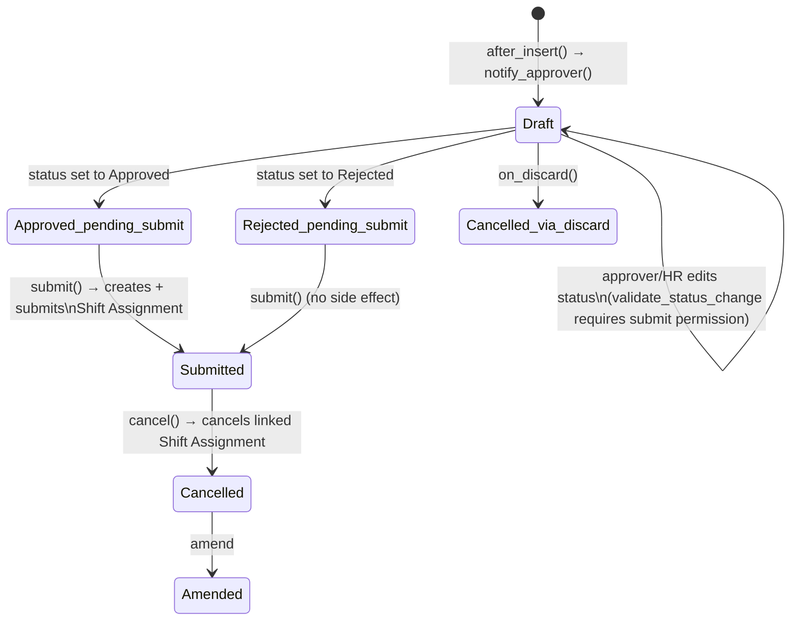

# Shift Request

An employee's self-service request to be put on a (non-default) shift for a period, subject to approval. It exists so shift changes go through an approval trail before they become a binding Shift Assignment, mirroring the Leave Application / Expense Claim approval pattern in the rest of HRMS (it shares the same `PWANotificationsMixin`).

## Key Fields

| Field | Type | Purpose |
|---|---|---|
| `employee` | Link | Requester |
| `shift_type` | Link | Requested shift |
| `from_date` / `to_date` | Date | Requested period (`to_date` optional — open-ended) |
| `approver` | Link (User) | Auto-fetched from `employee.shift_request_approver` if not set; who must approve |
| `status` | Select | Draft / Approved / Rejected |

## Relationships

- [[Employee]] — requester; must be Active.
- [[Shift Type]] — requested shift; cannot equal the employee's current `default_shift` (no point requesting what's already default).
- [[Shift Assignment]] — created and submitted automatically when this request is submitted with status Approved; cancelling this request cancels that Shift Assignment.
- Department Approver (child table on Department, `parentfield = shift_request_approver`) — alternate valid approvers besides the employee's personal `shift_request_approver`.

## Logic — What Happens and Why

**`validate()`**: `validate_active_employee`; `validate_from_to_dates`; `validate_overlapping_shift_requests` (`get_overlapping_dates`, shift-timing-aware via `has_overlapping_timings`) — throws `OverlappingShiftRequestError` against any other non-cancelled request for the same employee whose period overlaps and whose shift timing actually conflicts; `validate_approver` — the chosen `approver` must be either the employee's `shift_request_approver` or one of the Department's `shift_request_approver`-type Department Approvers, otherwise throws — this is the authorization gate, checked on every save not just submit; `validate_default_shift` — blocks requesting the employee's own default shift; `validate_status_change` — if the current user lacks `submit` permission on this doctype, the `status` field may not be changed away from "Draft" — i.e. only someone who could submit the shift request (effectively the approver/HR) is allowed to flip it to Approved/Rejected, even before actually submitting.

**`after_insert()`**: `notify_approver()` (PWA notification to the approver that a new request needs action).

**`on_update()`**: `share_doc_with_approver` (grants the approver document-level access so they can open/approve it even without broader read rights); `notify_approval_status()` (PWA notification to the employee once status flips to Approved/Rejected — from the mixin, compares `has_value_changed("status")`); `publish_update()` (realtime refetch of `hrms:my_shift_requests` / `hrms:team_shift_requests`).

**`on_submit()`**: enforces that only Approved or Rejected requests may be submitted at all (a Draft cannot be submitted — the approval decision must be made first via the write-then-submit flow). If Approved, immediately creates and submits a new [[Shift Assignment]] (`ignore_permissions=1`, since the employee submitting their own approved request may not have Shift Assignment create rights) copying company/shift_type/employee/from_date(-to_date) and stamping `shift_request` back to this document's name, with a confirmation `msgprint`.

**`on_cancel()`**: cancels every submitted Shift Assignment that was created from this request — same "undo the effect" pattern as Attendance Request.

**`on_discard()`**: sets `status = "Cancelled"` directly.

## Roles & Permissions

| Role | Can Do | Notes |
|---|---|---|
| [[Employee]] | Create/Read/Write | Can raise and edit their own request while Draft; no submit right — `validate_status_change` additionally hard-blocks a non-approver from changing status away from Draft even via write, so an employee can't self-approve by editing the field. |
| [[HR Manager]] | Full CRUD + Submit/Cancel/Amend | Can act as approver/administrator for any request. |
| [[HR User]] | Create/Read/Submit | No delete/cancel/amend — mirrors Shift Assignment's HR User rights: can push requests through but not unwind them. |

## Mermaid: State/Flow

