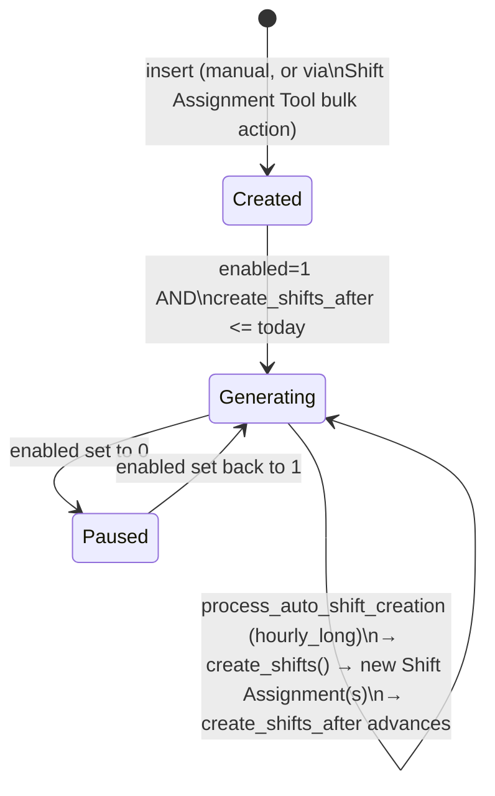

# Shift Schedule Assignment

Attaches a specific employee to a [[Shift Schedule]] template and drives the actual, ongoing generation of dated [[Shift Assignment]] records from that recurring pattern. This is the "rolling rota" engine: rather than requiring HR to create Shift Assignments manually every cycle, this doctype tracks a rolling watermark (`create_shifts_after`) and a scheduled job keeps extending real Shift Assignment records forward in time as long as it stays `enabled`.

## Key Fields

| Field | Type | Purpose |
|---|---|---|
| `employee` | Link | Who is on this recurring schedule |
| `shift_schedule` | Link | Which pattern to apply |
| `shift_status` | Select | Active/Inactive — status stamped onto generated Shift Assignments |
| `shift_location` | Link | Optional location stamped onto generated Shift Assignments |
| `enabled` | Check | If off, no further Shift Assignments are auto-generated |
| `create_shifts_after` | Date | Rolling watermark — shifts are generated for dates *after* this; advanced automatically as generation proceeds |

## Relationships

- [[Employee]] — the assignee.
- [[Shift Schedule]] — the recurrence pattern being applied.
- [[Shift Location]] — optional, passed through to generated assignments.
- [[Shift Assignment]] — every individual dated assignment this generates is stamped with `shift_schedule_assignment` pointing back here; `get_existing_shift_assignments` queries them to prevent conflicting edits.
- [[Shift Assignment Tool]] — `create_shift_schedule_assignment` in that tool is one of the ways this doctype gets created (bulk "Assign Shift Schedule" action).

## Logic — What Happens and Why

**`validate()`** → `validate_existing_shift_assignments`: if `create_shifts_after` was changed on an existing (non-new) record, checks whether Shift Assignments already exist for this employee ending on/after the *new* `create_shifts_after` date — if so, throws, listing them, because moving the watermark backward or into a period that's already been generated would create overlapping/duplicate assignments. In effect this field can only be pushed forward past what's already generated, or set on a fresh record.

**`create_shifts(start_date, end_date=None)`**: the rota-expansion algorithm. Defaults `end_date` to `start_date + 90` days if not given (bounds how far ahead a single call generates). Walks day-by-day from `start_date`:
- Determines the schedule's inter-cycle `gap` in weeks from `frequency` (0 for "Every Week" up to 3 for "Every 4 Weeks").
- For each day, if its weekday is in `repeat_on_days`, it's part of a run; contiguous matching days are coalesced into one `create_individual_assignment` call (start=first matching day, end=last matching day before a gap or the range boundary) rather than one assignment per day — this keeps Shift Assignment records compact (one per contiguous stretch, not one per date).
- At each cycle boundary (`weekday == week_end_day`, computed from the day before `start_date`), if `gap > 0` it skips ahead `7 * gap` days — this is what implements "every 2/3/4 weeks" instead of every week.
- **`create_individual_assignment`** calls `Shift Assignment Tool.create_shift_assignment` (the shared factory used by the bulk tool) to actually insert+submit the Shift Assignment, then advances `create_shifts_after` to the generated end date via `db_set` (bypassing full validate/modified-timestamp, since this is a rapid internal loop) — this is exactly what lets the *next* scheduled run pick up where this one left off.

**`process_auto_shift_creation()`** (hourly_long scheduled job): finds every enabled Shift Schedule Assignment whose `create_shifts_after` has already arrived (`<= nowdate()`), and for each, calls `create_shifts(create_shifts_after + 1 day)` to extend it forward, logging a comment on success and `frappe.log_error` on failure (isolated per-record — one bad schedule assignment doesn't block the rest of the sweep). This is the recurring-rota half of the module's auto-generation logic (parallel to Shift Type's auto-attendance sweep, but for creating assignments rather than marking attendance).

## Roles & Permissions

| Role | Can Do | Notes |
|---|---|---|
| [[Employee]] | Read | View-only. |
| [[HR User]] | Read/Write/Create | No delete — can set up and adjust rota assignments but not remove them. |
| [[HR Manager]] | Read/Write/Create/Delete | Full control, but note this doctype is **not submittable** (no `is_submittable` in JSON) — there is no submit/cancel/amend lifecycle here, unlike most of this module; "Active/Inactive" lives only in the `shift_status` field, not the docstatus workflow. |

## Mermaid: State/Flow

