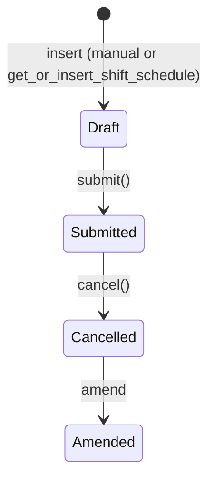

# Shift Schedule

A reusable rota template: "this Shift Type repeats on these weekdays, every N weeks." It exists to decouple the *pattern* of a recurring rotation from any one employee — the same Shift Schedule (e.g. "Night shift, Mon/Wed/Fri, every 2 weeks") can be attached to many employees via [[Shift Schedule Assignment]], instead of hand-building overlapping Shift Assignment date ranges per person.

## Key Fields

| Field | Type | Purpose |
|---|---|---|
| `shift_type` | Link | Which Shift Type this schedule repeats |
| `frequency` | Select | Every Week / 2 Weeks / 3 Weeks / 4 Weeks — the recurrence cadence |
| `repeat_on_days` | Table (Assignment Rule Day) | Which weekdays within the cycle this shift applies |

## Relationships

- [[Shift Type]] — the shift being scheduled.
- [[Shift Schedule Assignment]] — one or more employees are attached to a Shift Schedule via this doctype, which is what actually generates dated Shift Assignment records from the pattern.
- Assignment Rule Day (child table, shared with Frappe's Assignment Rule) — reused here purely as a weekday-list structure, not tied to assignment-rule automation.

## Logic — What Happens and Why

**`before_validate()`**: de-duplicates `repeat_on_days` — if the same weekday appears twice (e.g. via UI double-entry), the later duplicate row is removed. No other validation exists on this doctype; it's essentially a submittable template record with no lifecycle side effects of its own — all the real scheduling logic lives in Shift Schedule Assignment.

**`get_or_insert_shift_schedule(shift_type, frequency, repeat_on_days)`** (module-level helper): looks for an existing submitted Shift Schedule matching the same shift type, frequency, and exact set of weekdays; if none matches, creates and submits a new one with an auto-generated random name. This is a dedup/reuse helper so importing or bulk-creating schedules doesn't spawn near-duplicate templates for the same pattern.

## Roles & Permissions

| Role | Can Do | Notes |
|---|---|---|
| [[Employee]] | Read | View-only. |
| [[HR User]] | Read/Write/Create | No delete/submit — mirrors the general pattern of HR User being able to configure but not finalize/remove templates directly (submission likely intended via HR Manager or `get_or_insert_shift_schedule`). |
| [[HR Manager]] | Full CRUD + Submit/Cancel/Amend | Full lifecycle control of the template. |

## Mermaid: State/Flow

