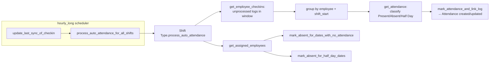

# Shift Type

The master definition of a work shift — its timings, grace periods, and (critically) the auto-attendance engine's configuration. This is the single most logic-heavy doctype in the module: it owns the scheduled job that turns Employee Checkin logs into Attendance records, and the absence-marking sweep for employees who never checked in at all.

## Key Fields

| Field | Type | Purpose |
|---|---|---|
| `start_time` / `end_time` | Time | Shift window; `end_time < start_time` means an overnight shift |
| `holiday_list` | Link | Overrides the employee's own holiday list for this shift's holiday checks |
| `enable_auto_attendance` | Check | Turns on the whole auto-marking pipeline for employees assigned this shift |
| `process_attendance_after` | Date | Lower bound — auto-attendance never processes before this date |
| `last_sync_of_checkin` | Datetime | Upper bound (moving forward as `update_last_sync_of_checkin` runs); read-only if `auto_update_last_sync` is set |
| `auto_update_last_sync` | Check | If set, the scheduler advances `last_sync_of_checkin` itself instead of requiring manual sync (e.g. after a device import) |
| `determine_check_in_and_check_out` | Select | "Alternating IN/OUT" vs "Strictly based on Log Type" — governs how Employee Checkin pairs are read |
| `working_hours_calculation_based_on` | Select | "First Check-in and Last Check-out" vs "Every Valid Check-in and Check-out" |
| `working_hours_threshold_for_half_day` / `working_hours_threshold_for_absent` | Float | Cutoffs (0 disables); halved automatically on half-holidays |
| `begin_check_in_before_shift_start_time` / `allow_check_out_after_shift_end_time` | Int (minutes) | Grace margins added to the shift window to accept early check-ins / late check-outs as still "in shift" |
| `enable_late_entry_marking` / `late_entry_grace_period` | Check/Int | Flags `Attendance.late_entry` when check-in exceeds this margin past start |
| `enable_early_exit_marking` / `early_exit_grace_period` | Check/Int | Flags `Attendance.early_exit` similarly |
| `mark_auto_attendance_on_holidays` | Check | If off (default), auto-attendance skips holiday dates entirely |
| `allow_overtime` / `overtime_type` | Check/Link | Enables overtime computation on auto-marked Present attendance |

## Relationships

- [[Employee Checkin]] — the raw input consumed by `process_auto_attendance`; checkins carry `shift` back-references to this doctype.
- [[Attendance]] — the output of the auto-attendance pipeline; also the target of `mark_absent_for_dates_with_no_attendance`/`mark_absent_for_half_day_dates`.
- [[Shift Assignment]] — `get_assigned_employees` and `get_dates_for_attendance` read active/default-shift assignments to know which employees and date ranges to sweep for absences.
- [[Employee]] — via `default_shift` field and `date_of_joining`/`relieving_date` bounds for the absence sweep.
- [[Overtime Type]] — linked when `allow_overtime` is enabled.

## Logic — What Happens and Why

**`validate()`**: `validate_same_start_and_end` (start ≠ end); `validate_circular_shift` — computes total duration including both grace margins and throws if it reaches/exceeds 1440 minutes (24h), because a shift that long would overlap itself when the margins are applied; `validate_unlinked_logs` — if `start_time` changed on an existing Shift Type and unprocessed Employee Checkins reference it (no `attendance`, not skipped, not off-shift), blocks the change until those are resolved — changing shift timings after logs already exist for the old timing window would corrupt the auto-attendance calculation for those logs.

**`process_auto_attendance(is_manually_triggered)`** — the core scheduled/whitelisted method:
- Bails out via `has_incorrect_shift_config` if auto-attendance is off or `process_attendance_after`/`last_sync_of_checkin` aren't set.
- Fetches unprocessed checkins (`get_employee_checkins`): `skip_auto_attendance=0`, no `attendance` yet, `time >= process_attendance_after`, `shift_actual_end < last_sync_of_checkin`, matching this shift, not off-shift.
- Groups them by (employee, shift_start) via `_process`, and per group: skips holidays unless `mark_auto_attendance_on_holidays`; halves both working-hour thresholds on half-holidays (`is_half_holiday`); calls `get_attendance` to classify Absent/Half Day/Present from `calculate_working_hours`, applying late-entry/early-exit flags against the grace periods; then hands off to `mark_attendance_and_link_log` (see [[Employee Checkin]]) to actually create/update Attendance.
- After processing existing logs, sweeps every employee assigned this shift (`get_assigned_employees`, including those with it as `default_shift`) for **dates with no checkins at all** (`mark_absent_for_dates_with_no_attendance`) and for **stale Half Day records still open for modification** (`mark_absent_for_half_day_dates`), committing in batches of 50 to avoid losing progress on a long run. This is why an employee who never checks in still ends up Absent, not just "unmarked".
- If manually triggered with a large backlog (>1000 logs, or under test flag), the whole thing is deferred to a background job instead of running inline.

**`get_dates_for_attendance`** / **`get_start_and_end_dates`**: computes the sweep window per employee as `max(process_attendance_after, date_of_joining)` through the day of the shift ending just before `last_sync_of_checkin` (looking one shift back so a still-in-progress shift isn't prematurely marked absent), then subtracts holiday dates and dates that already have Attendance.

**`update_last_sync_of_checkin()`** (hourly_long scheduled job): for shifts with `auto_update_last_sync`, advances `last_sync_of_checkin` to just past the actual shift end once that shift has fully elapsed — this is what lets auto-attendance run without a human resetting the sync point after every shift.

**`process_auto_attendance_for_all_shifts()`** (hourly_long scheduled job): the fan-out that calls `process_auto_attendance()` on every Shift Type with `enable_auto_attendance=1`. Together with `update_last_sync_of_checkin`, this is the checkin→attendance auto-marking pipeline referenced across the module.

## Roles & Permissions

| Role | Can Do | Notes |
|---|---|---|
| [[HR Manager]] | Read/Write/Create/Delete | Full control of shift definitions and their auto-attendance rules. |
| [[HR User]] | Read/Write/Create | No delete — can configure but not remove shift types. |
| [[Employee]] | Read | View-only; cannot see/modify auto-attendance configuration. |

## Mermaid: State/Flow

