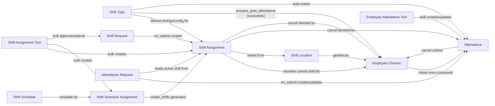

# Shift & Attendance

This module covers two intertwined business domains: **who is working which shift, when** (Shift Type, Shift Assignment, Shift Request, Shift Schedule, Shift Schedule Assignment, Shift Assignment Tool, Shift Location) and **whether they actually showed up** (Attendance, Employee Checkin, Attendance Request, Employee Attendance Tool). The connective tissue between them is the auto-attendance engine in [[Shift Type]], which consumes [[Employee Checkin]] logs against an employee's resolved [[Shift Assignment]] to produce [[Attendance]] records automatically, with manual tools and request-based corrections available wherever automation can't or shouldn't apply.

## Doctype Map

## Why This Module Exists

Attendance can't be trusted as a single manual entry point in any organization with shift work, remote check-ins, or approval-based exceptions — so the module is layered:

- **Shift Type must exist before Shift Assignment**, because a shift's timings, grace periods, and auto-attendance thresholds are what every downstream calculation (working hours, late/early flags, overnight-shift boundary math) depends on. Changing shift timings after checkins reference them is explicitly blocked (`validate_unlinked_logs`) to avoid corrupting past calculations.
- **Shift Assignment must exist before Employee Checkin can resolve a shift**, because a checkin timestamp is meaningless for attendance purposes until it's known which shift (if any) it falls inside — that resolution engine (`get_employee_shift` → `get_shift_details`) is shared code, not duplicated per caller.
- **Shift Request and Shift Schedule (+ Shift Schedule Assignment) are two different on-ramps to Shift Assignment** — one ad hoc and employee-initiated with approval, one templated and recurring for rota-based shops — but both terminate in the same Shift Assignment record, so all downstream logic (overlap checks, checkin resolution, auto-attendance sweeps) only has to reason about one doctype.
- **Attendance is deliberately the single source of truth**, fed by four independent producers (manual entry, Employee Attendance Tool, Attendance Request, and Shift Type's automated pipeline) that all funnel through the same `validate()` rules (duplicate detection, shift-overlap detection, leave-record reconciliation) — this is why Attendance's own validation is stricter and more defensive than any of its producers individually enforce.
- **Attendance Request exists as an auditable exception path** rather than allowing free-form edits to Attendance, because attendance data feeds payroll and compliance reporting — every correction needs a `reason`, an optional `explanation`, and leaves a comment trail on the Attendance record it touches.
- **Shift Location and geofencing are opt-in** (`HR Settings.allow_geolocation_tracking`, per-location `checkin_radius`) because not every organization needs or wants location-restricted check-ins, but where required, the enforcement point is deliberately in Employee Checkin (the point of data entry) rather than after the fact in Attendance.

## Doctypes in This Module

- [[Attendance]] — the authoritative daily attendance record (Present/Absent/On Leave/Half Day/WFH); everything else in this module exists to produce or correct it.
- [[Attendance Request]] — employee/HR-raised, approvable correction that creates or updates Attendance over a date range (On Duty / Work From Home).
- [[Employee Checkin]] — a single raw IN/OUT punch, optionally geofenced, consumed by auto-attendance or reviewed manually.
- [[Employee Attendance Tool]] — virtual bulk tool for manually marking Attendance for many employees on one date.
- [[Shift Type]] — master shift definition and configuration, including the scheduled auto-attendance engine.
- [[Shift Assignment]] — binds an employee to a Shift Type for a date range; the record every shift-resolution helper queries.
- [[Shift Request]] — employee self-service, approver-gated request for a (temporary) shift change; approval auto-creates a Shift Assignment.
- [[Shift Schedule]] — reusable recurring-rota template (shift + weekdays + cadence).
- [[Shift Schedule Assignment]] — attaches an employee to a Shift Schedule and rolls it forward into real, dated Shift Assignment records via a scheduled job.
- [[Shift Assignment Tool]] — virtual bulk tool for mass-assigning shifts/schedules or bulk-processing Shift Requests.
- [[Shift Location]] — named site with coordinates and a check-in radius, used to geofence Employee Checkin.

## See Also

- [[Attendance and Shift Lifecycle]] — end-to-end flow tying shift assignment, checkins, auto-attendance, and correction requests together.
