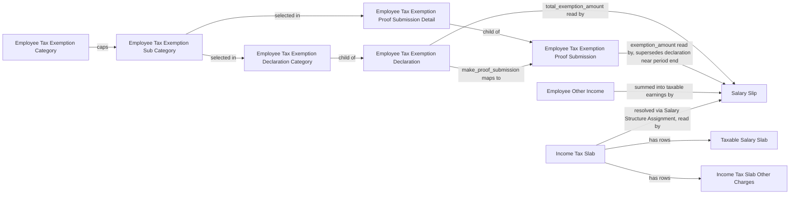

# Tax & Benefits

> [!note] This is a conceptual grouping, not a source folder
> These doctypes physically live under `hrms/payroll/doctype/` in source, so their full
> per-doctype files are kept in [[01-Modules/Payroll/_Overview|Payroll]] to avoid duplicate
> notes with drifting content. This page is the tax/benefits-focused map and reasoning —
> every `[[wikilink]]` below resolves to the doctype file that actually lives in the
> Payroll module folder.

Covers income-tax computation setup and employee-side tax-saving declarations/proof for Frappe HRMS: the statutory slab/bracket tables, the master data of exemption categories/sub-categories, the employee's provisional declaration and later evidence-backed proof submission, and non-salary taxable income. This module supplies the inputs [[Salary Slip]] needs to compute period tax deductions — it does not itself run payroll, it only supplies the rate table and exemption/other-income figures Salary Slip reads.

## Doctype Map

## Why This Module Exists

Payroll tax withholding needs to happen every pay period, but actual investment proof is usually only available near year-end. This module splits the problem into three layers:

1. **Statutory rate definition** ([[Income Tax Slab]] + [[Taxable Salary Slab]] + Income Tax Slab Other Charges) — defines *how much* tax is owed for a given taxable income, with pluggable regional overrides (marginal relief, surcharge) via `erpnext.allow_regional`, since tax law is country-specific.
2. **Exemption master data** ([[Employee Tax Exemption Category]] → [[Employee Tax Exemption Sub Category]]) — a two-tier structure so statutory caps (category level) can bound many specific instruments (sub-category level) without hardcoding.
3. **Employee-side estimate then evidence** ([[Employee Tax Exemption Declaration]] → [[Employee Tax Exemption Proof Submission]]) — the declaration lets payroll withhold a realistic (not maximal) tax amount throughout the year; the proof submission is the evidence that finally locks in the exemption. Salary Slip prefers the Proof Submission over the Declaration once the payroll period nears its end (`deduct_tax_for_unsubmitted_tax_exemption_proof`), and grants **zero** exemption if no proof was submitted — enforcing "prove it or lose it" in code, not just policy.

[[Employee Other Income]] exists separately because taxable income isn't only what's paid through the salary structure — external income must be folded into the same taxable-earnings total for tax to be computed correctly.

## Doctypes in This Module

- [[Income Tax Slab]] — the tax bracket/rate table an employee's payroll is taxed against, resolved via Salary Structure Assignment.
- [[Taxable Salary Slab]] — one bracket row (income range + rate + optional condition) inside an Income Tax Slab.
- [[Income Tax Slab Other Charges]] — one percentage-based surcharge/cess row layered on top of computed tax.
- [[Employee Tax Exemption Category]] — a statutory grouping of exemptible instruments with an overall cap.
- [[Employee Tax Exemption Sub Category]] — a specific exemptible instrument nested under a category, capped by it.
- [[Employee Tax Exemption Declaration]] — an employee's provisional, self-declared tax-saving investment plan for a payroll period.
- [[Employee Tax Exemption Declaration Category]] — one declared sub-category + amount row inside a Declaration.
- [[Employee Tax Exemption Proof Submission]] — the employee's evidence-backed actuals, supersedes the declaration once submitted.
- [[Employee Tax Exemption Proof Submission Detail]] — one proof row (sub-category, actual amount, attached document) inside a Proof Submission.
- [[Employee Other Income]] — non-salary taxable income folded into the payroll period's total taxable earnings.

## Benefit & Gratuity Doctypes (also conceptually part of this module)

The "Benefits" half of this module's name covers flexible-benefit allocation/claims and end-of-service gratuity — both, like the tax doctypes above, physically live under `hrms/payroll/doctype/` and feed into the [[Payroll Run Lifecycle]] rather than being computed here:

- [[Employee Benefit Application]] — an employee's annual flexible-benefit plan allocation across benefit components.
- [[Employee Benefit Application Detail]] — one benefit component amount row inside an Application.
- [[Employee Benefit Claim]] — an employee's claim against their allocated benefit amount, read by [[Salary Slip]] to pay out.
- [[Employee Benefit Detail]] — one claimed-component row inside a Benefit Claim.
- [[Employee Benefit Ledger]] — running ledger tracking claimed amounts against a Benefit Application's allocation.
- [[Gratuity]] — the end-of-service benefit payout computed against a [[Gratuity Rule]] at employee separation.
- [[Gratuity Rule]] — the slab-based formula (e.g. India's 15/26, UAE's 21/30 or 30/30) a Gratuity payout is calculated against.
- [[Gratuity Rule Slab]] — one tenure-range/fraction row inside a Gratuity Rule.
- [[Gratuity Applicable Component]] — the salary components counted as "applicable earnings" for a Gratuity Rule's calculation.
