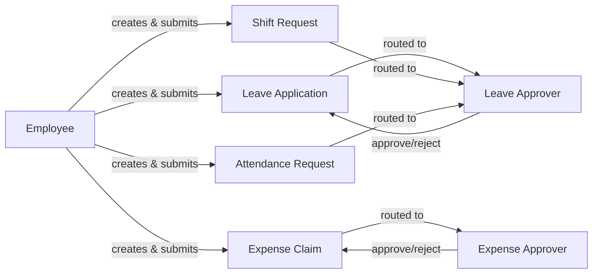

# Employee

The base self-service role. Every user record HRMS creates for a hired person gets
this role (plus, in the desk UI, "Employee Self Service" for the mobile-first HR app).
It represents "acting on my own record" — almost every permission rule for this role
is scoped with an `if_owner` or an explicit `employee == frappe.session.user`-style
check in the controller, not just the role alone.

## What This Role Can Do

| Area | Action | Scope |
|---|---|---|
| [[Leave Application]] | create, submit, cancel | only for self (`employee` field forced/validated to session user's linked Employee) |
| [[Leave Encashment]] | create | only for self, only within policy-allowed window |
| [[Compensatory Leave Request]] | create, submit | only for self |
| [[Attendance Request]] | create, submit | only for self |
| [[Shift Request]] | create, submit | only for self |
| [[Employee Checkin]] | create (via mobile/API) | only for self |
| [[Expense Claim]] | create, submit | only for self; routes to an [[Expense Approver]] |
| [[Employee Tax Exemption Declaration]] | create, submit | only for self, once per Payroll Period |
| [[Employee Tax Exemption Proof Submission]] | create, submit | only for self |
| [[Employee Other Income]] | create | only for self |
| [[Job Applicant]] via [[Employee Referral]] | create | can refer external candidates against open [[Job Opening]]s |
| [[Goal]], [[Appraisal]] (self-appraisal section) | read/update own | as participant in the active [[Appraisal Cycle]] |
| [[Employee Performance Feedback]] | give feedback | when nominated as a reviewer for a peer |
| [[Exit Interview]] | fill own | when triggered by their own [[Employee Separation]] |
| [[Salary Slip]], [[Full and Final Statement\|F&F Statement]] | read only | own record, never write |

## What This Role Cannot Do

- Cannot approve their own [[Leave Application]], [[Expense Claim]], [[Attendance Request]],
  or [[Shift Request]] — approval requires [[Leave Approver]] / [[Expense Approver]] role
  and being named on the Employee's `leave_approver`/`expense_approver` field (or
  [[Department Approver]] fallback).
- Cannot create/edit [[Salary Structure]], [[Salary Component]], [[Leave Policy]], or any
  master/setup doctype.
- Cannot run [[Payroll Entry]] or view other employees' Salary Slips.
- Cannot see HR-only fields on their own [[Employee]] record depending on field-level
  permissions (e.g. some HR/legal fields are HR User/HR Manager write-only).

## Why This Role Shape

Frappe HRMS treats "Employee" not as an admin role but as an *identity* — the
permission model leans on doctype-level "if owner" style restriction plus explicit
`employee` field checks in controllers (see `validate_active_employee`,
`get_permission_query_conditions` overrides referenced across [[Leave Application]],
[[Expense Claim]], [[Attendance Request]]) rather than granting Employee broad read/write
on HR doctypes. This keeps self-service safe by construction: giving everyone the
Employee role doesn't leak co-workers' leave balances, salary, or personal data, because
every list view and every submit action is filtered back down to "records where I am
the employee."

## Mermaid: Where Employee Sits in the Approval Chain

See also: [[Leave Approver]], [[Expense Approver]], [[HR User]], [[Leave Request Lifecycle]].
