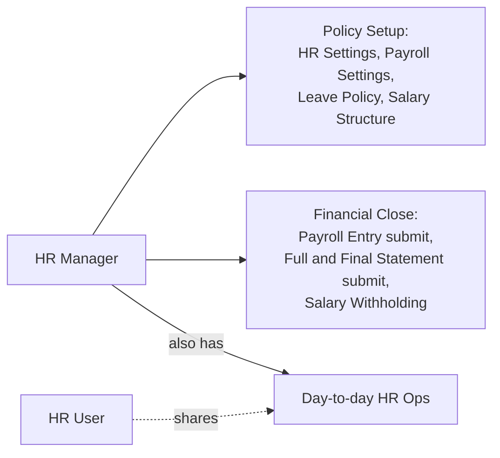

# HR Manager

The top operational authority inside the HR/Payroll domain (below [[System Manager]],
which is a Frappe-framework-wide super-role, not HR-specific). HR Manager has every
right [[HR User]] has, plus the doctypes and transitions that change organization-wide
policy or trigger accounting-consequential state.

## Policy & Setup Authority (usually HR Manager only)

- [[HR Settings]] — global toggles: self-approval rules, backdated-application limits,
  naming series, attendance/shift automation switches, hiring email templates.
- [[Payroll Settings]], [[Salary Structure]] design, [[Salary Component]] creation,
  [[Income Tax Slab]] and [[Taxable Salary Slab]] definition.
- [[Leave Policy]], [[Leave Policy Assignment]], [[Leave Type]], [[Leave Period]] —
  the rules every Employee's leave balance is computed against.
- [[Employee Grade]], [[Employment Type]], [[Department Approver]] — classification
  and approval-routing masters.
- [[Gratuity Rule]], [[Gratuity Rule Slab]] — statutory/company gratuity formula setup.

## Financial-Close / Submit Authority

- [[Payroll Entry]] submit — the action that locks a period's Salary Slips and queues
  bank/accounting postings.
- [[Full and Final Statement]] submit — finalizes a separated employee's settlement.
- [[Salary Withholding]] — decide to withhold pay pending an investigation/exit clearance.
- [[Salary Structure Assignment]] submit for any employee, including backdated ones
  (HR User may be restricted from backdating depending on [[HR Settings]] config).

## Cross-Employee Visibility

Unlike Employee (self-only) or Leave Approver/Expense Approver (only their assigned
reports), HR Manager and HR User both see and can act on every employee's records
company-wide — leave, attendance, payroll, performance, grievances. This is a
deliberate exception to Frappe's usual owner-based permission model, because HR
administration inherently requires cross-employee visibility to do its job (payroll
run, statutory filing, headcount planning).

## Why This Role Exists Separately from HR User

Compliance and audit reasons: pay-affecting configuration changes (a new Salary
Component, a changed Income Tax Slab, a submitted Payroll Entry) have downstream
accounting and legal consequences (wrong tax withheld, wrong GL postings, statutory
non-compliance). Restricting these actions to a smaller HR Manager set — while still
letting a larger HR User pool handle routine records — is the same segregation-of-duties
reasoning found in [[HR User]], from the other side: HR Manager is "who is trusted with
the parts of the system that, if wrong, are expensive or illegal to get wrong."

## Mermaid: HR Manager's Distinct Powers

See also: [[HR User]], [[System Manager]].
