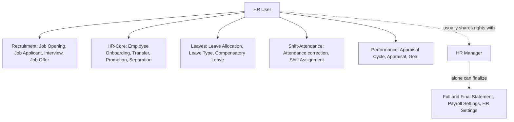

# HR User

The operational HR role — day-to-day data entry and processing across the employee
lifecycle, but without the org-wide policy-setting or financial-close powers reserved
for [[HR Manager]]. In most doctype permission tables, HR User and HR Manager appear
side by side with identical read/write/create rights; the split usually shows up on
**submit/cancel/amend of financially or legally consequential documents** (Payroll
Entry, Salary Structure Assignment, Full and Final Statement), which HR Manager alone
can push through, and on settings singles like [[HR Settings]], [[Leave Policy]],
[[Salary Structure]] design.

## What This Role Typically Can Do

- Create/edit records across almost every module for **any** employee (not scoped to
  self) — [[Employee Onboarding]], [[Employee Separation]], [[Employee Transfer]],
  [[Employee Promotion]], [[Employee Grievance]], [[Job Opening]], [[Job Applicant]],
  [[Interview]], [[Job Offer]], [[Leave Allocation]], [[Leave Type]], [[Shift Assignment]],
  [[Shift Type]], [[Attendance]] (manual correction), [[Appraisal Cycle]], [[Appraisal]].
- Approve/process on behalf of the organization where a doctype has no dedicated
  approver role (e.g. mark [[Attendance]] present/absent directly via
  [[Employee Attendance Tool]]).
- Read all employees' [[Salary Slip]]s, tax declarations, and other otherwise-private
  records for support/correction purposes.
- Run [[Payroll Entry]] in most configurations (submit rights on Payroll Entry are
  commonly granted to HR User too — verify per-doctype file; the split with HR Manager
  is not uniform across every payroll doctype, several grant both roles identical
  submit/cancel rights).

## What Tends To Be HR Manager-Only

- Company-wide settings: [[HR Settings]], [[Payroll Settings]], [[Leave Policy]] design,
  [[Salary Structure]] template design, [[Income Tax Slab]].
- Final financial sign-off: [[Full and Final Statement]] submit, [[Gratuity]] submit
  (though the Payroll agent flagged Gratuity's permissions as read/write/create only,
  no submit right for either role in the JSON — see [[Gratuity]]).
- [[Leave Control Panel]] bulk allocation runs.

Exact per-doctype split is authoritative in each doctype's own `## Roles & Permissions`
table — this page is the cross-cutting summary, not a substitute for it.

## Why This Split Exists

Frappe HRMS separates "does the transactional HR work" from "owns the policy and the
money" so that a large HR team can have many HR Users processing onboarding, leave,
attendance and interviews day to day, while only a small number of trusted HR Manager
accounts can change pay-affecting configuration or push a Payroll Entry/F&F Statement
to a state that generates accounting entries. This mirrors segregation-of-duties
practice in real HR/payroll operations: the person entering data usually isn't the
same person authorized to finalize money movement.

## Mermaid: HR User's Reach Across Modules

See also: [[HR Manager]], [[System Manager]].
