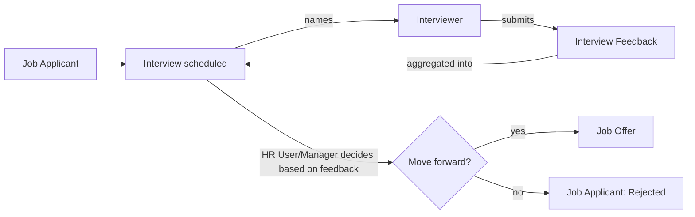

# Interviewer

A narrow, recruitment-only role for employees who sit on interview panels but aren't
HR staff. Scope is per-[[Interview]] via the [[Interviewer (Role)|Interviewer]] child-table/link record
naming them on that specific interview round, not company-wide.

## What This Role Can Do

| Doctype | Action | Scope |
|---|---|---|
| [[Interview]] | read | only interviews they're listed on |
| [[Interview Feedback]] | create, submit | only for interviews they're listed on |
| [[Interview Detail]] | read | as part of the interview they're assigned to |

Cannot see other candidates' applications ([[Job Applicant]]), cannot see [[Job Offer]]
terms, cannot move a candidate through the pipeline — feedback submission is their only
write action, and it feeds into (but does not itself decide) the hire/no-hire outcome.

## Automation Tied to This Role

- `send_interview_reminder` (scheduler `all`) and `send_daily_feedback_reminder`
  (scheduler `daily`) in `hrms/hr/doctype/interview/interview.py` nudge Interviewers
  who haven't submitted feedback yet — see [[Interview]] for the exact query logic.

## Why This Role Exists Separately from HR User

Interview panels routinely include engineers, team leads, or other non-HR staff who
need just enough system access to see their assigned interview and leave structured
feedback — granting them [[HR User]] would expose the entire employee database and
recruitment pipeline for a task that only needs a narrow slice. Interviewer is the
minimum-privilege role that makes structured feedback collection possible without
that exposure.

## Mermaid: Interviewer in the Recruitment Flow

See also: [[Interview]], [[Interview Feedback]], [[Recruitment to Onboarding]].
