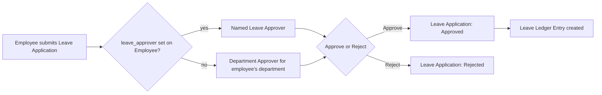

# Leave Approver

A scoped approval role: it does not grant company-wide access like [[HR User]]. Instead,
each [[Employee]] record names one or more specific users in its `leave_approver`
field(s), and only a user who both (a) holds the Leave Approver role and (b) is named
on that specific employee's record (or matches a [[Department Approver]] fallback for
that employee's department) can approve/reject that employee's requests.

## What This Role Can Do

| Doctype | Action | Scope |
|---|---|---|
| [[Leave Application]] | approve/reject (status change), read | only for employees who name them as `leave_approver` |
| [[Compensatory Leave Request]] | approve/reject | same scoping |
| [[Attendance Request]] | approve/reject | same scoping (attendance corrections route through the same approver chain) |
| [[Shift Request]] | approve/reject | same scoping |

The role itself carries no create/write rights on Leave Policy, Leave Type, or Leave
Allocation — a Leave Approver approves usage of leave, they don't define the leave
scheme itself (that's [[HR Manager]] territory).

## Resolution Order: Who Is *The* Approver For an Employee

1. Employee's own `leave_approver` field (explicit named user), if set.
2. Falls back to [[Department Approver]] configured for the employee's department, if
   the employee-level field is empty.
3. If neither resolves, [[HR User]]/[[HR Manager]] can still act since they have
   unscoped access — but the intended flow is always through a named approver.

## Why This Role Is Scoped, Not Global

Leave approval is meant to sit with the requester's actual manager/team lead, not with
HR broadly — HR configures the leave *system*, but day-to-day "is this person's time
off okay" is a line-management decision. Scoping the role to named-approver-per-employee
(rather than a blanket company-wide Leave Approver right) keeps that decision with the
right person and prevents an unrelated manager from approving another team's leave.
It also means the same person can be both an Employee (self-service) and a Leave
Approver (for their reports) simultaneously — both roles commonly coexist on one user.

## Mermaid: Approval Routing

See also: [[Employee]], [[Department Approver]], [[Leave Request Lifecycle]].
