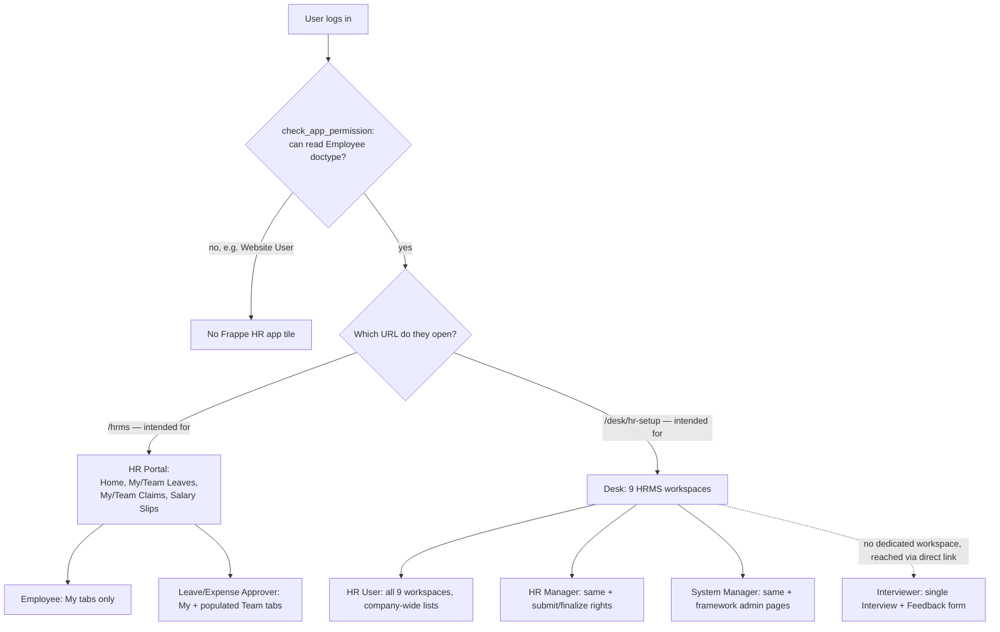

# What Each Role Sees On Login

Frappe HRMS has **two separate UIs**, and which one a role actually uses in practice
(there is no server-side forced redirect by role — see [[#No Automatic Role Routing]])
determines what "logging in" looks like for that role:

1. **Desk** (`/desk/hr-setup` — `app_home` in `hrms/hooks.py`) — the classic Frappe
   admin UI: a left sidebar of workspaces, each workspace a page of shortcuts, charts,
   and list-view links. This is what [[HR User]], [[HR Manager]], and
   [[System Manager]] use.
2. **HR Portal** (`/hrms`, served by `hrms/www/hrms.py`, built from `frontend/`) — a
   mobile-first Ionic/Vue single-page app: a Home screen with quick-action tiles and a
   handful of "My X / Team X" list screens. This is what [[Employee]],
   [[Leave Approver]], and [[Expense Approver]] use day to day, even though nothing
   stops them from also opening Desk (see below).

A third surface, `/hr` (`hrms/www/roster.py`), serves a standalone shift-roster
planning app — relevant mainly to [[HR User]]/[[HR Manager]] doing shift scheduling,
not covered per-tab here since it's a single-purpose planning tool, not a role home.

A fourth, `/jobs` (`hrms/www/jobs`), is the **public** job board — no login, no role,
lists open [[Job Opening]]s for external candidates. Not a logged-in view at all, but
included here because it's the one page in this app anyone can see with zero access.

## No Automatic Role Routing

There is no `role_home_page` mapping in `hooks.py` (it's present but commented out)
and no redirect logic in `hrms/www/hrms.py` or `roster.py` that sends one role to Desk
and another to the Portal. The only gate is `hrms.hr.utils.check_app_permission`
(referenced from `add_to_apps_screen`), which decides whether the **"Frappe HR" app
tile** even shows on the Frappe Apps screen: it returns `True` for Administrator,
`False` for a `Website User` user type, and otherwise `True` if the user has *any*
read permission on [[Employee]] — which a plain [[Employee]] role user does have
(scoped to their own record), so **an Employee-role user can technically open Desk
too**. In practice this vault documents the *intended* usage pattern each role's
permissions are actually designed around, not a hard technical restriction.

---

## Employee — HR Portal (`/hrms`)

| Screen | Route | What They See |
|---|---|---|
| Home | `/home` | `CheckInPanel` (their own last checkin + a checkin/checkout button), `QuickLinks` tiles (Request Attendance, Request a Shift, Request Leave, Claim an Expense, Request an Advance, View Salary Slips), `RequestPanel` (their own recent pending requests). |
| Attendance dashboard | `/dashboard/attendance` | Own [[Attendance]] history, own [[Employee Checkin]] log, own [[Attendance Request]]/[[Shift Request]] status — filtered `employee = me` at the API layer. |
| Leaves dashboard + list | `/dashboard/leaves`, leave list | Own leave balance summary; leave list has **My Leaves / Team Leaves** tabs — a plain Employee sees "My Leaves" populated and "Team Leaves" empty (server-side permission query returns nothing unless they also hold [[Leave Approver]]). |
| Expense claims dashboard + list | `/dashboard/expense-claims` | Own [[Expense Claim]] history; same **My Claims / Team Claims** tab pattern. |
| Salary slips dashboard | `/dashboard/salary-slips` | Own [[Salary Slip]] list and detail view only — never another employee's. |
| Employee advance | via Home quick link | Own Employee Advance requests only. |
| Profile / Notifications / Settings | `/profile`, `/notifications`, `/settings` | Own user profile fields, own notification feed, app-level preferences (language, theme) — no HR data. |

**Data scope on every screen: `employee = frappe.session.user`'s linked Employee,
enforced server-side** — the frontend doesn't add its own security, it relies on the
same permission-query-condition scoping documented in each doctype's
`## Roles & Permissions` section.

## Leave Approver / Expense Approver — same HR Portal, plus populated Team tabs

These aren't separate screens — a user holding [[Leave Approver]] and/or
[[Expense Approver]] uses the **exact same Home/dashboard/list screens** as
[[Employee]] (most approvers are also employees), except:

- The **Team Leaves** tab on the leave list, **Team Claims** tab on the expense list,
  and **Team Requests** tab on the shift/attendance-request lists now return rows,
  because the frontend's only client-side rule is `employee != me`
  (`frontend/src/components/ListView.vue`'s `defaultFilters`) — which records actually
  come back is entirely decided server-side by whether this user is named as
  `leave_approver`/`expense_approver` on those employees (or matches via
  [[Department Approver]] fallback). A Leave Approver who approves for 5 people sees
  exactly those 5 people's requests on the Team tab, no one else's.
- They can act on those requests (approve/reject) from the request's detail view,
  which a plain Employee viewing their own request cannot do.

No dedicated "approvals inbox" screen exists in the portal — Team tabs on the normal
My/Team list views **are** the approval inbox.

## Interviewer — no portal screen, Desk-only, scoped to assigned interviews

The [[Interviewer (Role)|Interviewer]] role has no presence in the `frontend/` app at all — an
interviewer works entirely in Desk, opening their assigned [[Interview]] document
(usually reached via a link in a reminder email/notification, not a workspace
shortcut, since Interviewer isn't a role interview workspaces are built around) and
filling in [[Interview Feedback]] from there. What they see when they log in is
whatever their other roles grant (commonly nothing beyond Desk's default My Settings
page) until they follow a specific Interview link.

## HR User — Desk, `/desk/hr-setup`, company-wide scope on every workspace

Lands on the **HR Setup** workspace (the `app_home` default) and has all 9 HRMS
workspaces available in the Desk sidebar, since their role has read/write access to
the doctypes each workspace links to:

| Workspace | Key Pages/Shortcuts | Data Scope |
|---|---|---|
| **HR Setup** | [[Employee]] (list), Organizational Chart, Company, Branch, Department, Designation, Employee Group, [[Employee Grade]] | All employees, all departments — company-wide. |
| **Tenure** | [[Employee Onboarding]], [[Employee Separation]], [[Employee Grievance]], Employee Exits report, Employee Birthday, [[Employee Skill Map]], [[Training Program]]/[[Training Event]]/[[Training Feedback]]/[[Training Result]], [[Grievance Type]] | All employees' lifecycle records. |
| **Leaves** | [[Leave Application]], [[Leave Encashment]], [[Leave Control Panel]], [[Leave Policy Assignment]], [[Leave Allocation]], Leave Balance reports, Holiday List | All employees' leave data — not scoped to "my team" like the approver's portal Team tab. |
| **Shift & Attendance** | Roster, [[Employee Attendance Tool]], [[Employee Checkin]], [[Shift Request]], [[Attendance Request]], Overtime, [[Shift Type]]/[[Shift Location]]/[[Shift Schedule]], Timesheet | All employees. |
| **Payroll** | [[Payroll Entry]], [[Salary Structure Assignment]], [[Salary Slip]], [[Additional Salary]], [[Salary Withholding]], Salary Register, Income/Professional Tax Deduction reports, GL reports | All employees' pay data (subject to the HR User/HR Manager split on submit rights — see [[HR Manager]]). |
| **Recruitment** | [[Job Opening]], [[Job Applicant]], [[Interview]], [[Job Offer]], Appointment Letter, [[Job Requisition]], [[Staffing Plan]], [[Employee Referral]] | All open and closed requisitions/candidates. |
| **Performance** | [[Goal]], [[Appraisal Cycle]], [[Appraisal]], [[Employee Performance Feedback]], [[Employee Promotion]], [[Appraisal Template]], KRA, [[Employee Feedback Criteria]] | All employees' appraisal data. |
| **Tax & Benefits** | [[Employee Tax Exemption Declaration\|Exemption Declaration]], [[Employee Tax Exemption Proof Submission\|Exemption Submission Proof]], [[Employee Benefit Application\|Benefit Application]], [[Employee Benefit Claim\|Benefit Claim]], Income Tax Computation/Deductions, [[Income Tax Slab]], [[Employee Tax Exemption Category\|Exemption Category]] | All employees' tax/benefit records. |
| **Expenses** | Employee Advance, [[Expense Claim]], [[Travel Request]], [[Purpose of Travel]], Vehicle Log, Accounting Entries (Payment/Journal Entry), [[Expense Claim Type]], Driver, Vehicle | All employees' claims and travel. |

**Data scope: company-wide on every list, no self/team restriction** — this is the
opposite of the portal's My/Team split, because [[HR User]]'s whole job requires
seeing every employee's records (see [[HR User]]'s own file for why).

## HR Manager — identical Desk layout to HR User, plus finalize actions

Sees the exact same 9 workspaces and pages as [[HR User]] on login — the difference
isn't *what pages exist*, it's which buttons on those pages are enabled: Payroll
Entry submit, Full and Final Statement submit, HR Settings/Payroll Settings/Leave
Policy edit access appear active for HR Manager where HR User's copy of the same page
may show them read-only or hidden, per each doctype's permissions table. See
[[HR Manager]] for the specific list of Manager-only actions.

## System Manager — same Desk shell, plus framework-level admin pages

Sees everything [[HR Manager]] sees, plus Desk's own non-HR admin surfaces (User
list, Role Permission Manager, System Settings, Integrations) that aren't part of
this app at all — these are standard Frappe framework pages, not HRMS workspaces, and
out of scope for this vault beyond noting they exist.

## Mermaid: Login Surface by Role

See also: [[Roles Overview]], [[Role Permission Matrix]], [[Employee]], [[Leave Approver]],
[[Expense Approver]], [[Interviewer (Role)|Interviewer]], [[HR User]], [[HR Manager]], [[System Manager]].
