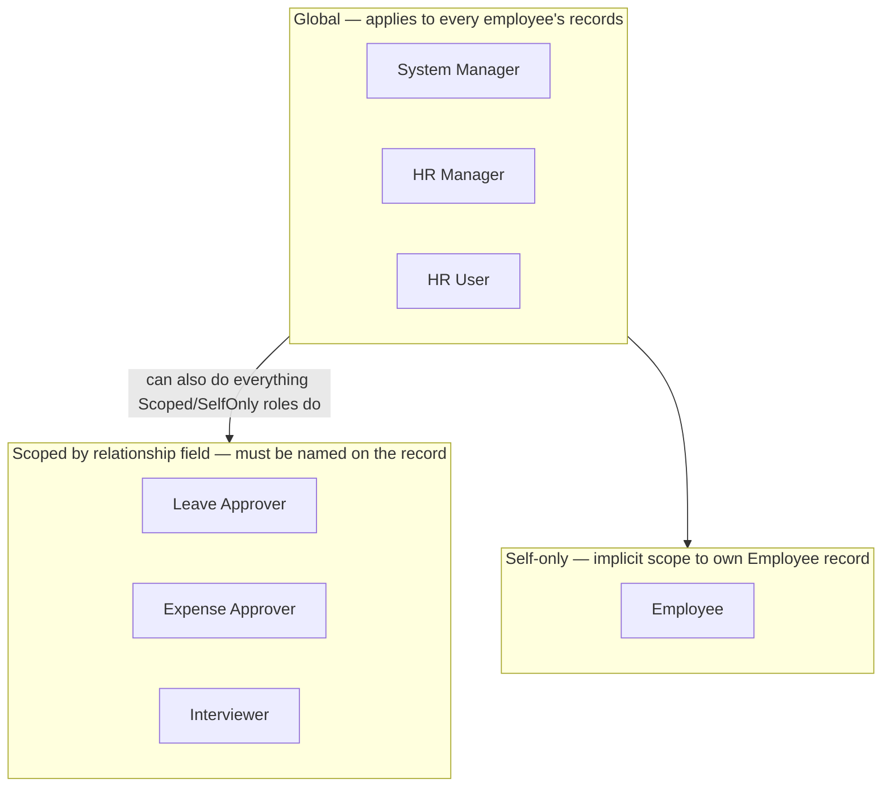

# Roles Overview

Frappe HRMS's permission model is built from two different shapes of role, and
mixing them up is the most common source of "why can't this user see/do X" confusion:

1. **Global roles** — [[System Manager]], [[HR Manager]], [[HR User]] — grant rights
   across *all* employees' records. These are assigned once on the User record and
   apply everywhere.
2. **Scoped-by-relationship roles** — [[Leave Approver]], [[Expense Approver]],
   [[Interviewer (Role)|Interviewer]] — the role alone grants nothing; it only becomes effective for a
   specific record when that user is also *named* on the relevant field (Employee's
   `leave_approver`/`expense_approver`, or an Interview's Interviewer child row), with
   [[Department Approver]] as an org-chart-based fallback.
3. **Self-only role** — [[Employee]] — every right is implicitly scoped to
   "documents where I am the employee," enforced in controller code
   (`get_permission_query_conditions`, explicit `employee == frappe.session.user`
   checks) rather than by the doctype permissions table alone.

## Full Role List Found in HRMS Doctype Permissions

Extracted from every doctype's JSON `permissions[].role` across the app (excludes
generic ERPNext/framework roles like Accounts User, Projects User, Manufacturing User,
Academics User, Fleet Manager that appear only on shared/core doctypes HRMS extends,
not on HRMS-authored doctypes):

- [[System Manager]] — framework-wide admin, appears almost everywhere.
- [[HR Manager]] — HR policy + financial-close authority.
- [[HR User]] — day-to-day HR operations.
- [[Employee]] — self-service.
- Employee Self Service — the mobile-app-facing variant of Employee; functionally
  equivalent scope, distinguished mainly for UI/workspace targeting rather than
  additional permission logic.
- [[Leave Approver]] — scoped leave/attendance/shift approval.
- [[Expense Approver]] — scoped expense approval.
- [[Interviewer (Role)|Interviewer]] — scoped interview feedback.
- `All` — the implicit role every logged-in user has; used sparingly for things like
  reading published Job Openings.
- `Administrator` — the framework super-user account, bypasses permission checks.

## Mermaid: Role Shape Taxonomy

## Why It's Built This Way

A single flat "HR" role would either be too powerful for line managers (any manager
could see any team's leave/salary data) or too weak for HR operations (HR staff need
company-wide reach to do payroll, headcount, and compliance work). Splitting roles by
*shape* — global for the people whose job is administering HR, relationship-scoped for
the people whose job is managing a specific team, self-only for the people whose job
is being an employee — lets Frappe HRMS support all three without over- or
under-granting access to any of them.

See also: [[Role Permission Matrix]], [[Master Relationship Graph]], [[Role Login Views]].
