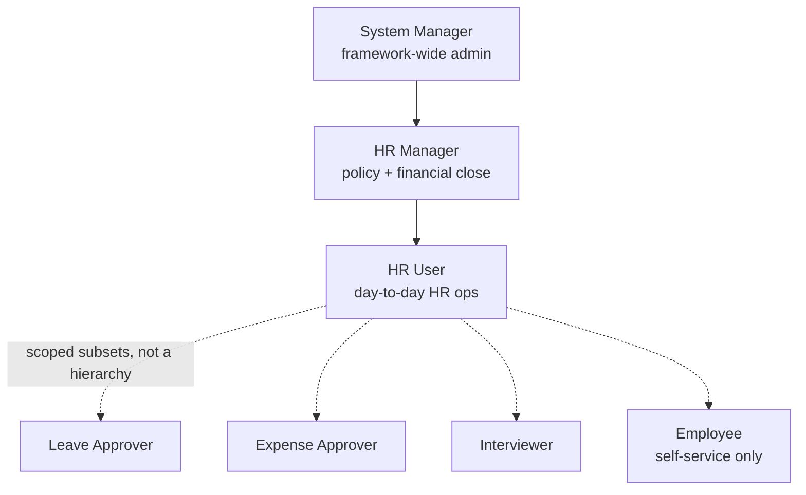

# System Manager

Not an HR-specific role — this is Frappe framework's top-level administrative role,
present in every Frappe app (ERPNext, HRMS, or a custom app alike). It is listed on
almost every HRMS doctype's permissions table because System Manager conventionally
gets full rights (read/write/create/delete/submit/cancel/amend/report/export) on
everything, as an escape hatch for system administration, data fixes, and
troubleshooting that shouldn't require impersonating an HR Manager.

## Relationship to HR Roles

- System Manager sits *above* [[HR Manager]] in practical power (can also manage users,
  roles, permissions, integrations, System Settings — none of which HR Manager can
  touch), but is not meant to be the role real HR staff operate under day to day.
- In a correctly configured instance, only IT/system administrators hold System
  Manager; HR staff hold [[HR User]]/[[HR Manager]] instead, keeping the
  segregation-of-duties reasoning documented in [[HR Manager]] intact.
- `Administrator` (the built-in super-user account) and System Manager are related but
  distinct: Administrator bypasses permission checks entirely at the framework level;
  System Manager is a role that can be assigned to any user account.

## Why It Appears in Every Permissions Table

Frappe's doctype JSON permissions array is additive per role — System Manager rows
exist so that whoever configures/maintains the Frappe instance can always reach every
document to fix data issues, run migrations, or recover from a misconfiguration,
independent of whatever HR-specific role scoping (self-only, named-approver-only)
applies to everyone else. It is the same pattern as a database superuser account
existing alongside application-level roles.

## Mermaid: Role Hierarchy (HRMS-Relevant Roles)

See also: [[HR Manager]], [[HR User]], [[Roles Overview]].
