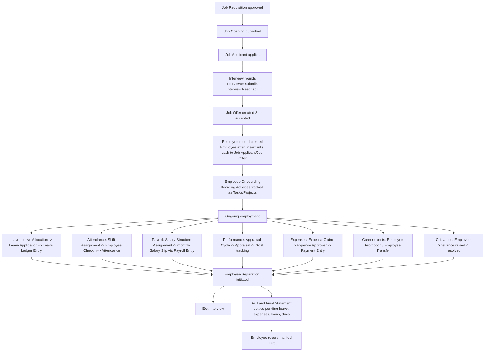

# Hire to Retire — Master Flow

The single lifecycle every other flow note in this vault is a chapter of. Frappe HRMS
is organized around one employee's journey from "candidate" to "former employee," with
each module owning one phase and handing off to the next via the [[Employee]] record
as the connecting spine.

## Phase-to-Module Map

| Phase | Module | Entry Point |
|---|---|---|
| Sourcing & hiring | [[01-Modules/Recruitment/_Overview\|Recruitment]] | [[Job Requisition]] → [[Job Offer]] |
| Onboarding | [[01-Modules/HR-Core/_Overview\|HR-Core]] | [[Employee Onboarding]] |
| Leave management | [[01-Modules/Leaves/_Overview\|Leaves]] | [[Leave Application]] |
| Time & attendance | [[01-Modules/Shift-Attendance/_Overview\|Shift-Attendance]] | [[Employee Checkin]], [[Shift Assignment]] |
| Compensation | [[01-Modules/Payroll/_Overview\|Payroll]] | [[Salary Structure Assignment]], [[Salary Slip]] |
| Growth | [[01-Modules/Performance/_Overview\|Performance]] | [[Appraisal Cycle]] |
| Reimbursement | [[01-Modules/Expenses/_Overview\|Expenses]] | [[Expense Claim]] |
| Career changes | [[01-Modules/HR-Core/_Overview\|HR-Core]] | [[Employee Promotion]], [[Employee Transfer]] |
| Exit | [[01-Modules/HR-Core/_Overview\|HR-Core]] | [[Employee Separation]], [[Full and Final Statement]] |

## Why the Employee Record Is the Spine

Every module's doctypes carry an `employee` Link field back to the single Employee
record rather than duplicating employee data per module. This is standard normalization,
but the *reason it matters for HRMS specifically* is compliance and continuity: a
person's leave balance, salary history, performance history, and exit settlement must
all agree on who they are and when they were employed — if each module kept its own
copy of employee status, [[01-Modules/Payroll/_Overview|Payroll]] could run for someone Leaves already knows has left,
or a Separation could complete while Payroll still owes them a running Salary
Structure Assignment. Centralizing on Employee, and having Employee's own doc_events
(`hrms/overrides/employee_master.py`) fan out validation and status sync to the other
modules, is what keeps the whole lifecycle internally consistent.

See also: [[Recruitment to Onboarding]], [[Leave Request Lifecycle]],
[[Payroll Run Lifecycle]], [[Expense Claim Lifecycle]],
[[Performance Appraisal Cycle]], [[Attendance and Shift Lifecycle]],
[[Employee Exit Lifecycle]], [[Master Relationship Graph]], [[HR Manager]],
[[HR User]], [[Employee]].
