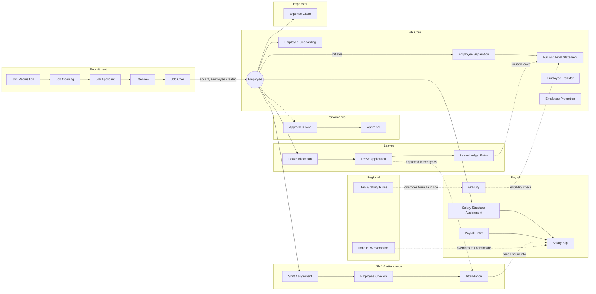

# Master Relationship Graph

The full vault, one module at a time, is too dense for one diagram — each module's
`_Overview.md` has its own detailed Doctype Map. This page is the **module-level**
zoom-out: how the modules hand off to each other, which is the layer that doesn't
appear inside any single module's overview.

## Reading This Graph

- **Solid arrows** are direct document links (a Link field, or one doctype explicitly
  creating another).
- **Dotted arrows** are cross-module *logic* couplings — no direct Link field, but one
  module's controller code reads or writes the other's data (e.g. [[Attendance]] feeding
  [[Salary Slip]]'s payable-days calculation, or a Regional override patching into core
  Payroll/HR-Core logic via `erpnext.allow_regional`).

## Per-Module Detail

Each module's own `_Overview.md` has the full doctype-level map:
- [[01-Modules/HR-Core/_Overview|HR Core]]
- [[01-Modules/Leaves/_Overview|Leaves]]
- [[01-Modules/Payroll/_Overview|Payroll]]
- [[01-Modules/Recruitment/_Overview|Recruitment]]
- [[01-Modules/Performance/_Overview|Performance]]
- [[01-Modules/Shift-Attendance/_Overview|Shift & Attendance]]
- [[01-Modules/Tax-Benefits/_Overview|Tax & Benefits]]
- [[01-Modules/Expenses/_Overview|Expenses]]
- [[01-Modules/HR-Setup/_Overview|HR Setup]]
- [[01-Modules/Regional/_Overview|Regional]]

See also: [[Module Dependency Graph]], [[Why Graph - Reasoning Map]], [[Hire to Retire Overview]].
