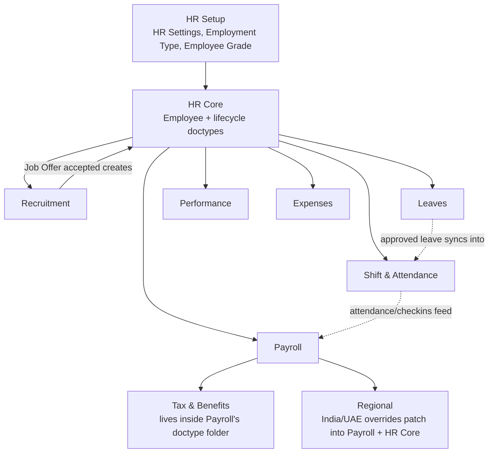

# Module Dependency Graph

Which module must have data/config in place *before* another module can function —
a "what breaks if this isn't set up yet" view, distinct from the runtime document
relationships in [[Master Relationship Graph]].

## Why the Dependency Order Matters

- **[[01-Modules/HR-Setup/_Overview|HR Setup]] before [[01-Modules/HR-Core/_Overview|HR Core]]**: [[HR Settings]] toggles (self-approval rules, naming,
  backdating limits) are read by controllers across almost every other module — if
  they don't exist yet, those controllers fall back to defaults that may not match
  the organization's actual policy, silently.
- **[[01-Modules/HR-Core/_Overview|HR Core]] before everything downstream**: every transactional doctype in [[01-Modules/Leaves/_Overview|Leaves]],
  [[01-Modules/Payroll/_Overview|Payroll]], [[01-Modules/Shift-Attendance/_Overview|Shift-Attendance]], [[01-Modules/Performance/_Overview|Performance]], and [[01-Modules/Expenses/_Overview|Expenses]] carries an `employee` Link
  field — none of them are meaningful (or, in most cases, even creatable, since the
  field is mandatory) without an [[Employee]] record existing first.
- **[[01-Modules/Leaves/_Overview|Leaves]] feeds [[01-Modules/Shift-Attendance/_Overview|Shift & Attendance]], which feeds [[01-Modules/Payroll/_Overview|Payroll]]**: an approved
  [[Leave Application]] updates [[Attendance]] so a leave day isn't misclassified as
  absent; Attendance in turn is what [[Salary Slip]] reads (via Salary Slip Leave/
  payable-days logic) to compute actual pay for a period with unpaid leave or
  absences. Skipping straight to Payroll without Leaves/Attendance in place means pay
  calculations can't account for time actually worked.
- **Tax & Benefits doctypes physically live inside Payroll's source folder** — it's
  not an independent module dependency-wise, it's a conceptual sub-grouping documented
  separately in this vault for clarity (see the note on [[01-Modules/Tax-Benefits/_Overview|Tax & Benefits]]).
- **[[01-Modules/Regional/_Overview|Regional]] sits downstream of Payroll and HR Core**, patching into their controllers
  via `erpnext.allow_regional` hooks and one-time `setup.py` fixtures (gratuity rules,
  custom fields) rather than being a self-contained module — it only makes sense once
  the doctypes it overrides already exist.
- **[[01-Modules/Recruitment/_Overview|Recruitment]] is the one module that feeds back upstream**: it doesn't depend on HR
  Core to function on its own (Job Opening/Job Applicant/Interview can run before any
  Employee exists), but its successful outcome (an accepted Job Offer) is what
  *creates* the HR Core Employee record that every other module then depends on —
  making Recruitment the actual entry point of the whole system despite HR Core being
  the structural hub.

See also: [[Master Relationship Graph]], [[Hire to Retire Overview]].
