# Why Graph — Reasoning Map

Every relationship documented in this vault exists for a reason grounded in one of a
small number of recurring design pressures. This page names those pressures once and
maps which relationships they explain, so the "why" isn't re-derived from scratch in
every doctype file — each doctype file still states its own specific reason, but this
page is the cross-cutting pattern underneath most of them.

```mermaid
flowchart TD
    subgraph Pressures["Recurring Design Pressures"]
        P1[Audit trail / compliance:\nnever overwrite, always append]
        P2[Segregation of duties:\nthe person entering data\nisn't always who authorizes it]
        P3[Statutory variability:\nlaw differs by country/region]
        P4[Periodic batching:\nsome facts only make sense\nas a whole period at once]
        P5[Estimate-then-reconcile:\nsome numbers must be guessed\nearly and corrected later]
        P6[Single source of truth:\ndon't let two doctypes\ndisagree about one fact]
    end

    P1 --> R1[Leave Ledger Entry, not a mutable balance field]
    P1 --> R2[Full and Final Statement aggregates rather than overwrites]
    P1 --> R3[Interview Feedback per-Interviewer, not one decision field]

    P2 --> R4[Leave Approver / Expense Approver scoped, not global]
    P2 --> R5[HR User vs HR Manager: ops vs financial-close]
    P2 --> R6[Self-approval blocked by default on Expense Claim]

    P3 --> R7[Gratuity Rule / Gratuity Rule Slab, not a fixed formula]
    P3 --> R8[Regional module: erpnext.allow_regional hooks for India/UAE]
    P3 --> R9[Income Tax Slab as configurable data, not hardcoded brackets]

    P4 --> R10[Payroll Entry batches Salary Slips]
    P4 --> R11[Appraisal Cycle batches Appraisals]
    P4 --> R12[Attendance auto-marking runs hourly over all of a shift's checkins]

    P5 --> R13[Tax Exemption Declaration now, Proof Submission later]
    P5 --> R14[Leave allocated per period, encashment computed at period end]

    P6 --> R15[Employee is the spine every module Links back to]
    P6 --> R16[Approved Leave Application syncs into Attendance]
    P6 --> R17[Journal Entry submit/cancel syncs payment status back onto\nExpense Claim, Salary Slip, Full and Final Statement, Salary Withholding]
```

## The Pressures, Explained

**Audit trail / compliance** — HR and payroll data is legally and financially
sensitive; the system consistently prefers append-only, reconstructable records
([[Leave Ledger Entry]]) over fields that get silently overwritten, so any balance or
decision can be traced back to the transactions that produced it.

**Segregation of duties** — the same real-world principle shows up at the role level
([[HR User]] vs [[HR Manager]]), the approval level ([[Leave Approver]]/
[[Expense Approver]] scoped to named relationships), and the self-approval blocks —
the person who benefits from or enters a transaction is, by default, not the person
who can authorize it.

**Statutory variability** — anything touching tax or termination pay ([[Gratuity]],
[[Income Tax Slab]], the [[01-Modules/Regional/_Overview|Regional module]]) is built as
*configurable data or pluggable override functions*, not hardcoded formulas, because
the correct calculation legitimately differs by country and changes when laws change.

**Periodic batching** — Payroll, Performance, and Attendance-auto-marking all
process "everyone in this period, together" rather than one record at a time, because
the underlying real-world process (a pay run, a review cycle, a work shift) only
produces a meaningful result once the whole period's data is in.

**Estimate-then-reconcile** — tax withholding and leave encashment both need a number
*before* all the facts are in (an employee's declared tax-saving plan, a year's
final unused-leave count) and a later step that corrects it against reality — the
system models both halves as separate doctypes rather than one field that would force
picking estimate or actual.

**Single source of truth** — [[Employee]] as the hub every module Links to, plus the
several doc_events in `hrms/hooks.py` that sync one doctype's state into another on
submit/cancel (Leave → [[Attendance]], Journal Entry → [[Expense Claim]]/[[Salary Slip]]/
[[Full and Final Statement]]/[[Salary Withholding]]), exist so that two different views of "has this
happened yet" (HR's view and Accounting's view, or Leave's view and Attendance's view)
never quietly drift apart.

See also: [[Master Relationship Graph]], [[Module Dependency Graph]], [[Roles Overview]].
