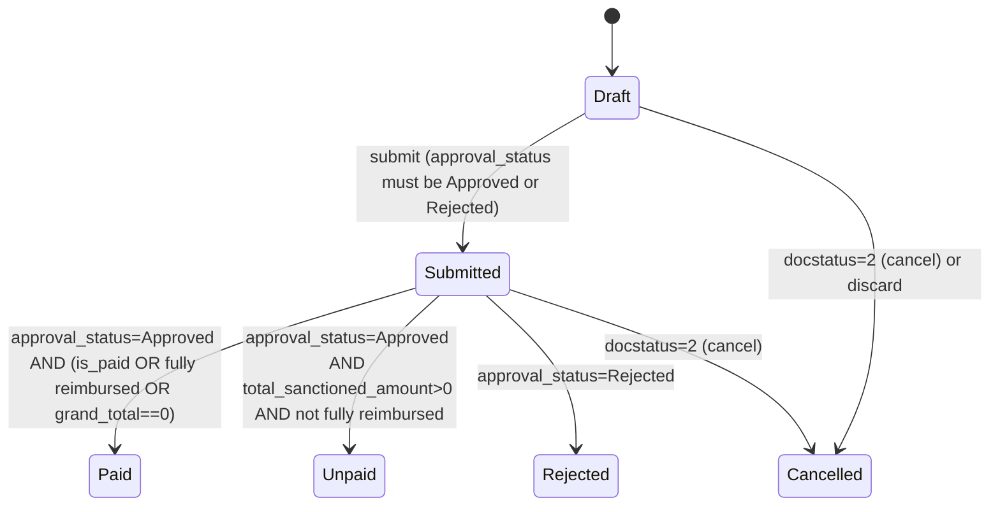

# Expense Claim

**Source:** `hrms/hr/doctype/expense_claim/expense_claim.json`, `expense_claim.py`, `expense_claim.js`
**Submittable:** yes   **Tree:** no   **Naming:** Naming Series (`naming_series` field, options `HR-EXP-.YYYY.-`, `set_only_once`)
**Module:** HR

## Schema

Full field list, in JSON `field_order`. Section/Column/Tab breaks noted as headings only.

### Tab: Expenses & Advances

| Field (fieldname) | Label | Type | Options/Link Target | Required | Default | Read-Only | Notes |
|---|---|---|---|---|---|---|---|
| naming_series | Series | Select | `HR-EXP-.YYYY.-` | yes | - | - | `set_only_once`, `no_copy` |
| employee | From Employee | Link | [[Employee Core Model]] | yes | - | - | `in_global_search`, `in_standard_filter`, `search_index` |
| employee_name | Employee Name | Data | - | - | - | yes | fetch_from `employee.employee_name` |
| department | Department | Link | Department | - | - | - | fetch_from `employee.department`, `fetch_if_empty` |
| *(column break)* | | | | | | | |
| expense_approver | Expense Approver | Link | User | - | - | - | |
| approval_status | Approval Status | Select | `Draft`/`Approved`/`Rejected`/`Cancelled` | - | Draft | - | `permlevel: 1`, `no_copy`, `search_index` |
| *(section: Currency, collapsible)* | | | | | | | |
| currency | Currency | Link | Currency | yes | - | - | fetch_from `employee.salary_currency`, `fetch_if_empty`; `depends_on: eval:(doc.docstatus==1 || doc.employee)` |
| exchange_rate | Exchange Rate | Float | - | yes | - | - | precision 9; `depends_on: currency` |
| *(section: expense_details)* | | | | | | | |
| expenses | Expenses | Table | `[[Expense Claim Detail]]` | yes | - | - | child table |
| *(section: Taxes & Charges, collapsible when `taxes` has rows)* | | | | | | | |
| taxes | Expense Taxes and Charges | Table | `[[Expense Taxes and Charges]]` | - | - | - | child table |
| *(section: Advance Payments, collapsible when `advances` has rows)* | | | | | | | |
| advances | Advances | Table | `[[Expense Claim Advance]]` | - | - | - | child table |
| *(section: Totals)* | | | | | | | |
| base_total_sanctioned_amount | Total Sanctioned Amount (Company Currency) | Currency | Company:company:default_currency | - | - | yes | `no_copy` |
| base_total_advance_amount | Total Advance Amount (Company Currency) | Currency | Company:company:default_currency | - | - | yes | |
| base_grand_total | Grand Total (Company Currency) | Currency | Company:company:default_currency | - | - | yes | |
| base_total_claimed_amount | Total Claimed Amount (Company Currency) | Currency | Company:company:default_currency | - | - | yes | `no_copy` |
| base_total_taxes_and_charges | Total Taxes and Charges (Company Currency) | Currency | Company:company:default_currency | - | - | yes | |
| total_sanctioned_amount | Total Sanctioned Amount | Currency | currency | - | - | yes | `no_copy` |
| total_advance_amount | Total Advance Amount | Currency | currency | - | - | yes | |
| grand_total | Grand Total | Currency | currency | - | - | yes | in_list_view |
| total_claimed_amount | Total Claimed Amount | Currency | currency | - | - | yes | `no_copy`, in_list_view |
| total_taxes_and_charges | Total Taxes and Charges | Currency | currency | - | - | yes | |
| total_amount_reimbursed | Total Amount Reimbursed | Currency | currency | - | - | yes | `no_copy`, in_list_view; computed server-side, see Business Logic |
| *(section: Exchange Gain/Loss)* | | | | | | | |
| total_exchange_gain_loss | Total Exchange Gain/Loss | Currency | Company:company:default_currency | - | - | yes | `depends_on: total_exchange_gain_loss` |
| gain_loss_account | Gain Loss Account | Link | Account | - | - | - | `depends_on: total_exchange_gain_loss` |

### Tab: Accounting

| Field (fieldname) | Label | Type | Options/Link Target | Required | Default | Read-Only | Notes |
|---|---|---|---|---|---|---|---|
| posting_date | Posting Date | Date | - | yes | Today | - | |
| is_paid | Is Paid | Check | - | - | 0 | - | `depends_on: eval:(doc.docstatus==0 || doc.is_paid)` |
| mode_of_payment | Mode of Payment | Link | Mode of Payment | - | - | - | `depends_on: is_paid` |
| bank_or_cash_account | Bank / Cash Account | Link | Account | - | - | - | `depends_on: mode_of_payment` |
| payable_account | Payable Account | Link | Account | conditionally | - | - | fetch_from `company.default_expense_claim_payable_account`, `fetch_if_empty`; `mandatory_depends_on: eval:!doc.is_paid` |
| clearance_date | Clearance Date | Date | - | - | - | - | |
| remark | Remark | Small Text | - | - | - | - | `no_copy` |
| *(section: Accounting Dimensions)* | | | | | | | |
| project | Project | Link | Project | - | - | - | `allow_on_submit` |
| cost_center | Cost Center | Link | Cost Center | - | - | - | fetch_from `company.cost_center`, `fetch_if_empty`; `allow_on_submit` |

### Tab: More Info

| Field (fieldname) | Label | Type | Options/Link Target | Required | Default | Read-Only | Notes |
|---|---|---|---|---|---|---|---|
| status | Status | Select | `Draft`/`Paid`/`Unpaid`/`Rejected`/`Submitted`/`Cancelled` | - | Draft | yes | `no_copy`, `print_hide`, in_list_view; set server-side, see State Machine |
| task | Task | Link | Task | - | - | - | `remember_last_selected_value` |
| amended_from | Amended From | Link | Expense Claim | - | - | yes | `no_copy`, `print_hide`, `report_hide`, `ignore_user_permissions` |
| delivery_trip | Delivery Trip | Link | Delivery Trip | - | - | - | `depends_on: eval: doc.delivery_trip` |
| vehicle_log | Vehicle Log | Link | Vehicle Log | - | - | yes | |

### Fields not in a tab (top-level, resolved elsewhere in field_order)

| Field (fieldname) | Label | Type | Options/Link Target | Required | Default | Read-Only | Notes |
|---|---|---|---|---|---|---|---|
| company | Company | Link | Company | yes | - | - | fetch_from `employee.company`, `fetch_if_empty`; `in_standard_filter` |

Title field: `employee_name`. Timeline field: `employee`. Sort: `creation DESC`.

## Child Tables

- `expenses` -> `Expense Claim Detail` (see [[Expense Claim Detail]])
- `taxes` -> `Expense Taxes and Charges` (see [[Expense Taxes and Charges]])
- `advances` -> `Expense Claim Advance` (see [[Expense Claim Advance]])

## State Machine

Two overlapping state concepts exist: `docstatus` (0/1/2 standard Frappe submit lifecycle) and the derived `status` field (`Draft/Paid/Unpaid/Rejected/Submitted/Cancelled`), plus an independent `approval_status` field (`Draft/Approved/Rejected/Cancelled`) that a human/workflow sets.

`status` computation logic (`set_status`, executed every `validate` and again whenever `update_reimbursed_amount` runs):

1. Base value from docstatus: `{0: "Draft", 1: "Submitted", 2: "Cancelled"}`.
2. IF `docstatus == 1` (submitted):
   a. IF `approval_status == "Approved"`:
      - IF `is_paid` is truthy, OR (`total_sanctioned_amount > 0` AND (`grand_total` rounded to `grand_total` precision equals `total_amount_reimbursed` rounded to same precision, OR `grand_total` rounded == 0)) THEN status = `"Paid"`.
      - ELSE IF `total_sanctioned_amount > 0` THEN status = `"Unpaid"`.
      - (else status stays `"Submitted"`, e.g. total_sanctioned_amount is 0 and not otherwise reimbursed)
   b. ELSE IF `approval_status == "Rejected"` THEN status = `"Rejected"`.
3. When called with `update=True` (from `update_reimbursed_amount`): persists via `db_set("status", status)`, then calls `publish_update()` and `notify_update()`. Otherwise just sets `self.status` in memory (called from `validate`).

`on_discard` (discarding a Draft): sets `status = "Cancelled"` and `approval_status = "Cancelled"` directly via `db_set`.

(from_state, event, to_state, guard):
- (Draft, submit, Submitted, `approval_status` is `Approved` or `Rejected`; else throws)
- (Submitted, recompute, Paid, `approval_status=="Approved"` AND (`is_paid` OR total reimbursed OR grand_total==0))
- (Submitted, recompute, Unpaid, `approval_status=="Approved"` AND `total_sanctioned_amount>0` AND not fully reimbursed)
- (Submitted, recompute, Rejected, `approval_status=="Rejected"`)
- (Draft, discard, Cancelled, docstatus==0)
- (any, cancel, Cancelled, docstatus set to 2 by framework)

## Validation Rules (exact, in execution order)

`validate()` order:

1. `validate_active_employee(self.employee)` -> IF Employee's `status == "Inactive"` THEN throw `"Transactions cannot be created for an Inactive Employee {0}."` (link to Employee) with exception class `InactiveEmployeeStatusError` (source: `hrms.hr.utils.validate_active_employee`).
2. `set_employee_name(self)` -> IF `self.employee` set AND `self.employee_name` empty THEN set `employee_name` from `Employee.employee_name` (source: `hrms.hr.utils.set_employee_name`).
3. `validate_sanctioned_amount()` -> for each row in `expenses`: IF `sanctioned_amount > amount` THEN throw `"Sanctioned Amount cannot be greater than Claim Amount in Row {0}."` (row idx).
4. `calculate_total_amount()` -> recomputes `total_claimed_amount`/`total_sanctioned_amount` (see Business Logic #1). No throw, but as a side effect: IF `approval_status == "Rejected"` THEN each expense row's `sanctioned_amount` is force-set to `0.0`.
5. `validate_advances()` (see Business Logic #3) -> may throw:
   - `"Selected employee advance is not of employee {employee}"` if the Employee Advance's employee doesn't match.
   - (via `validate_employee_advance_currency_and_account`, see Expense Claim Advance-adjacent checks below) various currency/account-type mismatch errors.
   - `"Row {0}# Allocated amount {1} cannot be greater than unclaimed amount {2}"` if `allocated_amount > (unclaimed_amount - return_amount)` (rounded to `total_advance_amount` precision).
   - `"Total advance amount cannot be greater than total sanctioned amount"` if `total_advance_amount > (total_sanctioned_amount + total_taxes_and_charges)` (rounded).
6. `set_expense_account(validate=True)` -> for each expense row: IF `not expense.default_account` (validate=True does NOT force refetch, only fills if empty) THEN set `default_account` from `get_expense_claim_account(expense_type, company)`; throws (via that helper) `"Set the default account for the {Expense Claim Type} {link}"` if no matching `Expense Claim Account` row exists for the company.
7. `set_default_accounting_dimension()` -> for each configured mandatory accounting dimension applicable to this company: if the field exists on the doc/child row and is empty and dimension is mandatory for BS/PL respectively, sets it to the dimension's default. No throw.
8. `calculate_taxes()` (whitelisted, also called standalone from client) -> recomputes tax amounts and `grand_total` (see Business Logic #2). No throw.
9. `set_status()` -> computes `self.status` in-memory (see State Machine). No throw (in-memory path).
10. `validate_company_and_department()` -> IF `self.department` set AND the Department's `company` differs from `self.company` THEN throw `"Department {0} does not belong to company: {1}"` with exception class `MismatchError`.
11. IF `self.task` set AND `not self.project` THEN set `self.project` from `Task.project`.
12. IF `flt(self.grand_total) > 0` AND `self.total_advance_amount` (truthy) THEN force `self.is_paid = 0`.

`before_submit()`:

13. `validate_for_self_approval()` -> IF HR Settings `prevent_self_expense_approval` is enabled AND the Employee's `user_id` equals the current session user AND no workflow is configured for "Expense Claim" THEN throw `"Self-approval for Expense Claims is not allowed"`.

`on_submit()`:

14. IF `self.approval_status == "Draft"` THEN throw `"""Approval Status must be 'Approved' or 'Rejected'"""`.

`validate_account_details()` (called from `get_gl_entries`, i.e. during `make_gl_entries`, which runs in `on_submit`/`on_cancel`):

15. For each expense row: IF `not data.cost_center` THEN throw `"Row {0}: {Cost Center} is required in the expenses table to book an expense claim."`.
16. IF `self.is_paid` AND `not self.mode_of_payment` THEN throw `"Mode of payment is required to make a payment"` (message erroneously formatted with `.format(self.employee)` but the string has no placeholder, so employee is not actually shown).

## Business Logic / Calculations

### 1. `calculate_total_amount()`
1. `total_claimed_amount = 0`, `total_sanctioned_amount = 0`.
2. FOR each row `d` in `expenses`:
   a. Round all currency/float fields on `d` to their field precision (`round_floats_in`).
   b. IF `approval_status == "Rejected"` THEN `d.sanctioned_amount = 0.0`.
   c. `total_claimed_amount += d.amount`.
   d. `total_sanctioned_amount += d.sanctioned_amount`.
   e. Set `d.base_amount` and `d.base_sanctioned_amount` = `round(d.field * exchange_rate, precision(base_field))` (see `set_base_fields_amount` helper below).
3. Set `base_total_sanctioned_amount` and `base_total_claimed_amount` on the parent the same way (multiplied by `exchange_rate`).

**Helper `set_base_fields_amount(doc, fields, exchange_rate=None)`:** for each field name `f` in `fields`: `doc["base_" + f] = round(round(doc[f], precision(f)) * (exchange_rate or self.exchange_rate), precision("base_" + f))`.

### 2. `calculate_taxes()` (whitelisted method `Expense Claim.calculate_taxes`)
1. `total_taxes_and_charges = 0`.
2. FOR each row `tax` in `taxes`:
   a. Round all currency/float fields on `tax` to field precision.
   b. IF `tax.rate` is set THEN `tax.tax_amount = round(total_sanctioned_amount * (tax.rate / 100), precision(tax_amount))`. (If no rate, `tax_amount` is left as manually entered.)
   c. `tax.total = tax.tax_amount + total_sanctioned_amount`.
   d. `total_taxes_and_charges += tax.tax_amount`.
   e. Set `tax.base_tax_amount` and `tax.base_total` via `set_base_fields_amount`.
3. Round `total_taxes_and_charges` to its field precision.
4. `grand_total = total_sanctioned_amount + total_taxes_and_charges - total_advance_amount`.
5. Round `grand_total` to field precision, then set `base_grand_total` via `set_base_fields_amount`.

### 3. `validate_advances()`
1. `total_advance_amount = 0`; `precision = precision(total_advance_amount)`.
2. FOR each row `d` in `advances`:
   a. Fetch `Employee Advance` fields (`employee`, `currency`, `advance_account`, `paid_amount`) for `d.employee_advance`.
   b. IF not found OR `advance.employee != self.employee` THEN throw (see Validation #5).
   c. Call `validate_employee_advance_currency_and_account(self, d.employee_advance, advance_details)` (see below) — throws on mismatch.
   d. Round all currency/float fields on `d`.
   e. IF `d.allocated_amount` truthy AND `d.allocated_amount > round(d.unclaimed_amount - d.return_amount, precision)` THEN throw (see Validation #5).
   f. `total_advance_amount += d.allocated_amount`.
   g. Set `d.base_advance_paid`/`d.base_unclaimed_amount` via `set_base_fields_amount(d, ["advance_paid","unclaimed_amount"], d.exchange_rate)` (uses the ADVANCE's own exchange rate, not the claim's).
   h. Set `d.base_allocated_amount` via `set_base_fields_amount(d, ["allocated_amount"])` (uses the claim's `exchange_rate`).
3. IF `total_advance_amount` truthy:
   a. Round `total_advance_amount` to field precision.
   b. `amount_with_taxes = round(round(total_sanctioned_amount, precision) + round(total_taxes_and_charges, precision), precision)`.
   c. Set `base_total_advance_amount` via `set_base_fields_amount`.
   d. IF `round(total_advance_amount, precision) > amount_with_taxes` THEN throw (see Validation #5).

### 4. `validate_employee_advance_currency_and_account(expense_claim, employee_advance, advance_details=None)`
1. If `advance_details` not supplied, fetch `currency`, `advance_account`, `paid_amount` for the Employee Advance filtered also by `employee == expense_claim.employee`.
2. If still not found, return (no-op — this is a defensive branch, e.g. advance belongs to a different employee).
3. IF `expense_claim.currency` is set AND differs from `advance_details.currency` THEN throw:
   `"Employee Advance {0} is in currency {1} and can only be claimed in an Expense Claim of the same currency. This Expense Claim is in {2}."`
4. `paid_amount = flt(advance_details.paid_amount)`.
5. Fetch `account_type` of `advance_details.advance_account`.
6. IF `account_type != "Receivable"`:
   - IF `paid_amount` truthy THEN throw `"Employee Advance {0} is linked to account {1}, which is not of type Receivable. {redo_payment_msg}"` where `redo_payment_msg` = `"Cancel the Payment Entry made against it, correct the advance account to be of type Receivable, and create a new Payment Entry."`
   - ELSE throw `"Employee Advance {0} is linked to account {1}, which is not of type Receivable. Please correct the account type before making a payment against it."`
7. IF `paid_amount` truthy AND NO `Advance Payment Ledger Entry` exists matching (`against_voucher_type="Employee Advance"`, `against_voucher_no=employee_advance`, `event="Submit"`, `delinked=0`, `amount>0`) THEN throw `"Employee Advance {0}'s payment does not match its Receivable account. This can happen if the account's type was changed after the payment was made. {redo_payment_msg}"`.

### 5. GL Entry generation — `get_gl_entries()` (called from `make_gl_entries`, itself only invoked `IF flt(total_sanctioned_amount) > 0`)
Order of GL lines appended:
1. Call `validate_account_details()` first (see Validation #15-16).
2. IF `grand_total` truthy: one payable-account CREDIT line for `base_grand_total`/`grand_total`, party type Employee/party=employee, `against_voucher = self.name`, `against = comma-joined default_account of all expenses`.
3. For each expense row: one DEBIT line to `data.default_account` for `base_sanctioned_amount`/`sanctioned_amount`, `against = employee`, `cost_center = data.cost_center or self.cost_center`, `project = data.project or self.project`.
4. For each advance row with `allocated_amount` truthy: one CREDIT line to `data.advance_account` for `base_allocated_amount`/`allocated_amount`, `party_type=Employee`, `against_voucher_type/no = data.reference_type/reference_name` (the Payment/Journal Entry that funded the advance), plus `advance_voucher_type/no` set the same way.
5. `add_tax_gl_entries()`: for each tax row, one DEBIT line to `tax.account_head` for `base_tax_amount`/`tax_amount`, `against = employee`, `against_voucher_type/no = self.doctype/self.name`.
6. IF `self.is_paid` AND `grand_total` truthy:
   a. Resolve `payment_account` via `get_bank_cash_account(mode_of_payment, company)`.
   b. One CREDIT line to `payment_account` for `base_grand_total`/`grand_total`, `against = employee`.
   c. One DEBIT line to `payable_account` for `base_grand_total`/`grand_total`, `party_type=Employee`, `against = payment_account`, `against_voucher = self.name`.
7. Every line carries `transaction_exchange_rate = self.exchange_rate` and (unless overridden per-line) `cost_center = self.cost_center` / `project = self.project`.

### 6. `create_exchange_gain_loss_je()` (called from `on_submit`, only runs `IF self.advances` non-empty)
1. `per_advance_gain_loss = 0`; `total_advance_exchange_gain_loss = 0`.
2. FOR each `advance` in `self.advances`:
   a. IF `advance.exchange_rate` AND `advance.base_allocated_amount` AND `self.base_total_advance_amount` are all truthy:
      - `allocated_amount_in_adv_exchange_rate = advance.allocated_amount * advance.exchange_rate`.
      - `per_advance_gain_loss += round(advance.base_allocated_amount - allocated_amount_in_adv_exchange_rate, precision(total_exchange_gain_loss))`.
      - IF `per_advance_gain_loss` truthy: persist it on the advance row as `exchange_gain_loss` (`db_set`), and accumulate into `total_advance_exchange_gain_loss`.

   Note (Port Note): `per_advance_gain_loss` is accumulated ACROSS the loop rather than reset per row — this is a running total assigned to each row's `exchange_gain_loss`, not a true "per advance" delta. Reproduce this literally; it looks like a latent bug in the source but the port must match it unless told otherwise.
3. IF `total_advance_exchange_gain_loss` truthy:
   a. Fetch `Company.exchange_gain_loss_account` for `gain_loss_account`.
   b. Persist `total_exchange_gain_loss` and `gain_loss_account` via `db_set`.
   c. `dr_or_cr = "credit" if total_exchange_gain_loss > 0 else "debit"`; `reverse_dr_or_cr` is the opposite.
   d. Create a Journal Entry via `create_gain_loss_journal(...)` (ERPNext core util) referencing this Expense Claim twice (`ref1`/`ref2` both point at this doc, `ref_detail_no=1`), booking the gain/loss between `payable_account` and `gain_loss_account`, dated `today()` (NOT `self.posting_date`).
   e. Show a message: `"All Exchange Gain/Loss amount of {0} has been booked through {1}"` (name, link to the new Journal Entry).

### 7. `get_total_reimbursed_amount(doc)` / `update_reimbursed_amount(doc)`
1. IF `doc.is_paid` THEN reimbursed amount = `doc.grand_total` (fully reimbursed by definition, since payment was recorded directly on the claim).
2. ELSE:
   a. Sum `(debit_in_account_currency - credit_in_account_currency)` across submitted `Journal Entry Account` rows referencing this claim (`reference_name = doc.name`, `docstatus=1`).
   b. Sum `allocated_amount` across submitted `Payment Entry Reference` rows referencing this claim where `advance_voucher_type` is NULL (i.e. excludes advance-only references) and `docstatus=1`.
   c. Reimbursed amount = sum of (a) + (b).
3. `update_reimbursed_amount`: sets `doc.total_amount_reimbursed`, persists via `frappe.db.set_value`, then calls `doc.set_status(update=True)` (recomputes and persists `status`, publishes realtime update).

### 8. `get_outstanding_amount_for_claim(claim)`
`outstanding = total_sanctioned_amount + total_taxes_and_charges - total_amount_reimbursed - total_advance_amount`, rounded to `grand_total` field precision. Accepts either the claim name (re-fetches those 4 fields) or an already-fetched dict.

### 9. `get_allocation_amount(paid_amount, claimed_amount, return_amount, unclaimed_amount)` (whitelisted)
- IF `unclaimed_amount` and `return_amount` both provided: `return unclaimed_amount - return_amount`.
- ELSE IF `paid_amount`, `claimed_amount`, `return_amount` all provided: `return paid_amount - (claimed_amount + return_amount)`.
- ELSE throw `"Invalid parameters provided. Please pass the required arguments."`.

### 10. Client-side advance auto-allocation (client-only, needs a server equivalent per Port Notes) — `update_employee_advance_claimed_amount` (expense_claim.js)
Runs whenever `grand_total` changes on the client:
1. `amount_to_be_allocated = total_sanctioned_amount + total_taxes_and_charges`.
2. FOR each advance row (in table order):
   a. IF `amount_to_be_allocated >= (advance.unclaimed_amount - advance.return_amount)` THEN `advance.allocated_amount = unclaimed_amount - return_amount`; subtract that from `amount_to_be_allocated`.
   b. ELSE `advance.allocated_amount = amount_to_be_allocated`; `amount_to_be_allocated = 0`.
This greedily fills each advance row in order until the claimed+tax amount is exhausted. The server does NOT recompute this automatically — it only validates whatever `allocated_amount` values are present (Business Logic #3). **Port Note:** a re-implementation must run this same greedy allocation server-side too if the UI is not trusted to compute it (e.g. an API-only client).

## Lifecycle Hooks (exact)

| Event | What Runs | Side Effects on Other Doctypes |
|---|---|---|
| `onload` | Sets onload flag `self_expense_approval_not_allowed` from `HR Settings.prevent_self_expense_approval` | none |
| `after_insert` | `notify_approver()` (PWANotificationsMixin) | Creates a `PWA Notification` doc addressed to the expense approver's user, if approver differs from the employee's user |
| `validate` | See Validation Rules | may set `department`/`project`/`is_paid`/child row fields |
| `before_submit` | `validate_for_self_approval()` | none (throws only) |
| `on_update` | `share_doc_with_approver(self, expense_approver)`; `publish_update()`; `notify_approval_status()` | Shares the doc (Submit permission) with the approver's user if they lack it via `frappe.share`; removes prior share if approver changed; creates a `PWA Notification` to the employee when `approval_status` changes to Approved/Rejected; triggers `hrms.refetch_resource` websocket events `hrms:my_claims` / `hrms:team_claims` |
| `after_delete` | `publish_update()` | websocket refetch events |
| `on_discard` | `db_set("status","Cancelled")`, `db_set("approval_status","Cancelled")` | none |
| `on_submit` | Validates `approval_status`; `update_task_and_project()`; `make_gl_entries()`; `update_reimbursed_amount(self)`; `update_claimed_amount_in_employee_advance()`; `create_exchange_gain_loss_je()` | Updates `Task.total_expense_claim` (sum of sanctioned amounts for submitted claims against that task/project) and calls `Project.update_project()`; posts GL Entries; updates each linked `Employee Advance.claimed_amount`; may create a Journal Entry for exchange gain/loss |
| `on_update_after_submit` | IF `taxes.account_head` or any `expenses` field changed: `validate_docs_for_voucher_types(["Expense Claim"])` then `repost_accounting_entries()` (ERPNext core) | Reposts ledger entries |
| `on_cancel` | Sets `ignore_linked_doctypes` to GL/Stock/Payment/Advance Payment Ledger Entry; `update_task_and_project()`; IF `payable_account` set: `make_gl_entries(cancel=True)`; `update_reimbursed_amount(self)`; `update_claimed_amount_in_employee_advance()`; `publish_update()`; `unlink_ref_doc_from_payment_entries(self)` | Reverses GL entries; recomputes Task/Project totals; unlinks Payment Entries referencing this claim |

## Whitelisted / API Methods

| Method name | HTTP-equivalent purpose | Args | Returns | What it does |
|---|---|---|---|---|
| `ExpenseClaim.calculate_taxes` (instance method, whitelisted) | Recompute tax lines and grand total on demand | none (uses doc state) | none (mutates doc) | See Business Logic #2 |
| `get_expense_claim_account_and_cost_center` | Resolve default GL account + cost center for an expense type when populating a row | `expense_claim_type: str, company: str` | `{account, cost_center}` | `cost_center` = ERPNext `get_default_cost_center(company)`; `account` via `get_expense_claim_account` |
| `get_expense_claim_account` | Resolve default account for an expense type | `expense_claim_type: str, company: str` | `{account}` | Looks up `Expense Claim Account` child row where `parent=expense_claim_type, company=company`; throws `"Set the default account for the {Expense Claim Type} {link}"` if none |
| `get_advances` | Populate/refresh the `advances` child table for the current employee (or a single advance) | `expense_claim: str\|dict\|Document, advance_id: str\|None` | list of advance rows (as appended to `expense_claim.advances`) | Checks read permission on `Employee`; queries `Employee Advance` (submitted, employee match, `paid_amount>0`, status not in Claimed/Returned/Partly Claimed and Returned, same currency as claim) when `advance_id` not given, else fetches that one advance (and validates currency/account via `validate_employee_advance_currency_and_account`); for each matched advance calls `get_expense_claim_advances` to build rows from `Advance Payment Ledger Entry` |
| `get_expense_claim` | Build a draft Expense Claim pre-populated from an Employee Advance (reverse direction) | `employee_advance: str\|dict` | new (unsaved) `Expense Claim` Document | Checks read permission on `Employee Advance`; sets company, currency, employee, `payable_account` (only if advance currency == company currency), `cost_center` (company default), `is_paid` = 1 if advance has `paid_amount`; populates `advances` via `get_expense_claim_advances` |
| `make_expense_claim_for_delivery_trip` | Map a Delivery Trip into a new Expense Claim | `source_name: str, target_doc` | mapped `Expense Claim` Document | `frappe.model.mapper.get_mapped_doc`; sets `delivery_trip = source_name` |
| `get_allocation_amount` | Compute an advance's allocatable amount | `paid_amount, claimed_amount, return_amount, unclaimed_amount` (all optional) | `float \| None` | See Business Logic #9 |

Additionally, `get_expense_claim_advances(expense_claim, employee_advance)` (module-level, NOT whitelisted — internal helper) builds `advances` rows by:
1. Querying `Advance Payment Ledger Entry` for `event="Submit"`, `against_voucher_type="Employee Advance"`, `against_voucher_no=employee_advance.name`, `delinked=False`, `amount>0`, filtered by company; sorted by `creation`.
2. For each such payment: querying `Advance Payment Ledger Entry` with `event="Adjustment"` against that payment voucher to compute `claimed_amount` (sum of absolute adjustment amounts).
3. `unclaimed_amount = paid_amount - claimed_amount`; `return_amount = employee_advance.return_amount` (same value applied to every payment row — Port Note: not per-payment).
4. `allocated_amount = get_allocation_amount(unclaimed_amount=unclaimed_amount, return_amount=return_amount)` = `unclaimed_amount - return_amount`.
5. Appends a fully-populated `Expense Claim Advance` row (`advance_account`, `employee_advance`, `posting_date`, `advance_paid`, `base_advance_paid`, `unclaimed_amount`, `allocated_amount`, `return_amount`, `exchange_rate`, `reference_type`, `reference_name` = the payment/journal voucher).

### Module-level (non-instance) whitelisted-adjacent functions used as hooks (not directly callable as an "API" but part of the same file, listed for completeness)
- `update_payment_for_expense_claim(doc, method=None)` — see Hooks doc, `hrms/hooks.py` doc_events for `Payment Entry`, `Unreconcile Payment`, `Journal Entry`. See "Cross-Module Hook: update_payment_for_expense_claim" below.
- `update_outstanding_amount_in_payment_entry(expense_claim, pe_reference)` — writes `Payment Entry Reference.outstanding_amount = get_outstanding_amount_for_claim(expense_claim)`.
- `validate_expense_claim_in_jv(doc, method=None)` — Journal Entry `validate` hook; see below.

## Permissions

| Role | Read | Write | Create | Delete | Submit | Cancel | Amend | Report | Export | Notes |
|---|---|---|---|---|---|---|---|---|---|---|
| HR Manager | yes | yes | yes | yes | yes | yes | yes | yes | yes | also permlevel-1 row: read/write |
| Employee | yes | yes | yes | - | - | - | - | yes | - | no delete/submit; base permlevel 0 only |
| Expense Approver | yes | yes | yes | yes | yes | yes | yes | yes | - | also permlevel-1 row: read/write/delete/print/report/share/email |
| HR User | yes | yes | yes | yes | yes | yes | yes | yes | - | also permlevel-1 row: read/write |
| All | yes | - | - | - | - | - | - | yes | yes | permlevel 1 only (read-only access to restricted/permlevel-1 fields e.g. `approval_status`) |

`permlevel: 1` fields on this doctype: `approval_status`. Only HR Manager, HR User, Expense Approver (write) and All (read) can see/edit it at that permission level — i.e. Employees (base role, permlevel 0 only) cannot set or view `approval_status` directly through the standard field-level permission system (though it is visible via `in_list_view`? No — it's not in_list_view; it is a distinct field-level restriction).

## Scheduled Jobs Touching This Doctype

None found directly scheduled against Expense Claim in `hrms/hooks.py`'s `scheduler_events`. (Verified: no scheduler entry references `expense_claim` module.)

## Cross-Module Hook: `update_payment_for_expense_claim` (hrms/hooks.py doc_events)

Registered against:
- `Payment Entry`: `on_submit`, `on_cancel`, `on_update_after_submit`
- `Unreconcile Payment`: `on_submit`
- `Journal Entry`: `on_submit`, `on_update_after_submit` (also `on_cancel` calls it as part of a list of cancel hooks)

Full algorithm (`update_payment_for_expense_claim(doc, method=None)`):
1. IF `doc.doctype == "Payment Entry"` AND NOT (`doc.payment_type == "Pay"` AND `doc.party`) THEN return immediately (only "Pay" payment entries with a party can reference an Expense Claim as payee).
2. Determine which child table on `doc` holds the references, per doctype:
   - `Journal Entry` -> child table `accounts`, doctype-reference field `reference_type`
   - `Payment Entry` -> child table `references`, doctype-reference field `reference_doctype`
   - `Unreconcile Payment` -> child table `allocations`, doctype-reference field `reference_doctype`
3. FOR each row `d` in that child table: IF `d.<doctype_field> == "Expense Claim"` AND `d.reference_name` is set:
   a. Load the referenced `Expense Claim` doc.
   b. Call `update_reimbursed_amount(expense_claim)` — this recomputes `total_amount_reimbursed` (Business Logic #7) and persists the recomputed `status` (State Machine).
   c. IF `doc.doctype == "Payment Entry"` THEN also call `update_outstanding_amount_in_payment_entry(expense_claim, d.name)` — recomputes and persists `Payment Entry Reference.outstanding_amount` = `get_outstanding_amount_for_claim(expense_claim)` (Business Logic #8).

This is the mechanism by which paying/cancelling a Payment Entry or Journal Entry against an Expense Claim keeps the claim's reimbursed total and derived `status` (Paid/Unpaid) in sync, without the Expense Claim itself being re-saved by the user.

### Companion hook: `validate_expense_claim_in_jv` (Journal Entry `validate`)
1. IF `doc.voucher_type == "Exchange Gain Or Loss"` THEN return (skip — those JEs are generated internally by `create_exchange_gain_loss_je` and are exempt).
2. FOR each row `d` in `doc.accounts`: IF `d.reference_type == "Expense Claim"`:
   a. `outstanding_amt = get_outstanding_amount_for_claim(d.reference_name)`.
   b. IF `d.debit > outstanding_amt` THEN throw `"Row No {0}: Amount cannot be greater than the Outstanding Amount against Expense Claim {1}. Outstanding Amount is {2}"`.

## Port Notes

- Inherits from ERPNext's `AccountsController` (not part of this app) — a re-implementation needs equivalent building blocks for: `get_gl_dict` (constructs a normalized GL entry dict with debit/credit + multi-currency fields), `round_floats_in` (rounds every Currency/Float field on a doc/row to its declared precision), `precision(fieldname)` (per-field decimal precision, defaulting to site-wide currency precision unless a field explicitly sets `precision`), `check_if_fields_updated` (diffs specific fields against the DB copy to decide whether a repost is needed), `repost_accounting_entries` (deletes and regenerates GL entries for a submitted doc when certain fields change post-submit).
- `is_submittable` doctype: Frappe auto-manages `docstatus` (0 Draft / 1 Submitted / 2 Cancelled), an automatic `amended_from` link chain on re-creation after cancel, and the `naming_series` auto-increment (`HR-EXP-.YYYY.-` -> e.g. `HR-EXP-2026-00001`) — these must be built explicitly in a new stack.
- `track_changes` is NOT set on this doctype itself (only on some child tables like `Expense Taxes and Charges`), so there is no automatic version/audit trail requirement for the parent beyond what's needed generally.
- `currency`/base-currency dual-field pattern (`amount` vs `base_amount`, always in company default currency via `options: "Company:company:default_currency"`) is a Frappe framework convention: any Currency field can declare its option as a fixed currency code, a fieldname holding a currency code, or (as here) `Company:<companyfield>:default_currency`. A port must implement this pattern explicitly per currency field pair, including keeping `exchange_rate` and all `base_*` fields recalculated together (see Business Logic #1/#2).
- Multi-currency reimbursement matching (`get_total_reimbursed_amount`) reads amounts `in_account_currency` from Journal Entry Account / Payment Entry Reference — i.e. reimbursement tracking is done in the CLAIM's currency, not the company's base currency; the port must decide and document which currency its own Payment/Journal records store allocations in.
- No explicit validation was found preventing an `Expense Claim` for the same employee/date/expense-type from being duplicated — flagging as a gap rather than inventing a uniqueness rule.
- The self-approval check (`validate_for_self_approval`) is skipped entirely when Frappe Workflow is configured for this doctype (`get_workflow_name("Expense Claim")` truthy) — i.e. workflow-based approval is assumed to already enforce its own separation of duties. A port must decide how it wants to model this if it doesn't have an equivalent generic workflow engine.
- `expense_approver` is NOT flagged `reqd` in the schema, but `expense_claim.js`'s `onload` conditionally makes it required client-side, driven by a server call to `leave_application.get_mandatory_approval` (shared helper, keyed off `HR Settings.expense_approver_mandatory_in_expense_claim`) — the port needs a server-side equivalent of this conditional-mandatory check, since it is enforced only in JS today.
- `set_expense_account` is called twice conceptually: once forcibly from the client (`expense_type` change handler, always overwrites `default_account`/`cost_center`) and once defensively from `validate()` server-side with `validate=True` (only fills if empty) — the server does NOT recompute the default account if the client already set one, even if `expense_type` changed after the fact and default_account is stale. This is a potential data-integrity gap worth flagging to a re-implementer relying only on server-side validation.

## Related Doctypes

- [[Employee Core Model]] — the claim is filed against this employee; validation checks active status and fetches `employee_name`/`department`/`salary_currency` from it.
- [[Expense Claim Detail]] — child table (`expenses`) of individual expense line items (date, type, claimed vs sanctioned amount).
- [[Expense Taxes and Charges]] — child table (`taxes`) of tax/charge lines computed against the claim's sanctioned total.
- [[Expense Claim Advance]] — child table (`advances`) linking paid Employee Advances allocated/claimed against this claim.
- [[Expense Claim Type]] — each expense line's `expense_type` resolves to a default GL account via this doctype (see `get_expense_claim_account`).
