# Employee Grievance

**Source:** `hrms/hr/doctype/employee_grievance/employee_grievance.json`, `employee_grievance.py`, `employee_grievance.js`
**Submittable:** yes   **Tree:** no   **Naming:** `autoname: "HR-GRIEV-.YYYY.-.#####"` (year-scoped auto-increment: prefix `HR-GRIEV-`, then current year, then a 5-digit auto-incrementing counter; counter resets are governed by Frappe's naming-series semantics per the literal `.YYYY.` token — i.e. the numeric part increments per distinct series key which includes the year segment)
**Module:** HR

## Schema

Field order per JSON `field_order` (note actual JSON field-array declaration order differs from `field_order`; table below follows `field_order` since that is the effective layout/tab order used by the form and is the more useful order for a schema table — declaration-order quirks noted inline where relevant):

| Field (fieldname) | Label | Type | Options/Link Target | Required | Default | Read-Only | Notes |
|---|---|---|---|---|---|---|---|
| subject | Subject | Data | — | yes | — | no | |
| raised_by | Raised By | Link | [[Employee Core Model|Employee]] | yes | — | no | |
| employee_name | Employee Name | Data | — | no | — | yes | `fetch_from: "raised_by.employee_name"` |
| designation | Designation | Link | Designation | no | — | yes | `fetch_from: "raised_by.designation"` |
| *(column_break_3)* | — | Column Break | — | — | — | — | layout only |
| date | Date  | Date | — | yes | — | no | |
| status | Status | Select | `Open\nInvestigated\nResolved\nInvalid\nCancelled` | yes | `Open` | no | In list view |
| reports_to | Reports To | Link | [[Employee Core Model|Employee]] | no | — | yes | `fetch_from: "raised_by.reports_to"`, `ignore_user_permissions: 1` |
| *(grievance_details_section)* | Grievance Details | Section Break | — | — | — | — | section heading — groups: grievance_against_party, grievance_against, grievance_type |
| grievance_against_party | Grievance Against Party | Link | DocType | yes | — | no | In list view. Client script restricts selectable DocTypes to `Company, Department, Employee Group, Employee Grade, Employee` (client-side query filter only — see Port Notes for required server-side equivalent). |
| grievance_against | Grievance Against | Dynamic Link | dynamic — target doctype named by `grievance_against_party` | yes | — | no | Client script excludes `raised_by`'s own Employee record from the picklist when `grievance_against_party == "Employee"` (client-only filter — see Port Notes). |
| grievance_type | Grievance Type | Link | [[Grievance Type]] | yes | — | no | In list view |
| *(column_break_11)* | — | Column Break | — | — | — | — | layout only |
| associated_document_type | Associated Document Type | Link | DocType | no | — | no | Client script restricts to non-table, non-single DocTypes outside an "ignore modules" list (`Setup, Core, Integrations, Automation, Website, Utilities, Event Streaming, Social, Chat, Data Migration, Printing, Desk, Custom`) — client-only filter, see Port Notes. |
| associated_document | Associated Document | Dynamic Link | dynamic — target doctype named by `associated_document_type` | no | — | no | |
| *(section_break_14)* | — | Section Break | — | — | — | — | layout only |
| description | Description | Text | — | yes | — | no | |
| *(investigation_details_section)* | Investigation Details | Section Break | — | — | — | — | section heading — groups: cause_of_grievance |
| cause_of_grievance | Cause of Grievance | Text | — | conditionally (see Notes) | — | no | `mandatory_depends_on: "eval: doc.status == \"Investigated\" || doc.status ==  \"Resolved\""` |
| *(resolution_details_section)* | Resolution Details | Section Break | — | — | — | — | section heading — groups: resolved_by, resolution_date, employee_responsible, resolution_detail |
| resolved_by | Resolved By | Link | User | conditionally (see Notes) | — | no | `mandatory_depends_on: "eval: doc.status == \"Resolved\""` |
| resolution_date | Resolution Date | Date | — | conditionally (see Notes) | — | no | `mandatory_depends_on: "eval: doc.status == \"Resolved\""` |
| employee_responsible | Employee Responsible  | Link | [[Employee Core Model|Employee]] | no | — | no | |
| *(column_break_16)* | — | Column Break | — | — | — | — | layout only |
| resolution_detail | Resolution Details | Small Text | — | conditionally (see Notes) | — | no | `mandatory_depends_on: "eval: doc.status == \"Resolved\""` |
| amended_from | Amended From | Link | [[Employee Grievance]] | no | — | yes | `no_copy: 1`, `print_hide: 1` |

`title_field`: `subject`. `search_fields`: `subject,raised_by,grievance_against_party`. `sort_field`: `creation` DESC. `track_changes: 1` (version history is tracked by the framework — see Port Notes). `index_web_pages_for_search: 1`.

## Child Tables

None.

## State Machine

Submittable doctype; standard docstatus transitions (see [[Submittable Document Lifecycle]]) run alongside the independent `status` field below.

```mermaid
stateDiagram-v2
    [*] --> Open: create (default status)
    Open --> Investigated: user sets status (cause_of_grievance becomes mandatory)
    Investigated --> Resolved: user sets status (resolved_by, resolution_date, resolution_detail become mandatory; cause_of_grievance remains mandatory)
    Open --> Resolved: user sets status directly
    Open --> Invalid: user sets status
    Investigated --> Invalid: user sets status
    Resolved --> [*]: submit (on_submit guard passes)
    Invalid --> [*]: submit (on_submit guard passes)
    Open --> [*]: submit BLOCKED by on_submit guard
    Investigated --> [*]: submit BLOCKED by on_submit guard
    [*] --> Cancelled: on_discard (draft only)
```

Plain list of transitions:

| From state | Event | To state | Guard condition |
|---|---|---|---|
| (new doc) | create | Open | `status` field default is `"Open"`; no controller code overrides this. |
| Open/Investigated/Resolved/Invalid | user edits `status` field directly (no controller-enforced state machine — any value can be set at any time via normal field edit, subject only to `mandatory_depends_on` field requirements) | any of Open/Investigated/Resolved/Invalid | None enforced server-side beyond the conditional-mandatory fields listed in Schema. There is no `validate()` method on this controller restricting which status transitions are legal. |
| Open or Investigated (docstatus 0->1) | `submit` | BLOCKED | `on_submit()`: IF `self.status` is NOT in `["Invalid", "Resolved"]` THEN `frappe.throw(_("Only Employee Grievance with status {0} or {1} can be submitted").format(bold(_("Invalid")), bold(_("Resolved"))))`. |
| Resolved or Invalid (docstatus 0->1) | `submit` | Submitted (docstatus=1) | Guard passes — no `frappe.throw`. |
| Draft (docstatus 0), before submit | discard | Cancelled (status field, not docstatus) | `on_discard()`: `self.db_set("status", "Cancelled")` — this only sets the `status` field value to the literal string `"Cancelled"`; it does not change `docstatus` (discard in Frappe deletes/discards an unsaved draft in the UI sense — the exact discard semantics depend on framework version, but the controller hook only touches `status`). |
| Submitted | standard framework cancel (docstatus 1->2) | Cancelled (docstatus) | No `on_cancel()` method defined — only the base framework docstatus transition occurs; the `status` field is not touched by any explicit `on_cancel` hook (it would retain whatever value it had at submit time, e.g. "Resolved" or "Invalid"). |
| Cancelled | amend | new Draft with `amended_from` set | standard framework amend behavior |

## Validation Rules (exact, in execution order)

No `validate()` method is defined on this controller class. All conditional-mandatory checks below are enforced purely via Frappe's `mandatory_depends_on` framework mechanism (evaluated at save time by the framework, not by explicit Python code in this controller):

1. IF `status == "Investigated"` OR `status == "Resolved"` THEN `cause_of_grievance` is mandatory (framework raises its standard "value missing" error, not a custom `frappe.throw` message — no custom text is defined in source for this).
2. IF `status == "Resolved"` THEN `resolved_by` is mandatory.
3. IF `status == "Resolved"` THEN `resolution_date` is mandatory.
4. IF `status == "Resolved"` THEN `resolution_detail` is mandatory.
5. (on submit only) IF `status` NOT IN `["Invalid", "Resolved"]` THEN `frappe.throw(_("Only Employee Grievance with status {0} or {1} can be submitted").format(bold(_("Invalid")), bold(_("Resolved"))))` (source: `on_submit`).

No uniqueness check, no active-employee check (unlike `Employee Referral`), and no cross-field consistency check (e.g. nothing validates that `resolution_date >= date`) exists in source — flag as Port Notes (a re-implementer might expect these but they are genuinely absent).

## Business Logic / Calculations

None.

## Lifecycle Hooks (exact)

| Event | What Runs | Side Effects on Other Doctypes |
|---|---|---|
| on_submit | Guard: block submit unless `status` in `["Invalid", "Resolved"]` (frappe.throw if violated) | None |
| on_discard | `self.db_set("status", "Cancelled")` | None — direct field update on self |

No `validate`, `before_insert`, `after_insert`, `on_update`, `before_submit`, `on_cancel`, `on_trash` methods exist on this controller.

## Whitelisted / API Methods

None — no `@frappe.whitelist()` functions in `employee_grievance.py`.

## Permissions

| Role | Read | Write | Create | Delete | Submit | Cancel | Amend | Report | Export | Notes |
|---|---|---|---|---|---|---|---|---|---|---|
| System Manager | yes | yes | yes | yes | yes | yes | yes | yes | yes | `select: 1`, share, email, print all 1 |
| HR Manager | yes | yes | yes | yes | yes | yes | yes | yes | yes | `select: 1`, share, email, print all 1 |
| HR User | yes | yes | yes | yes | no | no | no | yes | yes | share, email, print all 1 |
| Employee | yes | yes | yes | yes | no | no | no | no | no | share, email, print 1; NOTE: Employee role has `write: 1` and `delete: 1` but no `submit`/`report`/`export` — an Employee can create, edit, and delete their own (or any visible) Employee Grievance but cannot submit it or run it as a report/export it. |

No `permlevel`-restricted fields on this doctype (unlike Employee Referral).

## Scheduled Jobs Touching This Doctype

None found in `hrms/hooks.py` (`scheduler_events`) — no cron/job references `Employee Grievance`. No `doc_events` entry for `Employee Grievance` in `hooks.py` either.

## Related Doctypes

- [[Employee Core Model|Employee]] — via `raised_by`: linked via `raised_by`.
- [[Grievance Type]] — via `grievance_type`: In list view

## Port Notes

- **Client-only validations needing server-side equivalents**: `employee_grievance.js` restricts, via `frm.set_query`, the selectable options for `grievance_against_party` (only `Company, Department, Employee Group, Employee Grade, Employee`) and for `associated_document_type` (excludes a fixed list of Frappe core/system modules, and excludes table/single doctypes). It also restricts `grievance_against` to exclude the raised-by employee's own record when `grievance_against_party == "Employee"`. **None of these are enforced server-side** — a user (or API caller) could set `grievance_against_party` to any DocType name and `grievance_against` to any record, including the raising employee themself. A faithful/robust port should add server-side validation reproducing these three constraints, since the ground-truth source has no server-side check at all for them.
- **No cross-field date validation**: nothing checks `resolution_date` against `date` (grievance raised date) or against "not in the future" — port should not invent this check, but note its absence.
- **No status-transition state machine enforcement**: `status` can be set to any of the 5 values at any time before submit, in any order (e.g. Open -> Resolved -> Open again) with no guard besides the submit-time check. Only the submit action is gated.
- **`mandatory_depends_on` framework mechanism**: this must be reproduced explicitly in the new stack as application-level conditional-required-field validation (Frappe evaluates these JS-eval-style expressions both client-side for UI hinting and server-side at save time using its own mini expression evaluator) — there is no custom error message text defined for these; the new stack should provide a generic "X is required when status is Y" message or equivalent.
- **`ignore_user_permissions: 1`** on `reports_to`: this is a Frappe-specific permission-bypass flag for fetched Link fields (fetched value is set even if the current user lacks read permission on the source Employee record's `reports_to` value) — no functional equivalent needed in a new stack unless it also implements row-level "user permissions" on Employee records; note it exists so a fetch-field never blocks on this specific field.
- **`track_changes: 1`**: version/audit history of field-level changes is automatically maintained by Frappe (stored in the `Version` doctype) — the new stack must build this explicitly if field-level change history is required for this doctype.
- **Auto timestamps/owner tracking**: `creation`, `modified`, `owner`, `modified_by` are framework-standard and rely on Frappe's automatic bookkeeping — must be built explicitly in a new stack.
- **Naming series **`HR-GRIEV-.YYYY.-.#####`****: the year token means the counter is effectively scoped to a series key that embeds the calendar year at creation time; a new stack needs a sequence table keyed by (prefix, year) to reproduce the exact numbering behavior (i.e., counts do not necessarily reset to 1 each year unless the underlying Frappe series-counter table is queried per distinct rendered prefix — replicate this exactly as "auto-increment counter keyed by the literal series string with year substituted," consistent with standard Frappe naming-series behavior, and confirm with the port's series requirements if year-reset behavior matters for the target system).
