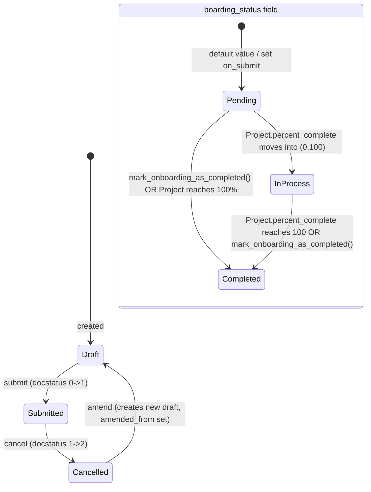

# Employee Onboarding

**Source:** `hrms/hr/doctype/employee_onboarding/employee_onboarding.json`, `employee_onboarding.py`, `employee_onboarding.js`, `employee_onboarding_list.js`
Also implements shared base class logic from `hrms/controllers/employee_boarding_controller.py` (`EmployeeBoardingController`) — documented in full here (section "Shared Boarding Controller Logic") and cross-referenced from `Employee Separation.md`, which extends the same base class.

**Submittable:** yes   **Tree:** no   **Naming:** `autoname: "HR-EMP-ONB-.YYYY.-.#####"` (expression-based naming series: prefix `HR-EMP-ONB-`, current 4-digit year, then a 5-digit auto-incrementing counter, e.g. `HR-EMP-ONB-2026-00001`)
**Module:** HR

## Schema

Full field list, in JSON `field_order`:

| Field (fieldname) | Label | Type | Options/Link Target | Required | Default | Read-Only | Notes |
|---|---|---|---|---|---|---|---|
| job_applicant | Job Applicant | Link | [[Job Applicant]] | Yes | — | No | Source applicant for this onboarding. |
| job_offer | Job Offer | Link | [[Job Offer]] | Yes | — | No | Client script filters list to job offers for the same `job_applicant` with `docstatus=1`. |
| employee_onboarding_template | Employee Onboarding Template | Link | [[Employee Onboarding Template]] | No | — | No | *(column_break_7)* Selecting this populates `activities` client-side via `get_onboarding_details` (see Whitelisted Methods) and fetch-populates company/department/designation/employee_grade below. |
| company | Company | Link | Company | Yes | — | No | `fetch_from: employee_onboarding_template.company`. |
| boarding_status | Boarding Status | Select | Pending / In Process / Completed | No | `Pending` | Yes (but `allow_on_submit: 1`) | Set by controller logic, not user-editable in UI despite allow_on_submit. |
| project | Project | Link | Project | No | — | Yes | Set by controller on submit (linked Project record for the onboarding tasks). |
| employee | Employee | Link | [[Employee Core Model|Employee]] | No | — | Yes | Auto-set in `validate()` if a matching Employee already exists for the `job_applicant`; otherwise created later via `make_employee`. |
| employee_name | Employee Name | Data | — | Yes | — | No | `fetch_from: job_applicant.applicant_name`. `in_list_view`. |
| department | Department | Link | Department | No | — | No | `fetch_from: employee_onboarding_template.department`. `in_list_view`. |
| designation | Designation | Link | Designation | No | — | No | `fetch_from: employee_onboarding_template.designation`. `in_list_view`. |
| employee_grade | Employee Grade | Link | [[Employee Grade]] | No | — | No | `fetch_from: employee_onboarding_template.employee_grade`. |
| holiday_list | Holiday List | Link | Holiday List | No | — | No | Used to compute task dates only if `employee` is not yet set (see `get_holiday_list` in shared controller). |
| date_of_joining | Date of Joining | Date | — | Yes | — | No | `in_list_view`. |
| boarding_begins_on | Onboarding Begins On | Date | — | Yes | — | No | Base date from which activity task dates (`begin_on`/`duration` offsets) are computed. |
| activities | Activities | Table | [[Employee Boarding Activity]] | No | — | No | `allow_on_submit: 1`. See `Employee Boarding Activity.md` (this file also documents its schema below, per spec). |
| notify_users_by_email | Notify users by email | Check | — | No | `0` | No | `allow_on_submit: 1`. Passed as `notify` to `assign_to.add`. |
| amended_from | Amended From | Link | [[Employee Onboarding]] | No | — | Yes | Standard amendment-chain field, `no_copy`. |

Section-break-only fields (`column_break_7`, `details_section`, `table_for_activity`, `column_break_13`) are pure layout and omitted above except as inline notes.

## Child Tables

- `activities` (fieldtype Table, options `Employee Boarding Activity`) — full child schema documented in `Employee Boarding Activity.md` (this module — this is its dedicated file per your assignment). Field list repeated here for convenience since Onboarding is its primary consumer:

| Field (fieldname) | Label | Type | Options | Required | Default | Read-Only | Notes |
|---|---|---|---|---|---|---|---|
| activity_name | Activity Name | Data | — | Yes | — | No | `in_list_view`, `columns:3`. |
| user | User | Link | User | No | — | No | `depends_on: eval:!doc.role` (client-side only — mutually exclusive with `role`, not enforced server-side). `in_list_view`, `columns:2`. |
| role | Role | Link | Role | No | — | No | `depends_on: eval:!doc.user` (client-side only). `columns:1`. |
| task | Task | Link | Task | No | — | Yes | `no_copy`. Set by `create_task_and_notify_user` via `activity.db_set("task", task.name)`. Cleared to `""` on amendment (see Validation Rules) and on parent cancel. |
| task_weight | Task Weight | Float | — | No | — | No | `non_negative: 1`. Passed to `Task.task_weight`. |
| required_for_employee_creation | Required for Employee Creation | Check | — | No | `0` | No | `depends_on: eval:['Employee Onboarding','Employee Onboarding Template'].includes(doc.parenttype)`. Gates `validate_employee_creation()`. |
| description | Description | Text Editor | — | No | — | No | Copied to `Task.description`; used as assignment description if set. |
| duration | Duration (Days) | Int | — | No | — | No | `non_negative: 1`, `columns:2`. Offset (in days) added to `begin_on` offset to compute task end date. |
| begin_on | Begin On (Days) | Int | — | No | — | No | `non_negative: 1`, `columns:2`. Offset (in days) from `boarding_begins_on` to compute task start date. |

## Shared Boarding Controller Logic (`EmployeeBoardingController`, `hrms/controllers/employee_boarding_controller.py`)

`Employee Onboarding` and `Employee Separation` both subclass `EmployeeBoardingController(Document)`. This section documents the base class in full; `Employee Separation.md` references this section rather than repeating it.

### `validate()`
1. IF `self.amended_from` is set THEN for every row in `self.activities`, set `activity.task = ""` (clears any task link carried over from the amended document, since a fresh amendment must not point at the old submitted document's tasks).

### `on_submit()`
1. Build `project_name`: `_(self.doctype) + " : "` then append `self.job_applicant` if doctype is `Employee Onboarding`, else append `self.employee` (i.e. for Employee Separation).
2. Create and insert a new `Project` document (`ignore_permissions=True, ignore_mandatory=True`):
   - `project_name` = value from step 1
   - `expected_start_date` = `self.date_of_joining` if doctype is Employee Onboarding, else `self.resignation_letter_date` (Employee Separation)
   - `department` = `self.department`
   - `company` = `self.company`
3. `self.db_set("project", project.name)` — direct DB write, bypasses normal save/validate.
4. `self.db_set("boarding_status", "Pending")`.
5. `self.reload()`.
6. Call `self.create_task_and_notify_user()`.

### `create_task_and_notify_user()`
1. `holiday_list = self.get_holiday_list()` (see below).
2. For each `activity` in `self.activities`:
   a. IF `activity.task` already set THEN skip this activity (`continue`) — tasks are only created once.
   b. `dates = self.get_task_dates(activity, holiday_list)` → `[start_date, end_date]`.
   c. Create and insert a new `Task` (`ignore_permissions=True`):
      - `project` = `self.project`
      - `subject` = `activity.activity_name + " : " + self.employee_name`
      - `description` = `activity.description`
      - `department` = `self.department`
      - `company` = `self.company`
      - `task_weight` = `activity.task_weight`
      - `exp_start_date` = `dates[0]`
      - `exp_end_date` = `dates[1]`
   d. `activity.db_set("task", task.name)` — direct DB write on the child row.
   e. Build `users` list: starts as `[activity.user]` if `activity.user` set, else `[]`.
   f. IF `activity.role` is set:
      - Query all enabled Users that have that Role via a `Has Role` join to `User` (`user.enabled == 1`, `has_role.role == activity.role`), distinct.
      - `users = unique(users + user_list)`.
      - IF `"Administrator"` is in `users` THEN remove it.
   g. IF `users` is non-empty THEN call `self.assign_task_to_users(task, users)`.

### `get_holiday_list()`
- IF `self.doctype == "Employee Separation"` THEN return `get_holiday_list_for_employee(self.employee)` (from `erpnext.setup.doctype.employee.employee`).
- ELSE (Employee Onboarding):
  - IF `self.employee` is set THEN return `get_holiday_list_for_employee(self.employee)`.
  - ELSE IF `self.holiday_list` is not set THEN `frappe.throw(_("Please set the Holiday List."), frappe.MandatoryError)`.
  - ELSE return `self.holiday_list`.

### `get_task_dates(activity, holiday_list)`
1. `start_date = end_date = None`.
2. IF `activity.begin_on is not None`:
   a. `start_date = add_days(self.boarding_begins_on, activity.begin_on)`, then `start_date = self.update_if_holiday(start_date, holiday_list)`.
   b. IF `activity.duration is not None`:
      - `end_date = add_days(self.boarding_begins_on, activity.begin_on + activity.duration)`, then `end_date = self.update_if_holiday(end_date, holiday_list)`.
3. Return `[start_date, end_date]`.

### `update_if_holiday(date, holiday_list)`
- WHILE `is_holiday(holiday_list, date)` (from `erpnext.setup.doctype.holiday_list.holiday_list`) DO `date = add_days(date, 1)`. Returns the first non-holiday date on/after `date`.

### `assign_task_to_users(task, users)`
- For each `user` in `users`, call `frappe.desk.form.assign_to.add` with:
  - `assign_to`: `[user]`
  - `doctype`: `task.doctype`
  - `name`: `task.name`
  - `description`: `task.description or task.subject`
  - `notify`: `self.notify_users_by_email`

### `on_cancel()`
1. `project = self.project`.
2. Force-delete every `Task` linked to that project (`frappe.delete_doc("Task", task.name, force=1)`).
3. Force-delete the `Project` itself (`frappe.delete_doc("Project", project, force=1)`).
4. `self.db_set("project", "")`.
5. For each `activity` in `self.activities`, `activity.db_set("task", "")`.
6. `frappe.msgprint(_("Linked Project {} and Tasks deleted.").format(project), alert=True, indicator="blue")`.

### Module-level whitelisted helper: `get_onboarding_details(parent, parenttype)`
- Permission check: `frappe.has_permission(parenttype, "read", parent, throw=True)`.
- Returns `frappe.get_all("Employee Boarding Activity", fields=[activity_name, role, user, required_for_employee_creation, description, task_weight, begin_on, duration], filters={parent, parenttype}, order_by="idx")`.
- This is called by the client script when the user picks an `employee_onboarding_template` / `employee_separation_template`, to copy that template's activity rows into the transaction's `activities` table. **Port note:** this copy happens client-side only — the server never re-derives `activities` from the template; a server-side port must replicate this copy step explicitly (e.g. on template selection or on create) since nothing forces it at save time.

### Module-level function: `update_employee_boarding_status(project, event=None)` (hooked on `Project.validate`)
1. `employee_onboarding = frappe.db.exists("Employee Onboarding", {"project": project.name})`.
2. `employee_separation = frappe.db.exists("Employee Separation", {"project": project.name})`.
3. IF neither exists THEN return.
4. Compute `status`:
   - `"Pending"` if `project.percent_complete == 0.0` (or not in the 0–100 open range described next)
   - `"In Process"` if `0.0 < project.percent_complete < 100.0`
   - `"Completed"` if `project.percent_complete == 100.0`
5. IF `employee_onboarding` THEN `frappe.db.set_value("Employee Onboarding", employee_onboarding, "boarding_status", status)`.
6. ELIF `employee_separation` THEN `frappe.db.set_value("Employee Separation", employee_separation, "boarding_status", status)`.
- **Port note:** `project.percent_complete` itself is computed by core ERPNext `Project` logic (task completion weight), not part of this app's source — a port must replicate ERPNext's percent-complete formula (sum of completed task weights / total task weights, or count-based if no weights) or provide an equivalent trigger. This file's repo does not define that formula.

### Module-level function: `update_task(task, event=None)` (hooked on `Task.on_update`)
- IF `task.project` is set AND NOT `task.flags.from_project` THEN call `update_employee_boarding_status(frappe.get_cached_doc("Project", task.project))`.
- Net effect: every time a Task under one of these projects is updated, the Project's percent_complete is recalculated (by core Project logic triggered via reload/get_cached_doc + validate chain) and then boarding_status is re-derived from it.

## State Machine

Submittable doctype; standard docstatus transitions (see [[Submittable Document Lifecycle]]) run alongside the `boarding_status` field below.

Plain transition list:

| From | Event | To | Guard |
|---|---|---|---|
| (none) | Create document | Draft (docstatus 0) | — |
| Draft | `submit` | Submitted (docstatus 1) | Standard Frappe submit validations pass (mandatory fields, `validate()`). |
| Submitted | `cancel` | Cancelled (docstatus 2) | Standard Frappe cancel. |
| Cancelled | `amend` (create new doc from cancelled one) | Draft (new document, `amended_from` = cancelled doc name) | — |
| boarding_status: Pending (default) | `on_submit` fires | boarding_status = Pending (explicit `db_set`) | Always, on first submit. |
| boarding_status: Pending/In Process | Linked `Project.percent_complete` recalculated via `Project.validate` hook (triggered from `Task.on_update`) | boarding_status recomputed to Pending / In Process / Completed | Formula in `update_employee_boarding_status` above. |
| boarding_status: any | `mark_onboarding_as_completed()` whitelisted call | Completed | User/API explicitly invokes the method (see Whitelisted Methods). |

## Validation Rules (exact, in execution order)

`Employee Onboarding.validate()` calls, in order: `super().validate()` (base controller), then `self.set_employee()`, then `self.validate_duplicate_employee_onboarding()`.

1. (base controller, `EmployeeBoardingController.validate`) IF `self.amended_from` is set THEN for every row in `self.activities`, set `activity.task = ""`. (source: `employee_boarding_controller.validate`)
2. (`set_employee`) IF `self.employee` is not already set THEN look up `frappe.db.get_value("Employee", {"job_applicant": self.job_applicant}, "name")` and assign it to `self.employee`. No error thrown if none found — `employee` simply stays empty. (source: `employee_onboarding.set_employee`)
3. (`validate_duplicate_employee_onboarding`) Look up `frappe.db.exists("Employee Onboarding", {"job_applicant": self.job_applicant, "docstatus": ("!=", 2)})`. IF a match is found AND that match's name is not `self.name` THEN `frappe.throw(_("Employee Onboarding: {0} already exists for Job Applicant: {1}").format(frappe.bold(emp_onboarding), frappe.bold(self.job_applicant)))`. (source: `employee_onboarding.validate_duplicate_employee_onboarding`)

### `validate_employee_creation()` (called only from the `make_employee` whitelisted mapper, NOT from `validate()`)
4. IF `self.docstatus != 1` THEN `frappe.throw(_("Submit this to create the Employee record"))`.
5. ELSE, for every `activity` in `self.activities` where `activity.required_for_employee_creation` is truthy: look up the linked `Task`'s `status`. IF that status is not in `["Completed", "Cancelled"]` THEN `frappe.throw(_("All the mandatory tasks for employee creation are not completed yet."), IncompleteTaskError)` (custom exception class `IncompleteTaskError(frappe.ValidationError)` defined in this module). (source: `employee_onboarding.validate_employee_creation`)

**Port note:** this employee-creation guard is only invoked (a) explicitly by the `make_employee` mapped-doc endpoint, and (b) by `hrms.overrides.employee_master.validate_onboarding_process` (hooked on `Employee.validate`) when an Employee record with a `job_applicant` is being validated and a submitted, non-Completed Employee Onboarding exists for that applicant — see Lifecycle Hooks below.

## Business Logic / Calculations

No monetary/tax calculation on this doctype. The only computed values are task start/end dates — see "Shared Boarding Controller Logic > `get_task_dates`" above (numbered steps already given there; not duplicated here per spec's "one canonical place" intent, but restated as the formula owner since Employee Onboarding is the more commonly used consumer):

1. `start_date = boarding_begins_on + begin_on days`, pushed forward day-by-day while it lands on a holiday (per the effective holiday list).
2. `end_date` (only if `duration` is set) = `boarding_begins_on + (begin_on + duration) days`, likewise pushed forward off holidays.
3. If `begin_on` is null, both `start_date` and `end_date` stay `None` (Task fields `exp_start_date`/`exp_end_date` are then unset).

## Lifecycle Hooks (exact)

Includes cross-doctype [[Cross-Doctype Hooks (doc_events)|`doc_events`]] hooks registered on `Employee`, `Project`, and `Task` (rows below prefixed "Cross-doctype:").

| Event | What Runs | Side Effects on Other Doctypes |
|---|---|---|
| `validate` | `super().validate()` (clear activity.task on amendment) → `set_employee()` → `validate_duplicate_employee_onboarding()` | None external. |
| `after_insert` | `hrms.telemetry.on_milestone_insert` (hooks.py `doc_events`) | Internal telemetry/usage tracking only — no functional side effect. |
| `on_submit` | `EmployeeBoardingController.on_submit()`: creates `Project`, sets `project`/`boarding_status="Pending"` via `db_set`, reloads, then `create_task_and_notify_user()` | Creates 1 `Project` + N `Task` records; creates ToDo assignments via `assign_to.add`. |
| `on_update_after_submit` | `self.create_task_and_notify_user()` (re-run; skips activities that already have `task` set) | Creates `Task`/assignment only for newly-added activity rows post-submit (activities table has `allow_on_submit: 1`). |
| `on_cancel` | `EmployeeBoardingController.on_cancel()`: force-deletes all Tasks under `project`, force-deletes the `Project`, clears `project` and each `activity.task` | Deletes `Task` and `Project` records permanently. |
| Cross-doctype: `Employee.validate` | `hrms.overrides.employee_master.validate_onboarding_process(doc)` — if the Employee being validated has a `job_applicant` and a submitted Employee Onboarding exists for it with `boarding_status != "Completed"`, calls that onboarding's `validate_employee_creation()` (throws `IncompleteTaskError` if mandatory tasks aren't done) and then `onboarding.db_set("employee", doc.name)`. | Links the newly created Employee back onto the Employee Onboarding record; can block Employee creation. |
| Cross-doctype: `Employee.after_insert` | `hrms.overrides.employee_master.update_job_applicant_and_offer(doc)` — if `doc.job_applicant` is set: sets the Job Applicant's `status` to `"Accepted"` (if not already) with a `frappe.msgprint`; and if a non-cancelled Job Offer for that applicant has a status other than `"Accepted"`, sets that Job Offer's `status = "Accepted"` (via `.save()` with `ignore_mandatory`/`ignore_permissions`) with a `frappe.msgprint` (message differs depending on whether the offer is still Draft, adding a hint to submit it). | Mutates linked `Job Applicant` and `Job Offer` records. |
| Cross-doctype: `Project.validate` | `update_employee_boarding_status(project)` — recomputes this doctype's `boarding_status` from `project.percent_complete` when the linked Project is (re)validated. | Writes `boarding_status` via `frappe.db.set_value`. |
| Cross-doctype: `Task.on_update` | `update_task(task)` → if `task.project` set and not flagged `from_project`, triggers `update_employee_boarding_status` on that Project. | Indirect `boarding_status` update, as above. |

## Whitelisted / API Methods

| Method name | HTTP-equivalent purpose | Args | Returns | What it does |
|---|---|---|---|---|
| `mark_onboarding_as_completed` (instance method, `@frappe.whitelist()`) | `POST` action on a specific Employee Onboarding | none (bound method call) | none (saves the doc) | `self.check_permission("write")`; for every `activity` in `self.activities`, sets that activity's linked `Task.status = "Completed"` via `frappe.db.set_value`; sets the linked `Project.status = "Completed"` via `frappe.db.set_value`; sets `self.boarding_status = "Completed"`; calls `self.save()`. |
| `make_employee(source_name, target_doc=None)` (module-level, `@frappe.whitelist()`) | `POST` — creates an Employee from an Employee Onboarding | `source_name: str`, optional `target_doc` | The (unsaved, client-side) mapped `Employee` document | Loads the Employee Onboarding by `source_name`; calls `doc.validate_employee_creation()` (throws if not submitted or mandatory tasks incomplete); uses `get_mapped_doc` to map `Employee Onboarding` → `Employee` with `field_map: {first_name: employee_name, employee_grade: grade}`; `set_missing_values` sets the target's `personal_email` from the Job Applicant's `email_id` and `status = "Active"`. Returns the mapped (unsaved) Employee doc for the client to review/save. |
| `get_onboarding_details(parent, parenttype)` (module-level, in `employee_boarding_controller.py`, `@frappe.whitelist()`) | `GET`-style lookup used when a template is selected | `parent: str`, `parenttype: str` | list of dicts (Employee Boarding Activity fields) | See "Shared Boarding Controller Logic" above. |

## Permissions

| Role | Read | Write | Create | Delete | Submit | Cancel | Amend | Report | Export | Notes |
|---|---|---|---|---|---|---|---|---|---|---|
| System Manager | Yes | Yes | Yes | Yes | Yes | Yes | Yes | Yes | Yes | Also `email:1`, `print:1`, `share:1`. |
| HR Manager | Yes | Yes | Yes | No | Yes | Yes | Yes | No | Yes | Also `print:1`, `share:1`. No delete right. |
| HR User | Yes | Yes | Yes | No | No | No | No | Yes | No | No submit/cancel/amend/delete/export rights. |

No `if_owner` or `permlevel` restrictions present in the JSON.

## Scheduled Jobs Touching This Doctype

None found in `hrms/hooks.py` `scheduler_events` that read/write Employee Onboarding directly. (The `Project`/`Task` doc_events above are triggered synchronously on document events, not on a schedule.)

## Related Doctypes

- [[Job Applicant]] — via `job_applicant`: Source applicant for this onboarding.
- [[Job Offer]] — via `job_offer`: Client script filters list to job offers for the same `job_applicant` with `docstatus=1`.
- [[Employee Onboarding Template]] — via `employee_onboarding_template`: *(column_break_7)* Selecting this populates `activities` client-side via `get_onboarding_details` (see Whitelisted Methods) and fetch-populates company/department/designation/employee_grade below.
- [[Employee Core Model|Employee]] — via `employee`: Auto-set in `validate()` if a matching Employee already exists for the `job_applicant`; otherwise created later via `make_employee`.
- [[Employee Grade]] — via `employee_grade`: `fetch_from: employee_onboarding_template.employee_grade`.
- [[Employee Boarding Activity]] — via `activities`: `allow_on_submit: 1`. See `Employee Boarding Activity.md` (this file also documents its schema below, per spec).

## Port Notes

- **Frappe framework behaviors relied on implicitly** (see [[Implicit Framework Behaviors]]) that a new stack must build explicitly:
  - `db_set` calls throughout (`self.db_set(...)`, `activity.db_set(...)`) write directly to the database bypassing the document's own `validate()`/`before_save` hooks and do not create a new revision in the same way a full `.save()` does, but they DO get captured by `track_changes` (see below) as a value-change entry. A port must implement an explicit "patch a single field without re-running full validation" operation if it wants identical behavior (important because `on_submit`'s `db_set("project", ...)` happens before the "creation" transaction's own validate would run again).
  - `track_changes: 1` — every field change is captured in an automatic audit trail (Frappe's Version doctype). A port must implement its own audit-log table if this history is required.
  - `naming_rule: "Expression"` / `autoname: "HR-EMP-ONB-.YYYY.-.#####"` — Frappe auto-increments the `#####` counter per year automatically via a hidden counter table; a port must implement this as an explicit sequence (e.g., a Postgres sequence or a counters table keyed by year) to reproduce exact naming (see [[Naming and Autoname Rules]]).
  - Amendment (`amend`): Frappe's built-in cancel→amend flow clones the cancelled document into a new Draft, sets `amended_from`, and resets `docstatus` to 0. A port must implement this clone-and-relink behavior explicitly; it is not custom logic in this doctype's `.py` file.
  - `sort_field: "creation"` / `sort_order: "DESC"` — default list ordering.
  - Currency/precision: no currency fields on this doctype.
- **Client-only logic that needs a server-side equivalent in a port** (flagged per spec instructions):
  - The `job_applicant`/`job_offer` list filters (`status: "Accepted"` for applicant; `job_applicant` + `docstatus:1` for offer) are UI convenience filters only — the server does not re-validate that the chosen `job_offer` belongs to the chosen `job_applicant`, nor that the applicant's status is Accepted. **No corresponding server-side check exists in `employee_onboarding.py`** — this looks like a gap a re-implementer might want to close, but per ground rules this is called out rather than invented.
  - Copying template activity rows into `activities` (via `get_onboarding_details`) happens only in the `employee_onboarding_template` change-handler in `employee_onboarding.js`. A port's backend must provide an equivalent "instantiate activities from template" operation since nothing forces this to happen server-side.
  - The `mark_onboarding_as_completed` custom button is only shown client-side when `docstatus===1` and `boarding_status` is Pending or In Process; server-side the whitelisted method itself does not re-check `boarding_status` or `docstatus` before running (beyond the `check_permission("write")` call) — a port should decide whether to add that guard or faithfully omit it.
  - The `employee` field's auto-lookup-on-change (`job_applicant` change handler in JS calling `frappe.db.get_value`) duplicates server-side `set_employee()` — the port only strictly needs the server-side version since `validate()` re-derives it if empty, but note `set_employee()` only fires if `self.employee` is falsy, so a user could clear it and it would be re-populated on save, but never overwritten if already set (even if the underlying Employee's `job_applicant` link changes).
- Ambiguity/gap: `boarding_status` is marked `read_only: 1` in the schema yet also `allow_on_submit: 1` — read_only wins in the UI (field is never directly user-editable); all writes to it are programmatic (`db_set`). No ambiguity in practice, noting for completeness.
- The `IncompleteTaskError` custom exception class exists purely to give a distinguishable exception type; its message is identical to the generic throw and carries no extra data.
