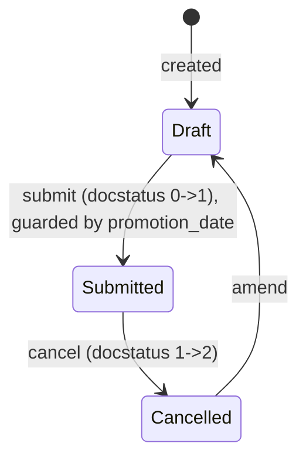

# Employee Promotion

**Source:** `hrms/hr/doctype/employee_promotion/employee_promotion.json`, `employee_promotion.py`, `employee_promotion.js` (includes shared `hrms/hr/employee_property_update.js`)
**Submittable:** yes   **Tree:** no   **Naming:** `naming_rule: "Expression (old style)"`, `autoname: "HR-EMP-PRO-.YYYY.-.#####"` (prefix `HR-EMP-PRO-`, 4-digit year, 5-digit auto-increment)
**Module:** HR

The shared "apply a set of Employee property changes with history tracking" mechanism (`update_employee_work_history`, `get_formatted_value`, `delete_employee_work_history`, `update_to_date_in_work_history`, all from `hrms/hr/utils.py`) is documented in full in `Employee Transfer.md` → "Business Logic / Calculations" — this file references that section rather than repeating it, and documents only what is Promotion-specific.

## Schema

Full field list, in JSON `field_order`:

| Field (fieldname) | Label | Type | Options/Link Target | Required | Default | Read-Only | Notes |
|---|---|---|---|---|---|---|---|
| employee | Employee | Link | [[Employee Core Model|Employee]] | Yes | — | No | `in_list_view`. Client script filters picker to `status: "Active"` (shared `employee_property_update.js`). |
| employee_name | Employee Name | Data | — | No | — | Yes | `fetch_from: employee.employee_name`. |
| department | Department | Link | Department | No | — | Yes | `fetch_from: employee.department`. |
| salary_currency | Salary Currency | Link | Currency | No | — | Yes | `fetch_from: employee.salary_currency`. Drives the `options` (currency symbol context) for `current_ctc`/`revised_ctc`. |
| promotion_date | Promotion Date | Date | — | Yes | — | No | *(column_break_3)* Anchor date for the promotion; gates submission (see Validation Rules) and passed as `date` into `update_employee_work_history`. |
| company | Company | Link | Company | No | — | No | `fetch_from: employee.company`. |
| promotion_details | (no label — table only) | Table | [[Employee Property History]] | No | — | No | *(details_section, "Employee Promotion Details", description: "Set the properties that should be updated in the Employee master on promotion submission")* — see `Employee Property History` schema, documented fully in `Employee Transfer.md`. **Note: unlike Employee Transfer's `transfer_details`, this field is NOT marked `reqd: 1`** — an Employee Promotion can be submitted with zero property-change rows (in which case `update_employee_work_history` immediately returns the employee unchanged — see step 1 of that shared algorithm). |
| current_ctc | Current CTC | Currency | (options: `salary_currency`) | Conditionally required | — | No | *(salary_details_section, "Salary Details")* `fetch_from: employee.ctc`, `fetch_if_empty: 1` (only auto-fills if the field is currently empty — a user-entered value is not overwritten by the fetch on subsequent saves). `non_negative: 1`. `mandatory_depends_on: "revised_ctc"` (becomes mandatory once `revised_ctc` has any value). |
| revised_ctc | Revised CTC | Currency | (options: `salary_currency`) | No | — | No | *(column_break_12)* `depends_on: "current_ctc"` (only shown once `current_ctc` has a value). `non_negative: 1`. |
| amended_from | Amended From | Link | [[Employee Promotion]] | No | — | Yes | `no_copy`, `print_hide`. |

## Child Tables

- `promotion_details` → **Employee Property History** — identical shared child doctype used by `Employee Transfer.transfer_details`; full schema documented in `Employee Transfer.md` → "Child Tables". Not repeated here to avoid divergent copies per the port spec's single-source intent.

## State Machine

Submittable doctype; standard docstatus transitions (see [[Submittable Document Lifecycle]]).

| From | Event | To | Guard |
|---|---|---|---|
| (none) | Create | Draft | — |
| Draft | `submit` | Submitted | 1) `validate()`: `validate_active_employee(self.employee)` must pass (Employee's `status` must not be `"Inactive"`). 2) `before_submit`: IF `getdate(self.promotion_date) > getdate()` THEN `frappe.throw(_("Employee Promotion cannot be submitted before Promotion Date"), frappe.DocstatusTransitionError)`. |
| Submitted | `cancel` | Cancelled | No custom guard in `on_cancel` (unlike Employee Transfer, there is no "delete the new employee first" style block — Promotion never creates a new Employee record). |
| Cancelled | `amend` | Draft (new doc) | — |

## Validation Rules (exact, in execution order)

`EmployeePromotion.validate()` body:
1. `validate_active_employee(self.employee)` (from `hrms.hr.utils`): IF `self.employee` (after resolving, if a dict/Document is passed, via `.get("employee")` — not applicable here since `self.employee` is already a plain Link string) is set AND `frappe.db.get_value("Employee", employee, "status") == "Inactive"` THEN `frappe.throw(_("Transactions cannot be created for an Inactive Employee {0}.").format(get_link_to_form("Employee", employee)), InactiveEmployeeStatusError)` (custom exception class `InactiveEmployeeStatusError`, defined in `hrms/hr/utils.py`). (source: `hr/utils.validate_active_employee`, called from `employee_promotion.validate`)

### `before_submit()`
2. IF `getdate(self.promotion_date) > getdate()` THEN `frappe.throw(_("Employee Promotion cannot be submitted before Promotion Date"), frappe.DocstatusTransitionError)`. (source: `employee_promotion.before_submit`)

**Port note:** `Employee Transfer` has NO equivalent `validate_active_employee` check — this is a genuine asymmetry between the two doctypes (Transfer allows transferring an Employee regardless of active/inactive status; Promotion explicitly forbids it for Inactive employees). Verified directly from source; do not assume symmetry.

## Business Logic / Calculations

Reuses the shared `update_employee_work_history` algorithm documented in `Employee Transfer.md`. Promotion-specific wrapping logic:

### `on_submit()`
1. Load `employee = frappe.get_doc("Employee", self.employee)`.
2. `employee = update_employee_work_history(employee, self.promotion_details, date=self.promotion_date)` — applies each `promotion_details` row's field change onto the Employee, in place (never creates a new Employee record — Promotion has no `create_new_employee_id` concept at all).
3. IF `self.revised_ctc` is set (truthy) THEN `employee.ctc = self.revised_ctc`.
4. `employee.save()`.

### `on_cancel()`
1. Load `employee = frappe.get_doc("Employee", self.employee)`.
2. `employee = update_employee_work_history(employee, self.promotion_details, cancel=True)` — **note: `date` is NOT passed on cancel** (defaults to `None` in the shared function signature); this only matters for the `internal_work_history` append path, which is skipped entirely when `cancel=True` anyway (see shared algorithm step 5 in `Employee Transfer.md`), so the omitted `date` has no observable effect here.
3. IF `self.revised_ctc` is set (truthy) THEN `employee.ctc = self.current_ctc` — reverts CTC back to the value captured in `current_ctc` at the time this promotion was created/submitted.
4. `employee.save()`.

**Port note (CTC revert correctness caveat):** step 3 unconditionally reverts to `self.current_ctc` regardless of what the Employee's CTC actually is at cancel time (e.g., if a later Promotion further changed CTC after this one, cancelling this earlier one would still blindly reset `employee.ctc` to THIS document's `current_ctc` snapshot, potentially undoing more recent changes). Reproduced exactly as written — flagged as a possible real-world data-integrity edge case rather than silently "fixed."

## Lifecycle Hooks (exact)

| Event | What Runs | Side Effects on Other Doctypes |
|---|---|---|
| `validate` | `validate_active_employee(self.employee)` | Reads `Employee.status`; throws if Inactive. |
| `before_submit` | Guard: `promotion_date` must not be in the future. | None. |
| `on_submit` | Applies `promotion_details` field changes to the Employee (via shared `update_employee_work_history`); if `revised_ctc` set, updates `Employee.ctc`; saves. | Mutates the linked `Employee` record (field values + `internal_work_history` table). |
| `on_cancel` | Reverts `promotion_details` field changes (cancel mode) and CTC (to `current_ctc`); saves. | Mutates the linked `Employee` record. |

No `doc_events` entries in `hrms/hooks.py` are keyed to `"Employee Promotion"`.

## Whitelisted / API Methods

None defined in `employee_promotion.py`. Uses the same shared `hrms.hr.utils.get_employee_field_property` whitelisted method documented in `Employee Transfer.md` → "Whitelisted / API Methods" (consumed by the same shared `employee_property_update.js` "Add Employee Property" dialog).

## Permissions

| Role | Read | Write | Create | Delete | Submit | Cancel | Amend | Report | Export | Notes |
|---|---|---|---|---|---|---|---|---|---|---|
| Employee | Yes | No | No | No | No | No | No | Yes | Yes | Also `email:1`, `print:1`, `share:1`. Identical pattern to Employee Transfer's Employee row. |
| HR User | Yes | Yes | Yes | No | Yes | No | No | Yes | Yes | Also `email:1`, `print:1`, `share:1`. |
| HR Manager | Yes | Yes | Yes | Yes | Yes | Yes | Yes | Yes | Yes | Also `email:1`, `print:1`, `share:1`. Full control. |

This permission table is byte-for-byte identical in structure to `Employee Transfer`'s (verified independently from `employee_promotion.json`). No `if_owner` or `permlevel` restrictions present.

## Scheduled Jobs Touching This Doctype

None found in `hrms/hooks.py` `scheduler_events`.

## Related Doctypes

- [[Employee Core Model|Employee]] — via `employee`: `in_list_view`. Client script filters picker to `status: "Active"` (shared `employee_property_update.js`).
- [[Employee Property History]] — via `promotion_details`: *(details_section, "Employee Promotion Details", description: "Set the properties that should be updated in the Employee master on promotion submission")* — see `Employee Property History` schema, documented fully in...

## Port Notes

- `quick_entry: 1` — UI-only.
- [[Naming and Autoname Rules|`naming_rule: "Expression (old style)"`]] vs. Employee Transfer's `naming_rule` key being absent entirely — both resolve to the same practical auto-increment pattern via their `autoname` string; this is a metadata/versioning artifact of how the doctype JSON was authored/migrated in Frappe, not a functional difference. A port can treat both doctypes' naming identically (yearly-scoped incrementing counter with a fixed prefix).
- `current_ctc`'s `fetch_if_empty: 1` behavior: standard `fetch_from` normally re-syncs on every save; `fetch_if_empty` restricts that to only fill the field when it is currently blank, so once a user has entered/edited `current_ctc`, subsequent Employee CTC changes will NOT silently overwrite it. A port must implement this "fetch-once, don't clobber user edits" semantic explicitly (default `fetch_from` behavior in most ORMs will not naturally replicate this without a "fetch if empty" flag).
- `mandatory_depends_on: "revised_ctc"` on `current_ctc` (mandatory only once `revised_ctc` has a value) and `depends_on: "current_ctc"` on `revised_ctc` (only shown once `current_ctc` has a value) together form a slightly circular-looking UI dependency: in practice, a user must first get `current_ctc` populated (typically via the auto-fetch from the Employee) before `revised_ctc` becomes visible at all, and once `revised_ctc` has any value, `current_ctc` retroactively becomes mandatory (in case it was somehow cleared). A port should implement both conditions independently rather than assuming one implies the other is automatically satisfied.
- All the client-only "Add Employee Property" dialog caveats documented in `Employee Transfer.md` → Port Notes (field/fieldtype exclusion list, duplicate-property/no-op-change guard, clear-on-employee-change UX) apply identically here since both doctypes share `employee_property_update.js` verbatim.
- `promotion_details` is optional (`reqd` not set) unlike Transfer's `transfer_details` (`reqd: 1`) — a Promotion can legitimately be submitted with an empty details table purely to record a CTC change (or, in the degenerate case, with nothing at all) — call this out explicitly since it's easy to assume both tables share the same "at least one row" requirement, and they do not.
- `track_changes: 1` — implicit audit trail, same caveat as other doctypes in this file.
