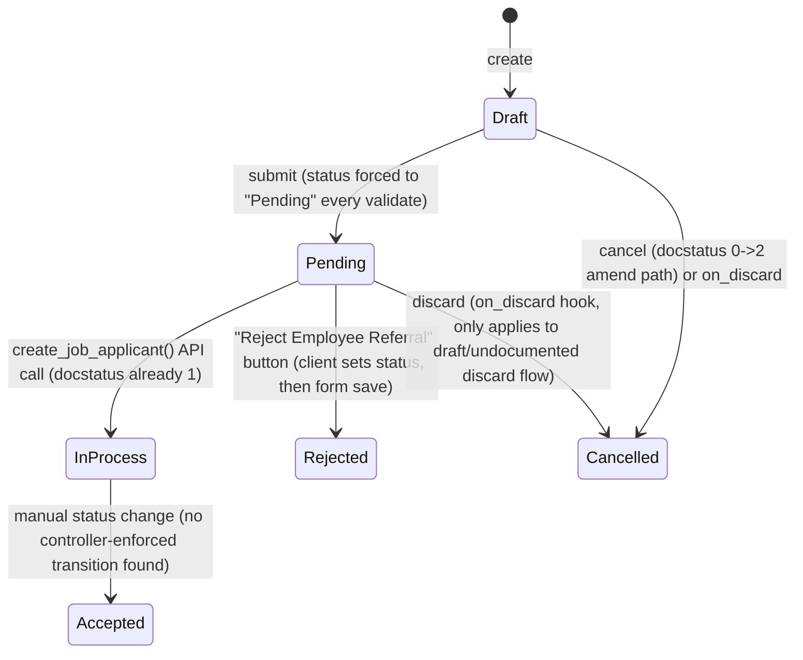

# Employee Referral

**Source:** `hrms/hr/doctype/employee_referral/employee_referral.json`, `employee_referral.py`, `employee_referral.js`
**Submittable:** yes   **Tree:** no   **Naming:** `autoname: "format:HR-REF-{####}"` (auto-incrementing numeric suffix, no reset)
**Module:** HR

## Schema

| Field (fieldname) | Label | Type | Options/Link Target | Required | Default | Read-Only | Notes |
|---|---|---|---|---|---|---|---|
| first_name | First Name  | Data | — | yes | — | no | |
| last_name | Last Name | Data | — | yes | — | no | |
| full_name | Full Name | Data | — | no | — | yes | Computed: `" ".join(filter(None, [first_name, last_name]))` (set in `set_full_name`, called from `validate`). In list view. |
| contact_no | Contact No. | Data | Phone | no | — | no | In standard filter |
| current_employer | Current Employer  | Data | — | no | — | no | |
| *(column_break_6)* | — | Column Break | — | — | — | — | layout only |
| date | Date | Date | — | yes | — | no | In standard filter |
| status | Status | Select | `Pending\nIn Process\nAccepted\nRejected\nCancelled` | yes | — | yes (permlevel 1) | `allow_on_submit: 1`, `no_copy: 1`. Always forced to "Pending" on every `validate()` call via `set_status()` — see Port Notes. In standard filter. |
| current_job_title | Current Job Title | Data | — | no | — | no | |
| resume | Resume | Attach | — | no | — | no | |
| *(referrer_details_section)* | Referrer Details | Section Break | — | — | — | — | section heading — groups: department |
| department | Department | Link | Department | no | — | yes | `fetch_from: "employee.department"` — NOTE: source field is `employee`, but this doctype has no field named `employee`; only `referrer` (Link to Employee) exists. This fetch expression appears to reference a non-existent field on this doctype — likely a leftover/bug from a copy-paste. Flag under Port Notes. |
| *(additional_information_section)* | Additional Information  | Section Break | — | — | — | — | section heading — groups: work_references |
| work_references | Work References | Text Editor | — | no | — | no | |
| amended_from | Amended From | Link | [[Employee Referral]] | no | — | yes | `no_copy: 1`, `print_hide: 1`. Standard amend-tracking field. |
| *(column_break_14)* | — | Column Break | — | — | — | — | layout only |
| for_designation | For Designation  | Link | Designation | yes | — | no | In list view, in standard filter |
| email | Email | Data | Email | yes | — | no | In list view, in standard filter |
| is_applicable_for_referral_bonus | Is Applicable for Referral Bonus | Check | — | no | `1` | no | Drives `referral_payment_status` logic |
| qualification_reason | Why is this Candidate Qualified for this Position? | Text Editor | — | no | — | no | |
| referrer | Referrer | Link | [[Employee Core Model|Employee]] | yes | — | no | In standard filter |
| referrer_name | Referrer Name | Data | — | no | — | yes | `fetch_from: "referrer.employee_name"`. In list view. |
| resume_link | Resume Link | Data | — | no | — | no | |
| referral_payment_status | Referral Bonus Payment Status | Select | `\nUnpaid\nPaid` | no | — | yes | Set programmatically in `set_referral_bonus_payment_status()` |
| *(referral_details_section)* | Referral Details | Section Break | — | — | — | — | section heading — groups: email, resume_link, current_employer, current_job_title, resume |
| *(column_break_12)* | — | Column Break | — | — | — | — | layout only |

`title_field`: `full_name`. `sort_field`: `creation`, `sort_order`: `DESC`. `index_web_pages_for_search: 1`.

## Child Tables

None.

## State Machine

Submittable doctype; standard docstatus transitions (see [[Submittable Document Lifecycle]]) run alongside the `status` field below.

Plain list of transitions:

| From | Event | To | Guard |
|---|---|---|---|
| (new doc) | `validate()` runs on every save (draft or submit) | status = "Pending" | Unconditional — `set_status()` always sets `self.status = "Pending"` regardless of current value, every single time the document is validated (including on amendments and re-saves). See Port Notes — this means status cannot be changed via normal save except immediately after via a whitelisted method's `db_set` bypass. |
| Pending (docstatus=1) | `create_job_applicant(source_name)` whitelisted call | In Process | Only reachable via the whitelisted method, which calls `emp_ref.db_set("status", "In Process")` — bypasses `validate()` so the forced-Pending logic does not overwrite it. |
| Pending (docstatus=1) | Client "Reject Employee Referral" button sets `frm.doc.status = "Rejected"` then saves | Rejected | Client-side only: `frm.doc.status = "Rejected"; frm.save_or_update();`. Because `validate()` unconditionally resets status to "Pending" on every save, this client-side rejection is immediately overwritten back to "Pending" server-side unless the port removes/changes the forced-Pending logic. **This is a functional inconsistency in the source — flag explicitly (see Port Notes).** |
| Any | `on_discard()` (docstatus 0, discarding a draft before submit) | Cancelled | `self.db_set("status", "Cancelled")` — direct DB write, bypasses validate. |
| Submitted | standard Frappe cancel (docstatus 1->2) | Cancelled (docstatus) | No explicit `on_cancel` method defined on the controller — only the base framework docstatus transition occurs; `status` field itself is not touched by an `on_cancel` hook. |
| Cancelled | amend | new Draft doc with `amended_from` set | standard framework amend behavior |

"Accepted" status is referenced in the client script (`if (frm.doc.docstatus === 1 && frm.doc.status === "Accepted")` to show "Create Additional Salary" button) but there is **no code path in `employee_referral.py` that ever sets status to "Accepted"** — it must be set via manual field edit (bypassing `allow_on_submit`) or via some other integration not present in this doctype's controller. Flag as Port Note.

## Validation Rules (exact, in execution order)

Inside `validate()`, in this exact order:

1. `validate_active_employee(self.referrer)` (shared util in `hrms/hr/utils.py`) — IF `referrer` is set AND `Employee.status` for that referrer is `"Inactive"` THEN `frappe.throw(_("Transactions cannot be created for an Inactive Employee {0}.").format(get_link_to_form("Employee", employee)), InactiveEmployeeStatusError)` (source: `hrms.hr.utils.validate_active_employee`).
2. `validate_unique_referral()` — IF a different Employee Referral record (`name != self.name`) exists with the same `email` AND `docstatus != 2` (i.e. not cancelled) THEN `frappe.throw(_("Employee Referral {0} already exists for email: {1}").format(get_link_to_form("Employee Referral", referral), frappe.bold(self.email)), frappe.DuplicateEntryError)` (source: `validate_unique_referral`).
3. `set_full_name()` — unconditionally sets `self.full_name = " ".join(filter(None, [self.first_name, self.last_name]))` (drops empty parts, joins remaining with a single space).
4. `set_status()` — unconditionally sets `self.status = "Pending"` (no condition at all).
5. `set_referral_bonus_payment_status()`:
   - IF `is_applicable_for_referral_bonus` is falsy THEN `self.referral_payment_status = ""`.
   - ELSE IF `referral_payment_status` is not already set (falsy) THEN `self.referral_payment_status = "Unpaid"`. (If already "Unpaid" or "Paid", left untouched.)

No `before_submit`, `on_submit`, or `on_cancel` methods are defined on the controller class.

## Business Logic / Calculations

None (no numeric/financial computation on this doctype itself).

## Lifecycle Hooks (exact)

| Event | What Runs | Side Effects on Other Doctypes |
|---|---|---|
| validate | Steps 1-5 above | None (only sets fields on self) |
| on_discard | `self.db_set("status", "Cancelled")` | None — direct field update on self, bypasses validate |

No `before_insert`, `after_insert`, `on_update`, `before_submit`, `on_submit`, `on_cancel`, `on_trash` methods exist on this controller.

## Whitelisted / API Methods

| Method name | HTTP-equivalent purpose | Args | Returns | What it does |
|---|---|---|---|---|
| `create_job_applicant` | POST — convert a referral into a Job Applicant | `source_name: str`, `target_doc: str \| Document \| None = None` | The newly created & saved `Job Applicant` Document | Loads the Employee Referral by `source_name`. Computes an interim `status` var: if `emp_ref.status` is `"Pending"` or `"In process"` (note: this string comparison is case-sensitive and the real status value is `"In Process"` with capital P, so this branch effectively only ever matches `"Pending"` in practice — see Port Notes) then `status = "Open"`, else `status = emp_ref.status`. Creates a new `Job Applicant` doc with: `source = "Employee Referral"`, `employee_referral = emp_ref.name`, `status` (per above), `designation = emp_ref.for_designation`, `applicant_name = emp_ref.full_name`, `email_id = emp_ref.email`, `phone_number = emp_ref.contact_no`, `resume_attachment = emp_ref.resume`, `resume_link = emp_ref.resume_link`. Saves the Job Applicant. Shows a success `frappe.msgprint` with a link to the new Job Applicant. Then sets the Employee Referral's own `status` to `"In Process"` via `emp_ref.db_set("status", "In Process")` (direct DB write, no revalidation). Returns the Job Applicant doc. |
| `create_additional_salary` | GET/POST — prepare (not save) an Additional Salary doc for the referral bonus | `employee_referral: str` | An in-memory (unsaved) `Additional Salary` Document, or an empty `Additional Salary` new-doc object if one already exists | Loads the Employee Referral. IF no `Additional Salary` exists yet with `ref_docname = doc.name` THEN builds a new (unsaved) `Additional Salary` with: `employee = doc.referrer`, `company = frappe.db.get_value("Employee", doc.referrer, "company")`, `overwrite_salary_structure_amount = 0`, `ref_doctype = doc.doctype` ("Employee Referral"), `ref_docname = doc.name`. If one already exists, the function still returns a bare unsaved `Additional Salary` new-doc (the `if not exists` branch is the only place `additional_salary` local var is populated with the referral's data — when the record already exists, an unpopulated `frappe.new_doc("Additional Salary")`... actually note: the local variable `additional_salary` is only created inside the `if` block; if the condition is false, the function falls through to `return doc` — wait, re-check: the function returns nothing built if the doc already exists because `additional_salary` would be undefined in that branch). **This is a latent bug: if an Additional Salary already exists for this referral, `create_additional_salary` will raise `UnboundLocalError` because `additional_salary` is never assigned in the `else` path before the `return additional_salary` statement.** Flag under Port Notes; a port should add an explicit else-branch (e.g. throw a clear "Additional Salary already exists" error) instead of reproducing the bug. |

Both methods are invoked from `employee_referral.js` via `frappe.call` (client only calls them; the client script does not perform equivalent server-side validation of its own — button visibility logic in `refresh` is UI-only gating, not a substitute for server-side authorization, so the port must still enforce all business rules server-side).

## Permissions

See [[Permission Model (RBAC)]] for the general role/permlevel model; this doctype's `status` field carries `permlevel: 1`, detailed below.

| Role | Read | Write | Create | Delete | Submit | Cancel | Amend | Report | Export | Notes |
|---|---|---|---|---|---|---|---|---|---|---|
| System Manager | yes | yes | yes | yes | no | no | no | yes | yes | share, email, print all 1 |
| Employee | yes | yes | yes | no | yes | (submit implies cancel via std framework) | yes | yes | yes | share, email, print all 1 |
| HR Manager | yes | yes | yes | yes | yes | (submit) | yes | yes | yes | share, email, print all 1 |
| HR User | yes | yes | yes | yes | yes | (submit) | yes | yes | yes | share, email, print all 1 |
| HR Manager (permlevel 1) | yes | no | no | yes | — | — | — | yes | yes | permlevel-1 row: controls access to `status` field (the only permlevel-1 field); write not granted at this level, so HR Manager cannot edit `status` directly even though level-0 grants write — permlevel restricts field-level write to roles with write at that level, which HR Manager here does NOT have (only read/delete/report/export/print/email/share) |
| HR User (permlevel 1) | yes | no | no | yes | — | — | — | yes | yes | same as above for HR User |
| Employee (permlevel 1) | yes | no | no | no | — | — | — | yes | yes | Employee also cannot write the permlevel-1 `status` field |

Note: none of the three roles have `write: 1` at `permlevel: 1`, meaning the `status` field (the only field carrying `permlevel: 1`) cannot be edited by any role through the standard form UI even though `allow_on_submit: 1` is set on it — in practice `status` is only ever changed via `db_set` calls in Python (bypassing permission checks) or the framework's internal document save that ignores permlevel checks for the document's own controller code. A port must replicate this: expose `status` as system/internal-managed only, not directly user-editable via the API/UI even by HR Manager/HR User.

## Scheduled Jobs Touching This Doctype

None found in `hrms/hooks.py` (`scheduler_events`) — no cron/job references `Employee Referral`.

## Related Doctypes

- [[Employee Core Model|Employee]] — via `referrer`: In standard filter

## Port Notes

- **Forced-Pending bug/feature**: `set_status()` unconditionally resets `status` to `"Pending"` on every `validate()` call, meaning a normal document save can never persist "Accepted"/"Rejected"/"In Process"/"Cancelled" through the standard save path — those values only stick when set via `db_set()` (which bypasses `validate`). The client's "Reject" button flow (`frm.doc.status = "Rejected"; frm.save_or_update();`) goes through normal save/validate and would be immediately reset to "Pending" by this logic. This looks like an unintentional side effect of the source code as written (there is no case-based guard, e.g. `if not self.status: self.status = "Pending"`). A faithful port should replicate the literal behavior (always reset to Pending on save) unless directed otherwise, but this should be called out to the port owner as likely-unintended.
- **`department` fetch_from bug**: `fetch_from: "employee.department"` references a field `employee` that does not exist on Employee Referral (the actual link field is `referrer`). In real Frappe this fetch would simply never populate (silently no-op, since the source field doesn't resolve) — the port should treat `department` as effectively always blank/dead unless the intent was `referrer.department`, which should be confirmed with source-of-truth before "fixing" it in the port.
- **`create_additional_salary` unbound-variable bug**: see Whitelisted Methods table above — when an Additional Salary already exists for the referral, the Python function will fail with `UnboundLocalError: local variable 'additional_salary' referenced before assignment` because it's only assigned inside the `if not frappe.db.exists(...)` branch, yet the final `return additional_salary` is unconditional. A port must decide explicit behavior here (e.g., throw an explicit "already exists" error, or return the existing Additional Salary) rather than replicate the crash.
- **`create_job_applicant` status-string case-sensitivity**: The check `if emp_ref.status in ["Pending", "In process"]` compares against `"In process"` (lowercase p) while the actual Select option value is `"In Process"` (capital P). This means the "In Process" branch of this condition is effectively dead code — only `"Pending"` ever matches. Faithful port should replicate this literal (buggy) string comparison unless told to fix it, and flag it.
- **Auto-numbering**: `autoname: "format:HR-REF-{####}"` — the new stack must implement a monotonically-increasing zero-padded (4-digit minimum, framework auto-expands beyond 9999) counter scoped globally (not per-company or per-year) exactly as Frappe's `format:` autoname does; Frappe stores/increments this via its internal series counter (`tabSeries`) — a new stack needs its own sequence/counter table for the `"HR-REF-"` prefix.
- **`amended_from`/amend chain**: standard Frappe amend behavior must be reproduced: cancelling a submitted doc sets docstatus=2 (immutable thereafter except via amend), and "Amend" creates a new Draft copying all fields and setting `amended_from` to the cancelled doc's name.
- **Audit trail**: no `track_changes` flag is set in the JSON (defaults to Frappe's standard version tracking of value changes still applies at the framework level for all doctypes) — if the target stack needs field-level history it must be built explicitly; Frappe provides this for free via its `Version` doctype.
- **Auto `creation`/`modified`/`owner`/`modified_by` timestamps**: relied upon implicitly (`sort_field: creation`) — must be built explicitly in the new stack (created_at, updated_at, created_by, updated_by columns).
- **Permlevel semantics**: Frappe's `permlevel` restricts field-level write access independent of document-level write access; the new stack has no built-in equivalent and must implement field-level ACL explicitly for the `status` field as described in Permissions above.
