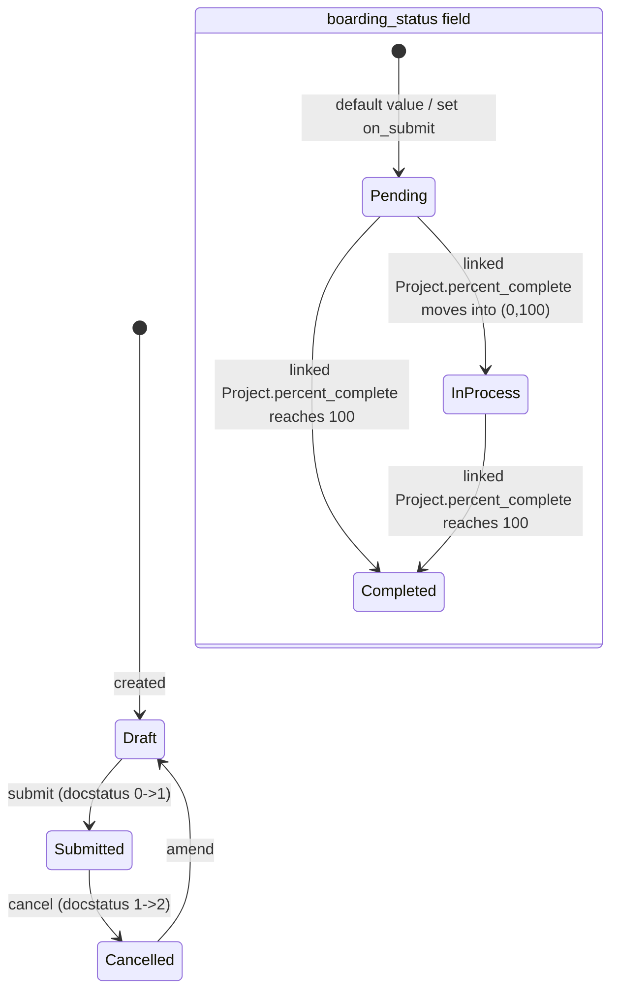

# Employee Separation

**Source:** `hrms/hr/doctype/employee_separation/employee_separation.json`, `employee_separation.py`, `employee_separation.js`, `employee_separation_list.js`
Shares its core boarding/task/project lifecycle with `Employee Onboarding` via the common base class `EmployeeBoardingController` (`hrms/controllers/employee_boarding_controller.py`). **The full shared logic (`validate`, `on_submit`, `create_task_and_notify_user`, `get_holiday_list`, `get_task_dates`, `update_if_holiday`, `assign_task_to_users`, `on_cancel`, plus the module-level `get_onboarding_details`, `update_employee_boarding_status`, `update_task` functions) is documented once in `Employee Onboarding.md` → "Shared Boarding Controller Logic" — read that section; it is not repeated here.** This file documents only what is specific to Employee Separation.

**Submittable:** yes   **Tree:** no   **Naming:** `autoname: "HR-EMP-SEP-.YYYY.-.#####"` (prefix `HR-EMP-SEP-`, 4-digit year, 5-digit auto-increment, e.g. `HR-EMP-SEP-2026-00001`)
**Module:** HR

## Schema

Full field list, in JSON `field_order`:

| Field (fieldname) | Label | Type | Options/Link Target | Required | Default | Read-Only | Notes |
|---|---|---|---|---|---|---|---|
| employee | Employee | Link | [[Employee Core Model|Employee]] | Yes | — | No | |
| employee_name | Employee Name | Data | — | No | — | Yes | `fetch_from: employee.employee_name`. `in_list_view`. |
| department | Department | Link | Department | No | — | Yes | `fetch_from: employee.department`. `in_list_view`. |
| designation | Designation | Link | Designation | No | — | Yes | `fetch_from: employee.designation`. |
| employee_grade | Employee Grade | Link | [[Employee Grade]] | No | — | Yes | `fetch_from: employee.grade`. |
| company | Company | Link | Company | Yes | — | No | *(column_break_7)* `fetch_from: employee.company`. |
| boarding_status | Status | Select | Pending / In Process / Completed | No | `Pending` | Yes (`allow_on_submit:1`) | Same semantics as Employee Onboarding's `boarding_status` — driven by linked Project's `percent_complete` and by direct `db_set` on submit. |
| resignation_letter_date | Resignation Letter Date | Date | — | No | — | Yes | `fetch_from: employee.resignation_letter_date`. `in_list_view`. Used as the linked Project's `expected_start_date` (see shared `on_submit` logic). |
| boarding_begins_on | Separation Begins On | Date | — | Yes | — | No | Equivalent role to Onboarding's `boarding_begins_on` — base date for activity task-date offsets. |
| project | Project | Link | Project | No | — | Yes | Set on submit, same as Onboarding. |
| employee_separation_template | Employee Separation Template | Link | [[Employee Separation Template]] | No | — | No | Selecting this in the client script copies its activities into `activities` via `get_onboarding_details` (parenttype `Employee Separation Template`), and `frm.add_fetch` wires `company`/`department`/`designation`/`employee_grade` fetches from it (see Port Notes — this duplicates/could conflict with the `employee.*` fetch_from on those same fields; JSON-declared `fetch_from` wins server-side since `add_fetch` is a client-only convenience). |
| activities | Activities | Table | [[Employee Boarding Activity]] | No | — | No | `allow_on_submit: 1`. See `Employee Boarding Activity.md`. |
| notify_users_by_email | Notify users by email | Check | — | No | `0` | No | `allow_on_submit: 1`. |
| exit_interview | Exit Interview Summary | Text Editor | — | No | — | No | *(section_break_14)* Free-text field on this doctype — distinct from, and NOT automatically linked to, the separate `Exit Interview` doctype/records. No code in `employee_separation.py` populates this from an actual `Exit Interview` document. |
| amended_from | Amended From | Link | [[Employee Separation]] | No | — | Yes | `no_copy`. |

## Child Tables

- `activities` → `Employee Boarding Activity` — see `Employee Boarding Activity.md` (identical schema/behavior to its use on Employee Onboarding; the only visibility difference is that `required_for_employee_creation` is hidden per its `depends_on` condition since `Employee Separation` is not in that condition's parenttype list, but the field/column still exists and is not read by any Employee Separation logic).

## State Machine

Submittable doctype; standard docstatus transitions (see [[Submittable Document Lifecycle]]) run alongside the `boarding_status` field below.



| From | Event | To | Guard |
|---|---|---|---|
| (none) | Create | Draft | — |
| Draft | `submit` | Submitted | Standard mandatory-field validation (`employee`, `company`, `boarding_begins_on` required) plus `validate()` chain. |
| Submitted | `cancel` | Cancelled | Standard Frappe cancel; runs `on_cancel` (deletes Project/Tasks). |
| Cancelled | `amend` | Draft (new doc) | — |
| boarding_status | Project percent_complete recompute | Pending/In Process/Completed | Per shared `update_employee_boarding_status` formula (see `Employee Onboarding.md`). |

Unlike Employee Onboarding, Employee Separation has **no** `mark_onboarding_as_completed`-equivalent whitelisted method — its `boarding_status` can only reach `Completed` via the Project percent-complete mechanism (or a direct DB edit); there is no dedicated "mark as completed" API on this doctype.

## Validation Rules (exact, in execution order)

`EmployeeSeparation.validate()` body is exactly:
```python
def validate(self):
    super().validate()
```
1. (base controller, `EmployeeBoardingController.validate`) IF `self.amended_from` is set THEN for every row in `self.activities`, set `activity.task = ""`. (source: `employee_boarding_controller.validate` — identical to Employee Onboarding's rule #1.)

**No Employee-Separation-specific validation exists beyond the inherited base-class rule.** In particular — unlike `Employee Onboarding` — there is no duplicate-separation check (`validate_duplicate_employee_onboarding` has no analogue here) and no `set_employee` step (the `employee` field is a direct required Link, not derived). This is a real gap relative to Onboarding's duplicate-prevention pattern — flagged per ground rules rather than assumed/replicated: **a re-implementer should decide deliberately whether to add an equivalent "one active Employee Separation per Employee" guard, since the original source does not enforce it.**

## Business Logic / Calculations

Identical formula to Employee Onboarding's task-date computation — see `Employee Onboarding.md` → "Business Logic / Calculations" / "Shared Boarding Controller Logic > get_task_dates". The only difference is the anchor field name (`boarding_begins_on` labeled "Separation Begins On" here) and that `get_holiday_list()` for this doctype ALWAYS resolves via `get_holiday_list_for_employee(self.employee)` (the `holiday_list` fallback branch in the shared function only applies when `self.doctype != "Employee Separation"`, i.e. it never triggers here) — note this doctype has no `holiday_list` field on its own schema at all.

## Lifecycle Hooks (exact)

Includes cross-doctype [[Cross-Doctype Hooks (doc_events)|`doc_events`]] hooks (rows below prefixed "Cross-doctype:").

| Event | What Runs | Side Effects on Other Doctypes |
|---|---|---|
| `validate` | `super().validate()` only (clear activity.task on amendment) | None. |
| `on_submit` | `super().on_submit()` — shared logic: creates `Project` (name = `"Employee Separation : " + self.employee`, `expected_start_date = self.resignation_letter_date`), sets `project`/`boarding_status="Pending"`, reloads, `create_task_and_notify_user()` | Creates 1 `Project` + N `Task`s; creates ToDo assignments. |
| `on_update_after_submit` | `self.create_task_and_notify_user()` | Creates Task/assignment for newly added post-submit activity rows only. |
| `on_cancel` | `super().on_cancel()` — force-deletes Tasks + Project, clears `project` and each `activity.task` | Deletes `Task`/`Project` records. |
| Cross-doctype: `Project.validate` | `update_employee_boarding_status` (checks both Employee Onboarding and Employee Separation by project) | Writes `boarding_status` via `db_set`. |
| Cross-doctype: `Task.on_update` | `update_task` → triggers the above | Indirect `boarding_status` update. |
| Cross-doctype: `Employee` fields | `employee_name`, `department`, `designation`, `employee_grade`, `company`, `resignation_letter_date` are ALL `fetch_from: employee.*` and `read_only: 1` — they auto-refresh whenever the linked Employee's corresponding field changes and this document is re-fetched/saved (standard Frappe fetch-from refresh-on-save behavior, not custom code). | None beyond the fetch. |

No doc_events in `hooks.py` are keyed specifically to `"Employee Separation"`.

## Whitelisted / API Methods

None defined in `employee_separation.py` itself. Consumes the shared `get_onboarding_details(parent, parenttype)` (documented in `Employee Onboarding.md`) with `parenttype="Employee Separation Template"` when the template field is set (client-side trigger only).

## Permissions

| Role | Read | Write | Create | Delete | Submit | Cancel | Amend | Report | Export | Notes |
|---|---|---|---|---|---|---|---|---|---|---|
| System Manager | Yes | Yes | Yes | Yes | Yes | Yes | Yes | Yes | Yes | Also `email:1`, `print:1`, `share:1`. |
| HR Manager | Yes | Yes | Yes | No | No | No | No | Yes | No | **Note: unlike Employee Onboarding, HR Manager here has NO submit/cancel/amend/delete/export rights** — only read/write/create/report. This is a real asymmetry versus Employee Onboarding's permission table; verified directly from the JSON (`employee_separation.json` permissions array has no `submit`/`cancel`/`amend`/`delete`/`export` keys on the HR Manager row). |
| HR User | Yes | Yes | Yes | No | No | No | No | No | No | No report right either (differs from Employee Onboarding's HR User, which does have `report:1`). |

No `if_owner` or `permlevel` restrictions present in the JSON.

## Scheduled Jobs Touching This Doctype

None found in `hrms/hooks.py` `scheduler_events`.

## Related Doctypes

- [[Employee Core Model|Employee]] — via `employee`: linked via `employee`.
- [[Employee Grade]] — via `employee_grade`: `fetch_from: employee.grade`.
- [[Employee Separation Template]] — via `employee_separation_template`: Selecting this in the client script copies its activities into `activities` via `get_onboarding_details` (parenttype `Employee Separation Template`), and `frm.add_fetch` wires `company`/`department`/`designation`/`emp...
- [[Employee Boarding Activity]] — via `activities`: `allow_on_submit: 1`. See `Employee Boarding Activity.md`.

## Port Notes

- See `Employee Onboarding.md` → "Port Notes" for all the shared framework-behavior notes (naming counters, `db_set` semantics, `track_changes` audit trail, amend/cancel cloning) — they apply identically here (with `HR-EMP-SEP-` prefix instead of `HR-EMP-ONB-`).
- **Client-only logic needing a server-side equivalent:** the `frm.add_fetch("employee_separation_template", "company"/"department"/"designation"/"employee_grade", ...)` calls in `employee_separation.js` are a legacy client-side fetch mechanism that would copy those fields FROM the template — but the JSON schema's own `fetch_from` declarations for those same fields point at `employee.*` instead, and since only one `fetch_from` can be declared server-side per field, **the template-based `add_fetch` client behavior and the JSON's `employee.*` fetch_from are mutually inconsistent field sources**. In practice, the JSON-level `fetch_from: employee.*` is what actually populates these read-only fields on save (fetched fields refresh from their declared `fetch_from` source at save time regardless of what the client-side `add_fetch` also tried to copy in the browser); the `add_fetch` client behavior would be visually overridden/irrelevant once saved. A port should treat `employee.*` as the authoritative source for `department`/`designation`/`employee_grade`/`company` on this doctype and can disregard the template-fetch client script, or explicitly note the discrepancy if replicating pixel-for-pixel client UX.
- `exit_interview` (Text Editor) on this doctype is a manually-typed free-text summary field, NOT a link to the `Exit Interview` doctype and NOT auto-populated from one — do not conflate the two. There is no code anywhere in this doctype or in `Exit Interview`'s controller that cross-writes between them.
- No duplicate-prevention validation exists for Employee Separation (see Validation Rules section) — call out explicitly as a gap versus Employee Onboarding's `validate_duplicate_employee_onboarding`.
- `quick_entry: 1` is set on this doctype (desk quick-add dialog) — UI-only, no server behavior to port.
