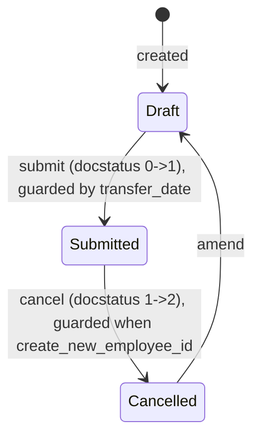

# Employee Transfer

**Source:** `hrms/hr/doctype/employee_transfer/employee_transfer.json`, `employee_transfer.py`, `employee_transfer.js` (which includes shared `hrms/hr/employee_property_update.js`)
**Submittable:** yes   **Tree:** no   **Naming:** `autoname: "HR-EMP-TRN-.YYYY.-.#####"` (prefix `HR-EMP-TRN-`, 4-digit year, 5-digit auto-increment)
**Module:** HR

## Schema

Full field list, in JSON `field_order`:

| Field (fieldname) | Label | Type | Options/Link Target | Required | Default | Read-Only | Notes |
|---|---|---|---|---|---|---|---|
| employee | Employee | Link | [[Employee Core Model|Employee]] | Yes | — | No | `in_list_view`. Client script filters picker to `status: "Active"` (shared `employee_property_update.js`). |
| employee_name | Employee Name | Data | — | No | — | Yes | `fetch_from: employee.employee_name`. |
| transfer_date | Transfer Date | Date | — | Yes | — | No | Anchor date for the transfer; also used as `from_date` for the new internal-work-history row, and gates submission (see Validation Rules). |
| company | Company | Link | Company | No | — | No | *(column_break_3)* `fetch_from: employee.company`. This is the employee's CURRENT company (source side of the transfer). |
| new_company | New Company | Link | Company | No | — | No | Target company if this transfer is an inter-company move. |
| department | Department | Link | Department | No | — | Yes | `bold: 1`. `fetch_from: employee.department`. |
| transfer_details | Employee Transfer Detail | Table | [[Employee Property History]] | Yes | — | No | *(details_section, "Employee Transfer Details")* Each row = one Employee field being changed (property/current/new/fieldname) — see `Employee Property History` schema below. |
| reallocate_leaves | Re-allocate Leaves | Check | — | No | `0` | No | **`hidden: 1`** — present in the schema/database but not shown in the UI at all in this version, and NOT referenced anywhere in `employee_transfer.py`. Dead/unused field currently. |
| create_new_employee_id | Create New Employee Id | Check | — | No | `0` | No | Toggles whether this transfer creates a brand-new Employee record (for the "new legal employment record" pattern, e.g. inter-company transfer) vs. updating the existing Employee in place. |
| new_employee_id | New Employee ID | Link | [[Employee Core Model|Employee]] | No | — | Yes | `allow_on_submit: 1`. Populated via `db_set` on submit only if `create_new_employee_id` is checked. |
| amended_from | Amended From | Link | [[Employee Transfer]] | No | — | Yes | `no_copy`, `print_hide`. |

## Child Tables

- `transfer_details` → **Employee Property History** (`hrms/hr/doctype/employee_property_history/employee_property_history.json`) — shared child doctype also used by `Employee Promotion.promotion_details`. Not itself in your assigned doctype list as a standalone file, so documented inline here per the port spec's "inline simple module-scoped child tables" rule:

  | Field (fieldname) | Label | Type | Options | Required | Default | Read-Only | Notes |
  |---|---|---|---|---|---|---|---|
  | property | Property | Data | — | No | — | Yes | `in_list_view`, `columns: 4`. Human-readable label of the Employee field being changed (e.g. "Department"). Populated client-side from `get_employee_field_property`'s returned `label`. |
  | current | Current | Data | — | No | — | Yes | `in_list_view`, `columns: 3`. The Employee's current value for that field (as a formatted string), captured client-side at the time the row is added. |
  | new | New | Data | — | No | — | Yes | `in_list_view`, `columns: 3`. The new value to apply. |
  | fieldname | Field Name | Data | — | No | — | Yes | `hidden: 1`. The actual Employee doctype fieldname (e.g. `department`) — this is what the server-side `update_employee_work_history` uses to `setattr` the value onto the Employee document. |

  `permissions: []` (inherits from parent, standard child-table convention). `quick_entry: 1` (UI-only).

## State Machine

Submittable doctype; standard docstatus transitions (see [[Submittable Document Lifecycle]]).

| From | Event | To | Guard |
|---|---|---|---|
| (none) | Create | Draft | — |
| Draft | `submit` | Submitted | `before_submit`: IF `getdate(self.transfer_date) > getdate()` (i.e. transfer date is in the future relative to today) THEN `frappe.throw(_("Employee Transfer cannot be submitted before Transfer Date"), frappe.DocstatusTransitionError)` — i.e. you cannot submit until the transfer date has arrived or passed. |
| Submitted | `cancel` | Cancelled | `on_cancel`: IF `self.create_new_employee_id` is truthy AND `self.new_employee_id` is still set (i.e. the new Employee record has not been deleted first) THEN `frappe.throw(_("Please delete the Employee {0} to cancel this document").format(f"<a href='/app/Form/Employee/{self.new_employee_id}'>{self.new_employee_id}</a>"))` — cancellation is blocked until the linked new Employee is manually deleted. Otherwise cancel proceeds (see Lifecycle Hooks for full on_cancel behavior). |
| Cancelled | `amend` | Draft (new doc) | — |

## Validation Rules (exact, in execution order)

No `validate()` method is defined on `EmployeeTransfer` at all — only `before_submit`, `on_submit`, `on_cancel`, and the helper `validate_user_in_details`. Only declarative schema constraints apply pre-save: `employee` required, `transfer_date` required, `transfer_details` required (`reqd: 1`, meaning at least one row must be present — Frappe enforces non-empty-table when `reqd:1` is on a Table field).

1. (`before_submit`) IF `getdate(self.transfer_date) > getdate()` THEN `frappe.throw(_("Employee Transfer cannot be submitted before Transfer Date"), frappe.DocstatusTransitionError)`. (source: `employee_transfer.before_submit`)

### `on_cancel()` guard (evaluated before the cancel-time mutation logic runs):
2. IF `self.create_new_employee_id` AND `self.new_employee_id` (still set) THEN `frappe.throw(_("Please delete the Employee {0} to cancel this document").format(...))`. (source: `employee_transfer.on_cancel`)

## Business Logic / Calculations

No monetary calculation. The core logic is "apply a set of field changes to an Employee, tracking history" — reproduced in full as pseudocode since it's shared with `Employee Promotion` via `hrms.hr.utils.update_employee_work_history`:

### `update_employee_work_history(employee, details, date=None, cancel=False)` (from `hrms/hr/utils.py`)
1. IF `details` (the `transfer_details`/`promotion_details` rows) is empty THEN return `employee` unchanged.
2. IF `employee.internal_work_history` is currently empty AND `cancel` is False THEN append a new row to `employee.internal_work_history` seeded with the employee's CURRENT `branch`, `designation`, `department`, and `from_date = employee.date_of_joining` — i.e. before applying any change, capture a baseline snapshot representing "where they were since they joined," so the history isn't empty.
3. Initialize `internal_work_history = {}` (a dict to accumulate any of department/designation/branch changes for a single new history row).
4. For each `item` in `details`:
   a. Look up the Employee doctype's meta field for `item.fieldname`; IF the field doesn't exist on Employee THEN skip this row (`continue`).
   b. `new_value = item.new` if NOT cancelling, else `item.current` (i.e. cancelling reverts to the "current" value that was captured when the row was created).
   c. `new_value = get_formatted_value(new_value, field.fieldtype)` — converts the string value back to the field's native type (see below).
   d. `setattr(employee, item.fieldname, new_value)` — directly mutates that attribute on the in-memory Employee document.
   e. IF `item.fieldname` is one of `"department"`, `"designation"`, `"branch"` THEN also stash `internal_work_history[item.fieldname] = item.new` (note: always `item.new`, even during cancel, at this specific stash step — only the primary field write in step 4b/c uses the cancel-aware "current" reversion).
5. IF `internal_work_history` accumulated any keys AND `cancel` is False THEN set `internal_work_history["from_date"] = date` and append it as a new row to `employee.internal_work_history`.
6. IF `cancel` is True THEN call `delete_employee_work_history(details, employee, date)` (see below).
7. Call `update_to_date_in_work_history(employee, cancel)` (see below).
8. Return the mutated `employee` document (caller is responsible for `.save()`).

### `get_formatted_value(value, fieldtype)` (from `hrms/hr/utils.py`)
1. IF `value` is falsy THEN return `None` (nothing to format).
2. IF `fieldtype == "Date"` THEN `value = getdate(value)`.
3. ELIF `fieldtype == "Datetime"` THEN `value = get_datetime(value)`.
4. ELIF `fieldtype in ["Currency", "Float"]` THEN:
   a. `number_format = frappe.db.get_default("number_format") or "#,###.##"`.
   b. Derive `decimal_str`, `comma_str` from that number format via `get_number_format_info`.
   c. IF the site's number format uses `.` as the thousands separator and `,` as the decimal separator (i.e. `comma_str == "."` and `decimal_str == ","`, e.g. European-style `1.234,56`) THEN re-punctuate the string to machine-readable form: replace `,` with a placeholder `#$`, then replace `.` with `,`, then replace the placeholder `#$` with `.` (net effect: swaps `.`/`,` roles so the string becomes standard `1234.56`-style).
   d. `value = flt(value)` (cast to float).
5. Return `value` (unchanged if fieldtype matched none of the above, e.g. Data/Link/Select fields pass through as plain strings).

### `delete_employee_work_history(details, employee, date)` (cancel path only)
1. Initialize `filters = {}`.
2. For each `d` in `details`, and for each `history` row in `employee.internal_work_history`:
   - IF `d.property == "Department"` AND `history.department == d.new` THEN `filters["department"] = d.new`.
   - IF `d.property == "Designation"` AND `history.designation == d.new` THEN `filters["designation"] = d.new`.
   - IF `d.property == "Branch"` AND `history.branch == d.new` THEN `filters["branch"] = d.new`.
   - IF `date` is set AND `date == history.from_date` THEN `filters["from_date"] = date`.
3. IF `filters` accumulated anything THEN `frappe.db.delete("Employee Internal Work History", filters)` (direct bulk delete matching ALL accumulated filter keys simultaneously — i.e. an AND of whichever filters got set) and then `employee.save()`.
   - **Port note / caveat:** because `filters` is a single shared dict mutated across the loop over multiple `details` rows and multiple `history` rows, if there are multiple detail rows (e.g. both department AND designation changed), the final `filters` dict used for the delete only reflects the LAST matching values seen in the double loop, and combines keys from different detail rows into one AND-filter — this could delete more or fewer history rows than intuitively expected when more than one property changed together. Reproduced exactly as written; flagged as a likely source of surprising behavior with multi-field transfers/promotions on cancel.

### `update_to_date_in_work_history(employee, cancel)`
1. IF `employee.internal_work_history` is empty THEN return.
2. For each row at `idx` in `employee.internal_work_history` (0-indexed): IF `idx == 0` OR the row has no `from_date` THEN skip. ELSE, look at `prev_row = internal_work_history[idx-1]`; IF `prev_row.to_date` is not already set THEN set `prev_row.to_date = add_days(row.from_date, -1)` — i.e. close out the previous history segment the day before the next one begins.
3. IF `cancel` is True THEN set `employee.internal_work_history[-1].to_date = None` — re-opens the last history segment (removes its end date) since the transfer/promotion that created the newest segment is being undone.

### `EmployeeTransfer.validate_user_in_details()`
- For each `item` in `self.transfer_details`: IF `item.fieldname == "user_id"` AND `item.new != item.current` THEN return `True`. Else (after checking all rows) return `False`. Used only inside `on_submit` to decide whether the `user_id` is being explicitly reassigned as part of the transfer (in which case the automatic "carry the old user_id to the new employee" step is skipped).

## Lifecycle Hooks (exact)

Includes cross-doctype [[Cross-Doctype Hooks (doc_events)|`doc_events`]] hooks (rows below prefixed "Cross-doctype:").

| Event | What Runs | Side Effects on Other Doctypes |
|---|---|---|
| `before_submit` | Guard: `transfer_date` must not be in the future. | None. |
| `on_submit` | See numbered steps below. | Creates or updates an `Employee` record; may clear the old Employee's `user_id`. |
| `on_cancel` | See numbered steps below. | Reverts Employee field changes (or blocks cancel if a new Employee still exists). |
| Cross-doctype: `Employee.on_trash` | `hrms.overrides.employee_master.update_employee_transfer(doc)` — IF a submitted Employee Transfer exists with `new_employee_id == doc.name` THEN `db_set("new_employee_id", "")` on that transfer. | Unsets `new_employee_id` on this doctype's submitted record when the target Employee it created is deleted — this is what actually allows a previously-blocked cancel (see `on_cancel` guard above) to proceed after the new Employee is deleted. |

### `on_submit()` full step sequence:
1. Load `employee = frappe.get_doc("Employee", self.employee)`.
2. IF `self.create_new_employee_id`:
   a. `new_employee = frappe.copy_doc(employee)`; clear `new_employee.name` and `new_employee.employee_number` (so a fresh identity/number will be assigned on insert).
   b. `new_employee = update_employee_work_history(new_employee, self.transfer_details, date=self.transfer_date)` — applies the transfer's field changes onto the COPY.
   c. IF `self.new_company` is set AND `self.company != self.new_company` THEN: clear `new_employee.internal_work_history` entirely (fresh start at the new company), set `new_employee.date_of_joining = self.transfer_date`, set `new_employee.company = self.new_company`.
   d. IF the OLD employee has a `user_id` set AND NOT `self.validate_user_in_details()` (i.e. `user_id` was not itself one of the explicitly-changed properties) THEN: carry `employee.user_id` over to `new_employee.user_id`, and clear the old employee's `user_id` via `employee.db_set("user_id", "")` (a user account can only be linked to one active Employee at a time).
   e. `new_employee.insert()`.
   f. `self.db_set("new_employee_id", new_employee.name)`.
   g. Relieve the old employee: `employee.db_set("relieving_date", self.transfer_date)`, `employee.db_set("status", "Left")`.
3. ELSE (not creating a new Employee id):
   a. `employee = update_employee_work_history(employee, self.transfer_details, date=self.transfer_date)` — applies changes IN PLACE on the same Employee.
   b. IF `self.new_company` is set AND `self.company != self.new_company` THEN: `employee.company = self.new_company`, `employee.date_of_joining = self.transfer_date`.
   c. `employee.save()`.

### `on_cancel()` full step sequence:
1. Load `employee = frappe.get_doc("Employee", self.employee)`.
2. IF `self.create_new_employee_id`:
   a. IF `self.new_employee_id` is still set THEN `frappe.throw(...)` (see Validation Rules #2) — cancel is blocked.
   b. ELSE: `employee.status = "Active"`, `employee.relieving_date = ""` — reactivates the OLD employee record (this branch only reaches here once `new_employee_id` has already been cleared by deleting that Employee, which fires `update_employee_transfer`).
3. ELSE: `employee = update_employee_work_history(employee, self.transfer_details, date=self.transfer_date, cancel=True)` — reverts the in-place field changes.
4. IF `self.new_company != self.company` THEN `employee.company = self.company` — reverts company change in both branches.
5. `employee.save()`.

## Whitelisted / API Methods

None defined in `employee_transfer.py`. (The shared `hrms.hr.utils.get_employee_field_property` whitelisted helper — used by the "Add Employee Property" dialog in `employee_property_update.js` — is documented once here since it's the shared mechanism for both Employee Transfer and Employee Promotion's detail-table builder UI.)

| Method name | HTTP-equivalent purpose | Args | Returns | What it does |
|---|---|---|---|---|
| `get_employee_field_property(employee, fieldname)` (`hrms.hr.utils`, `@frappe.whitelist()`) | `GET` — fetch a single Employee field's current value + metadata, to seed the "Add Employee Property" dialog | `employee: str`, `fieldname: str` | dict `{value, datatype, label, options}` or `None` | IF either arg missing THEN return `None`. Look up the Employee meta field for `fieldname`; IF not found THEN return `None`. Load the Employee doc (`check_permission=True`), read `doc.get(fieldname)`. IF the field's `fieldtype` is `Date` THEN format via `formatdate`; IF `Datetime` THEN format via `format_datetime`. Return the dict. |

## Permissions

| Role | Read | Write | Create | Delete | Submit | Cancel | Amend | Report | Export | Notes |
|---|---|---|---|---|---|---|---|---|---|---|
| Employee | Yes | No | No | No | No | No | No | Yes | Yes | Also `email:1`, `print:1`, `share:1`. Read-only self-service visibility (standard Frappe employee-self-service pattern; no `if_owner` flag present in JSON, so this is a blanket read grant to the `Employee` role, not restricted to only-their-own-record at the DocType-permission level — any row-level restriction, if present, would come from user-permissions/company matching elsewhere, not from this JSON). |
| HR User | Yes | Yes | Yes | No | Yes | No | No | Yes | Yes | Also `email:1`, `print:1`, `share:1`. Can create/submit but not cancel/amend/delete. |
| HR Manager | Yes | Yes | Yes | Yes | Yes | Yes | Yes | Yes | Yes | Also `email:1`, `print:1`, `share:1`. Full control. |

No `if_owner` or `permlevel` restrictions present in the JSON.

## Scheduled Jobs Touching This Doctype

None found in `hrms/hooks.py` `scheduler_events`.

## Related Doctypes

- [[Employee Core Model|Employee]] — via `employee`: `in_list_view`. Client script filters picker to `status: "Active"` (shared `employee_property_update.js`).
- [[Employee Property History]] — via `transfer_details`: *(details_section, "Employee Transfer Details")* Each row = one Employee field being changed (property/current/new/fieldname) — see `Employee Property History` schema below.

## Port Notes

- `quick_entry: 1` — UI-only.
- `reallocate_leaves` field exists in schema/DB but is `hidden: 1` and unused by any code in `employee_transfer.py` — a port may choose to omit it or carry it as an inert column; flagged as dead code rather than a feature to reproduce.
- The `delete_employee_work_history` shared-filter-dict behavior (see Business Logic section) is a genuine source of surprising multi-row cancel behavior in the original — reproduce it exactly if bit-for-bit fidelity with existing installations is required (e.g. to match existing data), or flag as a bug to the user if building fresh.
- **Frappe framework behaviors relied on implicitly:**
  - `frappe.copy_doc(employee)` — deep-clones a document (with all child tables) but is a framework utility, not custom code; a port must implement an equivalent deep-clone that also resets naming/identity fields as done manually here (`name`, `employee_number` cleared).
  - `db_set` bypasses full validate/save cycle — same caveat as documented in `Employee Onboarding.md`.
  - `track_changes: 1` — implicit audit trail.
  - Naming counter `HR-EMP-TRN-.YYYY.-.#####` — implicit yearly-scoped auto-increment, same caveat as other doctypes in this module.
  - Amend/cancel document cloning — standard Frappe behavior, not custom.
- Client-only logic (`employee_property_update.js`, shared with Employee Promotion) that has NO server-side equivalent validation and must be added deliberately if desired in a port:
  - The "Add Employee Property" dialog excludes a hardcoded list of fields (`naming_series`, `employee`, `first_name`, `middle_name`, `last_name`, `marital_status`, `ctc`, `employee_name`, `status`, `image`, `gender`, `date_of_birth`, `date_of_joining`, `lft`, `rgt`, `old_parent`) and field types (`HTML`, `Section Break`, `Column Break`, `Button`, `Read Only`, `Tab Break`, `Table`) from being selectable as a "property" to change. **The server-side `update_employee_work_history` does NOT enforce this exclusion list** — if a `transfer_details`/`promotion_details` row somehow specifies `fieldname: "ctc"` or `fieldname: "status"`, the server will happily `setattr` it onto the Employee (as long as the field exists in Employee's meta). This is a client-UI-only guard; a port relying on server-side integrity must decide whether to add this exclusion list server-side (it is not enforced today, so is a genuine gap, not an invented requirement).
  - Duplicate-property prevention (`validate_duplicate` in the JS, "Property already added" alert) and "nothing to change" detection (`current == new`) are client-only; the server accepts duplicate-fieldname rows or no-op changes without complaint.
  - `clear_property_table` client behavior (clearing the whole details table when `employee` changes, or on a fresh non-amended document load) is a UX safety net with no server equivalent — the server does not clear `transfer_details` if `employee` is changed via API without going through the form.
