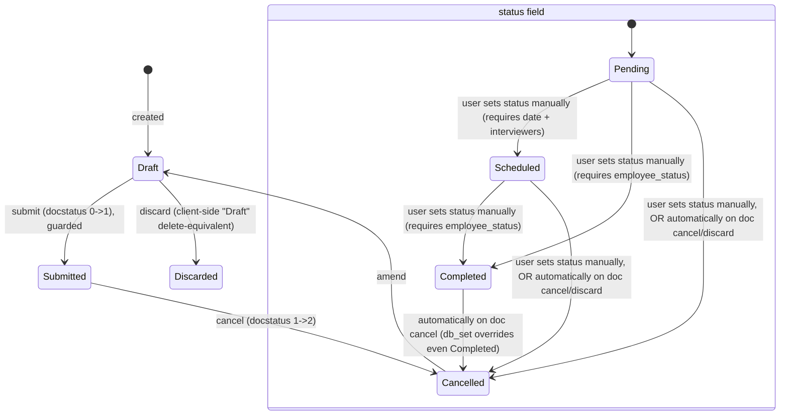

# Exit Interview

**Source:** `hrms/hr/doctype/exit_interview/exit_interview.json`, `exit_interview.py`, `exit_interview.js`, `exit_interview_list.js`, `exit_questionnaire_notification_template.html`
**Submittable:** yes   **Tree:** no   **Naming:** `naming_rule: "By \"Naming Series\" field"`, `autoname: "naming_series:"` — driven by the `naming_series` Select field, whose only option is the literal series `HR-EXIT-INT-` (i.e. every document gets `HR-EXIT-INT-` + Frappe's standard naming-series auto-increment counter). `allow_rename: 1`.
**Module:** HR

## Schema

Full field list, in JSON `field_order`:

| Field (fieldname) | Label | Type | Options/Link Target | Required | Default | Read-Only | Notes |
|---|---|---|---|---|---|---|---|
| naming_series | Naming Series | Select | `HR-EXIT-INT-` (single option) | No | — | No | Drives autoname. |
| employee | Employee | Link | [[Employee Core Model|Employee]] | Yes | — | No | `in_list_view`, `in_standard_filter`. |
| employee_name | Employee Name | Data | — | No | — | Yes | `fetch_from: employee.employee_name`. |
| email | Email ID | Data | Email | No | — | Yes | Set programmatically in `validate()` via `set_employee_email()` — NOT a `fetch_from` field. Also the doctype's `sender_field` (used for email-thread/append-to matching, `email_append_to: 1`). |
| company | Company | Link | Company | Yes | — | No | *(column_break_5)* `in_standard_filter`. |
| status | Status | Select | Pending / Scheduled / Completed / Cancelled | Yes | — | No | `in_list_view`, `in_standard_filter`. |
| date | Date | Date | — | No (conditionally required) | — | No | `mandatory_depends_on: "eval:doc.status==='Scheduled';"`. `in_list_view`, `in_standard_filter`. This is the scheduled interview date; also written into `Employee.held_on` on submit. |
| department | Department | Link | Department | No | — | Yes | *(employee_details_section)* `fetch_from: employee.department`. |
| designation | Designation | Link | Designation | No | — | Yes | `fetch_from: employee.designation`. |
| reports_to | Reports To | Link | [[Employee Core Model|Employee]] | No | — | Yes | `fetch_from: employee.reports_to`. `in_standard_filter`. |
| date_of_joining | Date of Joining | Date | — | No | — | Yes | *(column_break_9)* `fetch_from: employee.date_of_joining`. |
| relieving_date | Relieving Date | Date | — | No | — | Yes | `fetch_from: employee.relieving_date`. `in_list_view`, `in_standard_filter`. Presence of a non-empty value on the linked Employee is a hard precondition validated in `validate()` (see below). |
| ref_doctype | Reference Document Type | Link | DocType | No | — | No | *(exit_questionnaire_section)* Generic polymorphic reference — used together with `reference_document_name` (e.g. to link the interview to whatever record originated it). Not auto-populated by any code in this file. |
| reference_document_name | Reference Document Name | Dynamic Link | (dynamic, per `ref_doctype`) | No | — | No | `in_list_view`. |
| questionnaire_email_sent | Questionnaire Email Sent | Check | — | No | `0` | Yes | *(column_break_10)* `no_copy: 1`, `in_standard_filter`. Set to `1` via `db_set` only inside `send_exit_questionnaire` after a successful send. |
| interviewers | Interviewers | Table MultiSelect | [[Interviewer]] | No (conditionally required) | — | No | `mandatory_depends_on: "eval:doc.status==='Scheduled';"`. Child rows are `Interviewer` (single field: `user` Link to User) — see Child Tables. |
| interview_summary | Interview Summary | Text Editor | — | No | — | No | *(interview_summary_section)* Free text; no validation tied to it. |
| employee_status | Final Decision | Select | (blank) / Employee Retained / Exit Confirmed | No (conditionally required) | — | No | *(employee_status_section)* `mandatory_depends_on: "eval:doc.status==='Completed';"`. `in_list_view`, `in_standard_filter`. |
| amended_from | Amended From | Link | [[Exit Interview]] | No | — | Yes | `no_copy`, `print_hide`. |

## Child Tables

- `interviewers` (fieldtype **Table MultiSelect**, options `Interviewer`) — a lightweight multi-select child doctype:

  **`Interviewer`** (`hrms/hr/doctype/interviewer/interviewer.json`) — `istable: 1`, permissions: `[]` (inherits from parent).

  | Field (fieldname) | Label | Type | Options | Required | Default | Read-Only | Notes |
  |---|---|---|---|---|---|---|---|
  | user | User | Link | User | No | — | No | `in_list_view`. The only field — Table MultiSelect UI renders this as a tag/pill picker on the parent form rather than a full grid. |

  This is a module-scoped, single-purpose child doctype used only by this multiselect field; no dedicated file is written for it per the port spec's guidance to inline simple child schemas (it is documented here in full).

## State Machine

Submittable doctype; standard docstatus transitions (see [[Submittable Document Lifecycle]]) run alongside the `status` field below.

Plain transition list:

| From | Event | To | Guard |
|---|---|---|---|
| (none) | Create | Draft | — |
| Draft | `submit` | Submitted | `on_submit`: IF `self.status != "Completed"` THEN `frappe.throw(_("Only Completed documents can be submitted"))` — i.e. a document can only be submitted once its `status` field has been manually set to `Completed`. |
| Draft/Submitted | user edits `status` field to any of Pending/Scheduled/Completed/Cancelled | that value | Purely a user-editable Select field; the only field-level guards are the `mandatory_depends_on` conditions on `date`/`interviewers` (when Scheduled) and `employee_status` (when Completed) — there is no state-machine transition guard preventing, e.g., jumping straight from Pending to Completed, or moving backward from Completed to Pending, prior to submit. |
| Submitted | `cancel` | Cancelled (docstatus 2) | `on_cancel`: calls `update_interview_date_in_employee()` (clears `Employee.held_on` since `docstatus==2`), then `self.db_set("status", "Cancelled")` — forcibly overwrites the `status` field to `"Cancelled"` regardless of its prior value. |
| Cancelled | `amend` | Draft (new doc) | — |
| Draft | `discard` (Frappe's discard-a-draft action, distinct from cancel — only available pre-submit) | (document remains docstatus 0, discarded) | `on_discard`: `self.db_set("status", "Cancelled")` — same forced status override as on_cancel, but for a document that was never submitted. |

## Validation Rules (exact, in execution order)

`ExitInterview.validate()` calls, in order: `self.validate_relieving_date()`, then `self.validate_duplicate_interview()`, then `self.set_employee_email()`.

1. (`validate_relieving_date`) IF `frappe.db.get_value("Employee", self.employee, "relieving_date")` is falsy (not set) THEN `frappe.throw(_("Please set the relieving date for employee {0}").format(get_link_to_form("Employee", self.employee)), title=_("Relieving Date Missing"))`. (source: `exit_interview.validate_relieving_date`)
2. (`validate_duplicate_interview`) Look up `frappe.db.exists("Exit Interview", {"employee": self.employee, "name": ("!=", self.name), "docstatus": ("!=", 2)})`. IF a match is found THEN `frappe.throw(_("Exit Interview {0} already exists for Employee: {1}").format(get_link_to_form("Exit Interview", doc), frappe.bold(self.employee)), frappe.DuplicateEntryError)`. (source: `exit_interview.validate_duplicate_interview`)
3. (`set_employee_email`) Load the full `Employee` document for `self.employee`, then `self.email = get_employee_email(employee)` (from `erpnext.setup.doctype.employee.employee`) — unconditionally overwrites `self.email` on every save. (source: `exit_interview.set_employee_email`)

### `on_submit()` (separate from `validate()`, runs after all validate hooks pass and Frappe's own submit-mandatory checks)
4. IF `self.status != "Completed"` THEN `frappe.throw(_("Only Completed documents can be submitted"))`. (source: `exit_interview.on_submit`)
5. ELSE call `self.update_interview_date_in_employee()` → since `docstatus == 1` at this point, `frappe.db.set_value("Employee", self.employee, "held_on", self.date)`.

## Business Logic / Calculations

None (no monetary/numeric computation on this doctype).

## Lifecycle Hooks (exact)

| Event | What Runs | Side Effects on Other Doctypes |
|---|---|---|
| `validate` | `validate_relieving_date()` → `validate_duplicate_interview()` → `set_employee_email()` | Reads `Employee.relieving_date`/other fields; no writes. |
| `on_submit` | Guard: status must be `Completed`, else throw. Then `update_interview_date_in_employee()`. | `frappe.db.set_value("Employee", self.employee, "held_on", self.date)` — sets/updates the Employee's `held_on` field (the date the exit interview was held). |
| `on_cancel` | `update_interview_date_in_employee()` (docstatus now 2 → clears `held_on` to `None`) then `self.db_set("status", "Cancelled")` | `frappe.db.set_value("Employee", self.employee, "held_on", None)`. |
| `on_discard` | `self.db_set("status", "Cancelled")` | None external. |

No `doc_events` entries in `hrms/hooks.py` are keyed to `"Exit Interview"`.

## Whitelisted / API Methods

| Method name | HTTP-equivalent purpose | Args | Returns | What it does |
|---|---|---|---|---|
| `send_exit_questionnaire(interviews)` (module-level, `@frappe.whitelist()`) | `POST` bulk action — send exit questionnaire email(s) | `interviews: str \| list` — either a JSON string or a list of dicts/rows each containing at least a `name` key (as passed from either the form's "Send Exit Questionnaire" button, passing `[frm.doc]`, or the list view's bulk action, passing the checked rows) | `None` (emits a `frappe.msgprint` summary; no return value) | See numbered steps below. |
| `get_interviews(interviews)` (module-level helper, not whitelisted itself but called from the whitelisted method) | n/a | `interviews: str \| list` | `list` of dicts | IF `interviews` is a `str` THEN `json.loads` it. IF the resulting list is empty THEN `frappe.throw(_("At least one interview has to be selected."))`. Returns the list. |
| `validate_questionnaire_settings()` (module-level helper) | n/a | none | `None` (throws on failure) | Reads `HR Settings.exit_questionnaire_web_form` and `HR Settings.exit_questionnaire_notification_template`. IF either is falsy THEN `frappe.throw(_("Please set {0} and {1} in {2}.").format(frappe.bold(_("Exit Questionnaire Web Form")), frappe.bold(_("Notification Template")), get_link_to_form("HR Settings", "HR Settings")), title=_("Settings Missing"))`. |
| `show_email_summary(email_success, email_failure)` (module-level helper) | n/a | two lists of strings | `None` | Builds and shows a `frappe.msgprint` combining a "Sent Successfully: ..." line (comma-joined `email_success`) and/or a "Sending Failed due to missing email information for employee(s): {1}" line (comma-joined `email_failure`) — **note: this message template has an unused `{0}` placeholder and only `{1}` is filled by `", ".join(email_failure)`; the literal source is `_("Sending Failed due to missing email information for employee(s): {1}").format(", ".join(email_failure))` — quoted exactly, including the apparent off-by-one format-index bug (there is no `{0}` argument supplied, so this would raise an `IndexError` in Python's `str.format` at runtime if that branch is ever hit... but Frappe's `_()` translation wrapper's lazy formatting may tolerate it, or it is simply a latent bug). Port note: reproduce the message text if going for behavioral fidelity, but be aware of this apparent bug — see Port Notes.** |

### `send_exit_questionnaire` full step sequence:
1. `interviews = get_interviews(interviews)` (parses/validates non-empty, see above).
2. `validate_questionnaire_settings()` (throws if HR Settings incomplete).
3. Initialize `email_success = []`, `email_failure = []`.
4. For each `exit_interview` row in `interviews`:
   a. Load the full `Exit Interview` doc by `exit_interview.get("name")`.
   b. IF `interview.get("questionnaire_email_sent")` is truthy THEN skip (`continue`) — already sent.
   c. Load the full `Employee` doc for `interview.employee`; compute `email = get_employee_email(employee)`.
   d. Build a merged `context` dict: `interview.as_dict()` updated with `employee.as_dict()` (employee fields overwrite any same-named interview fields).
   e. Look up `template_name = frappe.db.get_single_value("HR Settings", "exit_questionnaire_notification_template")`; load that `Email Template` doc.
   f. IF `email` is truthy:
      - `frappe.sendmail(recipients=email, subject=template.subject, message=frappe.render_template(template.response, context), reference_doctype=interview.doctype, reference_name=interview.name)`.
      - `interview.db_set("questionnaire_email_sent", 1)`.
      - `interview.notify_update()`.
      - Append `email` to `email_success`.
   g. ELSE append `get_link_to_form("Employee", employee.name)` to `email_failure`.
5. `show_email_summary(email_success, email_failure)`.

The actual questionnaire content sent to the employee is templated via `exit_questionnaire_notification_template.html` (a default/example `Email Template` body, NOT the doctype's own hardcoded template — the real template used is whichever `Email Template` document is configured in `HR Settings.exit_questionnaire_notification_template`; this HTML file is the shipped default content for that template). It renders:
- Subject/body includes `{{ employee_name }}`, `{{ company }}`.
- Looks up `web_form = frappe.db.get_single_value('HR Settings','exit_questionnaire_web_form')`, then `web_form_link = frappe.utils.get_url(uri=frappe.db.get_value('Web Form', web_form, 'route'))`, and renders a "Submit Now" button linking to that Web Form URL.

## Permissions

| Role | Read | Write | Create | Delete | Submit | Cancel | Amend | Report | Export | Notes |
|---|---|---|---|---|---|---|---|---|---|---|
| System Manager | Yes | Yes | Yes | Yes | — (no `submit` key) | — | — | Yes | Yes | Also `email:1`, `print:1`, `share:1`. **Note: even though the doctype `is_submittable:1`, the JSON permissions array grants no role an explicit `submit`/`cancel`/`amend` right (none of the three permission rows sets those keys to 1).** This is called out explicitly rather than assumed — see Port Notes. |
| HR User | Yes | No | No | No | — | — | — | No | No | Read-only. |
| HR Manager | Yes | Yes | Yes | No | — | — | — | Yes | No | Also `email:1`, `print:1`, `share:1`. No delete. |

No `if_owner` or `permlevel` restrictions present in the JSON.

## Scheduled Jobs Touching This Doctype

None found in `hrms/hooks.py` `scheduler_events`.

## Related Doctypes

- [[Employee Core Model|Employee]] — via `employee`: `in_list_view`, `in_standard_filter`.
- [[Interviewer]] — via `interviewers`: `mandatory_depends_on: "eval:doc.status==='Scheduled';"`. Child rows are `Interviewer` (single field: `user` Link to User) — see Child Tables.

## Port Notes

- **Permissions gap flagged explicitly:** none of the three permission rows in `exit_interview.json` sets `submit`, `cancel`, or `amend` to 1, despite `is_submittable: 1`. In stock Frappe, System Manager (and any role with the `Administrator`/System Manager bundle) typically retains submit rights by virtue of framework-level superuser behavior even without the explicit flag in some configurations, but per the raw JSON as given, no role is explicitly granted submit/cancel/amend. A re-implementer should treat this as a genuine gap to confirm against the live system's actual role behavior rather than silently granting HR Manager or System Manager submit rights not present in the source JSON.
- `email_append_to: 1` and `sender_field: "email"` — Frappe framework feature allowing incoming emails to be threaded onto this doctype's records by matching the `email` field; a port needs its own email-thread-matching feature to reproduce this, it is not custom code here.
- `index_web_pages_for_search: 1` — Frappe full-text/website search indexing flag; irrelevant unless the port also exposes a public website search over this data (unlikely for an internal HR record, but noted for completeness).
- Naming: `naming_series: "HR-EXIT-INT-"` is declared as a Select field with exactly one literal option — functionally equivalent to a fixed-prefix autoname, but implemented via the more general naming-series mechanism (which supports renaming/allow_rename since `allow_rename: 1` is set on this doctype, unlike the other doctypes in this file which do not allow rename).
- **Apparent bug to reproduce-or-fix consciously:** the `show_email_summary` failure message `_("Sending Failed due to missing email information for employee(s): {1}").format(", ".join(email_failure))` references `{1}` but only supplies one positional argument (which fills `{0}`, not `{1}`) — in raw Python this raises `IndexError: Replacement index 1 out of range`. Frappe's `_()` wrapper may or may not swallow this depending on translation-string caching behavior at runtime; this is called out as-is from source rather than silently "fixed" in the spec, per ground rules (do not invent behavior). A port should decide explicitly whether to fix this off-by-one or reproduce it.
- `track_changes: 1` — implicit audit trail, needs explicit implementation in a port.
- The `email` field is NOT a `fetch_from` field despite looking like one — it's explicitly assigned in `validate()` via `get_employee_email(employee)`, which may differ from the Employee's raw `personal_email`/`company_email` field (depends on `get_employee_email`'s internal preference order, defined in `erpnext`, outside this repo — a port should trace that ERPNext function if exact email-selection-precedence fidelity is required; not reproduced here since it lives outside the `hrms` app source tree this task covers).
- `Employee Separation.exit_interview` (Text Editor field on that doctype) is unrelated to this doctype — see the Port Notes in `Employee Separation.md`.
