# Full and Final Statement

**Source:** `hrms/hr/doctype/full_and_final_statement/full_and_final_statement.json`, `full_and_final_statement.py`, `full_and_final_statement.js`, `full_and_final_statement_loan_utils.py`, `full_and_final_statement_list.js`
**Submittable:** yes   **Tree:** no   **Naming:** `autoname: "HR-FNF-.YYYY.-.#####"` (`naming_rule: "Expression (old style)"` — year-scoped auto-increment, same mechanism as `Employee Grievance`)
**Module:** HR

## Schema

| Field (fieldname) | Label | Type | Options/Link Target | Required | Default | Read-Only | Notes |
|---|---|---|---|---|---|---|---|
| employee | Employee | Link | [[Employee Core Model|Employee]] | yes | — | no | In list view |
| employee_name | Employee Name | Data | — | no | — | yes | `fetch_from: "employee.employee_name"` |
| designation | Designation | Link | Designation | no | — | yes | `fetch_from: "employee.designation"` |
| *(column_break_4)* | — | Column Break | — | — | — | — | layout only |
| status | Status | Select | `Paid\nUnpaid\nCancelled` | no | `Unpaid` | yes | Forced to `"Unpaid"` in `before_insert`; thereafter changed only via `db_set` (see State Machine) |
| department | Department | Link | Department | no | — | yes | `fetch_from: "employee.department"` |
| amended_from | Amended From | Link | [[Full and Final Statement]] | no | — | yes | `no_copy: 1`, `print_hide: 1` |
| *(section_break_8)* | Payables | Section Break | — | — | — | — | section heading — groups: payables |
| *(section_break_10)* | Receivables | Section Break | — | — | — | — | section heading — groups: receivables |
| assets_allocated | (no label) | Table | [[Full and Final Asset]] | no | — | no | See `Full and Final Asset.md` |
| relieving_date | Relieving Date  | Date | — | no | — | yes | `fetch_from: "employee.relieving_date"`. Must be set (see Validation Rule 1) before most workflow steps can proceed. |
| date_of_joining | Date of Joining | Date | — | no | — | yes | `fetch_from: "employee.date_of_joining"` |
| *(section_break_15)* | Assets Allocated | Section Break | — | — | — | — | `description: "Automatically fetches all assets allocated to the employee, if any"`. Groups: assets_allocated |
| company | Company | Link | Company | no | — | yes | `fetch_from: "employee.company"`. In list view, in standard filter. |
| *(column_break_12)* | — | Column Break | — | — | — | — | layout only |
| payables | (no label) | Table | [[Full and Final Outstanding Statement]] | no | — | no | See `Full and Final Outstanding Statement.md` |
| receivables | (no label) | Table | [[Full and Final Outstanding Statement]] | no | — | no | Same child doctype as `payables`, different logical table — see that file's Port Notes |
| *(employee_details_section)* | Employee Details | Section Break | — | — | — | — | section heading — groups: date_of_joining, relieving_date, designation, department |
| transaction_date | Transaction Date | Date | — | yes | — | no | In standard filter |
| *(totals_section)* | Totals | Section Break | — | — | — | — | section heading — groups: total_payable_amount, total_receivable_amount |
| total_payable_amount | Total Payable Amount | Currency | — | no | — | yes | In list view. Computed in `set_totals()` — see Business Logic. |
| *(column_break_21)* | — | Column Break | — | — | — | — | layout only |
| total_receivable_amount | Total Receivable Amount | Currency | — | no | — | yes | In list view. Computed in `set_totals()` — see Business Logic. |
| total_asset_recovery_cost | Total Asset Recovery Cost | Currency | — | no | — | yes | Computed in `set_total_asset_recovery_cost()` — see Business Logic. |

`title_field`: `employee_name`. `sort_field`: `creation` DESC. `track_changes: 1`. `index_web_pages_for_search: 1`.

`links` (Frappe "Connections"/back-reference metadata, JSON `links` array): this doctype is linked from `Journal Entry` via its child table `Journal Entry Account` — `link_doctype: "Journal Entry Account"`, `link_fieldname: "reference_name"`, `parent_doctype: "Journal Entry"`, `table_fieldname: "accounts"`, `is_child_table: 1`. This documents that a Journal Entry's `accounts` child rows can carry `reference_type = "Full and Final Statement"` / `reference_name = <this doc's name>` — this is exactly what `create_journal_entry()` produces (see Whitelisted Methods) and what `update_full_and_final_statement_status` (hooked on Journal Entry) reads back (see Lifecycle Hooks / Scheduled Jobs).

## Child Tables

- `assets_allocated` -> `Full and Final Asset` (see `Full and Final Asset.md`)
- `payables` -> `Full and Final Outstanding Statement` (see `Full and Final Outstanding Statement.md`)
- `receivables` -> `Full and Final Outstanding Statement` (same child doctype as `payables`; see `Full and Final Outstanding Statement.md`)

## State Machine

Submittable doctype; standard docstatus transitions (see [[Submittable Document Lifecycle]]) run alongside the `status` field below.

```mermaid
stateDiagram-v2
    [*] --> Unpaid: before_insert (status forced to Unpaid)
    Unpaid --> Unpaid: validate() re-runs on every save, no status change here
    Unpaid --> Submitted_Unpaid: submit() (before_submit guards must pass; status remains Unpaid at submit time)
    Submitted_Unpaid --> Paid: linked Journal Entry submitted (doc_event hook sets status=Paid via db_set)
    Paid --> Submitted_Unpaid: linked Journal Entry cancelled (doc_event hook sets status back to Unpaid via db_set)
    Submitted_Unpaid --> Cancelled_status: on_discard (draft-stage discard only; sets status field, not docstatus)
    Submitted_Unpaid --> DocCancelled: standard framework cancel (docstatus 1->2), on_cancel() runs loan-repayment reversal
```



Plain list of transitions:

| From | Event | To | Guard condition |
|---|---|---|---|
| (new doc) | `before_insert()` | status = "Unpaid" | Unconditional: `self.status = "Unpaid"`. Also calls `self.get_outstanding_statements()` at insert time (see Business Logic / Whitelisted Methods — same method is separately whitelisted and callable again later). |
| Draft, any save | `validate()` | (no status change) | Runs `validate_relieving_date`, `get_assets_statements`, `set_total_asset_recovery_cost`, `set_totals` every time the doc is saved (draft or otherwise) |
| Draft (docstatus 0->1) | `submit` | Submitted (docstatus=1), status unchanged (stays "Unpaid" unless already changed) | `before_submit()` runs `validate_settlement("payables")`, `validate_settlement("receivables")`, `validate_assets()` — submission blocked if any guard fails (see Validation Rules). On success, `on_submit()` runs `process_loan_accrual(self)` (only if the `lending` app is installed — see Business Logic). |
| Submitted, status "Unpaid" | linked `Journal Entry` submitted, where that JE has an `accounts` row with `reference_type == "Full and Final Statement"` and `reference_name == this.name` | status = "Paid" | Module-level hook `update_full_and_final_statement_status(doc, method=None)` registered on `Journal Entry`'s `on_submit` doc_event: `status = "Paid" if doc.docstatus == 1 else "Unpaid"`; for each matching account row, `fnf.db_set("status", status)`, `fnf.notify_update()`, `fnf.update_linked_payable_documents()`. |
| Submitted, status "Paid" | linked `Journal Entry` cancelled | status = "Unpaid" | Same hook, also registered on `Journal Entry`'s `on_cancel` doc_event — `doc.docstatus == 1` is false on a cancelled JE (docstatus becomes 2), so `status` computes to `"Unpaid"`. |
| Draft (docstatus 0), before submit | discard | status = "Cancelled" (field only, not docstatus) | `on_discard()`: `self.db_set("status", "Cancelled")`. |
| Submitted (docstatus 1) | standard framework cancel (docstatus 1->2) | docstatus=2 (Cancelled) | `on_cancel()`: sets `self.ignore_linked_doctypes = ("GL Entry",)` (allows cancellation even though GL Entries may reference this record) then calls `cancel_loan_repayment(self)` (only if `lending` app installed) which cancels any matching `Loan Repayment` and `Loan Interest Accrual` records tied to `Loan`-type receivables on this statement, dated to `transaction_date`. Note: `on_cancel` does NOT itself set the `status` field — `status` retains whatever value it had (e.g. "Paid" or "Unpaid") unless the Journal-Entry-cancel hook above separately fires and resets it to "Unpaid". |
| Cancelled | amend | new Draft with `amended_from` set | standard framework amend behavior |

## Validation Rules (exact, in execution order)

`validate()` (runs on every save, draft or otherwise), in order:
1. `validate_relieving_date()` — IF `relieving_date` is falsy THEN `frappe.throw(_("Please set {0} for Employee {1}").format(frappe.bold(_("Relieving Date")), get_link_to_form("Employee", self.employee)), title=_("Missing Relieving Date"))` (source: `validate_relieving_date`).
2. `get_assets_statements()` — IF `len(self.get("assets_allocated", [])) == 0` (no asset rows yet) THEN for each item returned by `get_assets_movement()`, `self.append("assets_allocated", data)`. No-op if rows already exist (does not refresh/re-sync on subsequent saves).
3. `set_total_asset_recovery_cost()` — for each row in `assets_allocated` where `action == "Recover Cost"`: IF `description` is blank THEN set `description = _("Asset Recovery Cost for {0}: {1}").format(data.reference, data.asset_name)`; accumulate `total_cost += flt(data.cost)`. After the loop, `self.total_asset_recovery_cost = flt(total_cost, self.precision("total_asset_recovery_cost"))`.
4. `set_totals()` — `total_payable = sum(flt(row.amount) for row in self.payables)`; `total_receivable = sum(flt(row.amount) for row in self.receivables)`; `self.total_payable_amount = flt(total_payable, precision)`; `self.total_receivable_amount = flt(total_receivable + flt(self.total_asset_recovery_cost), precision)` — i.e. total receivable INCLUDES the asset recovery cost total, added on top of the receivables-table sum.

`before_submit()` (runs only at submit time, in order):
5. `validate_settlement("payables")` — IF any row in `self.payables` has `status == "Unsettled"` THEN `frappe.throw(_("Settle all Payables and Receivables before submission"), title=_("Unsettled Transactions"))` (source: `validate_settlement`).
6. `validate_settlement("receivables")` — same check/message repeated for `self.receivables` (identical error message and title, so the message text does not distinguish which table failed).
7. `validate_assets()` — iterate `self.assets_allocated`: IF `action == "Return"` AND `status == "Owned"` THEN append `_("Row {0}: {1}").format(data.idx, frappe.bold(data.asset_name))` to a `pending_returns` list. ELIF `action == "Recover Cost"` THEN force `data.status = "Owned"`. After the loop: IF `pending_returns` is non-empty THEN build `msg = _("All allocated assets should be returned before submission") + "<br><br>" + ", ".join(pending_returns)` and `frappe.throw(msg, title=_("Pending Asset Returns"))`.

`before_insert()` (runs only once, at document creation, BEFORE `validate()` on the first save):
8. Unconditional: `self.status = "Unpaid"`.
9. `self.get_outstanding_statements()` — see Whitelisted Methods for its own internal ordering/guards (note: this method itself begins with a relieving-date check that duplicates rule #1 above, but at `before_insert` time — i.e. relieving date must already be resolvable via fetch from the selected Employee at doc-creation time, before `validate()` even runs).

## Business Logic / Calculations

### `set_total_asset_recovery_cost()` (numbered steps)
1. Initialize `total_cost = 0`.
2. For each row `data` in `assets_allocated`:
   a. IF `data.action == "Recover Cost"`:
      i. IF `data.description` is falsy, set it to `"Asset Recovery Cost for {reference}: {asset_name}"`.
      ii. `total_cost += flt(data.cost)`.
   b. (rows with `action == "Return"` are skipped/not accumulated)
3. `self.total_asset_recovery_cost = flt(total_cost, precision_of("total_asset_recovery_cost"))` — rounded to the Currency field's configured decimal precision (site/company default unless field-level precision override, none specified here).

### `set_totals()` (numbered steps)
1. `total_payable = sum(flt(row.amount) for row in self.payables)` (plain sum, no filtering by status).
2. `total_receivable = sum(flt(row.amount) for row in self.receivables)` (plain sum, no filtering by status).
3. `self.total_payable_amount = flt(total_payable, precision_of("total_payable_amount"))`.
4. `self.total_receivable_amount = flt(total_receivable + flt(self.total_asset_recovery_cost), precision_of("total_receivable_amount"))` — asset recovery cost is added into the receivable total (money the company recovers from the employee for unreturned/cost-recovered assets is treated as a receivable owed by the employee).

Edge cases explicitly handled: `flt()` coerces `None`/blank to 0 before summing (Frappe's `flt` utility), so blank `amount`/`cost` values do not raise errors, they contribute 0. No division operations exist in this doctype (no divide-by-zero concern). No proration logic exists in this doctype.

### `get_assets_movement()` (auto-populate `assets_allocated`, numbered steps)
1. Query `Asset Movement Item` where `docstatus == 1`, with `or_filters={"from_employee": self.employee, "to_employee": self.employee}` — i.e. any submitted asset movement where the current employee is either the source or destination.
2. Partition results into `inward_movements` (rows where `to_employee == self.employee`) and `outward_movements` (rows where `from_employee == self.employee`) — note a single row can be counted in both lists if it somehow has both `to_employee` and `from_employee` equal to the same employee (edge case not explicitly guarded against, but practically unlikely for real Asset Movement data).
3. For each movement in `inward_movements`:
   a. `outwards_count` = count of that specific `asset` code across `outward_movements`.
   b. `inwards_counts` = count of that specific `asset` code across `inward_movements`.
   c. IF `inwards_counts > outwards_count` (i.e. more times the asset moved to this employee than away from them — meaning the employee currently still holds at least one net unit of this asset) THEN:
      i. Look up `cost = Asset.total_asset_cost` for that asset.
      ii. Append a new asset-allocated row dict: `reference = movement.parent` (the Asset Movement doc name), `asset_name`, `date = Asset Movement.transaction_date` (looked up via `frappe.db.get_value`), `actual_cost = cost`, `cost = cost`, `action = "Return"`, `status = "Owned"`.
4. Return the accumulated list of row-dicts (consumed by `get_assets_statements()` in `validate()`, appended via `self.append("assets_allocated", data)`).

Note: this comparison logic (`inwards_counts > outwards_count`) is a coarse count-based heuristic, not a true FIFO/per-unit asset-instance match — if the same asset code moved to/from the employee multiple times, this will generate one row per still-inward-net movement occurrence found in the inward list (i.e., it can append duplicate-looking rows for the same asset if it moved in and out multiple times with a net positive inward count), since the loop iterates every inward movement record, not just unique asset codes. Flag as Port Note — this may not distribute rows to specific movement instances correctly.

### `add_withheld_salary_slips()` (numbered steps, part of `get_outstanding_statements`)
1. Query `Salary Slip` where `employee == self.employee`, `status == "Withheld"`, `docstatus != 2`, fetching `name, net_pay`.
2. For each such slip, append to `payables`: `status = "Unsettled"`, `component = "Salary Slip"`, `reference_document_type = "Salary Slip"`, `reference_document = slip.name`, `amount = slip.net_pay`, `paid_via_salary_slip = 1`.

### `create_component_row(components, component_type)` (numbered steps)
1. For each `component` string in the `components` list passed in, append to the named table (`payables` or `receivables`): `status = "Unsettled"`, `reference_document_type = component if component != "Bonus" else "Additional Salary"` (special-case remap: the conceptual "Bonus" payable component maps to the actual `Additional Salary` DocType as its reference document type), `component = component` (the original label, e.g. still literally "Bonus" even though `reference_document_type` becomes "Additional Salary").

### `get_payable_component()` — returns the fixed list `["Gratuity", "Expense Claim", "Bonus", "Leave Encashment"]`.

### `get_receivable_component()` — returns `["Employee Advance"]`, PLUS `"Loan"` appended IF `"lending" in frappe.get_installed_apps()` (conditional on the Lending app being installed on the site).

### `get_outstanding_statements()` (whitelisted; numbered steps — full order)
1. IF `not self.relieving_date` THEN `frappe.throw(_("Set Relieving Date for Employee: {0}").format(get_link_to_form("Employee", self.employee)))`.
2. IF `not self.payables` (table currently empty) THEN:
   a. `self.add_withheld_salary_slips()`.
   b. `components = self.get_payable_component()`.
   c. `self.create_component_row(components, "payables")`.
3. IF `not self.receivables` (table currently empty) THEN:
   a. `components = self.get_receivable_component()`.
   b. `self.create_component_row(components, "receivables")`.
4. `self.get_assets_statements()` (re-checks/populates `assets_allocated` if empty, same logic as in `validate()`).

Note: steps 2 and 3 are each guarded by "table currently empty" — calling this method again after rows already exist (e.g. re-triggering via the client's `employee` field-change handler) will NOT refresh/re-sync payables or receivables if any rows are already present, even if the underlying Salary Slip/Gratuity/etc records have changed since. This is an explicit "populate once" behavior, not a live-sync — flag as Port Note if idempotent-refresh behavior is desired in the new stack.

### `create_journal_entry()` (whitelisted; numbered steps)
1. `precision = frappe.get_precision("Journal Entry Account", "debit_in_account_currency")`.
2. Create new unsaved `Journal Entry`: `company = self.company`, `voucher_type = "Bank Entry"`, `posting_date = today()`.
3. `difference = self.total_payable_amount - self.total_receivable_amount`.
4. For each row in `self.payables`: IF `flt(data.amount) > 0` AND `not data.paid_via_salary_slip` THEN append an `accounts` row: `account = data.account`, `debit_in_account_currency = flt(data.amount, precision)`, `user_remark = data.remark`; additionally IF `data.reference_document_type in ["Expense Claim", "Gratuity", "Leave Encashment"]` THEN also set `party_type = "Employee"`, `party = self.employee` on that same row. (Rows paid via salary slip are excluded from the JE entirely — they were already paid through payroll.)
5. For each row in `self.receivables`: IF `flt(data.amount) > 0` THEN append an `accounts` row: `account = data.account`, `credit_in_account_currency = flt(data.amount, precision)`, `user_remark = data.remark`; additionally IF `data.reference_document_type == "Employee Advance"` THEN also set `party_type = "Employee"`, `party = self.employee`.
6. For each row in `self.assets_allocated`: IF `data.action == "Recover Cost"` THEN append an `accounts` row: `account = data.account`, `credit_in_account_currency = flt(data.cost, precision)`, `party_type = "Employee"`, `party = self.employee`, `user_remark = data.description`.
7. Append a final balancing `accounts` row: `credit_in_account_currency = difference if difference > 0 else 0`, `debit_in_account_currency = -(difference) if difference < 0 else 0`, `reference_type = self.doctype` ("Full and Final Statement"), `reference_name = self.name` — this is how the Journal Entry links back to this statement (consumed by `update_full_and_final_statement_status`).
8. Return the unsaved `jv` document (client-side then `frappe.model.sync` + navigates to the new (still unsaved) Journal Entry form — the user must manually save/submit the JE).

Note: this balancing entry's `credit_in_account_currency`/`debit_in_account_currency` has NO `account` value set at all (the dict passed only has `credit_in_account_currency`/`debit_in_account_currency`/`reference_type`/`reference_name`, no `account` key) — this looks like it relies on the user manually filling in the account for this balancing row in the Journal Entry form before saving, since a Journal Entry Account row without an account would fail Journal Entry's own validation. Flag as Port Note.

### `update_reference_document_payment_status(payable)`
1. `doc = frappe.get_cached_doc(payable.reference_document_type, payable.reference_document)`.
2. `amount = payable.amount if (self.docstatus == 1 AND self.status == "Paid") else 0`.
3. `doc.db_set("paid_amount", amount)`.
4. `doc.set_status(update=True)` (calls that doctype's own `set_status` method, e.g. on Gratuity/Leave Encashment, to recompute its status field based on the new `paid_amount`).

### `update_linked_payable_documents()`
1. For each row in `self.payables`: IF `reference_document_type in ["Gratuity", "Leave Encashment"]` THEN call `self.update_reference_document_payment_status(payable)`.

Note: only `Gratuity` and `Leave Encashment` payables get their paid_amount pushed back; `Expense Claim`, `Bonus`/`Additional Salary`, and `Salary Slip` payables do NOT get this treatment from this method (though Expense Claim/other doctypes may have their own independent payment-status mechanisms triggered elsewhere in the codebase, outside this doctype's scope).

## Lifecycle Hooks (exact)

| Event | What Runs | Side Effects on Other Doctypes |
|---|---|---|
| before_insert | `self.status = "Unpaid"`; `self.get_outstanding_statements()` | Reads Salary Slip, creates in-memory rows referencing Salary Slip/Gratuity/Expense Claim/Additional Salary/Leave Encashment/Employee Advance/Loan/Asset Movement (no writes to those doctypes — only local child-row creation) |
| validate | `validate_relieving_date()`, `get_assets_statements()`, `set_total_asset_recovery_cost()`, `set_totals()` | Reads Asset/Asset Movement/Asset Movement Item (no writes) |
| before_submit | `validate_settlement("payables")`, `validate_settlement("receivables")`, `validate_assets()` | None (may mutate own `assets_allocated` rows' `status` in-memory before save) |
| on_submit | `process_loan_accrual(self)` (only if `lending` app installed) | Creates `Loan Interest Accrual` entries, sets `Repayment Schedule.is_accrued = 1` via `frappe.db.set_value`, creates+saves+submits a `Loan Repayment` entry, for each Loan-type receivable row |
| on_cancel | `self.ignore_linked_doctypes = ("GL Entry",)`; `cancel_loan_repayment(self)` (only if `lending` app installed) | Cancels the matching `Loan Repayment` (filtered by `against_loan`, `docstatus=1`, `posting_date == self.transaction_date`) and cancels all matching `Loan Interest Accrual` records (same loan, `docstatus=1`, same `posting_date`) |
| on_discard | `self.db_set("status", "Cancelled")` | None |

Module-level function `update_full_and_final_statement_status(doc, method=None)` (NOT a controller method — a standalone function registered via `hrms/hooks.py` `doc_events` on the `Journal Entry` doctype, for `on_submit` and `on_cancel`; see Scheduled Jobs / hooks table below):
- `status = "Paid" if doc.docstatus == 1 else "Unpaid"`.
- For each `entry` in `doc.accounts` (the Journal Entry's own child rows): IF `entry.reference_type == "Full and Final Statement"` THEN `fnf = frappe.get_doc("Full and Final Statement", entry.reference_name)`; `fnf.db_set("status", status)`; `fnf.notify_update()`; `fnf.update_linked_payable_documents()`.

## Whitelisted / API Methods

| Method name | HTTP-equivalent purpose | Args | Returns | What it does |
|---|---|---|---|---|
| `get_outstanding_statements` | POST — (re)populate payables/receivables/assets_allocated for the current (in-memory) document | (instance method, no extra args beyond `self`) | None (mutates `self` in place; called via `frappe.call({method: "get_outstanding_statements", doc: frm.doc, ...})` which round-trips the whole doc) | See Business Logic section above for full step order. Throws if `relieving_date` not set. |
| `create_journal_entry` | POST — build (unsaved) Journal Entry from this statement's payables/receivables/asset-recovery rows | (instance method, no extra args) | Unsaved `Journal Entry` Document | See Business Logic section above for full step order. |
| `get_account_and_amount` (module-level) | GET-style lookup — resolve default account + amount for a given reference document, used to auto-fill a payables/receivables child row when the user picks a `reference_document` | `ref_doctype: str`, `ref_document: str`, `company: str` | `[account, amount]` list, or `None` | IF `ref_doctype` or `ref_document` falsy THEN return `None`. `frappe.has_permission(ref_doctype, "read", ref_document, throw=True)` (raises PermissionError if caller lacks read access to the target record). Then, dispatch by `ref_doctype`: **Salary Slip** -> fetch `payroll_entry, net_pay`; `amount = net_pay`; `payable_account = Payroll Entry.payroll_payable_account` if a payroll_entry exists else `None`. **Gratuity** -> fetch `payable_account, amount` directly. **Expense Claim** -> fetch `payable_account, grand_total, total_amount_reimbursed, total_advance_amount`; `amount = grand_total - (total_amount_reimbursed + total_advance_amount)`. **Loan** -> fetch `payment_account, total_payment, total_amount_paid`; `amount = total_payment - total_amount_paid`. **Employee Advance** -> fetch `advance_account, paid_amount, claimed_amount, return_amount`; `amount = paid_amount - (claimed_amount + return_amount)`. **Leave Encashment** -> `amount = encashment_amount`; `payable_account = Company.default_payroll_payable_account` (via `frappe.get_cached_value`). Any other `ref_doctype` not in this list: function implicitly returns `None` (falls through with no matching `if`, no explicit `else`/final return statement — Python function returns `None` by default). |

## Permissions

| Role | Read | Write | Create | Delete | Submit | Cancel | Amend | Report | Export | Notes |
|---|---|---|---|---|---|---|---|---|---|---|
| System Manager | yes | yes | yes | yes | no | no | no | yes | yes | share, email, print all 1 |
| HR User | yes | yes | yes | yes | no | no | no | yes | yes | share, email, print all 1 |
| HR Manager | yes | yes | yes | yes | yes | (cancel implied by submit right in std framework) | yes (amend right accompanies submit) | yes | yes | `cancel: 1`, `submit: 1` explicitly set; share, email, print all 1 |

Only **HR Manager** can submit/cancel/amend this doctype — System Manager and HR User can create/edit/delete drafts but not move them through the submit workflow.

## Scheduled Jobs Touching This Doctype

No [[Background Jobs (Scheduler Events)|`scheduler_events`]] (cron) entries touch this doctype directly. However, `hrms/hooks.py` registers [[Cross-Doctype Hooks (doc_events)|`doc_events`]] on **`Journal Entry`** (not on this doctype) that read/write Full and Final Statement records:

```
"Journal Entry": {
    "on_submit": [
        ...,
        "hrms.hr.doctype.full_and_final_statement.full_and_final_statement.update_full_and_final_statement_status",
        ...
    ],
    "on_cancel": [
        ...,
        "hrms.hr.doctype.full_and_final_statement.full_and_final_statement.update_full_and_final_statement_status",
        ...
    ],
}
```
This means every time ANY Journal Entry is submitted or cancelled anywhere in the system, this function runs and scans that JE's `accounts` rows for any referencing a Full and Final Statement, updating that statement's `status` field accordingly (see Lifecycle Hooks section above for exact behavior). This is not scheduler-triggered (not a cron job) — it is an event hook fired synchronously as part of Journal Entry's own submit/cancel transaction.

## Related Doctypes

- [[Employee Core Model|Employee]] — via `employee`: In list view
- [[Full and Final Asset]] — via `assets_allocated`: See `Full and Final Asset.md`
- [[Full and Final Outstanding Statement]] — via `payables`: See `Full and Final Outstanding Statement.md`

## Port Notes

- **`status` is not a true state machine field**: it starts "Unpaid" (before_insert), and can only become "Paid" via an external event (a linked Journal Entry being submitted) or "Cancelled" via `on_discard` (only pre-submit). Submitting the Full and Final Statement itself does NOT change `status` — submission only unlocks the create-journal-entry workflow. A port must implement `status` as driven by the Journal Entry linkage, not by this doctype's own submit action.
- **Cross-doctype JE coupling is significant and easy to miss**: the `Journal Entry.on_submit`/`on_cancel` hook is the ONLY mechanism that ever sets `status = "Paid"`. A port that doesn't implement an equivalent Journal-Entry-side hook will leave every Full and Final Statement permanently "Unpaid" even after real payment. This is the single most important cross-doctype coupling for this doctype and must be explicitly re-implemented, likely as a domain event/webhook on whatever "payment journal" concept the new stack uses.
- **`get_outstanding_statements` "populate once" semantics**: re-running this method (e.g. via re-selecting the Employee field client-side) after payables/receivables already have rows is a no-op for those two tables (guarded by `if not self.payables` / `if not self.receivables`) — it does NOT re-sync amounts if underlying source records changed. `assets_allocated` has the same "populate once" guard via `get_assets_statements`. Confirm with product/business owner whether the port should preserve this "populate once, never resync" behavior or improve it — the source has no config toggle for this.
- **`get_assets_movement()` heuristic weakness**: the inward/outward asset-movement counting logic (see Business Logic) is a coarse net-count heuristic that iterates per inward-movement-record (not per distinct asset code), which could append multiple `assets_allocated` rows for the same physical asset if it has been moved to/from the employee more than once. A literal port should reproduce this exact behavior (do not silently dedupe), but flag it to the product owner as a likely source of duplicate asset rows in edge cases.
- **`create_journal_entry` balancing row has no `account` set**: the final "difference" balancing account row appended in `create_journal_entry()` never sets an `account` key at all — the resulting Journal Entry is not directly submittable until a human fills in that account in the UI. A port exposing this as a pure API (no human-in-the-loop form) needs an explicit decision: either require the caller to supply a balancing account, or determine one from configuration (none exists in source).
- **Lending-app-conditional logic**: `process_loan_accrual` and `cancel_loan_repayment` are wrapped in `@if_lending_app_installed` (from `hrms.payroll.doctype.salary_slip.salary_slip_loan_utils`) — meaning this logic ONLY executes if the separate "Lending" Frappe app is installed on the site; otherwise these are no-ops. A port must decide whether the Loan/Lending domain is in scope at all; if so, this on_submit/on_cancel loan-accrual-and-repayment logic must be reproduced faithfully (see full numbered steps embedded in the Python source read above — reference file: `full_and_final_statement_loan_utils.py`), including: iterating `receivables` rows where `component == "Loan"`, loading the `Loan` and its submitted `Loan Repayment Schedule`, for each unaccrued repayment-schedule row computing interest/pending-principal amounts via `calculate_amounts`/`get_pending_principal_amount`, creating a `Loan Interest Accrual` via `make_loan_interest_accrual_entry`, marking `Repayment Schedule.is_accrued = 1`, then creating+saving+submitting a `Loan Repayment` via `create_repayment_entry` with `repayment_type = "Normal Repayment"`. Cancellation reverses via cancelling the matching `Loan Repayment` (matched by `against_loan` + `posting_date == transaction_date`) and all matching `Loan Interest Accrual` records for that loan/date.
- **Client-only calculations needing server equivalents**: `full_and_final_statement.js` has `calculate_total_payable_amt` and `calculate_total_receivable_amt` client-side handlers (triggered on row `amount`/`cost` changes) that mirror `set_totals()`/`set_total_asset_recovery_cost()` for live UI feedback — the server-side versions in `validate()` are authoritative and must be the ones a port actually relies on; the client math is UX-only and could in theory drift from the server calc between edits (before the next save round-trip), which is expected/acceptable Frappe UX behavior, not a bug to fix.
- **Client-side dynamic-link filtering for `reference_document_type`/`reference_document`** on `payables`/`receivables` rows (`set_queries` in `full_and_final_statement.js`): restricts `reference_document_type` to non-table, non-single doctypes in modules `["HR", "Payroll", "Loan Management"]`; restricts `reference_document` further based on the target doctype's own metadata (tree doctypes filtered to `is_group=0`; submittable doctypes filtered to `docstatus != 2`; doctypes with a `company` field filtered by this statement's `company`; doctypes with an `employee` field filtered by this statement's `employee`; `Leave Encashment` specifically additionally filtered to `status="Unpaid"` and `pay_via_payment_entry=1`). **None of this is enforced server-side** — a port should add equivalent server-side validation on these dynamic-link fields if data integrity via direct API calls matters, since the ground-truth source only filters client-side.
- **Auto timestamps / track_changes / naming series**: same framework-reliance notes as other doctypes in this module — `creation`/`modified`/`owner`/`modified_by` auto-tracked, `track_changes: 1` gives free field-level version history via Frappe's `Version` doctype, and the `HR-FNF-.YYYY.-.#####` naming series requires an explicit sequence-per-year counter table in a new stack.
- **`ignore_linked_doctypes = ("GL Entry",)` on cancel**: this is a Frappe-specific mechanism to allow cancelling a document even though General Ledger (accounting) entries reference it (normally Frappe blocks cancellation of a document that has linked, non-cancellable records) — a new stack's equivalent "can this record be deleted/voided while referenced elsewhere" logic must specifically exempt GL/accounting-ledger-type references for this doctype, consistent with this being an accounting-adjacent HR record.
