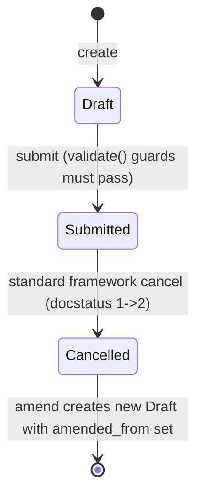

# Staffing Plan

**Source:** `hrms/hr/doctype/staffing_plan/staffing_plan.json`, `staffing_plan.py`, `staffing_plan.js`, `staffing_plan_dashboard.py`
**Submittable:** yes   **Tree:** no   **Naming:** `autoname: "prompt"` (`naming_rule: "Set by user"` — user types the document name at creation, same mechanism as `Grievance Type`)
**Module:** HR

## Schema

| Field (fieldname) | Label | Type | Options/Link Target | Required | Default | Read-Only | Notes |
|---|---|---|---|---|---|---|---|
| company | Company | Link | Company | yes | — | no | In list view |
| department | Department | Link | Department | no | — | no | Client-side filtered to `company == frm.doc.company` (UI-only, see Port Notes) |
| *(column_break_3)* | — | Column Break | — | — | — | — | layout only |
| from_date | From Date | Date | — | yes | — | no | |
| to_date | To Date | Date | — | yes | — | no | |
| *(staffing_plan_details)* | Details | Section Break | — | — | — | — | section heading — groups: staffing_details |
| staffing_details | Staffing Details | Table | [[Staffing Plan Detail]] | yes | — | no | See `Staffing Plan Detail.md`. Client-side filters out designations already chosen in this same table when picking a new row's designation (UI-only). |
| get_job_requisitions | Get Job Requisitions | Button | — | — | — | — | Pure UI trigger (`.js` opens a MultiSelectDialog then calls whitelisted `set_job_requisitions`); not a persisted data field. |
| *(section_break_8)* | — | Section Break | — | — | — | — | layout only |
| total_estimated_budget | Total Estimated Budget | Currency | `options: "Company:company:default_currency"` | no | `0.00` | yes | Computed in `set_total_estimated_budget()` — see Business Logic. |
| amended_from | Amended From | Link | [[Staffing Plan]] | no | — | yes | `no_copy: 1`, `print_hide: 1` |

`sort_field`: `creation` DESC. `track_changes: 1`. `quick_entry: 1`. No `title_field` specified.

## Child Tables

- `staffing_details` -> `Staffing Plan Detail` (see `Staffing Plan Detail.md`)

## State Machine

Submittable doctype; standard docstatus transitions (see [[Submittable Document Lifecycle]]).

No custom `status`/`workflow_state` field exists on this doctype — only the standard Frappe `docstatus` (0=Draft, 1=Submitted, 2=Cancelled) applies. No `on_submit`, `on_cancel`, or `on_discard` methods are defined on the controller — the only gating logic is inside `validate()`, which runs on every save (draft or submit) and therefore also gates the submit transition implicitly (since `validate()` always runs before a docstatus change is persisted).

Plain list of transitions:

| From | Event | To | Guard condition |
|---|---|---|---|
| (new doc) | create | Draft | none |
| Draft | any save (including submit) | (validated Draft, or Submitted) | `validate()` must pass all checks in Validation Rules below — same checks apply whether saving a draft or submitting |
| Draft (docstatus 0->1) | submit | Submitted | Passes `validate()`; no additional `before_submit`/`on_submit` guard exists |
| Submitted | standard framework cancel | Cancelled (docstatus=2) | No `on_cancel` override — pure framework default cancel |
| Cancelled | amend | new Draft, `amended_from` set | standard framework amend behavior |

## Validation Rules (exact, in execution order)

`validate()` runs, in this exact order:

1. `validate_period()` — IF `self.from_date` AND `self.to_date` are both set AND `self.from_date > self.to_date` THEN `frappe.throw(_("From Date cannot be greater than To Date"))`.
2. `validate_details()` — for each `detail` in `self.get("staffing_details")`, in table row order, run (in this per-row order):
   a. `validate_overlap(detail)` — query for any OTHER submitted (`docstatus == 1`) `Staffing Plan` (joined to its `Staffing Plan Detail` rows) where: `spd.designation == detail.designation` AND `sp.to_date >= self.from_date` AND `sp.from_date <= self.to_date` AND `sp.company == self.company` (i.e. any submitted plan for the SAME company with an overlapping date range that also lists this same designation). IF any such record is found THEN `frappe.throw(_("Staffing Plan {0} already exist for designation {1}").format(overlap[0][0], staffing_plan_detail.designation))`. (Note: this query does NOT exclude the current document itself by name — see Port Notes on self-match risk when amending/re-saving a submitted plan... actually since this only matches `docstatus == 1` and the current doc during its own `validate()` might itself already be docstatus 1 during certain re-save flows, or if amending a plan the amended-from doc is still docstatus 2/cancelled so it would not match; flagged for confirmation regardless.)
   b. `validate_with_subsidiary_plans(detail)` — sums `vacancies` and `total_estimated_cost` across all submitted Staffing Plan Detail rows (same designation, overlapping date range) belonging to Staffing Plans whose `company.parent_company == self.company` (i.e. direct child/subsidiary companies of this plan's company). IF (`children_details` exists AND `detail.vacancies < children_details.vacancies`) OR `detail.total_estimated_cost < children_details.total_estimated_cost` THEN `frappe.throw(_("Subsidiary companies have already planned for {1} vacancies at a budget of {2}. Staffing Plan for {0} should allocate more vacancies and budget for {3} than planned for its subsidiary companies").format(self.company, children_details.vacancies, children_details.total_estimated_cost, frappe.bold(detail.designation)), SubsidiaryCompanyError)`. **Note the exact operator-precedence as written in source**: the Python condition is `if (children_details and cint(vac) < cint(children.vacancies)) or flt(cost) < flt(children.total_estimated_cost):` — because `and` binds tighter than `or` in Python, the SECOND clause (`total_estimated_cost` comparison) is evaluated regardless of whether `children_details` is falsy, which could raise/compare against `None`-derived zero values if `children_details` itself is a falsy/empty dict-like Frappe query result (query builder `.run(as_dict=1)` on an aggregate `Sum` with no matching rows returns a row with `vacancies=None, total_estimated_cost=None`, which `cint`/`flt` coerce to 0) — practically this means the second half of the OR effectively becomes `0 < 0` -> False when there are no subsidiary plans, but the exact short-circuit structure should be reproduced literally rather than "fixed" into `children_details and (a or b)` when porting, since that would change behavior when `total_estimated_cost` comparisons could differ from the `vacancies` comparison's truthiness.
   c. `validate_with_parent_plan(detail)` — see Business Logic for full multi-step parent/sibling validation; throws `ParentCompanyError` or a generic `ValidationError` depending on which check fails (see below).
3. `set_total_estimated_budget()` — recomputes `current_count`, `current_openings`, `number_of_positions`, `total_estimated_cost` for every row and `self.total_estimated_budget` overall (see Business Logic — this is computation, not a throw-based validation, but it runs as the final step of `validate()`).

## Business Logic / Calculations

### `set_total_estimated_budget()` (numbered steps)
1. `self.total_estimated_budget = 0`.
2. For each `detail` row in `staffing_details`, in order:
   a. `designation_counts = get_designation_counts(detail.designation, self.company)` (see whitelisted function below).
   b. `detail.current_count = designation_counts["employee_count"]`.
   c. `detail.current_openings = designation_counts["job_openings"]`.
   d. `self.set_number_of_positions(detail)` — sets `detail.number_of_positions = cint(detail.vacancies) + cint(detail.current_count)`.
   e. `detail.total_estimated_cost = 0`.
   f. IF `detail.number_of_positions > 0`:
      i. IF `detail.vacancies` AND `detail.estimated_cost_per_position` are both truthy THEN `detail.total_estimated_cost = cint(detail.vacancies) * flt(detail.estimated_cost_per_position)`.
   g. `self.total_estimated_budget += detail.total_estimated_cost`.

Edge cases explicitly handled: if `detail.number_of_positions <= 0`, `total_estimated_cost` is forced to 0 regardless of vacancies/cost values (guards against negative-position plans contributing cost). If `vacancies` or `estimated_cost_per_position` is blank/zero/falsy, cost stays 0 (guards against multiplying by a missing value). No explicit rounding/precision call is applied to `total_estimated_cost` per-row (unlike `Full and Final Statement`'s use of `flt(x, precision)`) — the parent total `total_estimated_budget` is also not explicitly rounded via `self.precision(...)` in this controller (relies on the Currency fieldtype's own storage-level rounding, i.e. framework/database-level rounding rather than an explicit `flt(..., precision)` call in Python).

### `get_designation_counts(designation, company, job_opening=None)` (whitelisted, module-level; numbered steps)
1. IF `not designation` THEN return `False`.
2. `company_set = get_descendants_of("Company", company)` (all descendant companies in the Company tree/nested-set hierarchy below `company`), then `company_set.append(company)` (include the company itself).
3. `employee_count = frappe.db.count("Employee", {"designation": designation, "status": "Active", "company": ("in", company_set)})` — counts Active employees with this designation across the company AND all its descendant companies.
4. `filters = {"designation": designation, "status": "Open", "company": ("in", company_set)}`; IF `job_opening` arg provided THEN also add `filters["name"] = ("!=", job_opening)` (exclude a specific Job Opening record from the count, e.g. to avoid double counting the current one being edited).
5. `job_openings = frappe.db.count("Job Opening", filters)`.
6. Return `{"employee_count": employee_count, "job_openings": job_openings}`.

### `validate_with_parent_plan(staffing_plan_detail)` (numbered steps)
1. IF `Company.parent_company` for `self.company` is falsy (no parent company) THEN return immediately (nothing to validate).
2. `parent_plan_details = get_active_staffing_plan_details(self.company, staffing_plan_detail.designation, self.from_date, self.to_date)` (see whitelisted function below — note this call passes `self.company` itself, not its parent, into the lookup; the lookup function internally walks up the parent chain if no direct match is found — see that function's own logic).
3. IF `not parent_plan_details` THEN return (no active staffing plan found anywhere up the hierarchy for this designation/date range).
4. `parent_company = frappe.db.get_value("Staffing Plan", parent_plan_details[0].name, "company")` (the actual company that owns the found plan — could be higher up the hierarchy than the immediate parent).
5. IF `cint(staffing_plan_detail.vacancies) > cint(parent_plan_details[0].vacancies)` OR `flt(staffing_plan_detail.total_estimated_cost) > flt(parent_plan_details[0].total_estimated_cost)` THEN `frappe.throw(_("You can only plan for upto {0} vacancies and budget {1} for {2} as per staffing plan {3} for parent company {4}.").format(cint(parent_plan_details[0].vacancies), parent_plan_details[0].total_estimated_cost, frappe.bold(staffing_plan_detail.designation), parent_plan_details[0].name, parent_company), ParentCompanyError)`.
6. `lft, rgt = Company.lft, Company.rgt` for `parent_company` (nested-set boundary values).
7. `all_sibling_details` = aggregate query: `Sum(vacancies)`, `Sum(total_estimated_cost)` across all submitted Staffing Plan Detail rows (same designation, overlapping date range) belonging to Staffing Plans whose `company` is strictly within the nested-set range `(lft, rgt)` exclusive of the parent company itself (i.e. all descendants of `parent_company`, which includes `self.company` and its siblings under the same parent).
8. IF `cint(parent_plan_details[0].vacancies) < (cint(staffing_plan_detail.vacancies) + cint(all_sibling_details.vacancies))` OR `flt(parent_plan_details[0].total_estimated_cost) < (flt(staffing_plan_detail.total_estimated_cost) + flt(all_sibling_details.total_estimated_cost))` THEN `frappe.throw(_("{0} vacancies and {1} budget for {2} already planned for subsidiary companies of {3}. You can only plan for upto {4} vacancies and and budget {5} as per staffing plan {6} for parent company {3}.").format(cint(all_sibling_details.vacancies), all_sibling_details.total_estimated_cost, frappe.bold(staffing_plan_detail.designation), parent_company, cint(parent_plan_details[0].vacancies), parent_plan_details[0].total_estimated_cost, parent_plan_details[0].name))` (generic `frappe.ValidationError`, no custom exception class this time). Note: this comparison INCLUDES this row's own values summed with the sibling total, checked against the parent's total allowance — i.e. it's checking that this plan's request plus everything already planned across all sibling/descendant companies together does not exceed what the parent company's staffing plan allows.

### `validate_with_subsidiary_plans(staffing_plan_detail)` — see step 2b above (full logic already captured in Validation Rules to preserve exact operator precedence).

### `validate_overlap(staffing_plan_detail)` — see step 2a above.

### `set_job_requisitions(job_reqs)` (whitelisted instance method; numbered steps)
1. IF `job_reqs` (non-empty list) THEN:
   a. `requisitions = frappe.db.get_list("Job Requisition", filters={"name": ("in", job_reqs)}, fields=["designation", "no_of_positions", "expected_compensation"])`.
   b. `self.staffing_details = []` (WIPES all existing rows in the table — this is a full replace, not an append/merge).
   c. For each `req` in `requisitions`: `current_count = get_designation_counts(req.designation, self.company)["employee_count"]`; append a new row: `designation = req.designation`, `vacancies = req.no_of_positions`, `estimated_cost_per_position = req.expected_compensation`, `number_of_positions = cint(current_count) + cint(req.no_of_positions)`.
2. Return `self` (the whole document, saved back to the client via `frappe.model.sync`).

### `get_active_staffing_plan_details(company, designation, from_date=None, to_date=None)` (whitelisted, module-level; numbered steps, RECURSIVE)
1. `frappe.has_permission("Staffing Plan", "read", throw=True)` — explicit read-permission check (raises if caller cannot read Staffing Plan).
2. IF `from_date` is `None` THEN default to `getdate(nowdate())` (today). Same for `to_date`.
3. IF `not company` OR `not designation` THEN `frappe.throw(_("Please select Company and Designation"))`.
4. Query: any submitted (`docstatus == 1`) Staffing Plan (joined to Staffing Plan Detail) where `sp.company == company` AND `spd.designation == designation` AND `sp.to_date >= from_date` AND `sp.from_date <= to_date`, selecting `sp.name, spd.vacancies, spd.total_estimated_cost`.
5. IF no result found THEN: `parent_company = Company.parent_company` for `company`; IF a parent company exists THEN RECURSE: `staffing_plan = get_active_staffing_plan_details(parent_company, designation, from_date, to_date)` (walks up the company hierarchy one level at a time until a match is found or the top of the hierarchy is reached).
6. Return the found staffing plan list, or `None` if nothing found anywhere up the chain. Comment in source: "Only a single staffing plan can be active for a designation on given date" — this is an assumed invariant, NOT itself enforced by a uniqueness constraint anywhere in this doctype's code (the `validate_overlap` check is the closest enforcement, but it only prevents overlap within the SAME company, not globally) — see Port Notes.

## Lifecycle Hooks (exact)

| Event | What Runs | Side Effects on Other Doctypes |
|---|---|---|
| validate | `validate_period()`, `validate_details()` (per-row: `validate_overlap`, `validate_with_subsidiary_plans`, `validate_with_parent_plan`), `set_total_estimated_budget()` | Reads Employee, Job Opening, Company (tree), other Staffing Plan/Staffing Plan Detail records — no writes to other doctypes |

No `before_insert`, `after_insert`, `on_update`, `before_submit`, `on_submit`, `on_cancel`, `on_trash`, `on_discard` methods exist on this controller.

## Whitelisted / API Methods

| Method name | HTTP-equivalent purpose | Args | Returns | What it does |
|---|---|---|---|---|
| `set_job_requisitions` (instance method) | POST — bulk-replace `staffing_details` from selected Job Requisitions | `job_reqs: list[str]` | `self` (the whole Staffing Plan document) | See Business Logic above. Fully replaces `staffing_details` if `job_reqs` is non-empty; if `job_reqs` is empty/falsy, the table is left untouched (the `if job_reqs:` guard means an empty list is a no-op, not a clear-the-table action). |
| `get_designation_counts` (module-level) | GET-style lookup — live counts for a designation across a company + its descendants | `designation: str`, `company: str`, `job_opening: str \| None = None` | `dict` `{employee_count, job_openings}`, or `False` if `designation` is falsy | See Business Logic above. |
| `get_active_staffing_plan_details` (module-level) | GET-style lookup — find the nearest active/submitted staffing plan (walking up the company hierarchy) for a designation on a date range | `company: str`, `designation: str`, `from_date`, `to_date` | `list[dict]` (one row: `name, vacancies, total_estimated_cost`) or `None` | See Business Logic above (recursive up the company parent chain). Performs an explicit `frappe.has_permission` check. |

## Permissions

| Role | Read | Write | Create | Delete | Submit | Cancel | Amend | Report | Export | Notes |
|---|---|---|---|---|---|---|---|---|---|---|
| HR Manager | yes | yes | yes | yes | yes | yes | yes | yes | yes | `cancel: 1`, `submit: 1`, `amend: 1`; share, email, print all 1 |
| HR User | yes | yes | yes | no | yes | no | no | yes | yes | `submit: 1` explicitly granted but no `cancel`/`amend`/`delete`; share, email, print all 1. NOTE: no System Manager row exists in this doctype's `permissions` array at all (unlike every other doctype in this assigned set) — flag as Port Note. |

## Scheduled Jobs Touching This Doctype

None found in `hrms/hooks.py` (`scheduler_events` or `doc_events`) — no cron/job/hook references `Staffing Plan`.

## Related Doctypes

- [[Staffing Plan Detail]] — via `staffing_details`: See `Staffing Plan Detail.md`. Client-side filters out designations already chosen in this same table when picking a new row's designation (UI-only).

## Port Notes

- **No System Manager permission row**: unusually for this codebase, `Staffing Plan`'s `permissions` array has no `System Manager` entry at all — meaning access for that role falls back entirely to whatever Frappe's implicit System Manager superuser behavior provides (Frappe's System Manager role typically has full access to all doctypes by default framework convention, even without an explicit permission row, though this is a framework-level implicit behavior, not something declared in this JSON). A port should decide explicitly whether/how a "superuser" role gets access to this specific doctype, since the literal JSON here does not spell it out.
- **`set_job_requisitions` full-replace semantics**: calling this method wipes and rebuilds `staffing_details` entirely rather than merging/appending to existing rows — any manually-added rows not sourced from a Job Requisition are lost if this method is invoked after manual edits. A port should preserve this literal "full replace" behavior unless directed otherwise, and flag the destructive nature explicitly in any UI/API surface.
- **"Only one active staffing plan per designation per date" is an assumed but incompletely enforced invariant**: the code comment in `get_active_staffing_plan_details` states this assumption, but `validate_overlap` only checks WITHIN the same company (via `sp.company == self.company`), not globally across unrelated companies, and there is no database-level unique constraint. A port implementing stronger data integrity guarantees should treat this as a module-wide invariant candidate (see `_Module-Spec.md`) but must confirm the intended scope (same-company-only vs. global) with the product owner, since the literal source code only enforces the same-company case.
- **Boolean operator precedence in `validate_with_subsidiary_plans`**: reproduce the exact `(A and B) or C` structure noted in Validation Rules step 2b — do not silently "fix" this to `A and (B or C)`, since that changes behavior when there are no subsidiary plans at all (making `children_details` falsy).
- **Client-only validations without server equivalents**: (1) `staffing_plan.js`'s `vacancies` handler blocking `vacancies < current_openings` — not enforced server-side, see `Staffing Plan Detail.md` Port Notes; (2) the department picker filtered to `company == frm.doc.company` — not enforced server-side, meaning a `department` from an unrelated company could be saved via direct API write; (3) the designation-picker excluding already-used designations within the same table — not enforced server-side, meaning duplicate designation rows within a single Staffing Plan's `staffing_details` ARE possible via direct API write (the server-side `validate_overlap` only checks against OTHER submitted plans, not against duplicate rows within the SAME plan). A port should decide whether to add these three server-side checks, since none exist in the ground-truth Python.
- **Dashboard connections** (`staffing_plan_dashboard.py`): declares a "Job Opening" transaction link (`fieldname: "staffing_plan"`) — this is purely a UI "linked documents" panel definition in Frappe (shows related Job Openings referencing this Staffing Plan via a `staffing_plan` field on Job Opening) and carries no server-side logic; a port only needs this if replicating the equivalent "related records" UI panel, and should confirm the `Job Opening` doctype (owned by another module) actually has a `staffing_plan` field, since that doctype is outside this assigned doctype set.
- **Recursive company-hierarchy walk**: `get_active_staffing_plan_details` recurses up an unbounded number of parent-company levels with no explicit depth/cycle guard — a new stack should add a cycle-detection guard if the target Company hierarchy data could ever contain a cycle (Frappe's nested-set Company tree is assumed acyclic by convention, but this is not defensively checked in this function).
- **No explicit rounding on `total_estimated_budget`/`total_estimated_cost`**: unlike `Full and Final Statement`, this controller does not call `flt(value, self.precision(fieldname))` — currency rounding here relies entirely on the framework's/database's storage-level rounding of Currency fields. A port must apply its own currency rounding convention explicitly since it won't get this "for free" the way Frappe's ORM does at save time.
- **Auto timestamps / track_changes / prompt-naming**: same framework-reliance notes as other doctypes — `creation`/`modified`/`owner`/`modified_by` auto-tracked; `track_changes: 1` gives free version history; `autoname: "prompt"` means the primary key is user-typed at creation (see `Grievance Type.md` Port Notes for the same pattern and its relational-modeling implications).
