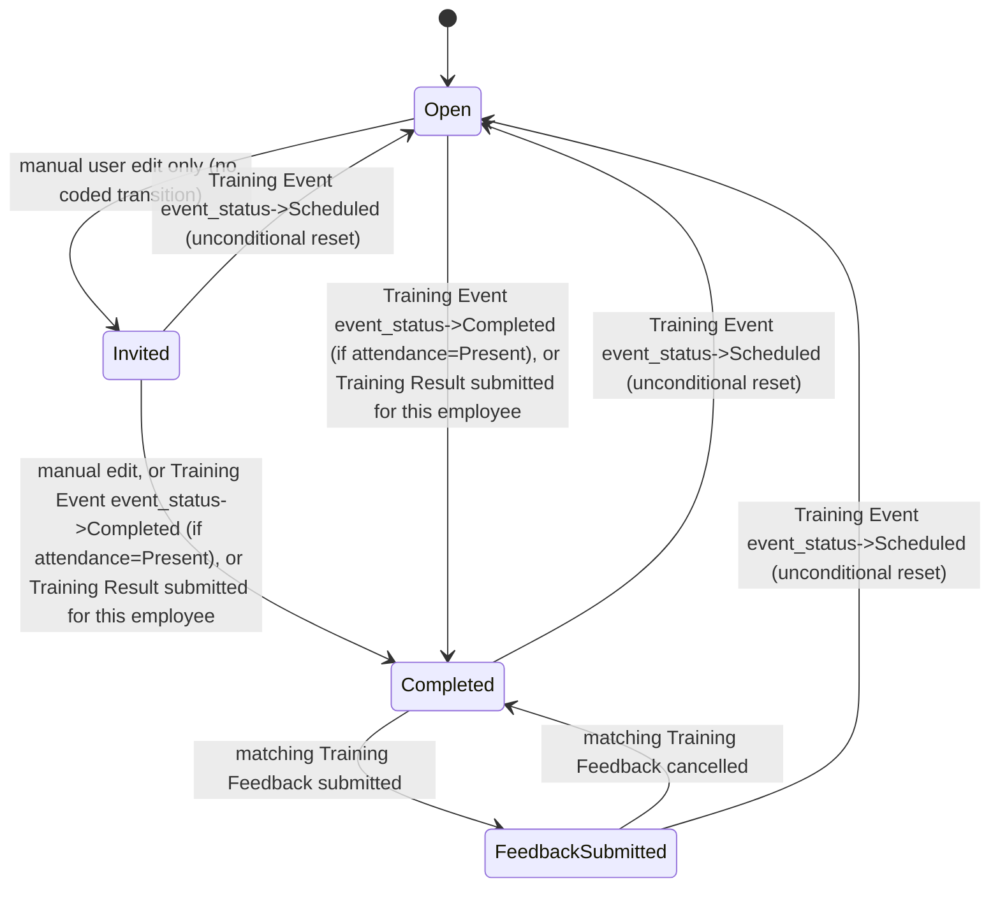

# Training Event Employee

**Source:** `hrms/hr/doctype/training_event_employee/training_event_employee.json`, `training_event_employee.py`
**Submittable:** no (child table — `istable: 1`)   **Tree:** no   **Naming:** standard Frappe child-table row naming (auto-generated `name` / row idx; no `autoname` rule declared)
**Module:** HR

Child doctype of `Training Event` (field `employees`).

## Schema

| Field (fieldname) | Label | Type | Options/Link Target | Required | Default | Read-Only | Notes |
|---|---|---|---|---|---|---|---|
| employee | Employee | Link | [[Employee Core Model|Employee]] | No (not `reqd` in schema — see Port Notes) | — | No | `no_copy`; shown in list view (grid column) |
| employee_name | Employee Name | Read Only | — | No | — | Yes (fieldtype itself is Read Only) | `fetch_from: employee.employee_name` |
| department | Department | Link | Department | No | — | Yes | `fetch_from: employee.department` |
| column_break_3 | — | Column Break | — | — | — | — | layout only |
| status | Status | Select | `Open`, `Invited`, `Completed`, `Feedback Submitted` | No | `Open` | No | `allow_on_submit`, `no_copy`; shown in grid |
| attendance | Attendance | Select | `Present`, `Absent` | No | — | No | shown in grid |
| is_mandatory | Is Mandatory | Check | — | No | `1` | No | shown in grid, `columns: 2` (grid column width) |

## Child Tables

N/A — this is itself a child table (of `Training Event`). It has no child tables of its own.

## State Machine

Not independently submittable (child row; docstatus follows the parent Training Event). Its own `status` field is a business-state flag with these values: `Open` (default) -> `Invited` -> `Completed` -> `Feedback Submitted`.

Transitions are driven entirely by parent/sibling-doctype controller code, not by this doctype's own controller (`training_event_employee.py` body is `pass`):
- Set to `Open`: by `Training Event.set_status_for_attendees()` whenever the parent's `event_status` is set to `Scheduled` (unconditional reset of every row) — see `Training Event.md`.
- Set to `Completed`: (a) by `Training Event.set_status_for_attendees()` when parent `event_status` becomes `Completed`, for rows where `attendance == "Present"` and current `status != "Feedback Submitted"`; (b) by `Training Result.on_submit()`, which sets it to `Completed` directly for every attendee row matching an employee present in the submitted Training Result — see `Training Result.md`; (c) by `Training Feedback.on_cancel()`, which resets it back to `Completed` when a previously-submitted Training Feedback for that employee/event is cancelled — see `Training Feedback.md`.
- Set to `Feedback Submitted`: by `Training Feedback.on_submit()`, for the row matching that feedback's `training_event`+`employee`.
- No code path in this repo sets `status` to `Invited` — that value exists in the Select options but is never programmatically assigned; it would only ever be set by a user manually editing the field via the grid (`status` is not `read_only`).

Plain list:
| From State | Event | To State | Guard Condition |
|---|---|---|---|
| any | parent Training Event `event_status` set to `Scheduled` and saved | Open | none (applies to every row unconditionally) |
| Open/Invited | parent Training Event `event_status` set to `Completed` and saved | Completed | this row's `attendance == "Present"` AND `status != "Feedback Submitted"` |
| any (except already Feedback Submitted implicitly) | linked `Training Result` submitted, and this employee appears in both the Training Result's `employees` table and the parent event's `employees` table | Completed | employee match by `employee` field between the two tables |
| Completed | matching `Training Feedback` (same training_event + employee) submitted | Feedback Submitted | Training Feedback's own validate passed (attendance != Absent, employee found in event) |
| Feedback Submitted | matching `Training Feedback` cancelled | Completed | none beyond the cancel itself succeeding |

## Validation Rules (exact, in execution order)

None. `training_event_employee.py`'s `TrainingEventEmployee` class body is `pass` — no custom validation. Only framework-level field constraints from the schema apply (none of the fields are `reqd` in this child doctype's JSON, notably not even `employee`).

## Business Logic / Calculations

None on this doctype directly (see State Machine section above for logic living in the parent/sibling doctypes that writes into these rows).

## Lifecycle Hooks (exact)

| Event | What Runs | Side Effects on Other Doctypes |
|---|---|---|
| (none — controller is `pass`) | — | — |

(All effective lifecycle behavior for this child table is driven externally — see `Training Event.md`, `Training Result.md`, `Training Feedback.md`.)

## Whitelisted / API Methods

None.

## Permissions

`permissions: []` in the JSON — child tables do not carry their own permission rows in Frappe; access is governed entirely by the parent doctype's (`Training Event`) permissions.

## Scheduled Jobs Touching This Doctype

None directly. (No `hrms/hooks.py` entries reference `Training Event Employee`.)

## Related Doctypes

- [[Employee Core Model|Employee]] — via `employee`: `no_copy`; shown in list view (grid column)

## Port Notes

- Because `employee` is NOT flagged `reqd` in the schema, a Training Event Employee row can theoretically exist with a blank `employee` — the UI/client script (`set_multiple_add`) and general workflow expectation is that it's always populated, but there is no server-side enforcement of that. A strict port should decide explicitly whether to relax or tighten this (recommend keeping it optional to match current behavior, and documenting the gap, rather than silently adding a NOT NULL constraint that source doesn't have).
- `department` and `employee_name` are fetch-from convenience copies of the linked Employee's fields at the time the row is saved/edited in the UI — a port must implement the fetch (copy) on employee selection, either client-side-then-submit or recomputed server-side on save, to keep parity; Frappe's `fetch_from` is a client-side auto-populate-on-select behavior backed by a read-only column, it is NOT re-synced automatically if the source Employee record changes later. Treat `employee_name`/`department` here as point-in-time snapshots, not live joins.
- `is_mandatory` defaults to checked (`1`) per row — this is a per-attendee flag (not a whole-event flag); as noted in `Training Event.md`'s Port Notes, the "Training Scheduled" notification's `doc.is_mandatory` Jinja reference does not actually correspond to any field on the parent Training Event, so that per-row flag is effectively unused by the current notification logic in this repo.
- `db_update_all()` (called from `Training Event.set_status_for_attendees`) is a Frappe ORM method that writes all child-table rows' current in-memory values straight to the database in one batch, bypassing each child row's own `validate`/`before_save` hooks. A port must replicate this as a direct bulk UPDATE of the child rows' `status` column, not by re-running "save" logic on each row (there is none to run here anyway since the controller is `pass`, but keep the same bypass semantics in mind generally for this table).
