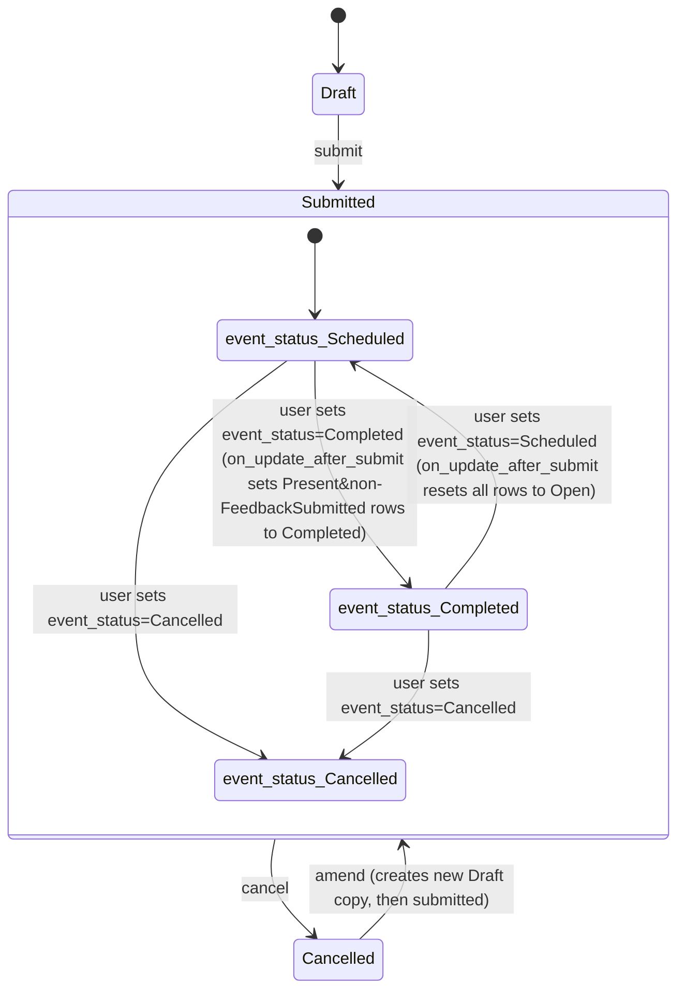

# Training Event

**Source:** `hrms/hr/doctype/training_event/training_event.json`, `training_event.py`, `training_event.js`, `training_event_calendar.js`
**Submittable:** yes   **Tree:** no   **Naming:** `field:event_name` (naming_rule "By fieldname"; document name = value of `event_name`, must be unique)
**Module:** HR

## Schema

| Field (fieldname) | Label | Type | Options/Link Target | Required | Default | Read-Only | Notes |
|---|---|---|---|---|---|---|---|
| event_name | Event Name | Data | — | Yes (reqd) | — | No | `unique`, `no_copy`; shown in list view; used as document name and title_field |
| training_program | Training Program | Link | [[Training Program]] | No | — | No | |
| event_status | Event Status | Select | `Scheduled`, `Completed`, `Cancelled` | Yes (reqd) | — | No | `allow_on_submit`; shown in list view and standard filter |
| has_certificate | Has Certificate | Check | — | No | `0` | No | `depends_on: eval:doc.type == 'Seminar' \|\| doc.type == 'Workshop' \|\| doc.type == 'Conference' \|\| doc.type == 'Exam'` (UI-only visibility condition; value can still be set/stored even if not shown) |
| column_break_2 | — | Column Break | — | — | — | — | layout only |
| type | Type | Select | `Seminar`, `Theory`, `Workshop`, `Conference`, `Exam`, `Internet`, `Self-Study` | Yes (reqd) | — | No | shown in list view and standard filter |
| level | Level | Select | (blank), `Beginner`, `Intermediate`, `Advance` | No | — | No | `depends_on: eval:doc.type == 'Seminar' \|\| doc.type == 'Workshop' \|\| doc.type == 'Exam'` |
| company | Company | Link | Company | No | — | No | |
| section_break_4 | — | Section Break | — | — | — | — | layout only |
| trainer_name | Trainer Name | Data | — | No | — | No | |
| trainer_email | Trainer Email | Data | — | No | — | No | |
| column_break_7 | — | Column Break | — | — | — | — | layout only |
| supplier | Supplier | Link | Supplier | No | — | No | |
| contact_number | Contact Number | Data | — | No | — | No | |
| section_break_9 | — | Section Break | — | — | — | — | layout only |
| course | Course | Data | — | No | — | No | shown in standard filter |
| location | Location | Data | — | Yes (reqd) | — | No | shown in list view and standard filter |
| column_break_12 | — | Column Break | — | — | — | — | layout only |
| start_time | Start Time | Datetime | — | Yes (reqd) | — | No | |
| end_time | End Time | Datetime | — | Yes (reqd) | — | No | must be strictly after start_time (see Validation Rules) |
| section_break_15 | — | Section Break | — | — | — | — | layout only |
| introduction | Introduction | Text Editor | — | Yes (reqd) | — | No | rich text |
| section_break_18 (label "Attendees") | Attendees | Section Break | — | — | — | — | groups the `employees` child table |
| employees | Employees | Table | [[Training Event Employee]] | No | — | No | `allow_on_submit` — rows may be added/edited after submission |
| amended_from | Amended From | Link | [[Training Event]] | No | — | Yes | `no_copy`, `print_hide`; standard amendment field |
| employee_emails | Employee Emails | Small Text | (options: `Email`, i.e. holds email-formatted text) | No | — | No | `hidden`; computed field — set by controller from the emails of every employee currently in the `employees` child table (see Business Logic) |

## Child Tables

- `employees` -> child doctype **Training Event Employee** — see `Training Event Employee.md`.

## State Machine

Submittable doctype (see [[Submittable Document Lifecycle]]). Standard Frappe docstatus lifecycle (Draft=0, Submitted=1, Cancelled=2) applies on top of the independent business field `event_status` (`Scheduled` / `Completed` / `Cancelled`).

- `event_status` is set purely by direct user edit on the form (no controller code sets it based on other events, other than the interaction below).
- After submission, editing `event_status` on the submitted document (`allow_on_submit`) triggers `on_update_after_submit`, which cascades into the child table's `status`/`attendance` fields:
  - IF `event_status == "Completed"` THEN for every row in `employees`: IF `attendance == "Present"` AND `status != "Feedback Submitted"` THEN set that row's `status = "Completed"`.
  - ELSE IF `event_status == "Scheduled"` THEN for every row in `employees`: set `status = "Open"` (unconditional reset, regardless of current status/attendance).
  - (No explicit branch for `event_status == "Cancelled"` — attendee statuses are left untouched in that case.)
  - Changes are persisted directly via `self.db_update_all()` (bulk raw DB update of all child rows, bypassing normal per-row validate/save events).
- `Training Result.on_submit` (a different doctype, see `Training Result.md`) also mutates this document: it loads the linked Training Event, force-sets its `status`... **Port Note:** the source code in `training_result.py.on_submit` sets `training_event.status = "Completed"`, but Training Event has no field literally named `status` — the actual field is `event_status`. This looks like a latent bug in the original source (setting a non-existent attribute on the in-memory doc object, which Frappe's Document class silently allows as a plain Python attribute assignment that then gets ignored on `.save()` since it's not a declared field). Confirm against a live instance before assuming Training Event's `event_status` is actually flipped to "Completed" by that code path; as written, it likely does **not** update `event_status`. See `Training Result.md` for full detail.

Plain list:
| From State | Event | To State | Guard Condition |
|---|---|---|---|
| Draft (docstatus=0) | submit | Submitted (docstatus=1) | end_time > start_time (validate) |
| Submitted | cancel | Cancelled (docstatus=2) | standard Frappe cancel |
| Cancelled | amend | new Draft (linked via amended_from) | standard Frappe amend |
| event_status=Scheduled (while Submitted) | user edits event_status to Completed, save | event_status=Completed | none beyond `reqd`; cascades child row `status` updates as above |
| event_status=Completed (while Submitted) | user edits event_status to Scheduled, save | event_status=Scheduled | none; resets all child rows' `status` to Open |
| any event_status (while Submitted) | user edits event_status to Cancelled, save | event_status=Cancelled | none; no child-row cascade coded for this branch |

## Validation Rules (exact, in execution order)

Executed inside `validate()`, in this exact order:

1. `set_employee_emails()` runs first (not a guard/throw — a side-effecting step that recomputes `employee_emails` from the current `employees` table every time the document is validated; see Business Logic).
2. `validate_period()` -> IF `time_diff_in_seconds(self.end_time, self.start_time) <= 0` THEN `frappe.throw(_("End time cannot be before start time"))` (source: `validate_period`). Note the message says "cannot be before" but the actual guard is "difference <= 0", i.e. it also rejects `end_time == start_time`, not just `end_time < start_time`.

Framework-level (schema-declared, not custom code) mandatory-field checks also apply: `event_name`, `event_status`, `type`, `location`, `start_time`, `end_time`, `introduction` must all be present, and `event_name` must be unique.

## Business Logic / Calculations

**`set_employee_emails()`** (called on every `validate`):
1. Build a list of `employee` values from every row currently in the `employees` child table (including duplicates/blanks as-is — no dedup logic here in this function itself).
2. Call `get_employee_emails(employee_list)` (imported from `erpnext.setup.doctype.employee.employee`) — this ERPNext utility resolves each Employee ID to its user/preferred email (exact internal implementation lives in ERPNext, not in this repo; treat as "given a list of Employee IDs, return the list of associated email addresses one-to-one, order determined by that utility, likely filtering out employees without an email").
3. Join the resulting list of email strings with `", "` and store it as `self.employee_emails`.
4. This value is what the "Training Scheduled" Notification (see Scheduled/Automated Notifications below) uses as its recipient list when the document is submitted.

No other calculations on this doctype.

## Lifecycle Hooks (exact)

| Event | What Runs | Side Effects on Other Doctypes |
|---|---|---|
| validate | `set_employee_emails()` then `validate_period()` (see above, exact order) | none (in-memory field recompute + guard) |
| on_update_after_submit | `set_status_for_attendees()`: cascades `event_status` into each `employees` row's `status` field per the rules under State Machine, then calls `self.db_update_all()` to persist all child rows in one bulk update | writes directly to this document's own child table rows (`Training Event Employee`) via raw DB update, bypassing child-row validate |
| (Submit, via Notification doc) | Frappe's Notification engine (standard, config-driven — see `hrms/hr/notification/training_scheduled/`) fires an email to every address in `employee_emails` | sends outbound email; no other doctype write |

## Whitelisted / API Methods

None defined in `training_event.py` itself. (`training_result.get_employees` in `Training Result.md` reads this doctype's `employees` table via `frappe.get_doc`, but is declared on the Training Result controller module, not here.)

## Permissions

| Role | Read | Write | Create | Delete | Submit | Cancel | Amend | Report | Export | Notes (if_owner, permlevel, etc) |
|---|---|---|---|---|---|---|---|---|---|---|
| HR Manager | 1 | 1 | 1 | 1 | 1 | 1 | 1 | 1 | 1 | also `email`, `import`, `print`, `share` = 1 |
| HR User | 1 | 1 | — | — | — | — | — | 1 | — | no create/delete/submit/cancel/amend/print/email/share |

## Scheduled Jobs Touching This Doctype

None found in `hrms/hooks.py` (`doc_events`/`scheduler_events`). No cron-based reminder job exists for Training Event in this codebase — the only automated notification is the event-driven ("Submit") Notification document below, not a scheduler_events entry.

**Notification (config-driven, not a Python scheduled job) — "Training Scheduled"** (`hrms/hr/notification/training_scheduled/training_scheduled.json`):
- `document_type`: Training Event, `event`: Submit, `channel`: Email, `enabled`: 1.
- Recipients: every address in the (comma-joined) `employee_emails` field (`receiver_by_document_field: employee_emails`).
- Subject: `Training Scheduled: {{ doc.name }}`.
- Body template renders: `doc.introduction`, `Event Location: doc.location`, a same-day-formatted or separate start/end date+time block (computed from `doc.start_time`/`doc.end_time` via Jinja, comparing `.date()`), a link back to the Training Event form, and — if `doc.is_mandatory` is truthy — an extra line "Note: This Training Event is mandatory". **Port Note:** the template references `doc.is_mandatory`, but no such field exists on Training Event's schema (the mandatory flag actually lives per-attendee as `Training Event Employee.is_mandatory`) — this Jinja expression will always evaluate falsy/undefined on this doctype as currently modeled; treat the "mandatory" line as effectively dead in production and flag as a possible source-repo inconsistency rather than inventing a fix.
- This must be reproduced as an application-level "on submit, send email" side effect in a port, not literally as a generic notification-template engine unless the target stack has an equivalent.

## Related Doctypes

- [[Training Program]] — via `training_program`: linked via `training_program`.
- [[Training Event Employee]] — via `employees`: `allow_on_submit` — rows may be added/edited after submission

## Port Notes

- `training_event_dashboard.py` links "Training Result" and "Training Feedback" as related transactions in the desk dashboard widget (both filtered by `training_event = this event`) — informational only, no business logic to port beyond supporting an equivalent "related records" query if desired.
- `training_event.js`: `onload_post_render` sets the `employees` grid to allow adding multiple employees at once (`set_multiple_add`) — pure UI convenience, no server equivalent needed.
- `training_event.js` `set_employee_query`: restricts the Employee link-field options inside the `employees` child grid to (a) `status = "Active"` employees only, and (b) excludes employees already added as a row in the same Training Event (client-side "NOT IN" filter recomputed on every `employee` field change). **This is a client-only validation with no server-side enforcement in `training_event.py`.** A port's server-side create/update logic for Training Event must independently enforce, if it wants parity: only Active employees may be added as attendees, and no employee may appear twice in the same event's `employees` table (currently NOT enforced server-side in the source — flagging this as a gap in the original code rather than inventing new behavior; a strict port of "exact current behavior" would leave this unenforced server-side, but note it explicitly to the implementer).
- `training_event_calendar.js` maps Training Event onto the Frappe desk Calendar/Gantt view (`start_time`->start, `end_time`->end, `event_name`->title) — pure UI/calendar-rendering wiring, not business logic.
- Refresh-time custom buttons ("Training Result", "Training Feedback") on the form just route to filtered list views — no logic to port.
- `track_changes` is not set on this doctype's JSON (absent from the schema dump), so no implicit Frappe audit trail is guaranteed here beyond the built-in submit/cancel/amend version tracking that Frappe applies to all submittable doctypes — verify against the target stack's own audit needs.
- Standard Frappe submittable-doctype behaviors relied on implicitly and needing explicit reproduction in a new stack: `amended_from` linking + `naming_series`-like docstatus reset on amend (new doc gets a fresh name derived from the same autoname rule since `field:event_name` — actually on amend the amended doc typically needs a new unique `event_name`, since `event_name` is `unique`; the framework's amend flow copies the doc but the user must supply a new distinct `event_name` before saving, since the old one is now taken by the cancelled original).
