# Training Result

**Source:** `hrms/hr/doctype/training_result/training_result.json`, `training_result.py`, `training_result.js`
**Submittable:** yes   **Tree:** no   **Naming:** `HR-TRR-.YYYY.-.#####` (naming_rule "Expression (old style)" — Frappe naming-series pattern: literal `HR-TRR-`, then current 4-digit year, then `-`, then a 5-digit zero-padded auto-incrementing counter reset per pattern instance, e.g. `HR-TRR-2026-00001`)
**Module:** HR

## Schema

| Field (fieldname) | Label | Type | Options/Link Target | Required | Default | Read-Only | Notes |
|---|---|---|---|---|---|---|---|
| training_event | Training Event | Link | [[Training Event]] | Yes (reqd) | — | No | `unique` — only one Training Result may exist per Training Event; shown in list view |
| section_break_3 | — | Section Break | — | — | — | — | layout only |
| employees | Employees | Table | [[Training Result Employee]] | No | — | No | populated client-side from the linked Training Event's attendee list (see Port Notes / whitelisted method) |
| amended_from | Amended From | Link | [[Training Result]] | No | — | Yes | `no_copy`, `print_hide`; standard amendment field |
| employee_emails | Employee Emails | Small Text | (options: `Email`) | No | — | No | `hidden`; computed by controller from current `employees` rows (same pattern as Training Event) |

## Child Tables

- `employees` -> child doctype **Training Result Employee** — see `Training Result Employee.md`.

## State Machine

Submittable doctype (see [[Submittable Document Lifecycle]]); standard docstatus lifecycle only (Draft -> Submitted -> Cancelled -> Amend). No independent `status`/`workflow_state` field on this doctype itself.

```mermaid
stateDiagram-v2
    [*] --> Draft
    Draft --> Submitted: submit (validate: linked Training Event must be submitted; on_submit cascades attendee status)
    Submitted --> Cancelled: cancel
    Cancelled --> Submitted: amend (new Draft, then submitted)
```

Plain list:
| From State | Event | To State | Guard Condition |
|---|---|---|---|
| Draft | submit | Submitted | linked `Training Event.docstatus == 1` (checked in `validate`, which always runs before submit) |
| Submitted | cancel | Cancelled | standard Frappe cancel (no custom `on_cancel` override defined — see Port Notes gap below) |
| Cancelled | amend | new Draft | standard Frappe amend |

## Validation Rules (exact, in execution order)

Executed inside `validate()`, in this exact order:

1. Load the linked Training Event: `training_event = frappe.get_doc("Training Event", self.training_event)`.
2. IF `training_event.docstatus != 1` THEN `frappe.throw(_("{0} must be submitted").format(_("Training Event")))` — i.e. exact rendered message: `"Training Event must be submitted"` (source: `validate`).
3. Recompute `self.employee_emails = ", ".join(get_employee_emails([d.employee for d in self.employees]))` (side effect, not a guard — runs unconditionally after the check above passes).

Framework-level: `training_event` is mandatory and must be unique (only one Training Result per Training Event).

## Business Logic / Calculations

**`employee_emails` recompute** (identical pattern to Training Event): collect `employee` from every row of `self.employees`, resolve to emails via `get_employee_emails()` (ERPNext utility), join with `", "`.

No numeric/scoring calculations are performed on this doctype itself — `hours`, `grade`, `comments` are entered per-employee on the child rows (`Training Result Employee`) with no aggregation, averaging, or pass/fail computation anywhere in this controller.

## Lifecycle Hooks (exact)

| Event | What Runs | Side Effects on Other Doctypes |
|---|---|---|
| validate | Steps 1–3 above (load Training Event, throw if not submitted, recompute employee_emails) | none (read-only load of Training Event; no write) |
| on_submit | Loads the linked Training Event (`frappe.get_doc`); force-sets `training_event.status = "Completed"` (see Port Notes — likely a bug, see below); for every row `e` in `self.employees`, for every row `e1` in `training_event.employees`, IF `e1.employee == e.employee` THEN set `e1.status = "Completed"` and break (inner loop stops at first match); finally `training_event.save()` | writes to `Training Event` document: (a) attempted `status` field set (see bug note), (b) `employees` child rows' `status` set to `Completed` for matched employees, persisted via the Training Event's normal `.save()` (which itself re-runs Training Event's own `validate` — `set_employee_emails` + `validate_period` — since `.save()` on an already-submitted doc still runs `validate`) |
| on_cancel | Not overridden — no custom cancel logic exists on Training Result. Only the standard Frappe cancel (docstatus -> 2) occurs; nothing reverses the `Training Event Employee.status = "Completed"` writes made by `on_submit`. **This is a real gap in the source**: cancelling a Training Result does NOT roll back attendees' status on the Training Event. Document as-is; do not invent a rollback that isn't in source. | none beyond standard docstatus change |

**Port Note on the `on_submit` bug:** `training_event.status = "Completed"` sets a plain Python attribute named `status` on the loaded `Training Event` document object. Training Event's actual JSON schema has no field called `status` (the real field is `event_status`). In Frappe's Document model, setting an undeclared attribute like this is allowed at the Python level but is NOT one of the document's persisted fields, so `training_event.save()` will NOT write anything to a `status` column (none exists) and will NOT change `event_status`. Net effect: this line is very likely dead/no-op code from the "Completed" perspective — the actual observable effect of `Training Result.on_submit()` on the Training Event is only the per-attendee `Training Event Employee.status = "Completed"` cascade (which does work, since `employees` is a real child table field). A port should replicate the WORKING behavior (mark matched attendees Completed) and should NOT attempt to also set some analogous "event completed" status field on Training Event as part of this method, since that isn't what the original code actually accomplishes — flag this explicitly rather than silently "fixing" it into intended-looking behavior.

## Whitelisted / API Methods

| Method name | HTTP-equivalent purpose | Args | Returns | What it does |
|---|---|---|---|---|
| `hrms.hr.doctype.training_result.training_result.get_employees` | GET-style read helper, called from client script when user picks a Training Event | `training_event: str` | The Training Event document's `employees` list (list of `Training Event Employee` child-row dict-likes, each with at least `employee`, `employee_name`) | 1. `frappe.has_permission("Training Event", "read", training_event, throw=True)` — explicit read-permission check on the named Training Event, throws standard Frappe PermissionError if the current user lacks read access. 2. `return frappe.get_doc("Training Event", training_event).employees` — returns that document's attendee child table as-is. |

Client-side caller (`training_result.js`, `training_event` field's `on-change` handler): only fires when `frm.doc.training_event` is set AND the document is not yet submitted (`!frm.doc.docstatus`). On response, clears the existing `employees` table and re-populates it with one new "Training Result Employee" row per returned attendee, copying `employee` and `employee_name` only (does not copy `department`, `hours`, `grade`, `comments` — those start blank and are entered here fresh). **This population step is client-only.** A port's server-side "create Training Result" flow should decide whether to auto-populate the employees table server-side (recommended, to keep behavior parity) using the same `get_employees`-equivalent logic, since a non-Frappe frontend calling a REST API would otherwise need to replicate this UI convenience itself.

## Permissions

| Role | Read | Write | Create | Delete | Submit | Cancel | Amend | Report | Export | Notes (if_owner, permlevel, etc) |
|---|---|---|---|---|---|---|---|---|---|---|
| HR Manager | 1 | 1 | 1 | 1 | 1 | 1 | 1 | 1 | 1 | also `email`, `print`, `share` = 1 |
| HR User | 1 | 1 | 1 | — | — | — | — | 1 | — | can create/read/write/report but not delete/submit/cancel/amend/print/email/share/export |

## Scheduled Jobs Touching This Doctype

None found in `hrms/hooks.py`.

**Notification (config-driven, event-based, not a scheduler job) — "Training Feedback"** (`hrms/hr/notification/training_feedback/training_feedback.json`) — note the notification document is misleadingly named "Training Feedback" but its `document_type` is **Training Result**:
- `document_type`: Training Result, `event`: Submit, `channel`: Email, `enabled`: 1.
- Recipients: `email_by_document_field: employee_emails` (this doctype's own `employee_emails` field).
- Subject: `Please Share your Feedback For {{ doc.training_event }}`.
- Body: renders a generic `{{ message }}` placeholder plus a details block (`Event Name` linking to `event_link`, `Event Location`, `Start Time`, `End Time`, `Attendance` — referencing template variables `event_link`, `location`, `start_time`, `end_time`, `attendance`, `name` that are NOT obviously fields on Training Result itself). **Port Note:** this template references context variables (`message`, `event_link`, `location`, `start_time`, `end_time`, `attendance`) that do not correspond 1:1 to Training Result's own schema fields; `training_feedback.py` under `hrms/hr/notification/training_feedback/` (the notification's optional `get_context` hook) is a no-op stub (`def get_context(context): pass`), meaning none of these extra template variables are actually being populated by custom Python here — they would render as empty/undefined in the sent email. This is a likely-inert/broken template in the source; document faithfully, do not invent the "intended" wiring.
- Effect intended (per the accompanying HTML at `training_feedback.html`, a second/alternate template file colocated with the notification): tell each attendee they attended the training and invite them to submit feedback via "Training Feedback > New". A port implementing "send feedback-invite email on Training Result submit" should send to the addresses in this doctype's `employee_emails` field, and can safely base the email purely on `doc.training_event`, `doc.employees` (names) — treating the extra undefined template variables as unimplemented/aspirational in the source rather than reproducing broken interpolation.

## Related Doctypes

- [[Training Event]] — via `training_event`: `unique` — only one Training Result may exist per Training Event; shown in list view
- [[Training Result Employee]] — via `employees`: populated client-side from the linked Training Event's attendee list (see Port Notes / whitelisted method)

## Port Notes

- Naming pattern `HR-TRR-.YYYY.-.#####` is a Frappe "naming series" style autoname: reproduce as `HR-TRR-<current 4-digit year>-<5-digit sequential counter, zero-padded, incrementing per (prefix+year) bucket, starting at 00001>`. The counter does not reset per Training Event, only per literal series+year combination, and is shared across all Training Result documents created in that year.
- `on_cancel` gap (documented above under Lifecycle Hooks) is a genuine asymmetry versus `on_submit` — attendee statuses set to `Completed` on submit are never reverted to their prior state on cancel. Do not silently add symmetry; call it out to the implementer as a decision point (keep faithful gap, or intentionally improve — that choice belongs to the port owner, not this spec).
- Standard Frappe submittable-doctype behaviors relied on implicitly: docstatus enforcement (can't edit most fields after submit except those flagged `allow_on_submit` — none are on this doctype's own fields besides the child table `employees`, which itself has `allow_on_submit`-flagged columns `hours`/`grade`/`comments`; see `Training Result Employee.md`), `amended_from` chain, naming-series counter persistence across restarts (needs a durable counter table in a new stack, not an in-memory sequence).
