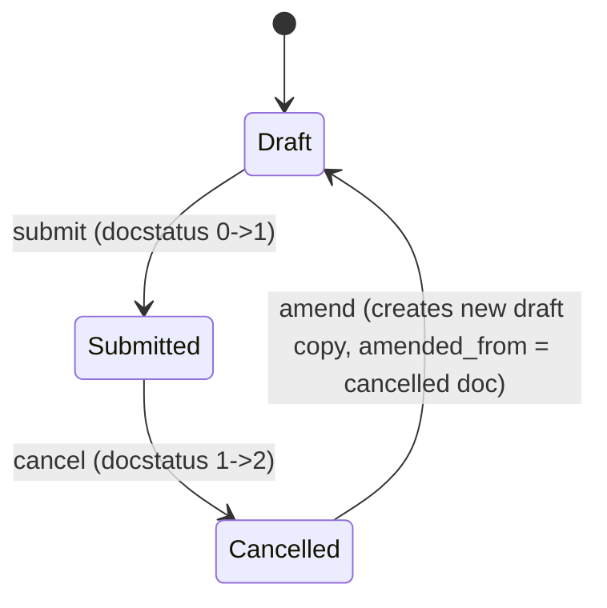

# Travel Request

**Source:** `hrms/hr/doctype/travel_request/travel_request.json`, `travel_request.py`, `travel_request.js`
**Submittable:** yes   **Tree:** no   **Naming:** `autoname: "HR-TRQ-.YYYY.-.#####"` (`naming_rule: "Expression (old style)"`) — series `HR-TRQ-<4-digit-year>-<5-digit-zero-padded-counter>`, e.g. `HR-TRQ-2026-00001`, year segment resolved at insert time, counter auto-incremented by the naming series
**Module:** HR

## Schema

`editable_grid: 1`, `is_submittable: 1`, `track_changes: 1`, `search_fields: "employee_name"`, `title_field: employee_name`, `sort_field: creation`, `sort_order: DESC`.

Full field table in JSON `field_order` sequence (Section/Column Break rows noted as group headers, not itemized):

| Field (fieldname) | Label | Type | Options/Link Target | Required | Default | Read-Only | Notes |
|---|---|---|---|---|---|---|---|
| travel_type | Travel Type | Select | `"", "Domestic", "International"` | Yes | — | No | In list view. |
| travel_funding | Travel Funding | Select | `"", "Require Full Funding", "Fully Sponsored", "Partially Sponsored, Require Partial Funding"` | No | — | No | — |
| travel_proof | Copy of Invitation/Announcement | Attach | — | No | — | No | File attachment. |
| *(column_break_2)* | — | Column Break | — | — | — | — | Layout only. |
| purpose_of_travel | Purpose of Travel | Link | [[Purpose of Travel]] | Yes | — | No | In list view. |
| details_of_sponsor | Details of Sponsor (Name, Location) | Data | — | No | — | No | — |
| *(section_break_4 — "Description", collapsible)* | — | Section Break | — | — | — | — | Groups: description. |
| description | Any other details | Small Text | — | No | — | No | — |
| *(employee_details — "Employee Details", collapsible)* | — | Section Break | — | — | — | — | Groups: employee, employee_name, cell_number, prefered_email, date_of_birth, personal_id_type, personal_id_number, passport_number. |
| employee | Employee | Link | [[Employee Core Model|Employee]] | Yes | — | No | In list view. |
| employee_name | Employee Name | Data | — | No | — | Yes | `fetch_from: "employee.employee_name"`. |
| cell_number | Contact Number | Data | — | No | — | No | `fetch_from: "employee.cell_number"` (not marked read-only, so user can override the fetched value). |
| prefered_email | Contact Email | Data | — | No | — | No | `fetch_from: "employee.prefered_email"` (not marked read-only). |
| *(column_break_7)* | — | Column Break | — | — | — | — | Layout only. |
| date_of_birth | Date of Birth | Date | — | No | — | Yes | `fetch_from: "employee.date_of_birth"`. |
| personal_id_type | Identification Document Type | Link | [[Identification Document Type]] | No | — | No | — |
| personal_id_number | Identification Document Number | Data | — | No | — | No | — |
| passport_number | Passport Number | Data | — | No | — | No | `fetch_from: "employee.passport_number"` (not marked read-only). |
| *(travel_itinerary — "Travel Itinerary" section)* | — | Section Break | — | — | — | — | Groups: itinerary. |
| itinerary | — | Table | [[Travel Itinerary]] | No | — | No | See `Travel Itinerary.md`. |
| *(costing_details — "Costing Details" section)* | — | Section Break | — | — | — | — | Groups: cost_center, costings. |
| cost_center | Cost Center | Link | Cost Center | No | — | No | — |
| costings | Costing | Table | [[Travel Request Costing]] | No | — | No | See `Travel Request Costing.md`. |
| *(event_details — "Event Details" section, collapsible)* | — | Section Break | — | — | — | — | Groups: name_of_organizer, address_of_organizer, other_details. |
| name_of_organizer | Name of Organizer | Data | — | No | — | No | — |
| address_of_organizer | Address of Organizer | Data | — | No | — | No | — |
| other_details | Other Details | Text | — | No | — | No | — |
| amended_from | Amended From | Link | [[Travel Request]] | No | — | Yes | `no_copy: 1`, `print_hide: 1`. Standard amendment-chain pointer. |
| *(accounting_dimensions_section — "Accounting Dimensions", collapsible)* | — | Section Break | — | — | — | — | Groups: company (via dimension_col_break). |
| *(dimension_col_break)* | — | Column Break | — | — | — | — | Layout only. |
| company | Company | Link | Company | No | — | Yes | `fetch_from: "employee.company"`. |

## Child Tables

- `itinerary` (Table, options `Travel Itinerary`) — see `Travel Itinerary.md` for full schema.
- `costings` (Table, options `Travel Request Costing`) — see `Travel Request Costing.md` for full schema.

## State Machine

Submittable doctype; standard docstatus transitions (see [[Submittable Document Lifecycle]]).

Plain list of transitions:
| From State | Event | To State | Guard Condition |
|---|---|---|---|
| Draft (docstatus=0) | Submit | Submitted (docstatus=1) | `validate()` must pass — see Validation Rules. No custom `before_submit`/`on_submit` logic exists on this doctype (controller defines only `validate`). |
| Submitted (docstatus=1) | Cancel | Cancelled (docstatus=2) | No custom `on_cancel` logic exists — standard framework cancel only. |
| Cancelled (docstatus=2) | Amend | new Draft (docstatus=0) | Standard Frappe amend flow; new document's `amended_from` set to the cancelled document's name. |

There is no custom `status`/`workflow_state` field on this doctype — only the standard `docstatus` (0/1/2) state.

## Validation Rules (exact, in execution order)

The controller's only method is `validate()`:

1. `validate_active_employee(self.employee)` — calls the shared utility (`hrms/hr/utils.py`). Condition and exact message:
   - IF `self.employee` resolves to an Employee whose `status == "Inactive"` THEN `frappe.throw(_("Transactions cannot be created for an Inactive Employee {0}.").format(get_link_to_form("Employee", employee)), InactiveEmployeeStatusError)`.
   - (If `employee` is falsy, the check is skipped — `frappe.db.get_value` is only evaluated `if employee`.)

No other validation exists on `Travel Request` itself. There is no `before_submit`, `on_submit`, `on_cancel`, `on_update`, or `autoname` override on the controller — naming is handled entirely by the `HR-TRQ-.YYYY.-.#####` series expression.

## Business Logic / Calculations

None. `Travel Request` performs no totals/calculations itself — `Travel Request Costing` child rows carry `sponsored_amount`, `funded_amount`, `total_amount` per expense line, but there is no parent-level rollup/sum field on `Travel Request`, and no controller code computes one (see `Travel Request Costing.md` — its own controller is also a no-op `pass`). **Port Note:** if a rollup total is expected downstream, it does not exist in source and must not be invented.

## Lifecycle Hooks (exact)

| Event | What Runs | Side Effects on Other Doctypes |
|---|---|---|
| validate | `validate_active_employee(self.employee)` | None (read-only check against Employee; no writes). |
| before_insert / after_insert / before_submit / on_submit / on_cancel / on_trash | *(none defined)* | — |

No entries for `Travel Request`, `Travel Itinerary`, or `Travel Request Costing` exist in `hrms/hooks.py` `doc_events`.

## Whitelisted / API Methods

None defined on this doctype's controller or module file.

## Permissions

| Role | Read | Write | Create | Delete | Submit | Cancel | Amend | Report | Export | Notes |
|---|---|---|---|---|---|---|---|---|---|---|
| System Manager | Yes | Yes | Yes | Yes | Yes (implicit — see note) | Yes (implicit) | Yes (implicit) | Yes | Yes | `email: 1`, `share: 1`, `print: 1` also set. This is the **only** permission row in source. |

**Note on Submit/Cancel/Amend:** the JSON permission row does not include explicit `submit`, `cancel`, or `amend` keys (they are absent, not `0`). For a submittable doctype in Frappe, a role with `write: 1` but no explicit `submit` right generally still cannot submit unless `submit: 1` is set — however, since no `submit`/`cancel`/`amend` keys appear at all in this permission dict, treat this as **absent/false** for those specific rights unless the target framework's default differs. This is called out explicitly because the source JSON is genuinely ambiguous (no additional permission row grants submit rights either) — see Port Notes.

## Scheduled Jobs Touching This Doctype

None found in `hrms/hooks.py`.

## Related Doctypes

- [[Purpose of Travel]] — via `purpose_of_travel`: In list view.
- [[Employee Core Model|Employee]] — via `employee`: In list view.
- [[Identification Document Type]] — via `personal_id_type`: linked via `personal_id_type`.
- [[Travel Itinerary]] — via `itinerary`: See `Travel Itinerary.md`.
- [[Travel Request Costing]] — via `costings`: See `Travel Request Costing.md`.

## Port Notes

- **Only one permission role (`System Manager`) is defined**, and it does not explicitly list `submit`/`cancel`/`amend` flags in the JSON. Since `Travel Request` is submittable, a re-implementer must decide how to interpret the missing submit/cancel/amend keys against their own permission-engine defaults; this spec does not invent an answer — flagged as ambiguous per the ground rules. In practice, Frappe defaults an omitted permission flag to `0`/false, meaning **no role in source can submit this doctype without additional Property Setters/customizations not captured here**. Confirm against a live instance/customizations before assuming this is intentional.
- **Fetched fields that are NOT read-only** (`cell_number`, `prefered_email`, `passport_number`) despite having `fetch_from` — Frappe auto-populates these once when the source Employee is selected/changes, but because they lack `read_only: 1`, users can subsequently edit them and the edited value is preserved (fetch does not re-overwrite on every save, only in response to the triggering field's change in the client). A port must replicate this "populate-once, then editable" semantic rather than treating all `fetch_from` fields as always-recomputed.
- **No rollup total field** on Travel Request despite having a costing child table — see Business Logic section. Do not invent a `total_cost` field.
- Client script (`travel_request.js`) is a no-op empty `refresh` handler — no business logic to port from JS.
- **Frappe framework behaviors relied on implicitly**: naming-series auto-increment and year-segment resolution for `HR-TRQ-.YYYY.-.#####` (must be built explicitly — a per-year, zero-padded, atomic counter); `track_changes: 1` automatic version/audit trail; standard submit/cancel/amend docstatus lifecycle (0/1/2) and the `amended_from` back-reference convention; `title_field`/`search_fields` are UI-only (desk list search) and imply no server validation.
