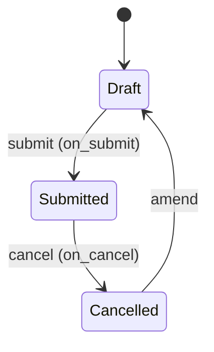

# Compensatory Leave Request

**Source:** `hrms/hr/doctype/compensatory_leave_request/compensatory_leave_request.json`, `compensatory_leave_request.py`, `compensatory_leave_request.js`
**[[Submittable Document Lifecycle|Submittable]]:** yes   **Tree:** no   **[[Naming and Autoname Rules|Naming]]:** `autoname: "HR-CMP-.YY.-.MM.-.#####"` (auto-increment counter per year+month, e.g. `HR-CMP-26-09-00001`)
**Module:** HR

## Schema

| Field (fieldname) | Label | Type | Options/Link Target | Required | Default | Read-Only | Notes |
|---|---|---|---|---|---|---|---|
| employee | Employee | Link | [[Employee Core Model\|Employee]] | yes | - | - | in_list_view |
| employee_name | Employee Name | Data | - | - | - | yes | `fetch_from: employee.employee_name` |
| department | Department | Link | Department | - | - | yes | `fetch_from: employee.department` |
| *(Column Break)* | | | | | | | |
| leave_type | Leave Type | Link | [[Leave Type]] | - | - | - | client-side query restricted to `is_compensatory=true`; server requires it non-empty via explicit throw (not `reqd` in schema — see Validation) |
| leave_allocation | Leave Allocation | Link | [[Leave Allocation]] | - | - | yes | set server-side in `on_submit` via `db_set` |
| *(Section Break: "Worked On Holiday")* | | | | | | | |
| work_from_date | Work From Date | Date | - | yes | - | - | |
| work_end_date | Work End Date | Date | - | yes | - | - | |
| half_day | Half Day | Check | - | - | 0 | - | |
| half_day_date | Half Day Date | Date | - | - | - | - | `depends_on: half_day`; client-side sets `reqd` dynamically when `half_day` checked |
| *(Column Break)* | | | | | | | |
| reason | Reason | Small Text | - | yes | - | - | |
| amended_from | Amended From | Link | [[Compensatory Leave Request]] | - | - | yes | standard amendment field |

## Child Tables

None.

## State Machine



Plain list:
- (Draft, submit, Submitted, guard: `validate()` chain passes; `on_submit` creates or updates a `Leave Allocation` and may throw `No Leave Period Found` if no active leave period covers the compensatory-leave-eligible date)
- (Submitted, cancel, Cancelled, guard: none besides standard permission checks; `on_cancel` reverses the leave-allocation effect)
- (Cancelled, amend, Draft [new doc], guard: standard Frappe amend flow)

No separate `status`/`workflow_state` field — only `docstatus`.

## Validation Rules (exact, in execution order)

`validate()`, in order:
1. `validate_active_employee(self.employee)` (utility, `hrms/hr/utils.py`) -> IF `Employee.status == "Inactive"` THEN `frappe.throw(_("Transactions cannot be created for an Inactive Employee {0}.").format(get_link_to_form("Employee", employee)), InactiveEmployeeStatusError)`.
2. `validate_dates(self, work_from_date, work_end_date)` (utility, default `restrict_future_dates=True`) -> in order:
   2a. IF `work_from_date > work_end_date` THEN `frappe.throw(_("To date can not be less than from date"))`.
   2b. ELIF `work_from_date > today` (and `restrict_future_dates` true) THEN `frappe.throw(_("Future dates not allowed"))`.
   2c. ELIF `Employee.date_of_joining` set AND `work_from_date < date_of_joining` THEN `frappe.throw(_("From date can not be less than employee's joining date"))`.
   2d. ELIF `Employee.relieving_date` set AND `work_end_date > relieving_date` THEN `frappe.throw(_("To date can not greater than employee's relieving date"))`.
3. IF `self.half_day`:
   3a. IF NOT `half_day_date` THEN `frappe.throw(_("Half Day Date is mandatory"))`.
   3b. ELIF NOT (`work_from_date <= half_day_date <= work_end_date`) THEN `frappe.throw(_("Half Day Date should be in between Work From Date and Work End Date"))`.
4. `validate_overlap(self, work_from_date, work_end_date)` (utility) -> for doctype `Compensatory Leave Request`, checks other rows (`docstatus < 2`, i.e. draft or submitted, excluding self) for the same `employee` whose `work_from_date`/`work_end_date` range overlaps (`work_from_date BETWEEN ... OR work_end_date BETWEEN ... OR (work_from_date < from AND work_end_date > to)`). IF found THEN `throw_overlap_error` -> `frappe.throw(_("A {0} exists between {1} and {2} (").format(doctype, formatdate(from_date), formatdate(to_date)) + '<b><a href="/app/Form/{doctype}/{overlap_doc}">{overlap_doc}</a></b>' + _(") for {0}").format(employee))`.
5. `validate_holidays()`:
   5a. `holidays = get_holiday_dates_for_employee(employee, work_from_date, work_end_date)` — list of holiday dates from the employee's holiday list within the range.
   5b. IF `len(holidays) < date_diff(work_end_date, work_from_date) + 1` (i.e. not every day in the requested range is a holiday) THEN: IF the range spans more than one day (`date_diff(work_end_date, work_from_date)` truthy) THEN `msg = _("The days between {0} to {1} are not valid holidays.").format(bold(format_date(work_from_date)), bold(format_date(work_end_date)))` ELSE (single day) `msg = _("{0} is not a holiday.").format(bold(format_date(work_from_date)))`; then `frappe.throw(msg)`.
6. `validate_attendance()`:
   6a. `attendance_records = frappe.get_all("Attendance", filters=[attendance_date between work_from_date/work_end_date, status in (Present, Work From Home, Half Day), docstatus=1, employee=self.employee], fields=[attendance_date, status])`.
   6b. `half_days = [attendance_date for record in attendance_records if record.status == "Half Day"]`.
   6c. IF `half_days` non-empty AND (`not self.half_day` OR `getdate(half_day_date) not in half_days`) THEN `frappe.throw(_("You were only present for Half Day on {}. Cannot apply for a full day compensatory leave").format(", ".join(bold(format_date(d)) for d in half_days)))`.
   6d. IF `len(attendance_records) < date_diff(work_end_date, work_from_date) + 1` (i.e. attendance is missing for at least one day in range) THEN `frappe.throw(_("You are not present all day(s) between compensatory leave request days"))`.
7. IF NOT `self.leave_type` THEN `frappe.throw(_("Leave Type is mandatory"))`.

**Note on execution order**: in source, `validate_holidays()` (step 5) is called BEFORE `validate_attendance()` (step 6) inside `validate()`, and the leave_type-required check (step 7) is called LAST, after both. Preserve this exact order in a port since a request that fails multiple checks will surface only the first one encountered.

## Business Logic / Calculations

### `on_submit()`
```
1. company = Employee.company for self.employee
2. date_difference = date_diff(work_end_date, work_from_date) + 1
3. IF self.half_day: date_difference -= 0.5
4. comp_leave_valid_from = add_days(work_end_date, 1)
   (the compensatory leave becomes usable starting the day AFTER the last worked-holiday day)
5. leave_period = get_leave_period(comp_leave_valid_from, comp_leave_valid_from, company)
   (finds an active Leave Period for `company` whose range covers comp_leave_valid_from)
6. IF leave_period (found):
   6a. leave_allocation = get_existing_allocation(comp_leave_valid_from)
       -> looks up a submitted Leave Allocation for (employee, leave_type) where
          from_date <= comp_leave_valid_from <= to_date, limit 1; returns the full doc or None.
   6b. IF leave_allocation found (existing allocation to extend):
       i.   leave_allocation.new_leaves_allocated += date_difference   (in-memory increment)
       ii.  leave_allocation.validate()   (re-runs full Leave Allocation validate chain in-memory,
            recomputing total_leaves_allocated via set_total_leaves_allocated internally — this
            does NOT persist via save(), it only mutates the in-memory doc and can raise any of
            Leave Allocation's own validation throws, e.g. OverAllocationError)
       iii. leave_allocation.db_set("new_leaves_allocated", leave_allocation.total_leaves_allocated)
            (Port Note: this sets new_leaves_allocated equal to the recomputed total_leaves_allocated,
             NOT to the incremented new_leaves_allocated value itself — see Port Notes below, this
             looks like it may conflate the two fields.)
       iv.  leave_allocation.db_set("total_leaves_allocated", leave_allocation.total_leaves_allocated)
       v.   create_additional_leave_ledger_entry(leave_allocation, date_difference, comp_leave_valid_from)
            (creates+submits a Leave Ledger Entry of leaves=date_difference, from_date=to_date=
             comp_leave_valid_from, is_carry_forward=0 — see Leave Allocation.md for the utility's
             exact mechanics)
   6c. ELSE (no existing allocation — create a new one):
       leave_allocation = create_leave_allocation(leave_period, date_difference)
       -> is_carry_forward = cint(Leave Type.is_carry_forward) for self.leave_type
       -> new Leave Allocation doc: employee, employee_name, leave_type, from_date=comp_leave_valid_from,
          to_date=leave_period[0].to_date, carry_forward=is_carry_forward,
          new_leaves_allocated=date_difference, total_leaves_allocated=date_difference,
          description=self.reason
       -> allocation.insert(ignore_permissions=True); allocation.submit()
       -> returns the new allocation doc (this submit triggers the full Leave Allocation
          on_submit chain, including its own ledger entry creation for new_leaves_allocated —
          i.e. this path creates ONE ledger entry via the new allocation's own on_submit, whereas
          the "existing allocation" path (6b) creates a SEPARATE additional ledger entry on top
          of an allocation that is not being freshly submitted)
   6d. self.db_set("leave_allocation", leave_allocation.name)
7. ELSE (no leave period covers comp_leave_valid_from):
   comp_leave_valid_from_display = bold(format_date(comp_leave_valid_from))
   msg = _("This compensatory leave will be applicable from {0}.").format(comp_leave_valid_from_display)
       + " " + _("Currently, there is no {0} leave period for this date to create/update leave allocation.").format(bold(_("active")))
       + "<br><br>" + _("Please create a new {0} for the date {1} first.").format(
           '<a href="/app/leave-period">Leave Period</a>', comp_leave_valid_from_display)
   frappe.throw(msg, title=_("No Leave Period Found"))
```

### `on_cancel()`
```
1. IF self.leave_allocation (was set on submit):
   1a. date_difference = date_diff(work_end_date, work_from_date) + 1
   1b. IF self.half_day: date_difference -= 0.5
   1c. leave_allocation = frappe.get_doc("Leave Allocation", self.leave_allocation)
   1d. IF leave_allocation (exists — always true given step 1c would raise otherwise):
       i.   leave_allocation.new_leaves_allocated -= date_difference
       ii.  IF leave_allocation.new_leaves_allocated < 0: leave_allocation.new_leaves_allocated = 0
            (clamp — never goes negative)
       iii. leave_allocation.validate()   (in-memory re-validate, same caveat as on_submit)
       iv.  leave_allocation.db_set("new_leaves_allocated", leave_allocation.total_leaves_allocated)
       v.   leave_allocation.db_set("total_leaves_allocated", leave_allocation.total_leaves_allocated)
       vi.  create_additional_leave_ledger_entry(leave_allocation, date_difference * -1, add_days(work_end_date, 1))
            (reverses the leave grant with a negative ledger entry dated at the original
             comp_leave_valid_from = add_days(work_end_date, 1))
```
Note: `on_cancel` does NOT clear `self.leave_allocation` back to null, and does not distinguish between the "existing allocation extended" vs "new allocation created" cases from `on_submit` — it always treats the linked allocation as one whose `new_leaves_allocated` should be decremented by the same `date_difference`, regardless of which path created it. If the allocation was newly created in `on_submit` (case 6c), cancelling this request reduces (but does not delete/cancel) that Leave Allocation record — it is left behind with `new_leaves_allocated` clamped to 0 rather than being cancelled itself.

## [[Cross-Doctype Hooks (doc_events)|Lifecycle Hooks]] (exact)

| Event | What Runs | Side Effects on Other Doctypes |
|---|---|---|
| validate | steps 1-7 above | Reads `Employee`, `Compensatory Leave Request` (overlap), `Holiday`/holiday list, `Attendance` |
| on_submit | see algorithm above | Creates or in-place-updates a `Leave Allocation` (via `db_set`, bypassing its `on_update_after_submit` docstatus-aware path since these are direct field writes on a doc instance, followed by a manual ledger entry) or creates+submits a brand-new `Leave Allocation`; sets `self.leave_allocation` via `db_set` |
| on_cancel | see algorithm above | Decrements (clamped at 0) the linked `Leave Allocation.new_leaves_allocated`/`total_leaves_allocated` via `db_set`; creates a reversing `Leave Ledger Entry` |

## Whitelisted / API Methods

None — no `@frappe.whitelist()` methods defined on this doctype's controller or module file.

## Permissions

| Role | Read | Write | Create | Delete | Submit | Cancel | Amend | Report | Export | Notes |
|---|---|---|---|---|---|---|---|---|---|---|
| System Manager | yes | yes | yes | yes | - | - | - | yes | yes | no submit/cancel rights; email, print, share all 1 |
| HR Manager | yes | yes | yes | yes | yes | yes | - | yes | yes | email, print, share all 1; no amend key present |
| HR User | yes | yes | yes | yes | yes | yes | - | yes | yes | email, print, share all 1; no amend key present |
| Employee | yes | yes | yes | yes | - | - | - | yes | yes | no submit/cancel rights; email, print, share all 1 (self-service creation, but cannot submit — likely intended to require HR approval-by-submission workflow, though no `if_owner` restriction is present in the JSON to scope Employee visibility to only their own records — see Port Notes) |

## Scheduled Jobs Touching This Doctype

None found in `hrms/hooks.py` `scheduler_events`.

## Related Doctypes

- [[Employee Core Model]] — the employee who worked the holiday/weekend day; `employee` Link field, also read for active-status/attendance validation.
- [[Leave Type]] — `leave_type` Link field, restricted to compensatory-eligible types.
- [[Leave Allocation]] — `leave_allocation` Link field; created or extended (`new_leaves_allocated` incremented) on approval/submit, decremented on cancel.
- [[Compensatory Leave Request]] — `amended_from` self-referencing Link field, standard Frappe amend-chain pointer.

## Port Notes

- **`leave_type` is NOT `reqd: 1` in the JSON schema** but IS enforced as mandatory via an explicit `frappe.throw` at the end of `validate()` (rule 7). A port must replicate this as an application-level required-field check, not merely a schema-level NOT NULL constraint, if it wants to preserve the exact same error message and to keep the field technically nullable at the DB/schema level as source does (e.g. a draft could theoretically be saved without a `leave_type` and only fail on submit if submission runs validate — but since Frappe runs `validate()` on every save including drafts, this will actually throw on any save, not just submit; confirm target-stack save semantics match).
- **`leave_allocation.validate()` called without `save()`**: both `on_submit` and `on_cancel` call the loaded `Leave Allocation` doc's `.validate()` method directly (to re-run its business rules and recompute `total_leaves_allocated` in-memory) and then persist the result via explicit `db_set()` calls on individual fields, rather than calling `.save()`. This means: (a) `Leave Allocation`'s own `on_update_after_submit` hook is NOT triggered by this flow (that hook only fires via the ORM's `save()`/`submit()` update path, not via bare `.validate()` + `db_set()`), and (b) no `Leave Ledger Entry` delta is created by `Leave Allocation` itself for this change — the delta ledger entry is instead created explicitly by `Compensatory Leave Request` via `create_additional_leave_ledger_entry`. A port must replicate this exact "validate in memory, write specific columns directly, and independently create the ledger entry" pattern rather than treating it as a generic "update the allocation and let its own hooks fire" operation — using the latter would double-count ledger entries or trigger unwanted downstream validation errors (e.g. the earned-leave "cannot update after submission" check).
- **Possible source inconsistency to flag, not silently fix**: in both `on_submit` and `on_cancel`, `leave_allocation.db_set("new_leaves_allocated", leave_allocation.total_leaves_allocated)` sets `new_leaves_allocated` to the value of `total_leaves_allocated` (not to the just-incremented/decremented `new_leaves_allocated` value computed a few lines earlier). Since at the point of this call (after `.validate()` ran `set_total_leaves_allocated()`), `total_leaves_allocated = unused_leaves + new_leaves_allocated`, this only leaves `new_leaves_allocated` unchanged if `unused_leaves == 0` for that allocation; if the allocation has any carried-forward `unused_leaves`, this line would inflate `new_leaves_allocated` by that carried-forward amount every time a compensatory request is submitted/cancelled against it. Reproduce this behavior exactly as written (do not silently correct it) and flag it to the target team as a likely latent bug in the source.
- **No `if_owner` restriction for the Employee role**: despite Employee having create/write/read rights, the permissions JSON contains no `if_owner: 1` restriction, meaning (at the DocType-permission level) an Employee-role user could, in principle, read/write any `Compensatory Leave Request` record, not just their own, unless restricted elsewhere (e.g. via a Employee-Self-Service permission query condition hook not visible in this doctype's own JSON). Flag for verification against `hrms/overrides` or user-permission configuration if replicating exact visibility scoping.
- **Naming**: `HR-CMP-.YY.-.MM.-.#####` embeds both 2-digit year and 2-digit month plus a 5-digit sequence — the counter likely resets monthly (Frappe naming series semantics: each unique prefix combination, including the month token, gets its own counter). A port must replicate month-scoped (not just year-scoped) auto-increment if exact name reproducibility matters.
- **`track_changes: 1`** is set — see general audit-trail note in `Leave Allocation.md` Port Notes; applies identically here.
- **Client-side only logic**: `compensatory_leave_request.js`'s `half_day` handler toggles `half_day_date`'s `reqd` UI property dynamically — the server enforces the equivalent mandatoriness via the explicit throw in `validate()` step 3a, so this is UI-only convenience already covered server-side; no gap here. The `leave_type` link-field query filter (`is_compensatory: true`) is UI-only — the server does NOT independently verify that the chosen `leave_type` has `is_compensatory` set; a port should add that server-side check explicitly if it's expected business behavior, since no such check was found in the traced Python source (flagging as a probable gap rather than inventing the validation).
