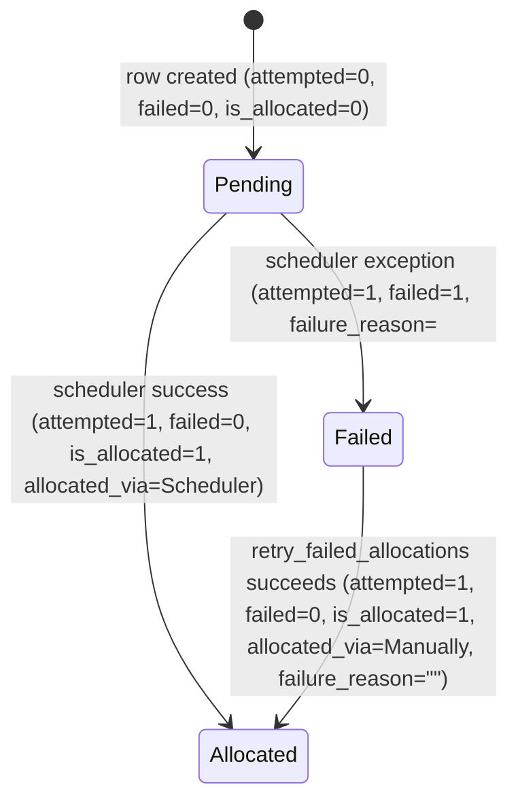

# Earned Leave Schedule

**Source:** `hrms/hr/doctype/earned_leave_schedule/earned_leave_schedule.json`, `earned_leave_schedule.py`
**Submittable:** no (child/table doctype — `istable: 1`)   **Tree:** no   **Naming:** none (child table rows are keyed by Frappe's implicit `parent`/`parentfield`/`idx` row-id mechanism; `allow_rename: 1` is a table-level flag with no effect on child rows)
**Module:** HR

This is a **child table doctype** (`istable: 1`), embedded only via `Leave Allocation.earned_leave_schedule` (Table field). It has no permissions of its own, no controller logic beyond the auto-generated type stub (`pass` — no custom methods), and is only ever created/mutated by:
- `Leave Policy Assignment`'s schedule-building logic (pre-populates rows when an earned-leave policy assignment is created — out of scope, owned by another module's spec, but this table is the target).
- `hrms.hr.utils.allocate_earned_leaves()` (the daily scheduler job) — reads/updates rows.
- `Leave Allocation.retry_failed_allocations()` — updates rows directly via `frappe.qb`.
- `hrms.hr.utils.log_allocation_error()` — updates rows on failure.

## Schema

| Field (fieldname) | Label | Type | Options/Link Target | Required | Default | Read-Only | Notes |
|---|---|---|---|---|---|---|---|
| allocation_date | Allocation Date | Date | - | - | - | yes | in_list_view; the calendar date on which this scheduled tranche of earned leave is due to be allocated |
| number_of_leaves | Number of Leaves | Float | - | - | - | yes | in_list_view; planned (pre-allocation) leave count; overwritten with the actual granted amount once allocated (see Business Logic) |
| *(Column Break)* | | | | | | | |
| *(Column Break)* | | | | | | | |
| failure_reason | Failure Reason | Small Text | - | - | - | yes | set when a scheduled allocation attempt fails |
| allocated_via | Allocated Via | Select | `\nScheduler\nLeave Policy Assignment\nManually` | - | - | yes | in_list_view, in_preview; records how the row was actually allocated |
| *(Section Break)* | | | | | | | |
| is_allocated | Is Allocated | Check | - | - | 0 | yes | in_list_view; 1 once the leaves for this row have been granted |
| attempted | Attempted | Check | - | - | 0 | yes | hidden; 1 once the scheduler has processed (attempted) this row, success or failure |
| failed | Failed | Check | - | - | 0 | yes | hidden; 1 if the attempt failed |

(Field order in JSON: `column_break_dmml`, `allocation_date`, `number_of_leaves`, `attempted`, `failed`, `column_break_pzdq`, `is_allocated`, `allocated_via`, `section_break_amtg`, `failure_reason` — table above is reordered by logical grouping per spec instructions; JSON field_order is authoritative for UI layout.)

## Child Tables

N/A — this doctype is itself a child table with no nested Table fields.

## State Machine

No `docstatus`/submittable lifecycle (child table rows inherit their parent `Leave Allocation`'s docstatus implicitly — there is no independent submit/cancel for a row). Effective row states are driven purely by the three Check fields:

Plain list:
- (Pending, scheduler runs and `update_previous_leave_allocation` succeeds, Allocated, guard: `allocation_date == today`, earned-leave-type quota checks pass)
- (Pending, scheduler runs and `update_previous_leave_allocation` raises, Failed, guard: `OverAllocationError` from annual-allocation or max-leaves-allowed check)
- (Failed, `Leave Allocation.retry_failed_allocations()` called by a user with write permission, Allocated, guard: retry-time quota checks pass — see `Leave Allocation.md` Validation #13-15)

## Validation Rules (exact, in execution order)

None — the controller class body is `pass`; no `validate()` override exists on this doctype. All correctness constraints live in the parent `Leave Allocation` controller and in `hrms/hr/utils.py` (see `Leave Allocation.md`).

## Business Logic / Calculations

This doctype has no calculations of its own; it is the ledger/status table for the `allocate_earned_leaves()` scheduled algorithm. **The full numbered pseudocode for that algorithm (including `update_previous_leave_allocation`, `get_monthly_earned_leave`, `calculate_pro_rated_leaves`, `get_expected_allocation_date_for_period`, and the semester/half-year helpers) is reproduced in full in `Leave Allocation.md` under "Business Logic / Calculations -> Algorithm: allocate_earned_leaves()"** — not duplicated here to avoid drift between the two files. Read that section for the complete mechanism; this file documents only the direct effects on THIS table's rows:

1. **Row creation**: rows are inserted (with `allocation_date`, planned `number_of_leaves`, all Check fields defaulting to 0) by the `Leave Policy Assignment` schedule-building logic at assignment-creation time — one row per expected future allocation tranche (e.g. 12 monthly rows for a Monthly-frequency earned leave type across a 1-year policy).
2. **On scheduler success** (`update_previous_leave_allocation`, step 10 of `allocate_earned_leaves`): direct SQL `UPDATE Earned Leave Schedule SET is_allocated=1, attempted=1, allocated_via='Scheduler', number_of_leaves=<actual earned_leaves after quota clamping> WHERE parent=<allocation_name> AND allocation_date=<today>`.
3. **On scheduler failure** (`log_allocation_error`): direct SQL `UPDATE Earned Leave Schedule SET attempted=1, failed=1, failure_reason=<'<error_log_name>. Check error log for more details.'> WHERE parent=<allocation_name> AND allocation_date=<today>`.
4. **On manual retry** (`Leave Allocation.retry_failed_allocations`): direct SQL `UPDATE Earned Leave Schedule SET is_allocated=1, attempted=1, allocated_via='Manually', failed=0, failure_reason='' WHERE parent=<allocation_name> AND allocation_date=<allocation_date> AND attempted=1 AND failed=1`.

All three updates are **raw `frappe.qb` UPDATE statements against the child table**, bypassing the parent `Leave Allocation` document's save/validate cycle entirely (no `parent.save()` call accompanies them) — a port must support updating child-table rows independent of their parent aggregate root.

## Lifecycle Hooks (exact)

| Event | What Runs | Side Effects on Other Doctypes |
|---|---|---|
| (none — no controller overrides) | n/a | n/a |

Row lifecycle is entirely externally driven (see Business Logic above): populated by Leave Policy Assignment, mutated by the daily `allocate_earned_leaves` scheduler job and by `Leave Allocation.retry_failed_allocations`.

## Whitelisted / API Methods

None defined on this doctype's controller.

## Permissions

`"permissions": []` in the JSON — this doctype defines no permission rows of its own. As a child table, access is governed entirely by the parent `Leave Allocation` doctype's permissions (see `Leave Allocation.md` Permissions section); there is no independent ACL for `Earned Leave Schedule` rows.

## [[Background Jobs (Scheduler Events)|Scheduled Jobs]] Touching This Doctype

| Job (hooks.py bucket) | Frequency | Function | Effect |
|---|---|---|---|
| `daily_long` | daily | `hrms.hr.utils.allocate_earned_leaves` | Reads pending rows (`attempted=0`, `allocation_date=today`) to determine what to allocate; writes `is_allocated`/`attempted`/`allocated_via`/`number_of_leaves` on success, or `attempted`/`failed`/`failure_reason` on failure via `log_allocation_error`. |

## Related Doctypes

- [[Leave Allocation]] — parent doctype; this table is embedded via its `earned_leave_schedule` Table field.
- [[Leave Policy Assignment]] — pre-populates the schedule rows at assignment-creation time.

## Port Notes

- **No independent primary key beyond Frappe's row `name`**: Frappe auto-generates a `name` (hash) for every child table row along with `parent`, `parentfield`, `parenttype`, and `idx` (sequence position within the parent) — these four fields (`parent`, `parentfield`, `parenttype`, `idx`) appear in the auto-generated type stub but not in the visible `fields` JSON array since they are framework-managed. A port's relational schema needs an explicit foreign key to `leave_allocation.id` (or equivalent) plus a `sort_order`/`idx` column to preserve row ordering, since ordering is significant for UI display (rows are read/written keyed by `allocation_date`, not `idx`, but display order should be preserved).
- **Read-only fields with no server-side enforcement of read-only-ness for direct SQL writes**: all fields are marked `read_only: 1` at the UI-field-definition level (meaning a user cannot type into them in the desk form), but this is purely a client/form-rendering property in Frappe — it does not block the `frappe.qb` UPDATE statements documented above, nor would it block any other direct DB write. A port should treat `read_only` here as "not user-editable via the parent form UI" only, not as a database-level immutability constraint.
- **`allocated_via` Select options include a blank first option** (`"\nScheduler\nLeave Policy Assignment\nManually"`) — the leading empty string is Frappe's convention for "no selection made yet" in a Select field; a port should allow NULL/empty as a valid initial state distinct from the three named values.
- Because this doctype has no controller-level validation, ALL business-rule constraints that touch these rows are enforced in the parent `Leave Allocation` controller and in `hrms/hr/utils.py`. A reimplementation must not skip validation just because this table's own model class is trivial — the invariants live one level up.
