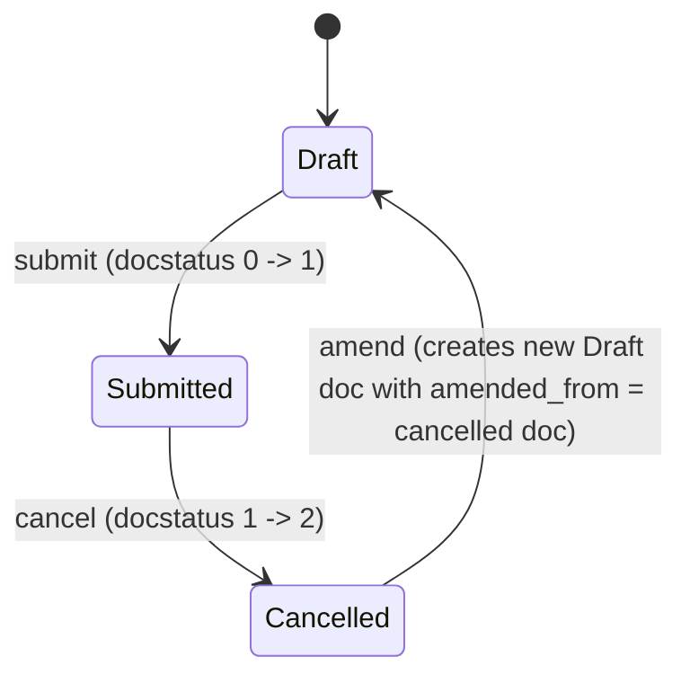

# Holiday List Assignment

**Source:** `hrms/hr/doctype/holiday_list_assignment/holiday_list_assignment.json`, `holiday_list_assignment.py`, `holiday_list_assignment.js`
**[[Submittable Document Lifecycle|Submittable]]:** yes   **Tree:** no   **[[Naming and Autoname Rules|Naming]]:** `naming_series:` on field `naming_series`, series pattern `HR-HLA-.YYYY.-` (e.g. `HR-HLA-2026-00001`, auto-incrementing per year)
**Module:** HR

## Schema

| Field (fieldname) | Label | Type | Options/Link Target | Required | Default | Read-Only | Notes |
|---|---|---|---|---|---|---|---|
| *(Section Break)* `section_break_wnwa` | — | Section Break | — | — | — | — | Layout only, skipped |
| `amended_from` | Amended From | Link | [[Holiday List Assignment]] | No | — | Yes | `no_copy: 1`, `print_hide: 1`, `search_index: 1` — standard Frappe amend-chain pointer, set automatically when a cancelled submitted doc is amended |
| `holiday_list` | Holiday List | Link | Holiday List (external/core doctype, not in this repo — see Port Notes) | Yes | — | No | `in_list_view: 1` |
| `naming_series` | Naming Series | Select | `HR-HLA-.YYYY.-` (single option) | Yes | — | No | `in_list_view: 1`; drives autoname |
| `employee_name` | Employee Name | Data | — | No | — | Yes | `hidden: 1`; `fetch_from: employee.employee_name` — **Note:** the fetch-from source field is literally `employee.employee_name`, but this doctype has no field named `employee`; it is populated instead by client-script logic reading from `assigned_to` when `applicable_for = "Employee"` (see Lifecycle Hooks) — the `fetch_from` declaration itself is effectively dead/inconsistent metadata (flag as Port Note) |
| *(Column Break)* `column_break_lzvp` | — | Column Break | — | — | — | — | Layout only, skipped |
| `assigned_to` | Assigned To | Dynamic Link | Dynamic, resolved via `applicable_for` (i.e. links to `Employee` or `Company` depending on that field's value) | Yes | — | No | `in_list_view: 1`; label is switched client-side to match `applicable_for` (see Lifecycle Hooks) |
| `employee_company` | Employee Company | Link | Company | No | — | Yes | `hidden: 1`; populated client-side from the assigned Employee's `company` when `applicable_for = "Employee"` |
| `applicable_for` | Applicable For | Select | `Employee\nCompany` (two options) | Yes | — | No | Determines what `assigned_to` links to |
| `holiday_list_start` | Holiday List Start | Date | — | No | — | — | `is_virtual: 1` — computed property, not a stored column (see below) |
| `holiday_list_end` | Holiday List End | Date | — | No | — | — | `is_virtual: 1` — computed property, not a stored column (see below) |
| `from_date` | Assignment Starts From | Date | — | Yes | — | No | Must fall within the linked Holiday List's date range (validated server-side) |

## Child Tables

None — no Table fields on this doctype.

## State Machine

Plain list:
- (Draft, submit, Submitted) — guard: standard Frappe submit permission (role has `submit: 1`); `validate()` runs before submit (see Validation Rules) and blocks submission if either check fails.
- (Submitted, cancel, Cancelled) — guard: standard Frappe cancel permission (role has `cancel: 1`); no custom `on_cancel` logic defined in the controller (framework default cancel behavior only).
- (Cancelled, amend, Draft) — guard: standard Frappe amend permission (role has `amend`-equivalent, i.e. can both cancel and create); the framework sets the new document's `amended_from` to the cancelled document's name. No custom `on_update_after_submit`/amend logic in the controller.

There is no separate `status`/`workflow_state` field; state is tracked purely via the standard Frappe `docstatus` (0=Draft, 1=Submitted, 2=Cancelled).

## Validation Rules (exact, in execution order)

Executed inside `validate()`, in this exact order:

1. **`validate_assignment_start_date()`** (called first):
   Fetch `holiday_list_start, holiday_list_end` from `Holiday List` where `name = self.holiday_list` (via `frappe.db.get_value("Holiday List", self.holiday_list, ["from_date", "to_date"])`). Compute `assignment_start_date = getdate(self.from_date)`. IF `assignment_start_date < holiday_list_start` OR `assignment_start_date > holiday_list_end` THEN `frappe.throw(_("Assignment start date cannot be outside holiday list dates"))` (source: `validate_assignment_start_date`).
2. **`validate_existing_assignment()`** (called second):
   Check `frappe.db.exists("Holiday List Assignment", {"assigned_to": self.assigned_to, "from_date": self.from_date, "docstatus": 1})` — i.e. does a **submitted** Holiday List Assignment already exist with the same `assigned_to` and the same `from_date`. IF such a record exists THEN `frappe.throw(_("Holiday List Assignment for {0} already exists for date {1}: {2}").format(self.assigned_to, format_date(self.from_date), get_link_to_form("Holiday List Assignment", holiday_list)), DuplicateAssignment, title=_("Duplicate Assignment"))` — where `holiday_list` in this format call is actually the **name of the conflicting existing assignment document** (the variable is misleadingly named `holiday_list` in source but holds the result of `frappe.db.exists`, i.e. the existing assignment's docname) (source: `validate_existing_assignment`). The exception class raised is `DuplicateAssignment`, imported from `hrms.payroll.doctype.salary_structure_assignment.salary_structure_assignment` (shared exception type reused across doctypes — a port should define an equivalent named exception/error code, e.g. `DUPLICATE_ASSIGNMENT`, for API consumers to detect this specific case).

Note the exact message template: `"Holiday List Assignment for {0} already exists for date {1}: {2}"` where `{0}` = `self.assigned_to` (raw value, the linked Employee or Company name/id), `{1}` = the `from_date` formatted via `format_date()` (site-locale date format), `{2}` = a link/reference to the conflicting existing document.

## Business Logic / Calculations

Two virtual (computed, not stored) properties — recomputed on every access, not persisted to the database:

1. **`holiday_list_start`** property: IF `self.holiday_list` is set THEN return `frappe.get_value("Holiday List", self.holiday_list, "from_date")`, ELSE return `None`.
2. **`holiday_list_end`** property: IF `self.holiday_list` is set THEN return `frappe.get_value("Holiday List", self.holiday_list, "to_date")`, ELSE return `None`.

A port should implement these as computed/derived fields at read time (e.g. a SQL join or application-layer lookup against the Holiday List record), NOT as stored columns, since `is_virtual: 1` means Frappe never persists them.

## [[Cross-Doctype Hooks (doc_events)|Lifecycle Hooks]] (exact)

| Event | What Runs | Side Effects on Other Doctypes |
|---|---|---|
| `validate` | `validate_assignment_start_date()` then `validate_existing_assignment()`, in that order (see Validation Rules) | Reads `Holiday List` (for date range) and queries other `Holiday List Assignment` records (for duplicate-submission check); no writes to other doctypes |

No `before_insert`, `after_insert`, `on_update`, `before_submit`, `on_submit`, `on_cancel`, or `on_trash` methods are defined on the controller — only `validate` and the two `@property` virtual-field getters exist.

Client script (`holiday_list_assignment.js`) — UI-only convenience logic, **flagged because it performs data population that must be reproduced server-side or in the client layer of the new stack, since none of it exists in the Python controller**:
- `refresh`: triggers `switch_assigned_to_label`.
- `applicable_for` (on change): triggers `toggle_fields`, then `clear_fields`, then `switch_assigned_to_label`.
- `toggle_fields`: shows/hides `employee_name` and `employee_company` based on whether `applicable_for == "Employee"` (UI-only; not enforced server-side — a port should decide whether to null these fields server-side when `applicable_for = "Company"`, since the Python controller does NOT clear or validate them).
- `clear_fields`: resets `assigned_to`, `employee_name`, `employee_company` to empty whenever `applicable_for` changes (UI-only convenience; not enforced server-side).
- `assigned_to` (on change): IF `applicable_for == "Employee"` AND `assigned_to` has a value, fetches `employee_name` and `company` from the linked `Employee` record and sets `employee_name` and `employee_company` on the form. **This is the actual source of truth for `employee_name`/`employee_company` population — the JSON's `fetch_from: employee.employee_name` metadata on `employee_name` is not actually what populates it in practice, since there is no `employee` fieldname on this doctype.** A server-side port MUST replicate this employee-lookup-on-assign logic explicitly (e.g. in a service/use-case layer), since it is entirely client-side in the source and has no Python equivalent — flagged per the "client-side calculations needing a server equivalent" instruction.
- `holiday_list` (on change): triggers `set_start_and_end_dates`.
- `set_start_and_end_dates`: IF `holiday_list` is set, fetches `from_date`/`to_date` from the linked `Holiday List` and sets the form's `from_date`, `holiday_list_start`, and `holiday_list_end` fields to those values (i.e. **defaults `from_date` to the Holiday List's start date** whenever the Holiday List is chosen/changed — the user can still edit `from_date` afterward, subject to the server-side range validation in Rule 1 above).
- `switch_assigned_to_label`: sets the `assigned_to` field's display label to the current value of `applicable_for` (pure UI polish, no server equivalent needed).

## Whitelisted / API Methods

None. No `@frappe.whitelist()` methods defined on this doctype's controller or in its module file.

## Permissions

| Role | Read | Write | Create | Delete | Submit | Cancel | Amend | Report | Export | Notes (if_owner, permlevel, etc) |
|---|---|---|---|---|---|---|---|---|---|---|
| System Manager | 1 | 1 | 1 | 1 | 1 | 1 | — | 1 | 1 | `email: 1`, `print: 1`, `select: 1`, `share: 1` |
| HR Manager | 1 | 1 | 1 | 1 | 1 | 1 | — | 1 | 1 | `email: 1`, `print: 1`, `select: 1`, `share: 1` |

(Neither role's permission row includes an explicit `amend` key in the JSON — under Frappe's permission model, amend capability is implicitly granted when both `cancel` and `create`/`write` are present, so both roles can amend in practice; documented here as "—" since the JSON has no literal `amend: 1` key, only `cancel: 1` + `create: 1` + `write: 1`.)

## Scheduled Jobs Touching This Doctype

None found in `hrms/hooks.py` scheduler_events referencing `Holiday List Assignment`.

## Related Doctypes

- [[Holiday List Assignment]] — `amended_from` self-referencing Link field, standard Frappe amend-chain pointer.
- [[Employee Core Model]] — one of the two possible targets of the `assigned_to` Dynamic Link (when `applicable_for = "Employee"`); also the source of `employee_name`/`employee_company` on assignment.

## Port Notes

- **External dependency — `Holiday List` doctype is NOT part of this repo** (it is a core ERPNext/Frappe doctype). This doctype's validation (`validate_assignment_start_date`) and virtual fields (`holiday_list_start`, `holiday_list_end`) both depend on querying it for `from_date` and `to_date`. Since the full `Holiday List` schema is out of scope, its expected minimal shape for porting purposes is:
  - `name` (primary key / identifier)
  - `from_date` (Date) — start of the holiday list's applicable date range
  - `to_date` (Date) — end of the holiday list's applicable date range
  - `company` (Link to Company) — the company this holiday calendar applies to
  - a child table of holiday dates, each row minimally: `holiday_date` (Date) and `description`/`holiday_name` (Text) — the actual list of holidays/non-working days
  A port's `Holiday List` table needs at least these columns for `Holiday List Assignment`'s logic (date-range validation, virtual start/end fields) to function; anything else on the real ERPNext `Holiday List` doctype is out of scope here.
- **`assigned_to` is a Dynamic Link** — its target doctype (`Employee` or `Company`) is determined at runtime by the sibling `applicable_for` Select field's value. In a relational port, this typically becomes either two nullable FK columns (`assigned_employee_id`, `assigned_company_id`, exactly one populated depending on `applicable_for`) or a single polymorphic `(assigned_to_type, assigned_to_id)` pair with application-level integrity checks, since a plain SQL FK can't target two different tables conditionally.
- **`employee_name` field's `fetch_from` metadata is misleading/inert** — see Lifecycle Hooks note above. Do not rely on the JSON's `fetch_from: employee.employee_name` when porting; replicate the actual client-side-driven lookup (fetch from `Employee` keyed by `assigned_to` when `applicable_for = "Employee"`) as an explicit application-layer step, and ideally move it server-side (e.g. populate on save) so API clients that skip the UI still get correct data — this is a gap in the source Frappe app, not something to silently "fix" without noting it.
- **No server-side clearing of `assigned_to`/`employee_name`/`employee_company` when `applicable_for` changes** — the source only does this in the client script. A port's server layer should decide explicitly whether to null out the Company-Dynamic-Link fields when switching `applicable_for`, since relying purely on client-side `clear_fields` leaves stale data reachable via direct API calls that bypass the UI.
- **Framework behaviors relied on implicitly:** naming series `HR-HLA-.YYYY.-` auto-increments a per-year counter — a port must implement an equivalent atomic sequence generator scoped by year (e.g. a `naming_series_counters` table keyed by `(series_prefix, year)`). Standard Frappe audit fields (`creation`, `modified`, `modified_by`, `owner`) and `docstatus` are implicit and must be added explicitly as columns. `track_changes` is not set in the JSON (absent, defaults to no version history). `index_web_pages_for_search: 1` and `grid_page_length: 50` are Frappe-UI/search-indexing concerns with no data-model equivalent needed in a port.
- **Gap vs. expectation:** there is no validation preventing `assigned_to` + `holiday_list` combination duplication (only `assigned_to` + `from_date` is checked for duplicates, not also scoped by `holiday_list`) — e.g. the same Employee could theoretically have two different submitted assignments with the same `from_date` pointing at two different Holiday Lists and only the second submission would be blocked (correctly, since the check is `assigned_to` + `from_date` regardless of `holiday_list`). This is worth flagging as intentional-looking but confirm against `Leave Application`/attendance logic that consumes this doctype if such nuance matters to a re-implementer.
