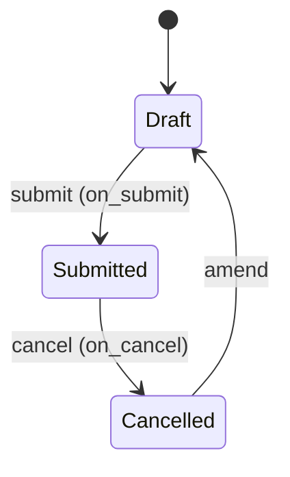

# Leave Adjustment

**Source:** `hrms/hr/doctype/leave_adjustment/leave_adjustment.json`, `leave_adjustment.py`, `leave_adjustment.js`
**[[Submittable Document Lifecycle|Submittable]]:** yes   **Tree:** no   **[[Naming and Autoname Rules|Naming]]:** `naming_series:` -> series `HR-LAD-.YYYY.-`
**Module:** HR

## Schema

| Field (fieldname) | Label | Type | Options/Link Target | Required | Default | Read-Only | Notes |
|---|---|---|---|---|---|---|---|
| *(Section Break)* | | | | | | | |
| amended_from | Amended From | Link | [[Leave Adjustment]] | - | - | yes | standard amendment field; `no_copy`, `search_index` |
| employee | Employee | Link | [[Employee Core Model\|Employee]] | yes | - | - | |
| *(Column Break)* | | | | | | | |
| employee_name | Employee Name | Data | - | - | - | yes | `fetch_from: employee.employee_name` |
| leave_type | Leave Type | Link | [[Leave Type]] | yes | - | - | client-side query restricted to leave types already allocated to `employee` (see Port Notes) |
| leave_allocation | Allocation to Adjust | Link | [[Leave Allocation]] | yes | - | yes | auto-populated client-side via `get_leave_allocation_for_posting_date`; read-only in form |
| naming_series | Series | Select | `HR-LAD-.YYYY.-` | yes | - | - | in_list_view |
| from_date | From Date | Date | - | - | - | yes | `fetch_from: leave_allocation.from_date` |
| to_date | To Date | Date | - | - | - | yes | `fetch_from: leave_allocation.to_date` |
| allocated_leaves | Allocated Leaves | Float | - | - | - | yes | `fetch_from: leave_allocation.total_leaves_allocated` |
| posting_date | Posting Date | Date | - | yes | Today | - | |
| *(Section Break: "Allocation Details")* | | | | | | | |
| leaves_to_adjust | Leaves to Adjust | Float | - | yes | - | - | `non_negative`; rounded to precision in `before_validate` |
| adjustment_type | Adjustment Type | Select | `\nAllocate\nReduce` | yes | - | - | |
| leaves_after_adjustment | Leaves After Adjustment | Float | - | - | - | yes | computed in `before_save` |
| *(Column Break)* | | | | | | | |
| *(Section Break)* | | | | | | | |
| reason_for_adjustment | Reason for Adjustment | Small Text | - | - | - | - | `depends_on: eval:doc.leave_allocation;` |

## Child Tables

None.

## State Machine

Plain list:
- (Draft, submit, Submitted, guard: `validate()` chain passes; `before_validate`/`before_save` hooks already normalized fields)
- (Submitted, cancel, Cancelled, guard: none besides standard permission checks; `on_cancel` deletes ledger entries)
- (Cancelled, amend, Draft [new doc], guard: standard Frappe amend flow)

No separate `status`/`workflow_state` field exists on this doctype — only `docstatus`.

## Validation Rules (exact, in execution order)

`before_validate()` (runs before `validate()`):
1. `system_precision = cint(System Settings.float_precision) or 3`. `precision = self.precision("leaves_to_adjust") or system_precision`. `leaves_to_adjust = flt(leaves_to_adjust, precision)` — value correction, not a throw.

`validate()`, in order:
2. `validate_duplicate_leave_adjustment()` -> IF a submitted (`docstatus=1`) `Leave Adjustment` already exists for the same `employee` + `leave_allocation` THEN `frappe.throw(title=_("Duplicate Leave Adjustment"), msg=_("Leave Adjustment for this allocation already exists: {0}. Please amend existing adjustment.").format(get_link_to_form("Leave Adjustment", duplicate_adjustment)))`.
3. `validate_non_zero_adjustment()` -> IF `leaves_to_adjust == 0` THEN `frappe.throw(_("Enter a non-zero value to adjust."))`.
4. `validate_over_allocation()` -> IF `adjustment_type == "Reduce"`: skip (return early, no check). ELSE (i.e. `adjustment_type == "Allocate"`): `max_leaves_allowed = Leave Type.max_leaves_allowed`; `new_allocation = flt(allocated_leaves) + flt(leaves_to_adjust)`. IF `max_leaves_allowed` truthy AND `new_allocation > max_leaves_allowed` THEN `frappe.throw(_("Allocation is greater than the maximum allowed {0} for leave type {1}").format(bold(max_leaves_allowed), bold(leave_type)))`.
5. `validate_leave_balance()` -> IF `adjustment_type == "Allocate"`: skip (return early). ELSE (i.e. `adjustment_type == "Reduce"`): `leave_balance = get_leave_balance_on(employee, leave_type, date=posting_date)`. IF `leave_balance < leaves_to_adjust` THEN `frappe.throw(_("Reduction is more than {0}'s available leave balance {1} for leave type {2}").format(bold(employee_name), bold(leave_balance), bold(leave_type)))`.

`before_save()` (runs after `validate()`, before persisting; also re-runs on every save including amendment):
6. `set_leaves_after_adjustment()` -> IF `adjustment_type == "Allocate"`: `leaves_after_adjustment = flt(allocated_leaves) + flt(leaves_to_adjust)`. ELIF `adjustment_type == "Reduce"`: `leaves_after_adjustment = flt(allocated_leaves) - flt(leaves_to_adjust)`. (No else branch — if `adjustment_type` is blank, `leaves_after_adjustment` is left unchanged.)

## Business Logic / Calculations

### `set_leaves_after_adjustment()` (see Validation rule 6 above for exact branches)
1. IF `adjustment_type == "Allocate"`: `leaves_after_adjustment = allocated_leaves + leaves_to_adjust`.
2. IF `adjustment_type == "Reduce"`: `leaves_after_adjustment = allocated_leaves - leaves_to_adjust`.

### `create_leave_ledger_entry(submit)` (called from `on_submit`/`on_cancel`)
1. `is_lwp = Leave Type.is_lwp` for `self.leave_type`.
2. Build args: `leaves = leaves_to_adjust IF adjustment_type == "Allocate" ELSE (-1 * leaves_to_adjust)`, `from_date = self.from_date`, `to_date = self.to_date`, `is_lwp = is_lwp`.
3. `create_leave_ledger_entry(self, args, submit)` (shared utility from `leave_ledger_entry.py`) — creates+submits a `Leave Ledger Entry` when `submit=True` (on_submit), or deletes the matching ledger entry when `submit=False` (on_cancel).

### `on_submit()`
1. `create_leave_ledger_entry(submit=True)`.

### `on_cancel()`
1. `create_leave_ledger_entry(submit=False)`.

**Note:** Unlike `Leave Allocation`, `Leave Adjustment` does NOT itself mutate `Leave Allocation.total_leaves_allocated` directly — the effect on the employee's leave balance flows purely through the `Leave Ledger Entry` created here (the ledger is the single source of truth for balance; `Leave Allocation.total_leaves_allocated` is a separate, informational running total maintained independently by the Leave Allocation controller and is NOT recalculated by this doctype). **Port Note:** confirm this is intentional in the source — no code path in `Leave Adjustment` calls back into `Leave Allocation` to update its `total_leaves_allocated` field, so a balance-reporting UI must sum ledger entries (or a materialized balance) rather than trusting `Leave Allocation.total_leaves_allocated` alone once adjustments exist.

## [[Cross-Doctype Hooks (doc_events)|Lifecycle Hooks]] (exact)

| Event | What Runs | Side Effects on Other Doctypes |
|---|---|---|
| before_validate | precision-normalize `leaves_to_adjust` | none |
| validate | duplicate check, non-zero check, over-allocation check (Allocate only), leave-balance check (Reduce only) | Reads `Leave Type`, `Leave Adjustment` (duplicate check), calls `get_leave_balance_on` (reads `Leave Ledger Entry`/`Leave Application` via that utility) |
| before_save | `set_leaves_after_adjustment` | none |
| on_submit | `create_leave_ledger_entry(True)` | Creates+submits a `Leave Ledger Entry` |
| on_cancel | `create_leave_ledger_entry(False)` | Deletes the matching `Leave Ledger Entry` |

## Whitelisted / API Methods

| Method name | HTTP-equivalent purpose | Args | Returns | What it does |
|---|---|---|---|---|
| `get_leave_allocation_for_posting_date` (module-level function) | Look up the active Leave Allocation for an employee/leave-type/date, for client-side auto-fill | `employee: str`, `leave_type: str`, `posting_date: str\|date` | `list[dict]` of `{name}` for matching submitted `Leave Allocation` rows where `from_date <= posting_date <= to_date` | Straight `frappe.get_list` query, no side effects. |
| `get_allocated_leave_types` (module-level function, decorated with `@frappe.whitelist()` and `@frappe.validate_and_sanitize_search_inputs`) | Search-query source for the `leave_type` field's link filter | `doctype, txt, searchfield, start, page_len, filters` (standard Frappe search-query signature; `filters.employee` used) | `tuple[tuple[str, str]]` of `(leave_type, name)` pairs from submitted `Leave Allocation` rows for that employee | Used as a custom `frappe.ui.form` link-field query source (`hrms.hr.doctype.leave_adjustment.leave_adjustment.get_allocated_leave_types`) restricting the `leave_type` picker to types the employee actually has an allocation for. |

## Permissions

| Role | Read | Write | Create | Delete | Submit | Cancel | Amend | Report | Export | Notes |
|---|---|---|---|---|---|---|---|---|---|---|
| HR User | yes | yes | yes | yes | yes | yes | (not explicitly listed — `amend` key absent, defaults to 0/false) | yes | yes | email, print, share all 1 |
| HR Manager | yes | yes | yes | yes | yes | yes | (not explicitly listed — defaults to 0/false) | yes | yes | email, print, share all 1 |

**Port Note:** neither permission row includes an `amend: 1` key in the JSON, meaning amend is NOT granted to either role by default for this doctype (contrast with `Leave Allocation`, which explicitly grants `amend: 1`). A cancelled `Leave Adjustment` therefore cannot be amended through the standard UI/permission path unless a role with `amend` rights is added — verify this is intentional before porting, since `Leave Adjustment` is `is_submittable: 1` and the duplicate-check message ("Please amend existing adjustment") implies amendment IS an expected user action, yet no role has amend permission in the source JSON. Flagging as a likely gap.

## Scheduled Jobs Touching This Doctype

None found in `hrms/hooks.py` `scheduler_events`.

## Related Doctypes

- [[Employee Core Model]] — the employee whose allocation is being adjusted; `employee` Link field.
- [[Leave Type]] — `leave_type` Link field.
- [[Leave Allocation]] — `leave_allocation` Link field; the allocation this adjustment modifies (read for balance/cap checks, not itself mutated).
- [[Leave Ledger Entry]] — created on submit (signed delta), deleted on cancel.
- [[Leave Adjustment]] — `amended_from` self-referencing Link field, standard Frappe amend-chain pointer.

## Port Notes

- **Amend permission gap**: see Permissions section above — the duplicate-adjustment error message tells the user to "amend existing adjustment," but no role in the permissions JSON has `amend: 1`. Do not silently grant amend in the port; flag it for product decision, and replicate the JSON exactly (no amend rights) unless told otherwise.
- **`get_leave_balance_on` dependency**: `validate_leave_balance()` calls into `hrms.hr.doctype.leave_application.leave_application.get_leave_balance_on` — this utility's own algorithm (leave balance as of a given date, accounting for ledger entries, expiry, etc.) is owned by the `Leave Application`/`Leave Ledger Entry` doctypes, not detailed further here; a port needs that function's full behavior for accurate reduce-validation and it should be documented under whichever doctype file owns `Leave Application`.
- **`before_validate`/`before_save` split**: Frappe runs `before_validate` before `validate`, and `before_save` after `validate` but before the DB write, on every save (not just first save) — a port must trigger `set_leaves_after_adjustment()` after all validation passes but before persisting, on every save call including amendments, not just once at creation.
- **`leave_allocation` field is `reqd: 1` but populated only via client-side JS** (`set_leave_allocation` trigger calling `get_leave_allocation_for_posting_date`) — there is no server-side fallback that derives `leave_allocation` automatically if omitted; a non-Frappe-desk client (e.g. a plain API caller) MUST supply `leave_allocation` explicitly or the required-field validation will reject the document. This is a client-side convenience only, flagged per instructions since the server does not compute it independently.
- **Naming series** `HR-LAD-.YYYY.-` needs the same auto-increment-per-year mechanism noted in `Leave Allocation.md`.
- **`track_changes` not set** in this doctype's JSON (absent, so defaults to Frappe's global default, typically off unless set) — contrast with `Leave Allocation` which explicitly sets `track_changes: 1`. Verify site-wide default before assuming no audit trail is needed.
- Currency/float precision: `leaves_to_adjust` is explicitly normalized to `self.precision("leaves_to_adjust") or system float_precision (default 3)` in `before_validate` — this is the one field in this doctype with explicit precision handling in code; `allocated_leaves` and `leaves_after_adjustment` rely on ambient Frappe Float rounding only.
