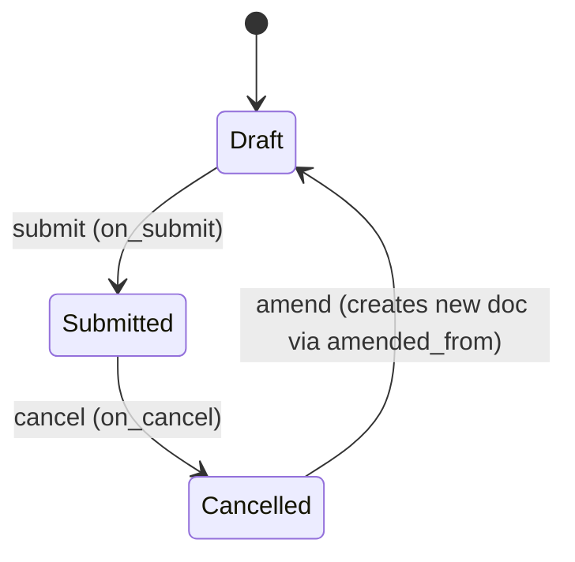

# Leave Allocation

**Source:** `hrms/hr/doctype/leave_allocation/leave_allocation.json`, `leave_allocation.py`, `leave_allocation.js`, `leave_allocation_dashboard.py`
**[[Submittable Document Lifecycle|Submittable]]:** yes   **Tree:** no   **[[Naming and Autoname Rules|Naming]]:** `naming_series:` -> series `HR-LAL-.YYYY.-`
**Module:** HR

## Schema

| Field (fieldname) | Label | Type | Options/Link Target | Required | Default | Read-Only | Notes |
|---|---|---|---|---|---|---|---|
| naming_series | Series | Select | `HR-LAL-.YYYY.-` | yes | - | - | `set_only_once` |
| employee | Employee | Link | [[Employee Core Model\|Employee]] | yes | - | - | in_list_view, in_standard_filter, search_index |
| employee_name | Employee Name | Data | - | - | - | yes | `fetch_from: employee.employee_name` |
| department | Department | Link | Department | - | - | yes | `fetch_from: employee.department` |
| *(Column Break)* | | | | | | | |
| leave_type | Leave Type | Link | [[Leave Type]] | yes | - | - | in_list_view, in_standard_filter |
| from_date | From Date | Date | - | yes | - | - | |
| to_date | To Date | Date | - | yes | - | - | |
| *(Section Break: "Allocation")* | | | | | | | |
| new_leaves_allocated | New Leaves Allocated | Float | - | - | - | - | `allow_on_submit`, `non_negative`, bold |
| carry_forward | Add unused leaves from previous allocations | Check | - | - | 0 | - | |
| unused_leaves | Unused leaves | Float | - | - | - | yes | `depends_on: carry_forward`; computed by `set_total_leaves_allocated` |
| total_leaves_allocated | Total Leaves Allocated | Float | - | yes | - | yes | `allow_on_submit`; computed = unused_leaves + new_leaves_allocated |
| total_leaves_encashed | Total Leaves Encashed | Float | - | - | - | yes | `depends_on: eval:doc.total_leaves_encashed>0`; set by `Leave Encashment` (see `Leave Encashment.md`) |
| *(Column Break)* | | | | | | | |
| compensatory_request | Compensatory Leave Request | Link | [[Compensatory Leave Request]] | - | - | yes | set when created from `Compensatory Leave Request` flow (Port Note: source shows this field exists in schema but the controller does not appear to set it directly — see Port Notes) |
| leave_period | Leave Period | Link | [[Leave Period]] | - | - | yes | in_standard_filter |
| leave_policy | Leave Policy | Link | [[Leave Policy]] | - | - | yes | hidden, `fetch_from: leave_policy_assignment.leave_policy`, in_standard_filter |
| expired | Expired | Check | - | - | 0 | yes | hidden, in_standard_filter; set to 1 by `expire_allocation()` |
| amended_from | Amended From | Link | [[Leave Allocation]] | - | - | yes | standard amendment field |
| *(Section Break: "Notes", collapsible)* | | | | | | | |
| description | Description | Small Text | - | - | - | - | width 300px |
| carry_forwarded_leaves_count | Carry Forwarded Leaves | Float | - | - | - | yes | `depends_on: carry_forwarded_leaves_count`; set on the *previous* allocation by `set_carry_forwarded_leaves_in_previous_allocation` |
| leave_policy_assignment | Leave Policy Assignment | Link | [[Leave Policy Assignment]] | - | - | yes | |
| company | Company | Link | Company | yes | - | yes | `fetch_from: employee.company` |
| *(Section Break: "Earned Leave Schedule")* | | | | | | | `depends_on: eval:doc.earned_leave_schedule && doc.earned_leave_schedule.length;` |
| earned_leave_schedule | Earned Leave Schedule | Table | [[Earned Leave Schedule]] | - | - | yes | child table, see below |
| retry_failed_allocations | Retry Failed Allocations | Button | - | - | - | - | hidden; shown client-side only when a schedule row has `attempted && failed` |

## Child Tables

- `earned_leave_schedule` (Table) -> child doctype `Earned Leave Schedule`. This doctype is assigned to this same agent — full schema documented in `Earned Leave Schedule.md`.

## State Machine



Plain list:
- (Draft, submit, Submitted, guard: passes `validate()` chain)
- (Submitted, cancel, Cancelled, guard: none besides standard Frappe permission checks; `on_cancel` runs cleanup)
- (Cancelled, amend, Draft [new doc], guard: standard Frappe amend flow, `amended_from` set to cancelled doc name)

Additional non-docstatus state: `expired` (Check field, default 0). Set to 1 only by `expire_allocation()` in `leave_ledger_entry.py` (called from `on_submit` for a superseded prior allocation, or manually via the "Expire Allocation" button / `expire_carried_forward_allocation` whitelisted method). Set back to 0 only if the expiry Leave Ledger Entry is cancelled (`LeaveLedgerEntry.on_cancel`).

## Validation Rules (exact, in execution order)

`validate()` calls, in order:
1. `validate_period()` -> IF `date_diff(to_date, from_date) <= 0` THEN `frappe.throw(_("To date cannot be before from date"))`.
2. `validate_allocation_overlap()` -> queries other submitted (`docstatus==1`) Leave Allocation rows for same employee+leave_type where date ranges overlap (`to_date >= self.from_date AND from_date <= self.to_date`, excluding self). IF found THEN `frappe.msgprint(_("{0} already allocated for Employee {1} for period {2} to {3}").format(leave_type, employee, formatdate(from_date), formatdate(to_date)))` followed immediately by `frappe.throw(_("Reference") + ': <a href="/app/Form/Leave Allocation/{name}">{name}</a>', OverlapError)`.
3. `validate_lwp()` -> IF `Leave Type.is_lwp` is true for `self.leave_type` THEN `frappe.throw(_("Leave Type {0} cannot be allocated since it is leave without pay").format(leave_type))`.
4. `set_employee_name(self)` (utility) -> IF `employee` set AND `employee_name` not set THEN fetch `Employee.employee_name` and assign (no throw).
5. `set_total_leaves_allocated()` (also `@frappe.whitelist()`, callable standalone) -> see Business Logic section below for full sub-algorithm; ends with a possible throw: IF resulting `total_leaves_allocated` is falsy (0) AND leave type is NOT `is_earned_leave` AND NOT `is_compensatory` AND NOT `allow_negative` THEN `frappe.throw(_("Total leaves allocated is mandatory for Leave Type {0}").format(leave_type))`.
6. `validate_leave_days_and_dates()` -> calls in order:
   6a. `validate_back_dated_allocation()` -> queries submitted allocations for same employee+leave_type where `from_date > self.to_date` AND `carry_forward == 1`. IF found THEN `frappe.throw(_("Leave cannot be allocated before {0}, as leave balance has already been carry-forwarded in the future leave allocation record {1}").format(formatdate(future_allocation.from_date), future_allocation.name), BackDatedAllocationError)`.
   6b. `validate_total_leaves_allocated()` -> `date_difference = date_diff(to_date, from_date) + 1`. IF `date_difference < total_leaves_allocated` THEN: IF `Leave Type.allow_over_allocation` THEN `frappe.msgprint(_("<b>Total Leaves Allocated</b> are more than the number of days in the allocation period"), indicator="orange", alert=True)` (non-blocking) ELSE `frappe.throw(_("<b>Total Leaves Allocated</b> are more than the number of days in the allocation period"), exc=OverAllocationError, title=_("Over Allocation"))`.
   6c. `validate_leave_allocation_days()` -> `max_leaves_allowed = Leave Type.max_leaves_allowed` for `self.leave_type`. IF `max_leaves_allowed > 0` THEN: compute `leave_period = get_leave_period(from_date, to_date, company)`; `leave_allocated = get_leave_allocation_for_period(employee, leave_type, leave_period.from_date, leave_period.to_date, exclude_allocation=self.name)` if a leave_period exists else 0; add `flt(new_leaves_allocated)`. IF resulting `leave_allocated > max_leaves_allowed` THEN `frappe.throw(_("Total allocated leaves are more than maximum allocation allowed for {0} leave type for employee {1} in the period").format(leave_type, employee), OverAllocationError)`.

`on_update_after_submit()` (runs when a submitted doc is edited, only if `new_leaves_allocated` changed):
7. `validate_earned_leave_update()` -> IF `leave_policy_assignment` is set AND `Leave Type.is_earned_leave` is true THEN `frappe.throw(msg, title=_("Not Allowed"))` where `msg` = `_("Cannot update allocation for {0} after submission").format(frappe.bold(_("Earned Leaves")))` + `"<br><br>"` + `_("Earned Leaves are auto-allocated via scheduler based on the annual allocation set in the Leave Policy: {0}").format(get_link_to_form("Leave Policy", leave_policy))`.
8. `validate_against_leave_applications()` -> `leaves_taken = get_approved_leaves_for_period(employee, leave_type, from_date, to_date)`. IF `flt(leaves_taken) > flt(total_leaves_allocated)` THEN: IF `Leave Type.allow_negative` THEN `frappe.msgprint(_("Note: Total allocated leaves {0} shouldn't be less than already approved leaves {1} for the period").format(total_leaves_allocated, leaves_taken))` (non-blocking) ELSE `frappe.throw(_("Total allocated leaves {0} cannot be less than already approved leaves {1} for the period").format(total_leaves_allocated, leaves_taken), LessAllocationError)`.
9. Recompute `total_leaves_allocated = flt(unused_leaves) + flt(new_leaves_allocated)`, then re-run `validate_leave_days_and_dates()` (rules 6a-6c again against the new total).

`allocate_leaves_manually(new_leaves, from_date=None)` (whitelisted method) validation:
10. `self.check_permission("write")` -> standard Frappe permission check (throws `frappe.PermissionError` if lacking).
11. IF `from_date` given AND NOT (`from_date` between `self.from_date` and `self.to_date` inclusive) THEN `frappe.throw(_("Cannot allocate leaves outside the allocation period {0} - {1}").format(bold(formatdate(from_date)), bold(formatdate(to_date))), title=_("Invalid Dates"))`.
12. Compute `new_allocation = total_leaves_allocated + new_leaves`; clamp `new_allocation` to `max_leaves_allowed` if `max_leaves_allowed > 0` and exceeded. Compute `new_allocation_without_cf = get_existing_leave_count() + new_leaves` (precision-rounded). Fetch `annual_allocation` from `Leave Policy Detail` for `(leave_policy, leave_type)`. IF `new_allocation != total_leaves_allocated AND new_allocation_without_cf <= annual_allocation` THEN proceed (apply, see Business Logic) ELSE `frappe.throw(msg, title=_("Annual Allocation Exceeded"))` where `msg` = `_("Total leaves allocated cannot exceed annual allocation of {0}.").format(bold(_(annual_allocation)))` + `"<br><br>"` + `_("Reference: {0}").format(get_link_to_form("Leave Policy", leave_policy))`.

`retry_failed_allocations(failed_allocations)` (whitelisted method) validation:
13. IF caller lacks `write` permission on `Leave Allocation` THEN `frappe.throw(_("You do not have permission to complete this action"), frappe.PermissionError)`.
14. Per failed allocation row: IF `new_allocation = total_leaves_allocated + number_of_leaves` exceeds `max_leaves_allowed` (when `max_leaves_allowed > 0`) THEN `frappe.throw(msg=_("Cannot allocate more leaves due to maximum leaves allowed limit of {0} in {1} leave type.").format(bold(max_leaves_allowed), bold(leave_type)), title=_("Retry Failed"))`.
15. ELIF `new_allocation_without_cf = get_existing_leave_count() + number_of_leaves` exceeds `annual_allocation` AND `earned_leave_frequency != "Yearly"` THEN `frappe.throw(msg=_("Cannot allocate more leaves due to maximum leave allocation limit of {0} in leave policy assignment").format(bold(annual_allocation)), title=_("Retry Failed"))`.

`get_carry_forwarded_leaves()` sub-validation (called from `set_total_leaves_allocated`):
16. `validate_carry_forward(leave_type)` -> IF `carry_forward` requested AND a previous allocation exists AND `Leave Type.is_carry_forward` is falsy THEN `frappe.throw(_("Leave Type {0} cannot be carry-forwarded").format(leave_type))`.

## Business Logic / Calculations

### `set_total_leaves_allocated()` (whitelisted; also invoked from `validate()`)
1. `unused_leaves = flt(get_carry_forwarded_leaves(employee, leave_type, from_date, carry_forward), precision("unused_leaves"))`.
   - `get_carry_forwarded_leaves(employee, leave_type, date, carry_forward)`:
     a. `unused_leaves = 0.0`
     b. `previous_allocation = get_previous_allocation(date, leave_type, employee)` — most recent submitted allocation for same employee+leave_type with `to_date < date`, ordered by `to_date desc`, limit 1.
     c. IF `carry_forward` truthy AND `previous_allocation` found THEN:
        i. `validate_carry_forward(leave_type)` (throws if leave type not carry-forwardable).
        ii. `unused_leaves = get_unused_leaves(employee, leave_type, previous_allocation.from_date, previous_allocation.to_date)` = SUM of `Leave Ledger Entry.leaves` where `employee`, `leave_type` match, `from_date >= previous_allocation.from_date`, `to_date <= previous_allocation.to_date`, and (`is_expired == 0` OR `is_carry_forward == 1`) (`or_filters`).
        iii. IF `unused_leaves` truthy THEN clamp to `Leave Type.maximum_carry_forwarded_leaves` if that value is set and `unused_leaves > max`.
     d. Return `unused_leaves`.
2. `total_leaves_allocated = flt(flt(unused_leaves) + flt(new_leaves_allocated), precision("total_leaves_allocated"))`.
3. `limit_carry_forward_based_on_max_allowed_leaves()`:
   - `max_leaves_allowed = Leave Type.max_leaves_allowed`.
   - IF `max_leaves_allowed` truthy AND `total_leaves_allocated > max_leaves_allowed` THEN `total_leaves_allocated = max_leaves_allowed` AND `unused_leaves = max_leaves_allowed - flt(new_leaves_allocated)`.
4. IF `carry_forward` truthy THEN `set_carry_forwarded_leaves_in_previous_allocation()`:
   - `previous_allocation = get_previous_allocation(from_date, leave_type, employee)`.
   - IF `on_cancel` flag (only true when called from `on_cancel`) THEN `self.unused_leaves = 0.0`.
   - IF `previous_allocation` found THEN `frappe.db.set_value("Leave Allocation", previous_allocation.name, "carry_forwarded_leaves_count", self.unused_leaves)` — DIRECT DB WRITE on a different (previous) Leave Allocation record, bypassing its own validate/save cycle.
5. IF `total_leaves_allocated` is falsy AND leave type is not earned/compensatory/allow_negative THEN throw (see Validation rule 5).

### `create_leave_ledger_entry(submit=True)` (called from `on_submit`/`on_cancel`)
1. IF `unused_leaves` truthy:
   a. `expiry_days = Leave Type.expire_carry_forwarded_leaves_after_days`.
   b. `end_date = add_days(from_date, expiry_days - 1)` if `expiry_days` set, ELSE `end_date = to_date`.
   c. Build ledger args: `leaves=unused_leaves`, `from_date=from_date`, `to_date=min(end_date, to_date)`, `is_carry_forward=1`.
   d. `create_leave_ledger_entry(self, args, submit)` — creates and submits (or deletes, if `submit=False`) a `Leave Ledger Entry` for the carry-forward portion.
   e. IF `submit` AND `end_date < today()` THEN show an informational "Expire Leaves" dialog/msgprint (does not block; server-side just calls `frappe.msgprint` with a primary action pointing at `expire_carried_forward_allocation`).
2. Build ledger args for the new (non-carry-forward) portion: `leaves=new_leaves_allocated`, `from_date=from_date`, `to_date=to_date`, `is_carry_forward=0`. `create_leave_ledger_entry(self, args, submit)`.

### `on_submit()`
1. `create_leave_ledger_entry()` (as above, submit=True).
2. `allocation = get_previous_allocation(from_date, leave_type, employee)`.
3. IF `self.carry_forward` truthy AND `allocation` found THEN `expire_allocation(allocation)` (see `Earned Leave Schedule.md`/expiry algorithm below) — immediately expires the *previous* allocation's remaining ledger balance since its unused leaves have now been carried forward into this one.

### `on_cancel()`
1. `create_leave_ledger_entry(submit=False)` — deletes the ledger entries created on submit (and their paired expiry entry, per `delete_ledger_entry`).
2. IF `leave_policy_assignment` set THEN `update_leave_policy_assignments_when_no_allocations_left()`:
   - Count remaining submitted (`docstatus=1`) Leave Allocation rows for the same `leave_policy_assignment`.
   - IF count == 0 THEN `frappe.db.set_value("Leave Policy Assignment", leave_policy_assignment, "leaves_allocated", 0)` (direct DB write on the parent assignment doc).
3. IF `self.carry_forward` truthy THEN `set_carry_forwarded_leaves_in_previous_allocation(on_cancel=True)` — resets `unused_leaves` to 0.0 locally, and if a previous allocation exists, DB-sets its `carry_forwarded_leaves_count` to 0.

### `on_update_after_submit()` (edit of `new_leaves_allocated` on a submitted doc)
Guard: only runs body IF `has_value_changed("new_leaves_allocated")`.
1. `validate_earned_leave_update()` (throws if earned leave — see Validation #7).
2. `validate_against_leave_applications()` (Validation #8).
3. `total_leaves_allocated = flt(unused_leaves) + flt(new_leaves_allocated)`.
4. `validate_leave_days_and_dates()` re-run (Validation #6a-6c).
5. `leaves_to_be_added = flt((new_leaves_allocated - get_existing_leave_count()), precision("new_leaves_allocated"))` where `get_existing_leave_count()` = SUM of `Leave Ledger Entry.leaves` for this transaction with `is_carry_forward=0`, `docstatus=1`.
6. Build args `{leaves: leaves_to_be_added, from_date, to_date, is_carry_forward: 0}` and call `create_leave_ledger_entry(self, args, True)` (module-level helper, submits a delta ledger entry — NOT `self.create_leave_ledger_entry`).
7. `self.db_update()` — persists the recalculated `total_leaves_allocated` directly (bypassing full validate cycle a second time).

### `allocate_leaves_manually(new_leaves, from_date=None)` (whitelisted)
1. Validate as above (Validation #10-12).
2. IF valid: `self.db_set("total_leaves_allocated", new_allocation, update_modified=False)`.
3. `date = from_date or frappe.flags.current_date or getdate()`.
4. `create_additional_leave_ledger_entry(self, new_leaves, date)` (utility — see below).
5. Add a comment: `_("{0} leaves were manually allocated by {1} on {2}").format(bold(new_leaves), frappe.session.user, bold(formatdate(date)))`.
6. `frappe.msgprint(_("{0} leaves allocated successfully").format(bold(new_leaves)), indicator="green", alert=True)`.

### `get_monthly_earned_leave()` (whitelisted) — thin wrapper
1. `doj = Employee.date_of_joining`.
2. `annual_allocation` from `Leave Policy Detail` for `(leave_policy, leave_type)`.
3. `frequency, rounding = Leave Type.earned_leave_frequency, Leave Type.rounding`.
4. Return `hrms.hr.utils.get_monthly_earned_leave(doj, annual_allocation, frequency, rounding)` (see full algorithm under Earned Leave Schedule below).

### `create_leave_adjustment(adjustment_type, leaves_to_adjust, posting_date, reason_for_adjustment=None)` (whitelisted)
1. Create a new `Leave Adjustment` doc with `employee`, `leave_type`, `adjustment_type`, `leaves_to_adjust`, `posting_date`, `leave_allocation=self.name`, `reason_for_adjustment`.
2. `.save()` then `.submit()`.
3. `frappe.msgprint(_("Adjustment Created Successfully"), indicator="green", alert=True)`.

### `retry_failed_allocations(failed_allocations)` (whitelisted)
Per failed allocation row `{number_of_leaves, allocation_date}` (validated per rules #13-15):
1. `self.db_set("total_leaves_allocated", total_leaves_allocated + number_of_leaves, update_modified=False)`.
2. `create_additional_leave_ledger_entry(self, number_of_leaves, allocation_date)`.
3. Direct SQL update on the `Earned Leave Schedule` child row matching `(parent=self.name, allocation_date, attempted=1, failed=1)`: set `is_allocated=1, attempted=1, allocated_via="Manually", failed=0, failure_reason=""`.

### `create_additional_leave_ledger_entry(allocation, leaves, date)` (utility, `hrms/hr/utils.py`)
1. `allocation.new_leaves_allocated = leaves` (in-memory mutation, not saved as the field's "true" value — used only to shape the ledger entry args).
2. `allocation.from_date = date`.
3. `allocation.unused_leaves = 0`.
4. `allocation.create_leave_ledger_entry()` — this calls the instance method described above, which (since `unused_leaves` is now 0) creates a single ledger entry of `leaves=leaves, from_date=date, to_date=allocation.to_date (unchanged), is_carry_forward=0` and submits it. **Port Note:** this mutates the in-memory `allocation` object's `new_leaves_allocated`/`from_date` fields without persisting them via `save()` — the persisted field values are set separately via `db_set`/`db_update` by the caller. A reimplementation must NOT let this temporary mutation leak into the stored row; only the ledger entry and the explicit `db_set` calls should change the database.

### Algorithm: `allocate_earned_leaves()` — scheduled job (`hrms/hr/utils.py`), triggered daily via `hooks.py` `scheduler_events.daily_long`

This is the core earned-leave allocation engine. Runs once per day for ALL earned leave types across ALL eligible employees.

```
1. e_leave_types = get_earned_leaves()
   -> SELECT name, max_leaves_allowed, earned_leave_frequency, rounding, allocate_on_day
      FROM Leave Type WHERE is_earned_leave = 1
2. today = frappe.flags.current_date OR getdate()   # today's date, overridable for testing
3. failed_allocations = []
4. FOR EACH e_leave_type IN e_leave_types:
   5. leave_allocations = get_leave_allocations(today, e_leave_type.name)
      -> SELECT Leave Allocation joined to Employee (status != "Left") and left-joined to
         Earned Leave Schedule, grouped by allocation name, counting matching schedule rows
         as earned_leave_schedule_exists, WHERE:
           today BETWEEN allocation.from_date AND allocation.to_date
           AND allocation.docstatus = 1
           AND allocation.leave_type = e_leave_type.name
           AND allocation.leave_policy_assignment IS NOT NULL
           AND allocation.leave_policy IS NOT NULL
   6. FOR EACH allocation IN leave_allocations:
      7. IF allocation.earned_leave_schedule_exists (this allocation has pre-computed
         Earned Leave Schedule child rows, i.e. was created via a Leave Policy Assignment
         that pre-built the schedule):
         7a. (allocation_date, earned_leaves) = get_upcoming_earned_leave_from_schedule(allocation.name, today)
             -> SELECT allocation_date, number_of_leaves FROM Earned Leave Schedule
                WHERE parent = allocation.name AND attempted = 0 AND allocation_date = today
             -> defaults to (None, None) if not found
         7b. annual_allocation = get_annual_allocation_from_policy(allocation, e_leave_type)
             -> Leave Policy Detail.annual_allocation WHERE parent = allocation.leave_policy_assignment... 
                (NOTE: actual filter uses allocation.leave_policy, per get_annual_allocation_from_policy:
                 parent = allocation.leave_policy, leave_type = e_leave_type.name)
      8. ELSE (no pre-built schedule — legacy / directly-created earned-leave allocation):
         8a. date_of_joining = Employee.date_of_joining for allocation.employee
         8b. allocation_date = get_expected_allocation_date_for_period(
                 e_leave_type.earned_leave_frequency, e_leave_type.allocate_on_day,
                 today, date_of_joining, effective_from=None)
             (see "get_expected_allocation_date_for_period" sub-algorithm below)
         8c. annual_allocation = get_annual_allocation_from_policy(allocation, e_leave_type)
         8d. earned_leaves = calculate_upcoming_earned_leave(allocation, e_leave_type, date_of_joining)
             -> re-fetches annual_allocation internally, then calls get_monthly_earned_leave(
                date_of_joining, annual_allocation, e_leave_type.earned_leave_frequency, e_leave_type.rounding)
                (see "get_monthly_earned_leave" sub-algorithm below; pro_rated defaults True,
                 period_start_date/period_end_date default to current sub-period)
      9. IF NOT allocation_date OR allocation_date != today: CONTINUE (skip this allocation today)
      10. TRY:
          update_previous_leave_allocation(allocation, annual_allocation, e_leave_type, earned_leaves, today)
          (see sub-algorithm below)
      11. EXCEPT Exception as e:
          log_allocation_error(allocation.name, e)
             -> frappe.log_error(e, reference_doctype="Leave Allocation")
             -> mark the matching Earned Leave Schedule row (parent=allocation.name,
                allocation_date=today) as attempted=1, failed=1, failure_reason=<error log link text>
          failed_allocations.append(allocation.name)
12. IF failed_allocations: send_email_for_failed_allocations(failed_allocations)
    -> emails all enabled Users with role "HR Manager" with links to the failed allocations
       and the Error Log list
```

**`update_previous_leave_allocation(allocation, annual_allocation, e_leave_type, earned_leaves, today)` sub-algorithm:**
```
1. allocation = frappe.get_doc("Leave Allocation", allocation.name)   # reload full doc
2. precision = allocation.precision("total_leaves_allocated")
3. annual_allocation = flt(annual_allocation, precision)
4. earned_leaves = flt(earned_leaves, precision)
5. new_leaves_to_allocate_without_cf = flt(allocation.get_existing_leave_count() + earned_leaves, precision)
   (get_existing_leave_count = SUM of non-carry-forward, submitted ledger entries for this allocation)
6. IF new_leaves_to_allocate_without_cf > annual_allocation AND e_leave_type.earned_leave_frequency != "Yearly":
     RAISE OverAllocationError: "Allocation was skipped due to exceeding annual allocation set in leave policy"
     (this propagates up and is caught by the caller's try/except, marking the row failed)
7. IF e_leave_type.max_leaves_allowed (truthy):
   7a. leaves_quota = flt(max_leaves_allowed - allocation.total_leaves_allocated, precision)
   7b. IF leaves_quota <= 0:
        RAISE OverAllocationError: "Allocation was skipped due to maximum leave allocation limit set in
        leave type. Please increase the limit and retry failed allocation."
   7c. ELIF leaves_quota < earned_leaves:
        earned_leaves = leaves_quota   # clamp to remaining quota
8. allocation.db_set("total_leaves_allocated", earned_leaves + allocation.total_leaves_allocated, update_modified=False)
9. create_additional_leave_ledger_entry(allocation, earned_leaves, today)
   (creates/submits a Leave Ledger Entry of leaves=earned_leaves, is_carry_forward=0, from_date=to_date=today)
10. Direct SQL UPDATE Earned Leave Schedule SET is_allocated=1, attempted=1,
    allocated_via='Scheduler', number_of_leaves=earned_leaves
    WHERE parent = allocation.name AND allocation_date = today
```

**`get_monthly_earned_leave(date_of_joining, annual_leaves, frequency, rounding, period_start_date=None, period_end_date=None, pro_rated=True)` sub-algorithm:**
```
1. earned_leaves = 0.0
2. divide_by_frequency = {"Yearly": 1, "Half-Yearly": 2, "Quarterly": 4, "Monthly": 12}
3. IF annual_leaves (truthy):
   3a. earned_leaves = flt(annual_leaves) / divide_by_frequency[frequency]
   3b. IF pro_rated:
       i.   IF NOT (period_start_date OR period_end_date):
              today_date = frappe.flags.current_date OR getdate()
              (period_start_date, period_end_date) = get_sub_period_start_and_end(today_date, frequency)
              (Monthly -> first/last day of month; Quarterly -> quarter start/end;
               Half-Yearly -> get_semester_start/end [calendar-half fallback, NOT effective_from-relative
               in this call path since effective_from isn't passed]; Yearly -> year start/end)
       ii.  earned_leaves = calculate_pro_rated_leaves(earned_leaves, date_of_joining,
              period_start_date, period_end_date, is_earned_leave=True)
            (see calculate_pro_rated_leaves sub-algorithm below)
   3c. earned_leaves = round_earned_leaves(earned_leaves, rounding)
       (rounding == "0.25" -> round(x*4)/4; "0.5" -> round(x*2)/2; else -> round(x); if rounding falsy, no-op)
4. RETURN earned_leaves
```

**`calculate_pro_rated_leaves(leaves, date_of_joining, period_start_date, period_end_date, is_earned_leave=False)` sub-algorithm** (from `Leave Policy Assignment` module, `hrms/hr/doctype/leave_policy_assignment/leave_policy_assignment.py`):
```
1. IF NOT leaves OR date_of_joining <= period_start_date:
     RETURN leaves unchanged   # no proration needed if employee joined before/at period start
2. precision = System Settings.float_precision (cached)
3. actual_period = date_diff(period_end_date, date_of_joining) + 1
4. complete_period = date_diff(period_end_date, period_start_date) + 1
5. leaves = leaves * (actual_period / complete_period)
6. IF is_earned_leave: RETURN flt(leaves, precision)
   ELSE: RETURN rounded(leaves)   # standard rounding, no decimal precision arg
```

**`get_expected_allocation_date_for_period(frequency, allocate_on_day, date, date_of_joining=None, effective_from=None)` sub-algorithm:**
```
1. TRY: doj = date_of_joining.replace(month=date.month, year=date.year)
   EXCEPT (ValueError, AttributeError):
     doj = last calendar day of date.month/date.year  # handles Feb 30 etc., or missing date_of_joining
2. IF frequency == "Half-Yearly" AND effective_from:
     (period_start, period_end) = get_half_year_periods(date, effective_from)
     half_yearly_dates = {"First Day": period_start, "Last Day": period_end}
   ELSE:
     half_yearly_dates = {"First Day": get_semester_start(date), "Last Day": get_semester_end(date)}
3. RETURN based on frequency + allocate_on_day lookup table:
   Monthly:    {"First Day": first day of date's month, "Last Day": last day of date's month,
                "Date of Joining": doj}
   Quarterly:  {"First Day": quarter start, "Last Day": quarter end}
   Half-Yearly: half_yearly_dates (as computed above)
   Yearly:     {"First Day": year start, "Last Day": year end}
   -> pick [frequency][allocate_on_day]
```
Note: `allocate_earned_leaves()` always calls this with `effective_from=None`, so the Half-Yearly branch always uses the calendar-half-year fallback (`get_semester_start`/`get_semester_end`), never the `effective_from`-relative `get_half_year_periods`.

**`get_semester_start(date)` / `get_semester_end(date)`:**
```
get_semester_start: IF date.month <= 6: return year_start(date) ELSE: return year_start(date) + 6 months
get_semester_end:   IF date.month > 6:  return year_end(date)   ELSE: return year_end(date) - 6 months
```

**`get_half_year_periods(date, effective_from)`** (used only when `effective_from` is explicitly passed, which does NOT happen in the `allocate_earned_leaves` scheduler path but IS used by `Leave Policy Assignment`'s own schedule-building logic — documented here for completeness since it feeds the same `Earned Leave Schedule` child table):
```
1. half_years_passed = get_complete_month_count(date, effective_from) // 6
2. half_year_start = effective_from + (half_years_passed * 6) months
3. half_year_end = (half_year_start + 6 months) - 1 day
4. RETURN (half_year_start, half_year_end)
```
`get_complete_month_count(date, effective_from)`:
```
month_count = (date.year - effective_from.year)*12 + (date.month - effective_from.month)
IF date.day < effective_from.day AND date != last day of date's month: month_count -= 1
RETURN month_count
```

### Algorithm: `process_expired_allocation()` — scheduled job (`hrms/hr/doctype/leave_ledger_entry/leave_ledger_entry.py`), triggered daily via `hooks.py` `scheduler_events.daily_long`

Expires stale Leave Allocation balances by writing negative-leaves ledger entries once an allocation's period has ended.

```
1. leave_type = list of Leave Type names WHERE expire_carry_forwarded_leaves_after_days > 0
   (if none, use [""] as a placeholder so the NOTIN clause below is well-formed)
2. Build correlated NOT EXISTS subquery ("inner_query") per outer ledger row `l`:
     EXISTS another Leave Ledger Entry row `il` such that:
       il.transaction_name = l.transaction_name
       AND il.transaction_type = "Leave Allocation"
       AND il.name != l.name
       AND il.docstatus = 1
       AND ( il.is_carry_forward = l.is_carry_forward
             OR (il.is_carry_forward = 0 AND il.leave_type NOT IN leave_type) )
   This subquery finds "another ledger entry for the same allocation that already represents
   the counterpart" — used to detect allocations that have ALREADY had their expiry-eligible
   counterpart entries created (i.e., avoid re-processing / avoid single-entry allocations that
   don't need special carry-forward split handling).
3. expire_allocation_rows = SELECT leaves, to_date, from_date, employee, leave_type,
     is_carry_forward, transaction_name AS name, transaction_type
   FROM Leave Ledger Entry l
   WHERE NOT EXISTS(inner_query)
     AND l.transaction_type = "Leave Allocation"
     AND l.to_date < today()
   -- i.e. every still-unprocessed ledger entry tied to a Leave Allocation whose to_date has passed,
   -- and for which no sibling ledger entry already accounts for the carry-forward/non-carry-forward
   -- split described above.
4. IF expire_allocation_rows: create_expiry_ledger_entry(expire_allocation_rows)
```

**`create_expiry_ledger_entry(allocations)` sub-algorithm:**
```
FOR EACH allocation IN allocations:
  IF allocation.is_carry_forward:
    expire_carried_forward_allocation(allocation)   # Case 1: carry-forwarded portion
  ELSE:
    expire_allocation(allocation)                    # Case 2: non-carry-forward / plain allocation
```

**`expire_allocation(allocation, expiry_date=None)` sub-algorithm** (also `@frappe.whitelist()`, callable directly e.g. from the "Expire Allocation" button, or via `expire_carried_forward_allocation` module-level whitelisted wrapper in `Leave Allocation`'s own controller):
```
1. IF allocation passed as a JSON string: parse it and reload the full Leave Allocation doc by name.
2. IF allocation.docstatus == 2 (cancelled): RETURN (no-op).
3. frappe.has_permission("Leave Allocation", "write", allocation.name, throw=True)
   -> raises frappe.PermissionError if the caller lacks write permission.
4. leaves = get_remaining_leaves(allocation)
   -> SUM(Leave Ledger Entry.leaves) WHERE employee, leave_type match, to_date <= allocation.to_date,
      docstatus = 1   (i.e. total ledger balance attributable to this allocation's period so far)
5. expiry_date = expiry_date if given ELSE allocation.to_date
6. IF leaves (truthy, i.e. nonzero balance remains):
     Build ledger args: leaves = -1 * leaves, transaction_name = allocation.name,
       transaction_type = "Leave Allocation", from_date = expiry_date, to_date = expiry_date,
       is_carry_forward = 0, is_expired = 1
     create_leave_ledger_entry(allocation, args)   # submits a new negative-leaves ledger entry
7. frappe.db.set_value("Leave Allocation", allocation.name, "expired", 1)   # direct DB write, always runs
```

**`expire_carried_forward_allocation(allocation)` sub-algorithm:**
```
1. leaves_taken = get_leaves_for_period(allocation.employee, allocation.leave_type,
     allocation.from_date, allocation.to_date, skip_expired_leaves=False)
   (from Leave Application module — total approved leave days taken against this period,
    including previously-expired ones since skip_expired_leaves=False)
2. leaves = flt(allocation.leaves) + flt(leaves_taken)
   (allocation.leaves here is the SIGNED leaves value of the originating carry-forward ledger
    row being processed, typically positive; leaves_taken is typically negative or the raw
    consumption figure per get_leaves_for_period's convention — net remaining balance)
3. IF leaves > 0:
     Build args: transaction_name = allocation.name, transaction_type = "Leave Allocation",
       leaves = -1 * leaves, is_carry_forward = allocation.is_carry_forward, is_expired = 1,
       from_date = allocation.to_date, to_date = allocation.to_date
     create_leave_ledger_entry(allocation, args)   # submits the expiry ledger entry
   (No "expired" flag DB write here, unlike expire_allocation — Port Note below.)
```

**Trigger note — `generate_leave_encashment()`** (`hrms/hr/utils.py`, also scheduled daily via `hooks.py` `scheduler_events.daily_long`): reads `Leave Allocation` rows expiring yesterday (`to_date == today - 1 day`) whose `leave_type.allow_encashment = 1`, only if `HR Settings.auto_leave_encashment` is enabled, and passes them to `create_leave_encashment()` to draft `Leave Encashment` documents. Leave Allocation itself is only a read source here — no writes happen to it. Full doctype spec (fields, validations, encashment amount calculation) is out of scope for this file — **see `Leave Encashment.md` for the full doctype spec** (owned by another module agent).

## [[Cross-Doctype Hooks (doc_events)|Lifecycle Hooks]] (exact)

| Event | What Runs | Side Effects on Other Doctypes |
|---|---|---|
| validate | `validate_period`, `validate_allocation_overlap`, `validate_lwp`, `set_employee_name`, `set_total_leaves_allocated`, `validate_leave_days_and_dates` (-> `validate_back_dated_allocation`, `validate_total_leaves_allocated`, `validate_leave_allocation_days`) | Reads `Leave Type`, `Employee`, other `Leave Allocation` rows, `Leave Period`. May direct-DB-write `carry_forwarded_leaves_count` on a *previous* Leave Allocation. |
| on_submit | `create_leave_ledger_entry()`; conditionally `expire_allocation(previous_allocation)` if `carry_forward` | Creates/submits `Leave Ledger Entry` row(s); may expire a previous `Leave Allocation` (writes its `expired` flag and a negative ledger entry). |
| on_cancel | `create_leave_ledger_entry(submit=False)`; conditional `update_leave_policy_assignments_when_no_allocations_left()`; conditional `set_carry_forwarded_leaves_in_previous_allocation(on_cancel=True)` | Deletes `Leave Ledger Entry` rows; may zero out `Leave Policy Assignment.leaves_allocated`; may zero `carry_forwarded_leaves_count` on the previous allocation. |
| on_update_after_submit | (only if `new_leaves_allocated` changed) `validate_earned_leave_update`, `validate_against_leave_applications`, recompute total, re-validate, create delta `Leave Ledger Entry`, `db_update()` | Creates a delta `Leave Ledger Entry`. |

## Whitelisted / API Methods

| Method name | HTTP-equivalent purpose | Args | Returns | What it does |
|---|---|---|---|---|
| `set_total_leaves_allocated` | Recompute allocation totals (also called client-side on field change) | none (uses doc state) | mutates doc fields, no explicit return | See Business Logic above; may throw `Total leaves allocated is mandatory...`. |
| `allocate_leaves_manually` | Add an ad-hoc manual leave grant to an existing allocation | `new_leaves: str\|float`, `from_date: str\|date\|None` | none (raises `msgprint`/`throw`) | See Business Logic above. |
| `get_monthly_earned_leave` | Preview the monthly earned-leave figure for this allocation's employee/policy | none | float (number of leaves) | Wraps `hrms.hr.utils.get_monthly_earned_leave`. |
| `create_leave_adjustment` | Create+submit a `Leave Adjustment` against this allocation | `adjustment_type: str`, `leaves_to_adjust: str\|float`, `posting_date: str\|date`, `reason_for_adjustment: str\|None` | none | Creates, saves, submits a `Leave Adjustment` doc; shows success msgprint. |
| `retry_failed_allocations` | Re-attempt earned-leave allocations that previously failed the scheduler run | `failed_allocations: list` (each with `number_of_leaves`, `allocation_date`) | none | See Business Logic/Validation above; requires `write` permission. |
| `expire_carried_forward_allocation` (module-level function, not an instance method) | Manually trigger the daily expiry job on demand | none | none | Requires `submit` permission on `Leave Allocation`; else `frappe.throw(_("You do not have permission to complete this action"), frappe.PermissionError)`. Calls `process_expired_allocation()`. |

## Permissions

| Role | Read | Write | Create | Delete | Submit | Cancel | Amend | Report | Export | Notes |
|---|---|---|---|---|---|---|---|---|---|---|
| HR User | yes | yes | yes | yes | yes | yes | yes | yes | - | email, share, print all 1 |
| HR Manager | yes | yes | yes | yes | yes | yes | yes | yes | yes | also `import`; email, share, print all 1 |

## [[Background Jobs (Scheduler Events)|Scheduled Jobs]] Touching This Doctype

| Job (hooks.py bucket) | Frequency | Function | Effect on Leave Allocation |
|---|---|---|---|
| `daily_long` | daily | `hrms.hr.doctype.leave_ledger_entry.leave_ledger_entry.process_expired_allocation` | Sets `expired=1` and writes negative ledger entries for allocations whose `to_date` has passed. |
| `daily_long` | daily | `hrms.hr.utils.generate_leave_encashment` | Reads allocations expiring yesterday to draft `Leave Encashment` docs (see `Leave Encashment.md`). No writes to Leave Allocation. |
| `daily_long` | daily | `hrms.hr.utils.allocate_earned_leaves` | Adds `total_leaves_allocated`, writes ledger entries, updates `Earned Leave Schedule` child rows for earned-leave-type allocations. |

## Related Doctypes

- [[Employee Core Model]] — the employee this allocation grants leave to; `employee` Link field.
- [[Leave Type]] — `leave_type` Link field; governs carry-forward, max-allowed, earned-leave rules for this allocation.
- [[Compensatory Leave Request]] — `compensatory_request` Link field (schema present, but not observed being set by the traced controller code — see Port Notes); reverse link is `Compensatory Leave Request.leave_allocation`, which extends/creates this allocation on approval.
- [[Leave Period]] — `leave_period` Link field, scoping this allocation to a named date range.
- [[Leave Policy]] — `leave_policy` Link field, fetched from the linked assignment.
- [[Leave Policy Assignment]] — `leave_policy_assignment` Link field; the assignment that created this allocation and is the only supported entry point for earned-leave schedules.
- [[Earned Leave Schedule]] — `earned_leave_schedule` child Table field, one row per scheduled earned-leave credit event.
- [[Leave Allocation]] — `amended_from` self-referencing Link field, standard Frappe amend-chain pointer.
- [[Leave Ledger Entry]] — created on submit (new + carry-forward portions), deleted on cancel, and written by the scheduled expiry job against this allocation's balance.
- [[Leave Adjustment]] — created (and submitted) by this doctype's whitelisted `create_leave_adjustment` method.
- [[Leave Encashment]] — reads allocations expiring yesterday (via the `generate_leave_encashment` scheduled job) to draft encashment records; not written by this doctype.

## Port Notes

- **Auto-timestamps / audit trail**: `track_changes: 1` means Frappe auto-logs a version history of every field change (via a separate Version doctype) — a reimplementation needs an explicit audit-log table if this behavior is required.
- **Naming series auto-increment**: `HR-LAL-.YYYY.-` generates names like `HR-LAL-2026-00001` with an auto-incrementing counter per year, managed by Frappe's naming series counter table. Must be built explicitly (e.g. a Postgres sequence keyed by year).
- **`total_leaves_allocated` is `allow_on_submit`**: this field (and `new_leaves_allocated`) can be edited on an already-submitted document without a formal amend — Frappe's `on_update_after_submit` hook exists specifically to re-validate at that point. Most stacks would model this as a distinct "patch" endpoint with its own validation, since normal REST/CRUD patterns don't have an implicit "submitted but still partially editable" state.
- **Currency/float precision**: `total_leaves_allocated`, `unused_leaves`, etc. use `self.precision(fieldname)`, which resolves to either a field-specific precision override or the site's global float precision (System Settings). A port must define and consistently apply a fixed decimal precision (source commonly defaults to 3 decimal places for Float unless overridden by field-level "precision" property, which is not set on these fields, so system default applies — verify against target site's configured `float_precision`, commonly 3).
- **`compensatory_request` field**: present in the schema but the current controller code shows the reverse link — `Compensatory Leave Request.leave_allocation` — being set, not `Leave Allocation.compensatory_request`. No code path found that writes this field. Flagging as a gap: either dead schema or set by older/removed code; do not assume it's populated by any traced code path.
- **Direct DB writes bypass validation**: several flows (`db_set`, `frappe.db.set_value`, `db_update`) mutate `Leave Allocation` fields without going through `validate()` again. A port must replicate this — i.e., these specific paths should be raw column updates, not full-entity re-validation-and-save, to match source behavior exactly (including bypassing `modified` timestamp updates when `update_modified=False` is passed).
- **`expire_carried_forward_allocation` does not set `expired=1`**: unlike `expire_allocation`, the carry-forward variant never flips the `expired` checkbox — only `expire_allocation` (the plain/non-carry-forward path) does. This asymmetry is in the source and should be preserved exactly.
- **`get_annual_allocation_from_policy` filter key**: uses `filters={"parent": allocation.leave_policy, "leave_type": e_leave_type.name}` against `Leave Policy Detail` — note this is `allocation.leave_policy` (a field on Leave Allocation, fetched from the Leave Policy Assignment), not `leave_policy_assignment`.
- **Ledger entry deletion on cancel is NOT a soft-cancel**: `delete_ledger_entry` (invoked when `create_leave_ledger_entry(submit=False)` runs) performs an actual SQL `DELETE` on `Leave Ledger Entry` rows matching the transaction (plus a paired expiry entry found via a creation-timestamp heuristic in `get_previous_expiry_ledger_entry`) — it does not follow the normal submittable-doctype cancel flow. A port needs a hard-delete for these specific ledger rows on Allocation cancellation, not a docstatus flip.
- Client-side only logic to flag: `leave_allocation.js` `leave_policy` handler auto-fills `new_leaves_allocated` from `Leave Policy Detail.annual_allocation` when `leave_policy` changes — this is a UI convenience only; the server never independently enforces that `new_leaves_allocated` matches the policy's annual allocation on plain create (only during `allocate_leaves_manually`/`retry_failed_allocations`/`update_previous_leave_allocation` does an explicit annual-allocation ceiling get enforced). The `carry_forward`/`unused_leaves`/`new_leaves_allocated` change handlers replicate `set_total_leaves_allocated` math client-side for responsiveness — server remains authoritative via the same-named whitelisted method.
- `leave_allocation.js` also sets a default `from_date = today` on new/blank forms — client-side default only, not enforced server-side (server requires the field but does not default it).
