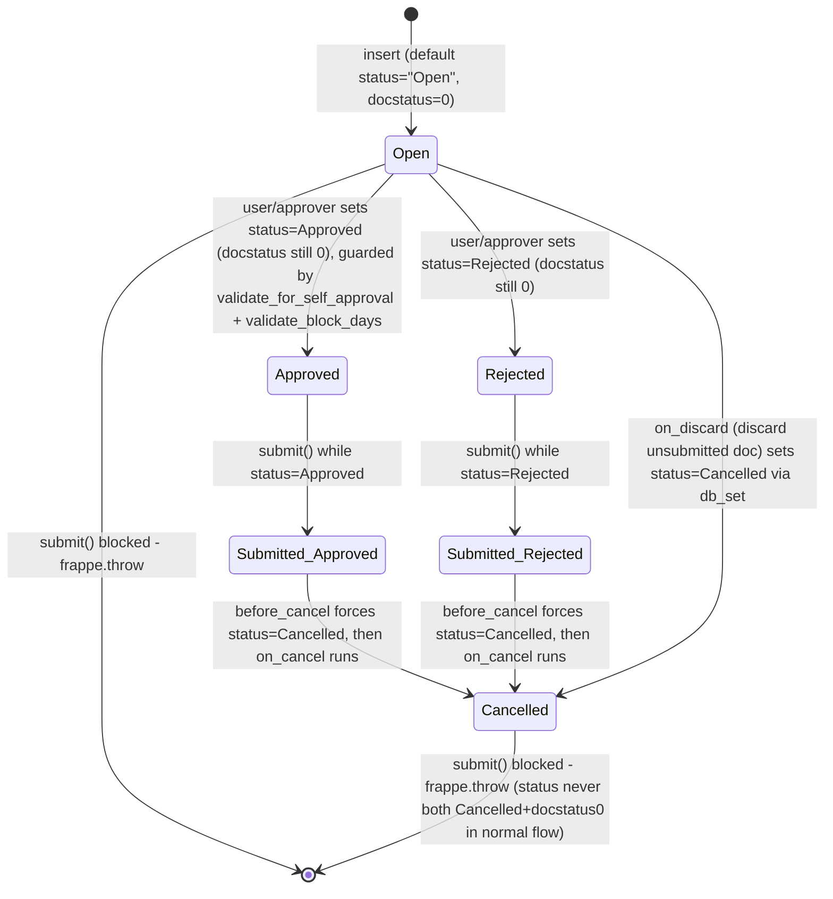

# Leave Application

**Source:** `hrms/hr/doctype/leave_application/leave_application.json`, `leave_application.py`, `leave_application.js`
**[[Submittable Document Lifecycle|Submittable]]:** yes   **Tree:** no   **[[Naming and Autoname Rules|Naming]]:** naming_series `HR-LAP-.YYYY.-` (year-scoped auto-increment)
**Module:** HR

This is the most complex doctype in the Leaves module: it drives leave balance consumption, attendance marking, block-date enforcement, cross-allocation splitting, and ledger accounting. Its controller mixes in `PWANotificationsMixin` in addition to `Document`.

## Schema

Full field table, in JSON `field_order`:

| Field (fieldname) | Label | Type | Options/Link Target | Required | Default | Read-Only | Notes |
|---|---|---|---|---|---|---|---|
| naming_series | Series | Select | `HR-LAP-.YYYY.-` | yes | - | no | `set_only_once: 1`, `print_hide: 1` |
| employee | Employee | Link | [[Employee Core Model\|Employee]] | yes | - | no | `in_global_search`, `in_standard_filter`, `search_index` |
| employee_name | Employee Name | Data | - | no | - | yes | fetch_from `employee.employee_name`, `in_global_search` |
| leave_type | Leave Type | Link | [[Leave Type]] | yes | - | no | `in_standard_filter`, `search_index`, `ignore_user_permissions: 1` |
| department | Department | Link | Department | no | - | yes | fetch_from `employee.department` |
| leave_balance | Leave Balance Before Application | Float | - | no | - | yes | `no_copy: 1`; set client-side via `get_leave_balance_on` call, used only for comparison in warning messages |
| from_date | From Date | Date | - | yes | - | no | `in_list_view`, `search_index` |
| to_date | To Date | Date | - | yes | - | no | `search_index` |
| half_day | Half Day | Check | - | no | 0 | no | |
| half_day_date | Half Day Date | Date | - | no | - | no | `depends_on: eval:doc.half_day && doc.from_date && doc.to_date && (doc.from_date != doc.to_date)` |
| total_leave_days | Total Leave Days | Float | - | no | - | yes | `no_copy: 1`, `precision: "1"`, `in_list_view`; computed server-side in `validate_balance_leaves` |
| description | Reason | Small Text | - | no | - | no | |
| leave_approver | Leave Approver | Link | User | no | - | no | conditionally mandatory (see Validation Rules) |
| leave_approver_name | Leave Approver Name | Data | - | no | - | yes | set in `set_leave_approver_name` |
| follow_via_email | Follow via Email | Check | - | no | 1 | no | `allow_on_submit: 1`, `print_hide: 1` |
| posting_date | Posting Date | Date | - | yes | Today | no | `no_copy: 1` |
| status | Status | Select | "Open\nApproved\nRejected\nCancelled" | yes | "Open" | no | `no_copy: 1`, `in_standard_filter`, `permlevel: 1` (only writable by roles with permlevel-1 write access) |
| company | Company | Link | Company | yes | - | yes | fetch_from `employee.company`, `remember_last_selected_value: 1` |
| salary_slip | Salary Slip | Link | [[Salary Slip]] | no | - | no | `print_hide: 1` |
| letter_head | Letter Head | Link | Letter Head | no | - | no | `allow_on_submit: 1`, `ignore_user_permissions: 1`, `print_hide: 1` |
| color | Color | Color | - | no | - | no | `allow_on_submit: 1`, `print_hide: 1` |
| amended_from | Amended From | Link | [[Leave Application]] | no | - | yes | `no_copy: 1`, `print_hide: 1`, `ignore_user_permissions: 1` |
| sb_other_details | Other Details | Section Break | - | - | - | - | collapsible section heading, groups salary_slip/color/letter_head/amended_from |

Layout-only fields omitted from the table per instructions: `column_break_4`, `section_break_5` ("Dates & Reason" heading — groups from_date/to_date/half_day/half_day_date/total_leave_days/description/leave_balance), `column_break1`, `section_break_7` ("Approval" heading — groups leave_approver/leave_approver_name/follow_via_email/posting_date/status), `column_break_18`, `column_break_17`.

## Child Tables

None.

## State Machine

`status` (Select: Open / Approved / Rejected / Cancelled) is independent of, but interacts with, the standard Frappe `docstatus` (0=Draft/unsubmitted, 1=Submitted, 2=Cancelled). Key rule enforced in `on_submit`: only `status in ("Approved", "Rejected")` may be submitted; `Open` and `Cancelled` cannot be submitted.



Plain list (from_state described as `status` value + `docstatus`; event; to_state; guard):

| From State | Event | To State | Guard Condition |
|---|---|---|---|
| (new) | insert | status="Open", docstatus=0 | default value on the `status` field |
| Open (docstatus 0) | user sets status → Approved and saves | Approved (docstatus 0) | `validate_for_self_approval`: blocked if `HR Settings.prevent_self_leave_approval` is true AND the employee's own user is approving AND no workflow is defined for the doctype AND `status=="Approved"` → throws `"Self-approval for leaves is not allowed"`. Also `validate_block_days`: blocked if there are applicable block dates for the employee/company AND `status=="Approved"` → throws `"You are not authorized to approve leaves on Block Dates"` (`LeaveDayBlockedError`) |
| Open (docstatus 0) | user sets status → Rejected and saves | Rejected (docstatus 0) | none of the approval-specific guards apply (balance/overlap/etc. validations still run on every save regardless of status, except the insufficient-balance throw is skipped when `status=="Rejected"`) |
| Approved or Rejected (docstatus 0) | `submit()` | same status, docstatus=1 | `on_submit`: `IF status in ("Open","Cancelled") THEN frappe.throw("Only Leave Applications with status 'Approved' and 'Rejected' can be submitted")`; also runs `validate_back_dated_application()` (can throw, see Validation Rules) |
| Open or Cancelled (docstatus 0) | `submit()` attempted | blocked | same throw as above |
| docstatus 1 (any status) | `cancel()` | status forced to "Cancelled", docstatus=2 | `before_cancel()` unconditionally sets `self.status = "Cancelled"`; then `on_cancel()` runs (reverses ledger entry, cancels attendance, notifies employee) |
| docstatus 0 (any status) | `on_discard` (user discards a never-submitted doc rather than deleting it) | status="Cancelled" (docstatus stays whatever discard leaves it as — this is a Frappe "discard" operation, distinct from delete) | `self.db_set("status", "Cancelled")` |

## Validation Rules (exact, in execution order)

`validate()` executes the following calls in this exact order; each sub-call's own internal checks are listed nested and numbered in overall execution order:

1. `validate_active_employee(self.employee)` -> IF Employee's `status == "Inactive"` THEN `frappe.throw(_("Transactions cannot be created for an Inactive Employee {0}.").format(get_link_to_form("Employee", employee)), InactiveEmployeeStatusError)` (source: `hrms.hr.utils.validate_active_employee`)
2. `set_employee_name(self)` — IF `employee` set and `employee_name` blank, fetch and set `employee_name`. Not a throw. (source: `hrms.hr.utils.set_employee_name`)
3. `validate_dates()`:
   1. IF `HR Settings.restrict_backdated_leave_application` is enabled AND `from_date` is set AND `getdate(from_date) < getdate()` (today):
      - Look up `allowed_role = HR Settings.role_allowed_to_create_backdated_leave_application`.
      - IF `not allowed_role` -> `frappe.throw(_("Backdated Leave Application is restricted. Please set the {} in {}").format(frappe.bold(_("Role Allowed to Create Backdated Leave Application")), get_link_to_form("HR Settings", "HR Settings", _("HR Settings"))))`
      - ELIF `allowed_role` is set but not in the current user's roles -> `frappe.throw(_("Only users with the {0} role can create backdated leave applications").format(_(allowed_role)))`
   2. IF `from_date` and `to_date` both set AND `getdate(to_date) < getdate(from_date)` -> `frappe.throw(_("To date cannot be before from date"))`
   3. `validate_half_day_date()` (whitelisted method, also called here server-side unconditionally):
      - IF `not self.half_day` -> return (no-op)
      - IF `is_holiday(employee=self.employee, date=self.half_day_date)` -> `frappe.throw(_("Half Day Date cannot be a holiday"))`
      - IF NOT (`from_date <= half_day_date <= to_date`) -> `frappe.throw(_("Half Day Date should be between From Date and To Date"))`
   4. IF `not is_lwp(self.leave_type)` (leave type's `is_lwp` flag is falsy):
      - `validate_dates_across_allocation()`:
        - IF `Leave Type.allow_negative` is truthy -> return (skip entirely)
        - `alloc_on_from_date, alloc_on_to_date = get_allocation_based_on_application_dates()` (submitted Leave Allocation covering `from_date`, and one covering `to_date`, respectively, for this employee+leave_type)
        - IF neither exists (`not (alloc_on_from_date or alloc_on_to_date)`) -> `frappe.throw(_("Application period cannot be outside leave allocation period"))`
        - ELIF `is_separate_ledger_entry_required(alloc_on_from_date, alloc_on_to_date)` is True (i.e. from/to dates fall in different or only-partially-covering allocations) -> `frappe.throw(_("Application period cannot be across two allocation records"), exc=LeaveAcrossAllocationsError)`
      - `validate_back_dated_application()`:
        - Query for any submitted (`docstatus=1`) Leave Allocation for this employee+leave_type with `carry_forward=1` and `from_date > self.to_date` (i.e. a future carry-forward allocation already exists beyond this application's range).
        - IF found -> `frappe.throw(_("Leave cannot be applied/cancelled before {0}, as leave balance has already been carry-forwarded in the future leave allocation record {1}").format(formatdate(future_allocation[0].from_date), future_allocation[0].name))`
4. `validate_balance_leaves()`:
   1. `precision = System Settings.float_precision or 2`.
   2. IF `from_date` and `to_date` both set:
      - `self.total_leave_days = get_number_of_leave_days(employee, leave_type, from_date, to_date, half_day, half_day_date)` (see Business Logic — Leave Day Calculation Algorithm below).
      - IF `self.total_leave_days <= 0` -> `frappe.throw(_("The day(s) on which you are applying for leave are holidays. You need not apply for leave."))`
      - IF `not is_lwp(leave_type)`:
        - `leave_balance = get_leave_balance_on(employee, leave_type, from_date, to_date, consider_all_leaves_in_the_allocation_period=True, for_consumption=True)`
        - `leave_balance_for_consumption = flt(leave_balance.leave_balance_for_consumption, precision)`
        - IF `self.status != "Rejected"` AND (`leave_balance_for_consumption < self.total_leave_days` OR `not leave_balance_for_consumption`):
          - `show_insufficient_balance_message(leave_balance_for_consumption)`:
            - `alloc_on_from_date, alloc_on_to_date = get_allocation_based_on_application_dates()`
            - IF `Leave Type.allow_negative` is truthy:
              - IF `leave_balance_for_consumption != self.leave_balance` -> msgprint (warning, non-blocking): `_("Warning: Insufficient leave balance for Leave Type {0} in this allocation.").format(frappe.bold(self.leave_type))` + `"<br><br>"` + `_("Actual balances aren't available because the leave application spans over different leave allocations. You can still apply for leaves which would be compensated during the next allocation.")`
              - ELSE msgprint (warning, non-blocking): `_("Warning: Insufficient leave balance for Leave Type {0}.").format(frappe.bold(self.leave_type))`
            - ELSE (allow_negative is falsy) -> `frappe.throw(_("Insufficient leave balance for Leave Type {0}").format(frappe.bold(self.leave_type)), exc=InsufficientLeaveBalanceError, title=_("Insufficient Balance"))`
5. `validate_leave_overlap()`:
   1. IF `self.name` is falsy (new/unsaved doc), temporarily set `self.name = "New Leave Application"` (to make the `!=` filter below behave for a new record).
   2. Query all Leave Applications for the same `employee`, `docstatus < 2`, `status in ("Open","Approved")`, `to_date >= self.from_date`, `from_date <= self.to_date`, `name != self.name` (date-range overlap test).
   3. For each overlapping application `d`:
      - IF ALL of: `self.half_day==1` AND `d.half_day==1` AND `self.half_day_date == d.half_day_date` AND (`self.total_leave_days == 0.5` OR `self.from_date == d.to_date` OR `self.to_date == d.from_date`):
        - `total_leaves_on_half_day = get_total_leaves_on_half_day()` = `COUNT(*)` of other Open/Approved, docstatus<2, same-employee, half_day=1, same half_day_date applications (excluding self) `* 0.5`.
        - IF `total_leaves_on_half_day >= 1` -> `throw_overlap_error(d)`.
        - (Otherwise two different half-day applications on the same date, adjoining a shared boundary date, are tolerated — this allows exactly one other half-day overlap without erroring.)
      - ELSE -> `throw_overlap_error(d)` unconditionally.
   4. `throw_overlap_error(d)` -> `frappe.throw(_("Employee {0} has already applied for {1} between {2} and {3} : {4}").format(self.employee, d.leave_type, formatdate(d.from_date), formatdate(d.to_date), get_link_to_form("Leave Application", d.name)), OverlapError)`
6. `validate_max_days()`:
   1. `max_days = Leave Type.max_continuous_days_allowed`. IF falsy -> return (no limit configured).
   2. `details = get_consecutive_leave_details()` — walks backward via `_get_first_from_date` (chains through any prior Open/Approved application whose `to_date` equals `add_days(reference_date, -1)`, recursively) and forward via `_get_last_to_date` (chains through any following application whose `from_date` equals `add_days(reference_date, 1)`, recursively), for the same employee+leave_type, collecting all touched `leave_applications` names, then computes `total_consecutive_leaves = get_number_of_leave_days(employee, leave_type, first_from_date, last_to_date)` across the entire merged consecutive span.
   3. IF `details.total_consecutive_leaves > cint(max_days)` -> `frappe.throw(msg, title=_("Maximum Consecutive Leaves Exceeded"))` where `msg = _("Leave of type {0} cannot be longer than {1}.").format(get_link_to_form("Leave Type", self.leave_type), max_days)`, with an appended `"<br><br>" + _("Reference: {0}").format(", ".join(get_link_to_form("Leave Application", name) for name in details.leave_applications))` if any reference applications were found in the chain.
7. `show_block_day_warning()` — non-blocking: computes `block_dates = get_applicable_block_dates(from_date, to_date, employee, company, all_lists=True, leave_type=leave_type)` (from `Leave Block List` doctype — external to this file). IF any found: `frappe.msgprint(_("Warning: Leave application contains following block dates") + ":")` then one `frappe.msgprint(formatdate(d.block_date) + ": " + d.reason)` per block date. Never throws.
8. `validate_block_days()`:
   1. `block_dates = get_applicable_block_dates(from_date, to_date, employee, company, leave_type=leave_type)` (default `all_lists` not passed, i.e. only lists applicable to the current user's role restrictions).
   2. IF `block_dates` truthy AND `self.status == "Approved"` -> `frappe.throw(_("You are not authorized to approve leaves on Block Dates"), LeaveDayBlockedError)`.
9. `validate_salary_processed_days()`:
   1. IF `not Leave Type.is_lwp` -> return (only applies to Leave-Without-Pay types).
   2. Find the most recently created submitted `Salary Slip` for this employee whose `start_date`/`end_date` range overlaps `from_date`..`to_date` (either boundary falling inside the slip's period).
   3. IF found -> `frappe.throw(_("Salary already processed for period between {0} and {1}, Leave application period cannot be between this date range.").format(formatdate(last_processed_pay_slip[0][0]), formatdate(last_processed_pay_slip[0][1])))`
10. `validate_attendance()`:
    1. Query `Attendance` records for this employee, `attendance_date between (from_date, to_date)`, `status in ("Present","Work From Home")`, `docstatus=1`, `half_day_status != "Absent"`.
    2. IF any found -> `frappe.throw(_("Attendance for employee {0} is already marked for the following dates: {1}").format(employee, "<br><ul><li>" + "</li><li>".join(get_link_to_form("Attendance", a.name, label=formatdate(a.attendance_date)) for a in attendance_dates) + "</li></ul>"), AttendanceAlreadyMarkedError)`
11. `set_half_day_date()`:
    - IF `from_date == to_date` AND `half_day == 1` -> `self.half_day_date = self.from_date`.
    - IF `half_day == 0` -> `self.half_day_date = None`.
    - (Not a throw; a value correction, mirrored client-side in the `.js` `validate` handler — see Port Notes.)
12. IF `Leave Type.is_optional_leave` is truthy -> `validate_optional_leave()`:
    1. `leave_period = get_leave_period(from_date, to_date, company)`. IF none -> `frappe.throw(_("Cannot find active Leave Period"))`.
    2. `optional_holiday_list = Leave Period.optional_holiday_list`. IF blank -> `frappe.throw(_("Optional Holiday List not set for leave period {0}").format(leave_period[0].name))`.
    3. For every calendar day `day` from `from_date` to `to_date` inclusive: IF no `Holiday` child row exists with `parent=optional_holiday_list` and `holiday_date=day` -> `frappe.throw(_("{0} is not in Optional Holiday List").format(formatdate(day)), NotAnOptionalHoliday)` (throws on the FIRST non-matching day encountered, in date order).
13. `validate_applicable_after()`:
    1. IF `self.leave_type` set: fetch the full `Leave Type` doc. IF `leave_type.applicable_after > 0`:
       - `number_of_days = date_diff(getdate(from_date), Employee.date_of_joining)`.
       - IF `number_of_days >= 0` AND `number_of_days < leave_type.applicable_after` -> `frappe.throw(_("{0} applicable after {1} calendar days").format(self.leave_type, leave_type.applicable_after))`.
       - (If `number_of_days < 0`, i.e. leave starts before date of joining, this specific check is silently skipped — no throw from this rule for that case.)
14. `validate_for_self_approval()`:
    1. `self_leave_approval_not_allowed = HR Settings.prevent_self_leave_approval`.
    2. `employee_user = Employee.user_id`.
    3. IF `self_leave_approval_not_allowed` AND `employee_user == frappe.session.user` AND `not get_workflow_name("Leave Application")` (no workflow configured) AND `self.status == "Approved"` -> `frappe.throw(_("Self-approval for leaves is not allowed"))`.
15. `validate_leave_approver()`:
    1. IF `self.docstatus != 2` AND `not self.leave_approver` AND `HR Settings.leave_approver_mandatory_in_leave_application` is truthy -> `frappe.throw(_("Leave Approver is mandatory"))`.
16. `set_leave_approver_name()`:
    - IF `not self.leave_approver` -> `self.leave_approver_name = None`.
    - ELIF `not self.leave_approver_name` OR `self.has_value_changed("leave_approver")` -> `self.leave_approver_name = get_fullname(self.leave_approver)`.
    - (Value correction, not a throw.)

**Additional validations outside `validate()`, in `on_submit()` (executes in this order after the "Open"/"Cancelled" status guard):**

17. IF `self.status in ("Open", "Cancelled")` -> `frappe.throw(_("Only Leave Applications with status 'Approved' and 'Rejected' can be submitted"))` (first line of `on_submit`).
18. `validate_back_dated_application()` — same check as step 3.4's nested call, re-run explicitly at submit time (in case allocation carry-forward state changed between save and submit).

**In `create_separate_ledger_entries` (only reached when both allocations exist across a split and `submit=True`):**

19. IF `alloc_on_from_date` and `alloc_on_to_date` both exist AND `add_days(alloc_on_from_date.to_date, 1) != alloc_on_to_date.from_date` (i.e. the two allocations are not back-to-back/consecutive) -> `frappe.throw(_("Leave Application period cannot be across two non-consecutive leave allocations {0} and {1}.").format(get_link_to_form("Leave Allocation", alloc_on_from_date.name), get_link_to_form("Leave Allocation", alloc_on_to_date)))`

## Business Logic / Calculations

### 1. Leave Day Calculation Algorithm — `get_number_of_leave_days(employee, leave_type, from_date, to_date, half_day=None, half_day_date=None, holiday_list=None)` (whitelisted)

Numbered pseudocode, reproducing the exact algorithm:

```
1. CALL validate_leave_access(employee)
   - employee_user = Employee.user_id
   - leave_approver = get_employee_leave_approver(employee)
   - IF current session user NOT IN (employee_user, leave_approver) AND
        NOT frappe.has_permission("Employee", "read", employee)
     THEN throw "Not permitted" (frappe.PermissionError)

2. number_of_days = date_diff(to_date, from_date) + 1   // inclusive day count

3. IF cint(half_day) == 1:
   a. is_valid_half_day = (half_day_date is set)
                          AND (from_date <= half_day_date <= to_date)
                          AND NOT is_holiday(employee, half_day_date)
   b. IF is_valid_half_day:
        number_of_days = number_of_days - 0.5
   // NOTE: if half_day_date falls on a holiday, or is outside range, or missing,
   // the 0.5 deduction is SKIPPED silently (no error) - the day is simply not
   // treated as a half day for this calculation, even though half_day flag is set.

4. IF Leave Type.include_holiday is falsy (i.e. holidays should be EXCLUDED from leave days):
     number_of_days = flt(number_of_days) - flt(get_holidays(employee, from_date, to_date))
   // get_holidays() -> validate_leave_access(employee) again, then
   //   holidays = get_holiday_dates_between_range(employee, from_date, to_date)
   //   returns len(holidays)  -- i.e. count of ALL holiday-list dates
   //   (including weekly offs, since skip_weekly_offs defaults False) within the
   //   employee's effective Holiday List(s) for that date range, INCLUDING
   //   possible date ranges spanning two different Holiday List Assignments.
   // NOTE: the `holiday_list` parameter passed into get_number_of_leave_days is
   // accepted but NOT used by this holiday-count branch (get_holidays always
   // re-derives the employee's Holiday List internally) - it is only consumed
   // by other callers, e.g. Leave Ledger Entry rows that already recorded a
   // holiday_list, for informational/audit purposes.

5. RETURN number_of_days  // may be fractional (half-day), can be 0 or negative
   // (validate_balance_leaves() throws if the final total_leave_days <= 0)
```

### 2. Leave Balance / Consumption Algorithm — `get_leave_balance_on(employee, leave_type, date, to_date=None, consider_all_leaves_in_the_allocation_period=False, for_consumption=False)` (whitelisted)

```
1. CALL validate_leave_access(employee)  // same as above

2. to_date = to_date OR nowdate()

3. allocation_records = get_leave_allocation_records(employee, date, leave_type)
   // returns dict keyed by leave_type -> {from_date, to_date, total_leaves_allocated,
   //   unused_leaves (carry-forward component), new_leaves_allocated, leave_type, employee}
   // Built by summing Leave Ledger Entry rows (see "Allocation Aggregation" below).

4. allocation = allocation_records.get(leave_type) OR empty dict

5. end_date = allocation.to_date IF (allocation exists AND consider_all_leaves_in_the_allocation_period)
              ELSE date
   // i.e. by default only counts leaves taken up to `date`; when the flag is set,
   // counts leaves taken through the END of the allocation period (used by
   // Leave Application's own balance check, since applying leave consumes
   // balance that must remain valid for the whole allocation window).

6. cf_expiry = get_allocation_expiry_for_cf_leaves(employee, leave_type, to_date, allocation.from_date)
   // finds a submitted Leave Ledger Entry of transaction_type="Leave Allocation",
   // is_carry_forward=1, whose to_date falls between allocation.from_date and to_date
   // -> that to_date is the carry-forward expiry date, else "".

7. leaves_taken = get_leaves_for_period(employee, leave_type, allocation.from_date, end_date)
   // negative number; see "Leaves-For-Period Algorithm" below

8. manually_expired_leaves = get_manually_expired_leaves(employee, leave_type, allocation.from_date, end_date)
   // SUM(leaves) from Leave Ledger Entry where transaction_type="Leave Allocation",
   // is_expired=1, is_carry_forward=0, from_date >= allocation.from_date, to_date < end_date
   // (i.e. non-carry-forward expiry entries that fell strictly before end_date - a
   // safety-net add-back so a manually-expired allocation doesn't double-subtract)

9. remaining_leaves = get_remaining_leaves(allocation, leaves_taken, date, cf_expiry, manually_expired_leaves)
   // see "Remaining Leaves Algorithm" below - returns dict{leave_balance, leave_balance_for_consumption}

10. IF for_consumption: RETURN remaining_leaves (the full dict)
    ELSE: RETURN remaining_leaves.leave_balance (just the number)
```

### 2a. Allocation Aggregation — `get_leave_allocation_records(employee, date, leave_type=None)`

```
For the given employee (optionally filtered to one leave_type), aggregate Leave Ledger
Entry rows where:
  - from_date <= date
  - docstatus == 1
  - transaction_type IN ("Leave Allocation", "Leave Adjustment")
  - employee matches
  - is_expired == 0
  - is_lwp == 0
  - AND (
        (is_carry_forward == 0 AND to_date >= date)               -- active new-leave allocation
        OR (
            is_carry_forward == 1
            AND to_date BETWEEN linked-allocation.from_date AND linked-allocation.to_date
                 (via LEFT JOIN to Leave Allocation or Leave Adjustment on transaction_name)
            AND linked-allocation.from_date <= date
            AND date <= linked-allocation.to_date
        )                                                          -- active carry-forward allocation
    )
GROUP BY employee, leave_type, computing:
  - cf_leaves  = SUM(leaves WHERE is_carry_forward==1 ELSE 0)
  - new_leaves = SUM(leaves WHERE is_carry_forward==0 ELSE 0)
  - from_date  = MIN(from_date) across matched rows
  - to_date    = MAX(to_date) across matched rows

Result per leave_type:
  total_leaves_allocated = cf_leaves + new_leaves
  unused_leaves           = cf_leaves        // carry-forward component
  new_leaves_allocated    = new_leaves
```

### 2b. Remaining Leaves Algorithm — `get_remaining_leaves(allocation, leaves_taken, date, cf_expiry, manually_expired_leaves)`

```
DEFINE _get_remaining_leaves(remaining_leaves, end_date):
    IF remaining_leaves > 0:
        remaining_days = date_diff(end_date, date) + 1
        remaining_leaves = MIN(remaining_days, remaining_leaves)
        // caps leave balance at however many CALENDAR days remain until end_date,
        // even if more leave days are technically banked - prevents claiming a
        // large balance you can't physically use before the allocation window closes
    RETURN remaining_leaves

IF cf_expiry is set AND allocation.unused_leaves (carry-forward leaves) is truthy:
    // allocation has BOTH carry-forward and newly-allocated leaves, and cf leaves
    // have a distinct expiry date
    new_leaves_taken, cf_leaves_taken = get_new_and_cf_leaves_taken(allocation, cf_expiry)
       // splits leaves_taken into the portion consumed against cf leaves (dated
       // up to cf_expiry) vs against new leaves (dated after cf_expiry), clamping
       // cf_leaves_taken so it never exceeds allocation.unused_leaves (excess
       // rolls into new_leaves_taken)

    IF getdate(date) > getdate(cf_expiry):
        cf_leaves = remaining_cf_leaves = 0          // carry-forward leaves have expired
    ELSE:
        cf_leaves = allocation.unused_leaves + cf_leaves_taken   // cf_leaves_taken is negative
        remaining_cf_leaves = _get_remaining_leaves(cf_leaves, cf_expiry)

    leave_balance = (allocation.new_leaves_allocated + new_leaves_taken)
                    + cf_leaves
                    + manually_expired_leaves
    leave_balance_for_consumption = (allocation.new_leaves_allocated + new_leaves_taken)
                    + remaining_cf_leaves
                    + manually_expired_leaves
ELSE:
    // allocation only has newly-allocated leaves (no distinct cf expiry to track)
    leave_balance = leave_balance_for_consumption =
        allocation.total_leaves_allocated + leaves_taken + manually_expired_leaves

remaining_leaves_for_consumption = _get_remaining_leaves(leave_balance_for_consumption, allocation.to_date)
RETURN {leave_balance: leave_balance, leave_balance_for_consumption: remaining_leaves_for_consumption}
```

### 2c. New/CF Split — `get_new_and_cf_leaves_taken(allocation, cf_expiry)`

```
cf_leaves_taken  = get_leaves_for_period(employee, leave_type, allocation.from_date, cf_expiry)
new_leaves_taken = get_leaves_for_period(employee, leave_type, add_days(cf_expiry, 1), allocation.to_date)

IF abs(cf_leaves_taken) > allocation.unused_leaves:
    // more was consumed against cf leaves than existed - shift the excess to "new"
    new_leaves_taken += -(abs(cf_leaves_taken) - allocation.unused_leaves)
    cf_leaves_taken = -allocation.unused_leaves

RETURN (new_leaves_taken, cf_leaves_taken)
```

### 3. Leaves-For-Period Algorithm — `get_leaves_for_period(employee, leave_type, from_date, to_date, skip_expired_leaves=True)`

```
leave_entries = get_leave_entries(employee, leave_type, from_date, to_date)
  // Leave Ledger Entry rows for this employee/leave_type, docstatus=1, where
  // (leaves < 0 OR is_expired == 1), AND the entry's [from_date,to_date] window
  // overlaps [from_date,to_date] param (either boundary inside, or the entry
  // fully spans the requested window)

leave_days = 0
FOR each leave_entry in leave_entries:
    inclusive_period = (leave_entry.from_date >= from_date) AND (leave_entry.to_date <= to_date)

    IF inclusive_period AND leave_entry.transaction_type == "Leave Encashment":
        leave_days += leave_entry.leaves        // encashment debit, already negative

    ELIF inclusive_period AND leave_entry.transaction_type == "Leave Allocation"
             AND leave_entry.is_expired AND NOT skip_expired_leaves:
        leave_days += leave_entry.leaves        // count expired-allocation debit too

    ELIF leave_entry.transaction_type == "Leave Application":
        // clip the entry's date range to the requested window
        IF leave_entry.from_date < from_date: leave_entry.from_date = from_date
        IF leave_entry.to_date   > to_date:   leave_entry.to_date   = to_date

        half_day = 0
        half_day_date = None
        IF leave_entry.leaves % 1 != 0:              // fractional -> had a half day
            half_day = 1
            half_day_date = (fetch Leave Application.half_day_date for leave_entry.transaction_name)

        leave_days += get_number_of_leave_days(
                          employee, leave_type,
                          leave_entry.from_date, leave_entry.to_date,
                          half_day, half_day_date,
                          holiday_list=leave_entry.holiday_list
                      ) * -1
        // re-derives the leave-day count for the (possibly clipped) sub-range
        // and negates it, since ledger leaves are stored negative for consumption

    // (Leave Allocation entries that are non-expired, or Leave Encashment entries
    // that are not "inclusive_period", contribute nothing here)

RETURN leave_days
```

### 4. Half-Day Date Auto-Set — `set_half_day_date()` (server) / mirrored client-side

```
IF from_date == to_date AND half_day == 1:
    half_day_date = from_date
IF half_day == 0:
    half_day_date = None
```
> **Port Notes (client-side-only logic flagged):** The exact same two-branch logic appears in `leave_application.js` inside the `validate` form event (`frm.doc.half_day_date = frm.doc.from_date` / `= ""`), and again inside the `half_day` field-change handler which additionally opens a datepicker range-limited to `[from_date, to_date]` for the multi-day half-day case (`half_day_datepicker`). The **server-side `set_half_day_date()` only handles the same-day case** (`from_date == to_date`) — it does NOT independently compute/validate a half_day_date for a multi-day range; that value is expected to arrive already set from the client (via the `validate_half_day_date` whitelisted RPC, which only checks it's within range and not a holiday, but does not compute a default). A server-authoritative port must decide the half-day date via an explicit user-submitted value for multi-day ranges — there is no formula that derives "the" half day within a multi-day span; it is always a user choice for `from_date != to_date`.

### 5. Optional Leave Validation Loop — see Validation Rule 12 (day-by-day walk over the Optional Holiday List's child `Holiday` rows).

### 6. Leave Ledger Entry Creation — `create_leave_ledger_entry(submit=True)` (called from `on_submit` and `on_cancel`)

```
1. IF self.status != "Approved" AND submit:
     RETURN   // only Approved applications post ledger entries when submitting;
              // but note this is called with submit=False from on_cancel
              // regardless of status, to reverse/delete any existing entries

2. expiry_date = get_allocation_expiry_for_cf_leaves(employee, leave_type, to_date, from_date)
   // finds a submitted carry-forward Leave Allocation ledger entry whose to_date
   // falls within [from_date, to_date] of this application - i.e. the
   // application's date range straddles an allocation's carry-forward expiry

3. lwp = Leave Type.is_lwp

4. IF expiry_date:
     CALL create_ledger_entry_for_intermediate_allocation_expiry(expiry_date, submit, lwp)
5. ELSE:
     alloc_on_from_date, alloc_on_to_date = get_allocation_based_on_application_dates()
     IF is_separate_ledger_entry_required(alloc_on_from_date, alloc_on_to_date):
         CALL create_separate_ledger_entries(alloc_on_from_date, alloc_on_to_date, submit, lwp)
         // only reachable if Leave Type.allow_negative was true (else validation
         // would already have blocked a cross-allocation application)
     ELSE:
         args = {
             leaves: total_leave_days * -1,
             from_date: from_date,
             to_date: to_date,
             is_lwp: lwp,
             holiday_list: get_holiday_list_for_employee(employee, raise_exception=NOT frappe.flags.in_patch) or ""
         }
         CALL hrms.hr.doctype.leave_ledger_entry.leave_ledger_entry.create_leave_ledger_entry(self, args, submit)
```

### 6a. `create_ledger_entry_for_intermediate_allocation_expiry(expiry_date, submit, lwp)`

```
leaves = get_number_of_leave_days(employee, leave_type, from_date, expiry_date, half_day, half_day_date)
IF leaves:
    create ledger entry: {from_date: from_date, to_date: expiry_date, leaves: leaves*-1, is_lwp: lwp,
                           holiday_list: <employee's holiday list, or "">}

IF expiry_date != to_date:
    start_date = add_days(expiry_date, 1)
    leaves = get_number_of_leave_days(employee, leave_type, start_date, to_date, half_day, half_day_date)
    IF leaves:
        create a SECOND ledger entry: {from_date: start_date, to_date: to_date, leaves: leaves*-1, ...same lwp/holiday_list}
```

### 6b. `create_separate_ledger_entries(alloc_on_from_date, alloc_on_to_date, submit, lwp)`

```
IF submit AND both allocations exist AND add_days(alloc_on_from_date.to_date, 1) != alloc_on_to_date.from_date:
    THROW (see Validation Rule 19 - non-consecutive allocations)

IF alloc_on_from_date exists:
    first_alloc_end = alloc_on_from_date.to_date
    second_alloc_start = add_days(alloc_on_from_date.to_date, 1)
ELSE:
    first_alloc_end = add_days(alloc_on_to_date.from_date, -1)
    second_alloc_start = alloc_on_to_date.from_date

leaves_in_first_alloc  = get_number_of_leave_days(employee, leave_type, from_date, first_alloc_end, half_day, half_day_date)
leaves_in_second_alloc = get_number_of_leave_days(employee, leave_type, second_alloc_start, to_date, half_day, half_day_date)

IF leaves_in_first_alloc:
    create ledger entry {from_date: from_date, to_date: first_alloc_end, leaves: leaves_in_first_alloc*-1, is_lwp: lwp, holiday_list: ...}
IF leaves_in_second_alloc:
    create ledger entry {from_date: second_alloc_start, to_date: to_date, leaves: leaves_in_second_alloc*-1, is_lwp: lwp, holiday_list: ...}
```

### 7. Backdated-Expired-Allocation Reverse Entry (in `on_submit`, after the primary `create_leave_ledger_entry()` call)

```
leave_allocation = get_leave_allocation()   // allocation covering self.posting_date (or today)
IF not leave_allocation: RETURN
to_date = leave_allocation.to_date
can_expire = NOT Leave Type.is_carry_forward
IF to_date < getdate() (today) AND can_expire:
    // this application was for an allocation period that has already expired by
    // the time of submission - create an offsetting positive-leaves entry so the
    // expiry-ledger math (see Leave Ledger Entry.md expire_allocation) stays correct
    args = {leaves: total_leave_days, from_date: to_date, to_date: to_date, is_carry_forward: 0}
    create_leave_ledger_entry(self, args)   // note: NOT self.create_leave_ledger_entry - this
                                             // is the module-level Leave Ledger Entry function
self.reload()
```

### 8. Attendance Marking — `update_attendance()` (called from `on_submit`)

```
IF self.status != "Approved": RETURN

holiday_dates = []
IF NOT Leave Type.include_holiday:
    holiday_dates = get_holiday_dates_for_employee(employee, from_date, to_date)

FOR each calendar date `dt` in [from_date, to_date]:
    date = dt as "YYYY-MM-DD"
    attendance_name = existing Attendance record for (employee, attendance_date=date, docstatus != 2), if any

    IF date IN holiday_dates:
        IF attendance_name exists:
            cancel it (if submitted) and force-delete it
        CONTINUE   // never mark attendance on excluded holidays

    CALL create_or_update_attendance(attendance_name, date):
        status = "Half Day" IF (half_day_date set AND date == half_day_date) ELSE "On Leave"
        IF attendance_name exists:
            half_day_status = None IF status=="On Leave" ELSE "Present"
            modify_half_day_status = 1 IF (existing.status=="Absent" AND status=="Half Day") ELSE 0
            db_set on existing Attendance: {status, leave_type, leave_application: self.name,
                                             half_day_status, modify_half_day_status}
        ELSE:
            create new Attendance: employee, employee_name, attendance_date=date, company,
                                    leave_type, leave_application=self.name, status,
                                    half_day_status = "Present" IF status=="Half Day" ELSE None,
                                    modify_half_day_status = 1 IF status=="Half Day" ELSE 0
            insert (ignore_permissions, ignore_validate flag set) and submit it
```

### 9. Attendance Cancellation — `cancel_attendance()` (called from `on_cancel`)

```
IF self.docstatus == 2:
    find all Attendance records for employee, attendance_date BETWEEN from_date/to_date,
        docstatus < 2, status IN ("On Leave", "Half Day")
    FOR each: force-set docstatus = 2 directly via db.set_value (bypasses normal cancel workflow/hooks)
```

## [[Cross-Doctype Hooks (doc_events)|Lifecycle Hooks]] (exact)

| Event | What Runs | Side Effects on Other Doctypes |
|---|---|---|
| after_insert | `notify_approver()` — sends notification to the leave approver (method not shown in excerpt beyond name; part of `PWANotificationsMixin`) | Notification/PWA push to Leave Approver user |
| validate | Full chain in Validation Rules #1-16 | Reads Employee, Leave Type, Leave Allocation, HR Settings, Attendance, Salary Slip, Leave Period, Holiday |
| on_update | 1) IF `status=="Open"` AND `docstatus<1` AND `HR Settings.send_leave_notification`: `notify_leave_approver()` (emails/messages the approver using the `leave_approval_notification_template` Email Template). 2) `share_doc_with_approver(self, leave_approver)` — grants the approver a docshare with `submit=1` if they lack submit permission otherwise; also removes a stale docshare if `leave_approver` changed since last save. 3) `publish_update()` — triggers `hrms.refetch_resource` realtime events for `hrms:my_leaves` (employee's user) and `hrms:team_leaves`. 4) `notify_approval_status()` (not shown in excerpt beyond call site; presumably notifies employee of Approved/Rejected transitions, part of `PWANotificationsMixin`). | Docshare grant/removal on this doc for the approver user; realtime pub/sub refetch signals; Email Template render + `frappe.sendmail` |
| on_submit | 1) Status guard (Validation Rule 17). 2) `validate_back_dated_application()` (Validation Rule 18). 3) `update_attendance()` (Business Logic #8). 4) IF `HR Settings.send_leave_notification`: `notify_employee()` (renders `leave_status_notification_template` Email Template and emails the employee). 5) `create_leave_ledger_entry()` (Business Logic #6). 6) Backdated-expired-allocation reverse entry (Business Logic #7). 7) `self.reload()`. | Creates/updates/cancels+deletes `Attendance` records; creates `Leave Ledger Entry` row(s) (possibly 2, for split/expiry cases); sends email |
| before_cancel | `self.status = "Cancelled"` (forced, unconditional) | none |
| on_cancel | 1) `create_leave_ledger_entry(submit=False)` — deletes the ledger entries created at submit time (see `Leave Ledger Entry`'s `delete_ledger_entry`, including the allocation-linked-to-application throw guard). 2) IF `HR Settings.send_leave_notification`: `notify_employee()` again (cancellation notice). 3) `cancel_attendance()` (Business Logic #9). 4) `publish_update()`. | Deletes Leave Ledger Entry rows; force-cancels linked Attendance rows; email; realtime refetch |
| on_discard | `self.db_set("status", "Cancelled")` | none beyond status field |
| after_delete | `publish_update()` | realtime refetch signals only |
| onload | `set_onload("self_leave_approval_not_allowed", HR Settings.prevent_self_leave_approval)` — feeds client-side button/field-lock logic | none server-persisted |

## Whitelisted / API Methods

| Method name | HTTP-equivalent purpose | Args | Returns | What it does |
|---|---|---|---|---|
| `validate_half_day_date` (instance method) | Validate the currently-set half_day_date against holidays/date range | none (operates on `self`) | `True`/`None` implicitly; throws on failure | See Validation Rule 3.3 |
| `get_leave_metrics_and_details` | Fetch computed leave-day count + allocation summary for a prospective application, before creating it | `employee`, `leave_type`, `from_date`, `to_date`, `half_day`, `half_day_date` | `{number_of_leave_days, leave_allocation}` | Checks `frappe.has_permission("Employee","read",employee,throw=True)`, then calls `get_number_of_leave_days` and `get_leave_details` |
| `get_number_of_leave_days` | Compute leave-day count for a date range (used by client `calculate_total_days`) | `employee`, `leave_type`, `from_date`, `to_date`, `half_day`, `half_day_date`, `holiday_list` | float (may be fractional) | See Business Logic #1 |
| `get_leave_details` | Get full leave allocation summary for an employee as of a date | `employee`, `date`, `for_salary_slip` | `{leave_allocation: {leave_type: {total_leaves, expired_leaves, leaves_taken, leaves_pending_approval, remaining_leaves}}}, leave_approver, lwps}` | Iterates all allocation records for the employee, computing remaining/taken/pending/expired per leave type; also returns the employee's leave approver and the list of LWP leave type names |
| `get_leave_balance_on` | Compute leave balance as of a date (used by client `get_leave_balance`) | `employee`, `leave_type`, `date`, `to_date`, `consider_all_leaves_in_the_allocation_period`, `for_consumption` | float, or dict if `for_consumption=True` | See Business Logic #2 |
| `get_holidays` | Count holidays between two dates for an employee | `employee`, `from_date`, `to_date` | int | `validate_leave_access` then `len(get_holiday_dates_between_range(...))` |
| `get_events` | Calendar feed: leaves, block dates, holidays in a date range | `start`, `end`, `filters` (JSON string) | list of event dicts | Adds department leaves (if current user has Employee role), all matching leave applications, applicable block dates, and holidays, as separate event blocks |
| `get_mandatory_approval` | Whether leave/expense approver is mandatory | `doctype` (string, "Leave Application" or other) | value of the relevant HR Settings flag | Branches on `doctype` to read either `leave_approver_mandatory_in_leave_application` or `expense_approver_mandatory_in_expense_claim` |
| `get_leave_approver` | Get the resolved leave approver for an employee | `employee` | user id string | `validate_leave_access` then `get_employee_leave_approver` |
| `get_leave_approver_and_mandatory` | Combined approver + mandatory flag lookup | `employee` | `{is_mandatory, leave_approver}` | Checks `frappe.has_permission("Employee","read",employee,throw=True)` |

Non-whitelisted module-level helper functions referenced throughout this spec (not directly callable via API, but essential to reproduce): `get_allocation_expiry_for_cf_leaves`, `get_leave_allocation_records`, `get_leaves_pending_approval_for_period`, `get_remaining_leaves`, `get_manually_expired_leaves`, `get_new_and_cf_leaves_taken`, `get_leaves_for_period`, `get_leave_entries`, `is_lwp`, `add_department_leaves`, `add_leaves`, `add_block_dates`, `add_holidays`, `get_approved_leaves_for_period`, `get_employee_leave_approver`, `validate_leave_access`, `on_doctype_update` (adds a DB index on `["employee","from_date","to_date"]`).

## Permissions

| Role | Read | Write | Create | Delete | Submit | Cancel | Amend | Report | Export | Notes |
|---|---|---|---|---|---|---|---|---|---|---|
| Employee | 1 | 1 | 1 | - | - | - | - | 1 | - | share=1, email=1, print=1; permlevel 0 only — cannot touch `status` (permlevel 1) |
| HR Manager | 1 | 1 | 1 | 1 | 1 | 1 | 1 | 1 | 1 | share=1, email=1, print=1; permlevel 0 row |
| HR Manager (permlevel 1) | 1 | 1 | - | - | - | - | - | 1 | 1 | separate row: `permlevel:1`, grants write access to the `status` field specifically; share=1, email=1, print=1 |
| HR User | 1 | 1 | 1 | 1 | 1 | 1 | 1 | 1 | - | share=1, email=1, print=1; permlevel 0 row |
| HR User (permlevel 1) | 1 | 1 | - | - | - | - | - | 1 | - | separate row: `permlevel:1` for `status` field write access |
| Leave Approver | 1 | 1 | - | 1 | 1 | 1 | - | 1 | - | permlevel 0 row; share=1, email=1, print=1; no `create` |
| Leave Approver (permlevel 1) | 1 | 1 | - | - | - | - | - | 1 | - | separate row: `permlevel:1` for `status` field write access |
| All (permlevel 1) | 1 | - | - | - | - | - | - | - | - | read-only at permlevel 1 for every role implicitly granted "All" |

Port Notes: Frappe's [[Permission Model (RBAC)|`permlevel`]] mechanism restricts write access to specific fields (here, `status`, which is the only field with `"permlevel": 1` in the JSON) separately from row-level create/read/write. A relational/RBAC port needs an equivalent "field-level write permission" concept if it wants to reproduce this exactly (e.g. Employee role can create/edit the application body but cannot directly flip `status` to Approved/Rejected — that requires Leave Approver/HR User/HR Manager permlevel-1 write grant). Employee role notably has NO submit/cancel rights at all — an employee cannot self-submit their own leave application; that must be done by an approver/HR role.

## Scheduled Jobs Touching This Doctype

None registered directly against `Leave Application` in `hrms/hooks.py` scheduler_events. (It is, however, read by `hrms.hr.doctype.leave_ledger_entry.leave_ledger_entry.process_expired_allocation` indirectly through the shared Leave Ledger Entry table, and by `hrms.hr.utils.generate_leave_encashment` / `allocate_earned_leaves` indirectly through leave balance calculations — see `Leave Ledger Entry.md` and `Leave Encashment.md`.)

## Related Doctypes

- [[Employee Core Model]] — the employee filing the request; `employee` Link field, also read for active-status/joining-date validation.
- [[Leave Type]] — `leave_type` Link field; nearly every validation defers to this type's configuration (LWP, optional leave, carry-forward, max consecutive days, etc.).
- [[Leave Allocation]] — read to check balance and determine which allocation(s) the application's dates fall under; can span at most one allocation unless `allow_negative` is set.
- [[Leave Ledger Entry]] — created (negative leave entries) on submit; reversed/deleted on cancel.
- [[Salary Slip]] — `salary_slip` Link field, set once processed into payroll; also blocks LWP applications overlapping an already-processed payroll period.
- [[Leave Block List]] — checked via `get_applicable_block_dates()`; approving on a block date is disallowed unless the approving user is on the list's allow-list.
- [[Leave Period]] — used when the leave type is Optional Leave, to find the period's `optional_holiday_list`.
- [[Leave Application]] — `amended_from` self-referencing Link field, standard Frappe amend-chain pointer.

## Port Notes

- **Client-side-only logic requiring a server equivalent:**
  - `leave_application.js` `validate` handler duplicates `set_half_day_date()`'s same-day branch client-side before save — harmless duplication since the server re-applies it, but confirms the server is authoritative; a port only needs the server-side version.
  - `half_day_datepicker` (client-only): restricts the half-day-date picker's UI range to `[from_date, to_date]` — pure UX, the server's `validate_half_day_date` already enforces the same bound as a hard validation, so no server gap here.
  - `calculate_total_days` (client): calls the whitelisted `get_number_of_leave_days` RPC on every relevant field change purely to preview `total_leave_days` and refresh the balance display before save. The authoritative value is always recomputed server-side in `validate_balance_leaves()` regardless of what the client sent — a port must NOT trust a client-submitted `total_leave_days`.
  - `get_leave_balance` (client): calls `get_leave_balance_on` to populate the read-only `leave_balance` ("Leave Balance Before Application") field purely for display/warning purposes before save; this field is descriptive only and is not itself used in any server-side validation math (the server recomputes its own balance check independently in `validate_balance_leaves`).
  - `set_leave_approver` (client): auto-populates `leave_approver` on employee selection by calling the whitelisted `get_leave_approver`. Server-side, `leave_approver` is only checked for presence (Validation Rule 15) — a port's API layer should replicate this auto-population as a convenience but must still allow (and validate) an explicit value from any client.
  - `set_form_buttons`/`show_save_button` (client): read-only-locks the `status` field in the UI when the current user is the employee themself and self-approval is disallowed, forcing them to use "Save" instead of a submit/approve action. This is a UI convenience only — the real enforcement is server-side `validate_for_self_approval()` (Validation Rule 14), which a port must keep as the actual gate regardless of what the UI allows.
  - `make_dashboard` (client): restricts the `leave_type` link-field's selectable options to leave types the employee has an active allocation for (plus LWP types) — this is a client-side query filter with **no equivalent server-side restriction** found in `validate()`. **Callout:** a from-scratch port should decide explicitly whether to enforce "employee must have an allocation (or the type must be LWP) to even select a leave type" server-side, since nothing in the Python controller stops an application for a leave type with zero allocation from being created (it would instead fail downstream in `validate_dates_across_allocation` with "Application period cannot be outside leave allocation period", unless `allow_negative` is set on that leave type).
- **`total_leave_days` precision is `1`** in the JSON (`"precision": "1"`) despite half-day support producing `.5` values — this is compatible (one decimal place), but a port should not round this field to zero decimals.
- **Naming series** `HR-LAP-.YYYY.-` — year-scoped auto-increment; a port must implement equivalent sequence generation (e.g. `HR-LAP-2026-00001`) if matching the exact ID format is required, otherwise treat as a display-only reference number and use a surrogate key.
- **`docstatus` + `status` are two independent state machines** that must both be modeled — a port must not conflate "submitted" with "approved". A submitted Leave Application is ALWAYS either Approved or Rejected (enforced by Validation Rule 17); Open/Cancelled applications simply cannot reach docstatus=1.
- **Framework-implicit behaviors that need explicit reproduction:** auto-timestamps (`creation`, `modified`, `modified_by`, `owner`) on every doctype; `naming_series` auto-increment persistence; automatic `docstatus` transitions on submit/cancel/amend (including the standard Frappe "amend" flow — `amended_from` links a new draft to a cancelled original — which this doctype supports via its `amended_from` field but which has no bespoke logic beyond the standard framework mechanism); currency/float precision auto-rounding is not directly relevant here (no Currency fields on this doctype) but Float precision-1 on `total_leave_days` should be enforced at write time.
- **`is_holiday(employee, date)`** (used in `validate_half_day_date` and the half-day-validity check inside `get_number_of_leave_days`) and **`get_holiday_list_for_employee`** are imported from `erpnext.setup.doctype.employee.employee` — genuinely external to this repo (ERPNext core), confirmed not present in `hrms`. Treat `Holiday List` (fields at minimum: `company`, list of `Holiday` child rows each with `holiday_date` + `description` + `weekly_off` flag) and `Holiday List Assignment` (fields: `assigned_to`, `holiday_list`, `from_date`, `docstatus`) as external dependencies whose minimal shape must exist in the new stack for holiday exclusion/half-day-holiday checks to function, per `hrms/utils/holiday_list.py`'s usage (`get_holiday_list_for_employee`, `get_assigned_holiday_list`, `get_holiday_dates_between`, `get_holiday_dates_between_range` — these support an employee's Holiday List Assignment changing mid-range, splitting the date range across two different Holiday Lists as needed).
- **No explicit check exists** preventing a Leave Application's `from_date`/`to_date` from being set to a date in the far future beyond any allocation — this is implicitly bounded by `validate_dates_across_allocation` (must fall within a submitted allocation's date range, unless `allow_negative`). There is also no explicit "future dates for certain leave types" restriction found anywhere in `leave_application.py`, `hr/utils.py`, or the JSON — despite the task brief's expectation of such a rule, no such leave-type-specific future-date restriction exists in this version of the source. This is called out here explicitly per the "do not invent" ground rule, rather than assumed.
