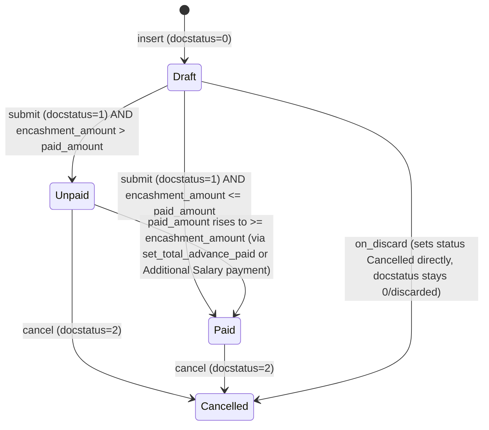

# Leave Encashment

**Source:** `hrms/hr/doctype/leave_encashment/leave_encashment.json`, `leave_encashment.py`, `leave_encashment.js`
**[[Submittable Document Lifecycle|Submittable]]:** yes   **Tree:** no   **[[Naming and Autoname Rules|Naming]]:** Expression (old style), pattern `HR-ENC-.YYYY.-.#####` (year-scoped, 5-digit auto-increment; `allow_rename: 1`)
**Module:** HR

Controller base class: `AccountsController` (from `erpnext.controllers.accounts_controller`) — NOT plain `Document`. This gives it accounting-dimension handling, GL-entry helpers (`get_gl_dict`), and advance-payment-ledger integration for free.

## Schema

Full field table, in JSON `field_order`:

| Field (fieldname) | Label | Type | Options/Link Target | Required | Default | Read-Only | Notes |
|---|---|---|---|---|---|---|---|
| employee | Employee | Link | [[Employee Core Model\|Employee]] | yes | - | no | `in_list_view` |
| employee_name | Employee Name | Data | - | no | - | yes | fetch_from `employee.employee_name` |
| department | Department | Link | Department | no | - | yes | fetch_from `employee.department` |
| company | Company | Link | Company | yes | - | no | fetch_from `employee.company` |
| leave_period | Leave Period | Link | [[Leave Period]] | yes | - | no | `in_list_view` |
| leave_type | Leave Type | Link | [[Leave Type]] | yes | - | no | `in_list_view` |
| leave_allocation | Leave Allocation | Link | [[Leave Allocation]] | no | - | yes | set on submit if not already set |
| leave_balance | Leave Balance | Float | - | no | - | yes | computed in `set_leave_balance` |
| actual_encashable_days | Actual Encashable Days | Float | - | no | - | yes | "Number of leaves eligible for encashment based on leave type settings" |
| encashment_days | Encashment Days | Float | - | no | - | no | `non_negative: 1`; user-overridable but capped by `actual_encashable_days` |
| encashment_amount | Encashment Amount | Currency | options=`currency` | no | - | yes | computed |
| accounting_section | Accounting | Section Break | - | - | - | - | groups: pay_via_payment_entry, expense_account, payable_account |
| pay_via_payment_entry | Pay Via Payment Entry | Check | - | no | 0 | no | "Process leave encashment via a separate Payment Entry instead of Salary Slip" |
| expense_account | Expense Account | Link | Account | mandatory_depends_on `pay_via_payment_entry` | - | no | depends_on `pay_via_payment_entry` |
| payable_account | Payable Account | Link | Account | mandatory_depends_on `pay_via_payment_entry` | - | no | depends_on `pay_via_payment_entry` |
| posting_date | Posting Date | Date | - | no | Today | no | depends_on `pay_via_payment_entry` |
| currency | Currency | Link | Currency | yes | - | yes | depends_on `eval:(doc.docstatus==1 \|\| doc.employee)` |
| paid_amount | Paid Amount | Currency | - | no | 0.0 | yes | depends_on `pay_via_payment_entry`; "Amount paid against this encashment" |
| accounting_dimensions_section | Accounting Dimensions | Section Break | - | - | - | - | depends_on `pay_via_payment_entry` |
| cost_center | Cost Center | Link | Cost Center | mandatory_depends_on `pay_via_payment_entry` | - | no | |
| payroll | Payroll | Section Break | - | - | - | - | depends_on `eval:doc.pay_via_payment_entry==0;` |
| encashment_date | Encashment Date | Date | - | no | Today | no | |
| additional_salary | Additional Salary | Link | [[Additional Salary]] | no | - | yes | set when paid via Salary Slip route |
| amended_from | Amended From | Link | [[Leave Encashment]] | no | - | yes | standard amendment field |
| status | Status | Select | "Draft\nUnpaid\nPaid\nSubmitted\nCancelled" | no | - | yes | computed in `set_status`; NOTE: "Submitted" is a listed option but is never actually assigned by `set_status` (see Port Notes) |

`track_changes: 1` is set on this doctype (unlike Leave Ledger Entry) — full field-level audit history is recorded automatically by the framework.

## Child Tables

None declared directly, but this doctype is linked FROM `Payment Entry Reference` (a child table of `Payment Entry`) via the `links` array — i.e. a Payment Entry can reference a Leave Encashment as `against_voucher`. No child table owned by Leave Encashment itself.

## State Machine

`status` is a display/derived field, NOT independently settable — it's fully determined by `docstatus` + payment state.

Plain list:
| From State | Event | To State | Guard Condition |
|---|---|---|---|
| (new) | insert | Draft | `set_status()` called from `validate()`; `docstatus==0` -> `status="Draft"` |
| Draft | submit | Unpaid | `docstatus==1` and `flt(encashment_amount) > flt(paid_amount, precision)` |
| Draft | submit | Paid | `docstatus==1` and `flt(encashment_amount) <= flt(paid_amount, precision)` (paid_amount only nonzero if pre-set, unusual at initial submit) |
| Unpaid | `set_total_advance_paid()` (called externally when a Payment Entry against this doc is reconciled) | Paid | new `paid_amount` (from summed Advance Payment Ledger Entries) makes `encashment_amount <= paid_amount` |
| Draft/Unpaid/Paid | cancel | Cancelled | `docstatus==2`; `on_cancel()` runs, then `set_status(update=True)` sets `status="Cancelled"` and calls `notify_update()` |
| Draft | `on_discard` (user discards an unsubmitted doc instead of deleting) | Cancelled (status field only) | `self.db_set("status", "Cancelled")` — note docstatus is not itself part of this path; this is a document-discard/scrap operation |

Port Notes: the `status` option list contains `"Submitted"` but no code path in `set_status()` ever assigns it — a straight docstatus==1 always resolves to "Unpaid" or "Paid", never "Submitted". Treat "Submitted" as dead/reserved in the enum for a port (do not implement logic requiring it, but keep the value in the schema enum for fidelity in case reports/filters reference it).

## Validation Rules (exact, in execution order)

Order follows `validate()` then `before_submit()`:

1. `set_employee_name(self)` — if `employee` is set and `employee_name` is empty, sets `employee_name` from `Employee.employee_name`. Not a throw, a correction. (source: `hrms.hr.utils.set_employee_name`, called from `validate`)
2. `validate_active_employee(self.employee)` -> IF the linked Employee's `status == "Inactive"` THEN `frappe.throw(_("Transactions cannot be created for an Inactive Employee {0}.").format(get_link_to_form("Employee", employee)), InactiveEmployeeStatusError)` (source: `hrms.hr.utils.validate_active_employee`, called from `validate`)
3. `self.encashment_date = self.encashment_date or getdate()` — default-fills today if unset. Not a throw. (source: `validate`)
4. `get_leave_details_for_encashment()` runs, itself an ordered chain (see Business Logic below) which can throw:
   - 4a. `set_leave_balance()` -> `get_leave_allocation()` returns None -> `frappe.throw(_("No Leaves Allocated to Employee: {0} for Leave Type: {1}").format(self.employee, self.leave_type))` (source: `set_leave_balance`)
   - 4b. `set_actual_encashable_days()` -> IF `Leave Type.allow_encashment` is falsy -> `frappe.throw(_("Leave Type {0} is not encashable").format(self.leave_type))` (source: `set_actual_encashable_days`)
   - 4c. `set_encashment_days()` -> IF `self.encashment_days > self.actual_encashable_days` -> `frappe.throw(_("Encashment Days cannot exceed {0} {1} as per Leave Type settings").format(bold(_("Actual Encashable Days")), self.actual_encashable_days))` (source: `set_encashment_days`)
   - 4d. `set_encashment_amount()` -> calls `set_salary_structure()` if `self._salary_structure` not yet set -> IF no assigned Salary Structure found for the employee on `encashment_date` -> `frappe.throw(_("No Salary Structure assigned to Employee {0} on the given date {1}").format(self.employee, frappe.bold(format_date(self.encashment_date))))` (source: `set_encashment_amount` -> `set_salary_structure`)
5. `self.set_status()` — recompute `status` display field from `docstatus`/amounts (no throw).
6. IF `not self.pay_via_payment_entry` THEN `self.set_salary_structure()` again — re-validates the same "No Salary Structure assigned..." condition as 4d if not already cached (idempotent; same message as above). (source: `validate`)
7. `before_submit()`: IF `not self.encashment_amount or self.encashment_amount <= 0` THEN `frappe.throw(_("You can only submit Leave Encashment for a valid encashment amount"))` (source: `before_submit`)

Note: `set_actual_encashable_days` also emits (non-throwing) `frappe.msgprint` warnings:
- IF `Leave Type.non_encashable_leaves` is set: `frappe.msgprint(_("Excluded {0} Non-Encashable Leaves for {1}").format(bold(encashment_settings.non_encashable_leaves), leave_form_link))`
- IF `Leave Type.max_encashable_leaves` is set: `frappe.msgprint(_("Maximum encashable leaves for {0} are {1}").format(leave_form_link, bold(encashment_settings.max_encashable_leaves)), title=_("Encashment Limit Applied"))`

And `set_total_advance_paid()` (called from outside the standard validate flow, when advance payment ledger entries change) has its own check:
8. IF `flt(paid_amount) > self.encashment_amount` THEN `frappe.throw(_("Row {0}# Paid Amount cannot be greater than Encashment amount"))` — Note: this message string literally contains an unformatted `{0}#` placeholder in source (no `.format()` call is applied) — reproduce the message text verbatim including the un-substituted `{0}`. (source: `set_total_advance_paid`)

## Business Logic / Calculations

### `get_leave_details_for_encashment()` — whitelisted, called on employee/leave_type/date change from client, and from `validate()`
Executes in this exact order:
1. `set_leave_balance()`
2. `set_actual_encashable_days()`
3. `set_encashment_days()`
4. `set_encashment_amount()`

### `set_leave_balance()`
1. `allocation = get_leave_allocation()` — finds the single `Leave Allocation` record (docstatus=1) for this `employee` + `leave_type` where `from_date <= encashment_date <= to_date`. Throws if none (Validation Rule 4a).
2. `leave_balance = allocation.total_leaves_allocated - allocation.carry_forwarded_leaves_count + get_leaves_for_period(employee, leave_type, allocation.from_date, encashment_date)`
   - `get_leaves_for_period` (imported from `Leave Application`) returns a negative number for leaves consumed in the period, so adding it here nets out consumption.
3. `self.leave_allocation = allocation.name`.

### `set_actual_encashable_days()`
1. Fetch `encashment_settings = {allow_encashment, non_encashable_leaves, max_encashable_leaves}` from the cached Leave Type doc.
2. IF `not encashment_settings.allow_encashment` -> throw (Validation Rule 4b).
3. `self.actual_encashable_days = self.leave_balance` (starting point).
4. IF `encashment_settings.non_encashable_leaves` is truthy:
   - `actual_encashable_days = self.leave_balance - encashment_settings.non_encashable_leaves`
   - `self.actual_encashable_days = actual_encashable_days if actual_encashable_days > 0 else 0` (clamped to zero floor)
   - msgprint warning shown (see above).
5. IF `encashment_settings.max_encashable_leaves` is truthy:
   - `self.actual_encashable_days = min(self.actual_encashable_days, encashment_settings.max_encashable_leaves)`
   - msgprint warning shown.

### `set_encashment_days()`
1. IF `self.encashment_days` is falsy (0/unset): `self.encashment_days = self.actual_encashable_days` (auto-fill default = full eligible balance).
2. IF `self.encashment_days > self.actual_encashable_days` -> throw (Validation Rule 4c). (Allows manual entry of a smaller number of days than the max, but never more.)

### `set_salary_structure()`
1. `self._salary_structure = get_assigned_salary_structure(employee, encashment_date)` (from `Salary Structure Assignment` doctype logic — external to this module).
2. IF none found -> throw (Validation Rule 4d/6).

### `set_encashment_amount()`
1. IF `self._salary_structure` attribute not yet set on the in-memory doc, call `set_salary_structure()` first.
2. `per_day_encashment` = lookup `Salary Structure Assignment.leave_encashment_amount_per_day` for `employee` + `salary_structure=self._salary_structure`, `docstatus=1`, `from_date <= encashment_date`, ordered by `from_date desc` (i.e. latest assignment on/before the encashment date).
3. IF not found on the assignment, fall back to `Salary Structure.leave_encashment_amount_per_day` (the structure-level default).
4. `per_day_encashment = per_day_encashment or 0`.
5. `self.encashment_amount = self.encashment_days * per_day_encashment if per_day_encashment > 0 else 0`.

### `set_status(update=False)`
1. `precision = self.precision("paid_amount")`.
2. IF `docstatus == 0`: `status = "Draft"`.
3. ELIF `docstatus == 1`: IF `flt(encashment_amount) > flt(paid_amount, precision)` THEN `status = "Unpaid"` ELSE `status = "Paid"`.
4. ELIF `docstatus == 2`: `status = "Cancelled"`.
5. IF `update` is True: persist via `self.db_set("status", status)` and call `self.notify_update()` (used from `on_cancel` and `set_total_advance_paid`, i.e. contexts outside the normal save flow). ELSE: just set `self.status = status` in memory (used inside `validate`, persisted by the normal save).

### `set_total_advance_paid()` (called externally, e.g. by Payment Entry reconciliation hooks in `erpnext`/`hrms.overrides`)
1. Sum `ABS(SUM(amount))` from `Advance Payment Ledger Entry` where `company`, `against_voucher_type=self.doctype`, `against_voucher_no=self.name`, `delinked=0`.
2. IF result > `self.encashment_amount` -> throw (Validation Rule 8).
3. `self.db_set("paid_amount", paid_amount)`.
4. `self.set_status(update=True)`.

### `create_leave_encashment(leave_allocation)` (module-level factory, called by the scheduled job — see below)
For each `allocation` in the input list:
1. IF `get_assigned_salary_structure(allocation.employee, allocation.to_date)` is falsy -> skip this allocation entirely (no encashment created, no error raised).
2. ELSE build and insert a new `Leave Encashment` doc: `leave_period=allocation.leave_period`, `employee=allocation.employee`, `leave_type=allocation.leave_type`, `encashment_date=allocation.to_date`, inserted with `ignore_permissions=True`. It is left in Draft status (not auto-submitted) — a human must review and submit it.

### `create_leave_ledger_entry(submit=True)`
1. Create a primary ledger entry: `args = {leaves: encashment_days * -1, from_date: encashment_date, to_date: encashment_date, is_carry_forward: 0}` via `hrms.hr.doctype.leave_ledger_entry.leave_ledger_entry.create_leave_ledger_entry(self, args, submit)`.
2. `leave_allocation = get_leave_allocation()`. IF none found: return (no reverse entry).
3. `to_date = leave_allocation.to_date`.
4. `can_expire = not Leave Type.is_carry_forward` (i.e. reverse-entry logic only applies if the leave type is NOT itself a carry-forward type).
5. IF `to_date < getdate()` AND `can_expire`: create a second, offsetting ledger entry with `args = {leaves: encashment_days (positive, i.e. reversing the debit), from_date: to_date, to_date: to_date, is_carry_forward: 0}` — this restores the encashed days back into the (already-expired) allocation's ledger balance for backdated/expired-allocation encashments, mirroring the equivalent logic in `Leave Application.on_submit`.

## [[Cross-Doctype Hooks (doc_events)|Lifecycle Hooks]] (exact)

| Event | What Runs | Side Effects on Other Doctypes |
|---|---|---|
| validate | see Validation Rules 1-6 | none direct; reads Employee, Leave Type, Leave Allocation, Salary Structure Assignment/Structure |
| before_submit | Validation Rule 7 (positive encashment_amount check) | none |
| on_submit | 1) IF `leave_allocation` not set, `db_set` it from `get_leave_allocation()`. 2) IF `pay_via_payment_entry`: `create_gl_entries()` (posts GL Entries via `erpnext.accounts.general_ledger.make_gl_entries`). ELSE: `create_additional_salary()`. 3) `set_encashed_leaves_in_allocation()`. 4) `create_leave_ledger_entry()`. | Creates `Additional Salary` (submitted) OR `GL Entry` rows; increments `Leave Allocation.total_leaves_encashed`; creates `Leave Ledger Entry` row(s) |
| on_cancel | 1) IF `additional_salary` set: cancel that `Additional Salary` doc, then clear the field via `db_set`. 2) IF `leave_allocation` set: decrement `Leave Allocation.total_leaves_encashed` by `self.encashment_days` via raw `db.set_value`. 3) IF `pay_via_payment_entry`: `create_gl_entries(cancel=True)` (reversing GL entries). 4) `create_leave_ledger_entry(submit=False)` — deletes the ledger rows created on submit (see `Leave Ledger Entry`'s `delete_ledger_entry`). 5) `self.ignore_linked_doctypes = ["GL Entry", "Payment Ledger Entry", "Advance Payment Ledger Entry"]` (permits cancel despite these linked docs existing). 6) `set_status(update=True)`. | Cancels `Additional Salary`; decrements `Leave Allocation.total_leaves_encashed`; reverses/removes GL Entries; deletes Leave Ledger Entry rows |
| on_discard | `self.db_set("status", "Cancelled")` | none beyond the status field |

## Whitelisted / API Methods

| Method name | HTTP-equivalent purpose | Args | Returns | What it does |
|---|---|---|---|---|
| `get_leave_details_for_encashment` (instance method) | Recompute balance/eligibility/amount fields, e.g. on client-side field change | none (operates on `self`/`frm.doc`) | none (mutates document fields in place) | Runs `set_leave_balance` -> `set_actual_encashable_days` -> `set_encashment_days` -> `set_encashment_amount` in order |

Other functions used by this doctype (`create_additional_salary`, `create_gl_entries`, `get_gl_entries`, `set_total_advance_paid`, `create_leave_encashment`) are plain (non-whitelisted) Python functions/methods, not directly callable from a client.

## Permissions

| Role | Read | Write | Create | Delete | Submit | Cancel | Amend | Report | Export | Notes |
|---|---|---|---|---|---|---|---|---|---|---|
| System Manager | 1 | 1 | 1 | 1 | 1 | 1 | 1 | 1 | 1 | share=1, email=1, print=1 |
| HR Manager | 1 | 1 | 1 | 1 | 1 | 1 | 1 | 1 | 1 | share=1, email=1, print=1 |
| HR User | 1 | 1 | 1 | 1 | 1 | 1 | 1 | 1 | 1 | share=1, email=1, print=1 |
| Employee | 1 | 1 | 1 | 1 | - | - | - | 1 | 1 | share=1, email=1, print=1; no submit/cancel/amend granted |

## [[Background Jobs (Scheduler Events)|Scheduled Jobs]] Touching This Doctype

| Frequency | Function | What it does |
|---|---|---|
| daily_long | `hrms.hr.utils.generate_leave_encashment` | IF `HR Settings.auto_leave_encashment` is enabled: finds all `Leave Type` names with `allow_encashment=1`; finds all `Leave Allocation` rows whose `to_date == yesterday` (`add_days(getdate(), -1)`) and `leave_type in <that list>`; calls `create_leave_encashment(leave_allocation=<those rows>)` (see Business Logic above — this creates one Draft Leave Encashment per matching allocation, skipping employees with no assigned Salary Structure on that date) |

## Related Doctypes

- [[Employee Core Model]] — the employee being paid out; `employee` Link field.
- [[Leave Period]] — `leave_period` Link field.
- [[Leave Type]] — `leave_type` Link field; governs encashment eligibility, thresholds, and earning component.
- [[Leave Allocation]] — `leave_allocation` Link field; read for balance, and its `total_leaves_encashed` is incremented/decremented on submit/cancel.
- [[Additional Salary]] — `additional_salary` Link field; created+submitted when NOT `pay_via_payment_entry`, cancelled on this doc's cancel.
- [[Leave Ledger Entry]] — created on submit (debit + possible reversing entry for expired allocations), deleted on cancel.
- [[Salary Structure Assignment]] — read for the per-day encashment rate (`leave_encashment_amount_per_day`) and to resolve the assigned salary structure.
- [[Salary Structure]] — fallback source for `leave_encashment_amount_per_day` when not set on the assignment.
- [[Leave Encashment]] — `amended_from` self-referencing Link field, standard Frappe amend-chain pointer.

## Port Notes

- **AccountsController inheritance**: this doctype is NOT a plain document — it inherits from `erpnext`'s `AccountsController`, which brings in default handling for `get_gl_dict`, accounting dimensions (`cost_center`, company defaulting), and multi-currency behavior. A from-scratch port must explicitly implement: (a) GL entry posting/reversal semantics used in `create_gl_entries`/`get_gl_entries`, (b) accounting-dimension validation, (c) currency-precision rounding on `Currency` fields (`encashment_amount`, `paid_amount`) — Frappe auto-rounds Currency fields to the site's currency precision on save, which does not happen for free in a generic ORM.
- **Two mutually-exclusive payment paths** driven by `pay_via_payment_entry`: TRUE -> posts a payable/expense GL entry pair directly (paid via a manually created Payment Entry later, tracked through `Advance Payment Ledger Entry`); FALSE (default) -> creates and submits an `Additional Salary` record which is later paid out through payroll (Salary Slip generation, outside this doctype's scope).
- `Additional Salary.salary_component` is populated from `Leave Type.earning_component` — IF that field is blank on the Leave Type, `create_additional_salary` throws `_("Please set Earning Component for Leave type: {0}.").format(self.leave_type)`. This is a validation that only fires deep inside `on_submit` (not in `validate()`), meaning a doc can pass `validate()` yet still fail at submit-time here — reproduce this exact late-binding order in a port (do not move it earlier without noting the behavior change).
- The `status` Select field's option list has a dead value `"Submitted"` that the controller logic never assigns — see State Machine section.
- `currency` field is `reqd: 1` but only conditionally shown (`depends_on: eval:(doc.docstatus==1 || doc.employee)`), and there's no explicit controller line setting it — it must be populated client-side (see `.js` `get_employee_currency` on the `employee` change event, which calls `hrms.payroll.doctype.salary_structure_assignment.salary_structure_assignment.get_employee_currency`). **Port Notes callout**: server-side `validate()` has no fallback to auto-populate `currency` if the client never calls that endpoint — a headless/API-driven creation of a Leave Encashment could leave `currency` empty despite `reqd: 1`, unless the new stack adds an explicit server-side default. This is a client-side-only default with no server equivalent in source; a server-authoritative port MUST add one.
- `track_changes: 1` — full document revision history is automatically maintained by the framework; a port needs an explicit audit/version table for this doctype if that behavior is required.
- Naming pattern `HR-ENC-.YYYY.-.#####` combines the literal year token and a global (not year-reset per source) auto-increment counter as interpreted by Frappe's naming series engine — confirm the exact reset behavior (per-year vs global sequence) against the target Frappe version if exact document numbers must match; treat it as "auto-incrementing, year-prefixed" for a new implementation.
