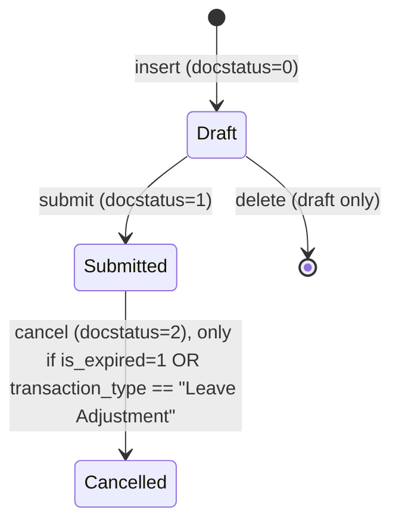

# Leave Ledger Entry

**Source:** `hrms/hr/doctype/leave_ledger_entry/leave_ledger_entry.json`, `leave_ledger_entry.py`, `leave_ledger_entry.js`, `leave_ledger_entry_list.js`
**[[Submittable Document Lifecycle|Submittable]]:** yes   **Tree:** no   **[[Naming and Autoname Rules|Naming]]:** Default (hash-based auto-generated `name`, no `autoname` key present in JSON — Frappe falls back to the default `hash` naming rule since `naming_rule` is not set in this JSON, unlike other doctypes in the module)
**Module:** HR

## Purpose

This is the immutable, append-only accounting ledger for all leave balance movements. Every `Leave Allocation`, `Leave Application`, `Leave Encashment`, and `Leave Adjustment` transaction writes one or more rows here (positive `leaves` = credit/allocation, negative `leaves` = debit/consumption). All leave-balance calculations (in `Leave Application`'s `get_leave_balance_on` and related functions) are derived by summing/filtering rows in this ledger — it is the single source of truth for leave balance, not a running total stored elsewhere.

## Schema

Full field table, in JSON `field_order`:

| Field (fieldname) | Label | Type | Options/Link Target | Required | Default | Read-Only | Notes |
|---|---|---|---|---|---|---|---|
| employee | Employee | Link | [[Employee Core Model\|Employee]] | no (no `reqd` flag) | - | no | `in_list_view`, `in_standard_filter`, `search_index` |
| employee_name | Employee Name | Data | - | no | - | no | fetch_from `employee.employee_name` |
| leave_type | Leave Type | Link | [[Leave Type]] | no | - | no | `in_list_view`, `in_standard_filter`, `search_index` |
| transaction_type | Transaction Type | Link | DocType | no | - | no | `in_standard_filter`, `search_index`. Values used in practice: "Leave Allocation", "Leave Application", "Leave Encashment", "Leave Adjustment" |
| transaction_name | Transaction Name | Dynamic Link | dynamic on `transaction_type` | no | - | no | `search_index`; points to the source document (e.g. the Leave Application name) |
| company | Company | Link | Company | yes | - | yes | fetch_from `employee.company` |
| leaves | Leaves | Float | - | no | - | no | signed: positive = credit (allocation/encashment reversal), negative = debit (consumption/expiry) |
| from_date | From Date | Date | - | no | - | no | |
| to_date | To Date | Date | - | no | - | no | |
| holiday_list | Holiday List | Link | Holiday List | no | - | no | |
| is_carry_forward | Is Carry Forward | Check | - | no | 0 | no | |
| is_expired | Is Expired | Check | - | no | 0 | no | marks an entry created to expire a previous allocation |
| is_lwp | Is Leave Without Pay | Check | - | no | 0 | no | |
| amended_from | Amended From | Link | [[Leave Ledger Entry]] | no | - | yes | standard amendment field |

## Child Tables

None.

## State Machine

Standard submittable lifecycle only — no custom `status`/`workflow_state` field.

Plain list:
| From State | Event | To State | Guard Condition |
|---|---|---|---|
| (none) | insert via `create_leave_ledger_entry(ref_doc, args, submit=True)` | Draft (docstatus=0) | called from Leave Application / Leave Allocation / Leave Encashment controllers |
| Draft | submit | Submitted (docstatus=1) | `Document.submit()` default framework behavior; entry's own `validate()` must pass |
| Submitted | cancel | Cancelled (docstatus=2) | Only allowed if `self.is_expired == 1` (expiry entries can always be cancelled) OR `self.transaction_type != "Leave Adjustment"` is FALSE is not the condition — re-read: cancel succeeds unless `is_expired` is falsy AND `transaction_type == "Leave Adjustment"`... see exact logic below |
| Draft | not submitted, deleted via `delete_ledger_entry()` | (row deleted) | called instead of cancel when `submit=False` is passed to `create_leave_ledger_entry` |

Note on `on_cancel` guard — reproduce exactly (see Validation Rules below); it is an ALLOW-list, not a simple boolean.

## Validation Rules (exact, in execution order)

1. `getdate(self.from_date) > getdate(self.to_date)` -> `frappe.throw(_("Leave Ledger Entry's To date needs to be after From date. Currently, From Date is {0} and To Date is {1}").format(frappe.bold(formatdate(self.from_date)), frappe.bold(formatdate(self.to_date))), exc=InvalidLeaveLedgerEntry, title=_("Invalid Leave Ledger Entry"))` (source: `validate`)
2. On cancel (`on_cancel`): IF `self.is_expired` is truthy THEN allow cancel and set `Leave Allocation.expired = 0` on the linked transaction (`frappe.db.set_value("Leave Allocation", self.transaction_name, "expired", 0)`). ELSE IF `self.transaction_type != "Leave Adjustment"` THEN `frappe.throw(_("Only expired allocation can be cancelled"))`. ELSE (transaction_type == "Leave Adjustment" and not expired) allow cancel with no special side effect. (source: `on_cancel`)
3. In `delete_ledger_entry(ledger)` (called when a linked doc is cancelled with `submit=False`, e.g. Leave Application on_cancel): IF `ledger.transaction_type == "Leave Allocation"` THEN call `validate_leave_allocation_against_leave_application(ledger)` which checks for any Leave Ledger Entry rows with `transaction_type == "Leave Application"`, same `employee`+`leave_type`, whose `from_date >= ledger.from_date` and `to_date <= ledger.to_date` -> if any exist: `frappe.throw(_("Leave allocation {0} is linked with the Leave Application {1}").format(ledger.transaction_name, ", ".join(get_link_to_form("Leave Application", application) for application in leave_application_records)))` (source: `validate_leave_allocation_against_leave_application`)

## Business Logic / Calculations

This doctype itself performs no leave-day arithmetic (that lives in `Leave Application`); it is written to and read from by other doctypes' controllers. Its own module-level functions:

### `create_leave_ledger_entry(ref_doc, args, submit=True)`
1. Build a base dict: `doctype="Leave Ledger Entry"`, `employee=ref_doc.employee`, `employee_name=ref_doc.employee_name`, `leave_type=ref_doc.leave_type`, `transaction_type=ref_doc.doctype`, `transaction_name=ref_doc.name`, `is_carry_forward=0`, `is_expired=0`, `is_lwp=0`.
2. Merge caller-supplied `args` on top (overriding any of the above, e.g. `leaves`, `from_date`, `to_date`, `is_carry_forward`, `is_expired`, `is_lwp`, `holiday_list`).
3. IF `submit` is True: `frappe.get_doc(ledger)`, set `flags.ignore_permissions = 1`, then `.submit()`.
4. ELSE: call `delete_ledger_entry(ledger)` (removes matching existing rows instead of writing a new one — used to reverse a ledger entry on cancellation of the source document).

### `delete_ledger_entry(ledger)`
1. IF `ledger.transaction_type == "Leave Allocation"`: run `validate_leave_allocation_against_leave_application(ledger)` (see Validation Rules #3).
2. Look up `expired_entry = get_previous_expiry_ledger_entry(ledger)` — the id of an expiry-entry created at the same `creation` timestamp (see below) for the same employee/leave_type, that is `is_expired=1`, `docstatus=1`, `is_carry_forward=0`.
3. Delete ALL Leave Ledger Entry rows where `transaction_name == ledger.transaction_name` OR `name == expired_entry` (a raw SQL delete via query builder, bypassing normal `cancel`/`delete` document lifecycle — no `on_trash`/`on_cancel` hooks fire).

### `get_previous_expiry_ledger_entry(ledger)`
1. Find the `creation` timestamp of the (still non-expired) Leave Ledger Entry row for `transaction_name = ledger.transaction_name`, `is_expired=0`, `transaction_type="Leave Allocation"`.
2. Format that timestamp as `DATE_FORMAT` (date only, no time) and use a `LIKE 'YYYY-MM-DD%'` match to find a companion row created the same calendar day with `is_expired=1`, `docstatus=1`, `is_carry_forward=0`, same `employee`+`leave_type`.
3. Return its `name` (or falsy if none).

### `process_expired_allocation()` (called by scheduler — see Scheduled Jobs)
1. Fetch all `Leave Type` names where `expire_carry_forwarded_leaves_after_days > 0` -> `leave_type` list (defaults to `[""]` if none, so the NOT-IN filter below still behaves).
2. Build a correlated-subquery filter: an allocation ledger entry `Ledger` (aliased `l`) is a candidate for expiry only if there is NO OTHER non-cancelled (`docstatus=1`) ledger row for the same `transaction_name`/`transaction_type="Leave Allocation"` that either (a) has the same `is_carry_forward` flag as `Ledger`, or (b) has `is_carry_forward=0` AND belongs to a leave type NOT in the "has carry-forward expiry" list above. (This is how a two-phase allocation — new leaves entry + a later carry-forward entry — is prevented from being expired twice, and single-phase allocations without carry-forward expiry rules are still caught.)
3. Select all `Leave Ledger Entry` rows where `transaction_type == "Leave Allocation"` AND `to_date < today()` AND the above "no sibling entry" condition holds (`ExistsCriterion(inner_query).negate()`).
4. For each such allocation row, call `create_expiry_ledger_entry`.

### `create_expiry_ledger_entry(allocations)`
For each allocation row: IF `allocation.is_carry_forward` THEN call `expire_carried_forward_allocation(allocation)` ELSE call `expire_allocation(allocation)`.

### `expire_allocation(allocation, expiry_date=None)` — `@frappe.whitelist()`
1. If `allocation` is passed as a JSON string, parse it and re-fetch the actual `Leave Allocation` document by `name`.
2. IF `allocation.docstatus == 2` (already cancelled): return immediately, no-op.
3. Check `frappe.has_permission("Leave Allocation", "write", allocation.name, throw=True)`.
4. `leaves = get_remaining_leaves(allocation)` — SUM of `leaves` from Leave Ledger Entry rows for this employee/leave_type where `to_date <= allocation.to_date` and `docstatus=1`.
5. `expiry_date = expiry_date or allocation.to_date`.
6. IF `leaves` is truthy (non-zero): create a new ledger entry via `create_leave_ledger_entry(allocation, args)` where `args = {leaves: -leaves, transaction_name: allocation.name, transaction_type: "Leave Allocation", from_date: expiry_date, to_date: expiry_date, is_carry_forward: 0, is_expired: 1}`.
7. Always set `Leave Allocation.expired = 1` via `frappe.db.set_value`.

### `expire_carried_forward_allocation(allocation)`
1. `leaves_taken = get_leaves_for_period(allocation.employee, allocation.leave_type, allocation.from_date, allocation.to_date, skip_expired_leaves=False)` (imported from `Leave Application` — see that file's Business Logic section for the full algorithm).
2. `leaves = allocation.leaves + leaves_taken` (i.e. originally-carried-forward leaves reduced by what was already consumed, including previously-expired amounts because `skip_expired_leaves=False`).
3. IF `leaves > 0`: create a ledger entry via `create_leave_ledger_entry(allocation, args)` where `args = {transaction_name: allocation.name, transaction_type: "Leave Allocation", leaves: -leaves, is_carry_forward: allocation.is_carry_forward, is_expired: 1, from_date: allocation.to_date, to_date: allocation.to_date}`.

### `get_remaining_leaves(allocation)`
Returns `SUM(leaves)` from Leave Ledger Entry where `employee`, `leave_type` match, `to_date <= allocation.to_date`, `docstatus=1`.

## [[Cross-Doctype Hooks (doc_events)|Lifecycle Hooks]] (exact)

| Event | What Runs | Side Effects on Other Doctypes |
|---|---|---|
| validate | Checks `from_date <= to_date`, else throws `InvalidLeaveLedgerEntry` | none |
| on_cancel | Allow-list check (is_expired=1, or non-"Leave Adjustment" throws) | If `is_expired`: sets `Leave Allocation.expired = 0` on the referenced allocation |
| on_doctype_update | Adds a DB index on `["transaction_type", "transaction_name"]` | Schema/index only, not row-level |

Note: there is no explicit `on_submit`/`before_insert` in the controller — submission is plain framework default behavior.

## Whitelisted / API Methods

| Method name | HTTP-equivalent purpose | Args | Returns | What it does |
|---|---|---|---|---|
| `expire_allocation` | Force-expire a Leave Allocation's remaining balance | `allocation` (Leave Allocation name, dict, or JSON string), `expiry_date` (optional date) | none (side effects only) | See Business Logic above; requires write permission on the Leave Allocation |

## Permissions

| Role | Read | Write | Create | Delete | Submit | Cancel | Amend | Report | Export | Notes |
|---|---|---|---|---|---|---|---|---|---|---|
| System Manager | 1 | 1 | 1 | 1 | 1 | - (not listed, but note: cancel not explicitly in JSON for System Manager row — see raw permission below) | - | 1 | 1 | share=1, email=1, print=1 |
| HR Manager | 1 | 1 | 1 | 1 | 1 | 1 | - | 1 | 1 | share=1, email=1, print=1 |
| HR User | 1 | 1 | 1 | 1 | 1 | - | - | 1 | 1 | share=1, email=1, print=1 |
| All | 1 | 1 | 1 | 1 | 1 | - | - | 1 | 1 | `if_owner: 1` — restricted to records the user owns; share=1, email=1, print=1 |

Raw JSON permission rows (verbatim booleans, for exactness):
- System Manager: create=1, delete=1, email=1, export=1, print=1, read=1, report=1, share=1, submit=1, write=1 (no `cancel`, no `amend` key present)
- HR Manager: cancel=1, create=1, delete=1, email=1, export=1, print=1, read=1, report=1, share=1, submit=1, write=1 (no `amend` key present)
- HR User: create=1, delete=1, email=1, export=1, print=1, read=1, report=1, share=1, submit=1, write=1 (no `cancel`, no `amend`)
- All: create=1, delete=1, email=1, export=1, if_owner=1, print=1, read=1, report=1, share=1, submit=1, write=1 (no `cancel`, no `amend`)

Port Notes: no role in the source JSON has `amend: 1`, and only HR Manager has explicit `cancel: 1` — despite that, `Document.cancel()` for System Manager/HR User/All roles is governed by Frappe's implicit rule that any role able to `submit` a doctype can also `cancel` unless the framework version enforces the JSON flag strictly; a from-scratch port MUST decide explicitly whether cancel requires a separate permission bit (safer: require it explicitly, matching HR Manager only, and grant System Manager admin override).

## [[Background Jobs (Scheduler Events)|Scheduled Jobs]] Touching This Doctype

| Frequency | Function | What it does |
|---|---|---|
| daily_long | `hrms.hr.doctype.leave_ledger_entry.leave_ledger_entry.process_expired_allocation` | Finds Leave Allocation ledger rows whose `to_date` is in the past with no existing expiry sibling, and creates expiry ledger entries (see Business Logic above) |

(`hrms.hr.utils.generate_leave_encashment` and `hrms.hr.utils.allocate_earned_leaves` also run `daily_long` and interact with allocations/encashments that write to this ledger, but they are not defined in this doctype's own files — see `Leave Encashment.md` for `generate_leave_encashment`.)

## Related Doctypes

- [[Employee Core Model]] — the employee this ledger row's balance movement belongs to; `employee` Link field.
- [[Leave Type]] — `leave_type` Link field.
- [[Leave Allocation]] — primary source/target of allocation, carry-forward, and expiry entries; `transaction_type`/`transaction_name` Dynamic Link when the source is an allocation, and this doctype writes back `Leave Allocation.expired`.
- [[Leave Application]] — a common source doctype for consumption (debit) entries; also supplies `get_leaves_for_period` used by the expiry algorithms.
- [[Leave Encashment]] — a source doctype for encashment (debit) entries.
- [[Leave Adjustment]] — a source doctype for signed adjustment entries.
- [[Leave Ledger Entry]] — `amended_from` self-referencing Link field, standard Frappe amend-chain pointer.

## Port Notes

- **Immutable ledger, but rows ARE physically deleted on reversal** — `delete_ledger_entry` runs a raw SQL `DELETE`, not a cancel. A port must replicate this: reversing a Leave Application/Encashment before its ledger entry was ever submitted (`submit=False` path) hard-deletes the corresponding ledger rows rather than creating an offsetting entry. This is different from normal accounting-ledger immutability and must be called out to whoever designs the new schema — if audit-trail completeness matters more than matching legacy behavior exactly, consider soft-delete/tombstone instead, but note the deviation.
- No `naming_rule`/`autoname` key exists in the JSON — this doctype uses Frappe's default random-hash primary key generation for `name`. A relational port should use a UUID or its own PK strategy for this table; there is no meaningful naming series to preserve.
- The correlated-subquery expiry logic in `process_expired_allocation` is one of the more subtle pieces of business logic in the whole module — the "does this allocation have a sibling entry" check is what prevents double-expiring a leave type that got a carry-forward *and* a new-leave ledger row from the same `Leave Allocation` transaction. Reproduce it exactly as a two-phase filter, not a simplified "one row per allocation" assumption.
- `docstatus`, `owner`, `creation`, `modified`, `modified_by` are framework-provided audit columns on every Frappe doctype (auto-timestamps, auto user-stamping) — these must be added explicitly to any relational table modelling this doctype, they are not declared in the `fields` array.
- `track_changes` is not set on this doctype (absent from JSON, defaults to falsy) — no version/audit-trail history is auto-recorded, unlike `Leave Encashment` which does set `track_changes: 1`.
