# Leave Policy Assignment

**Source:** `hrms/hr/doctype/leave_policy_assignment/leave_policy_assignment.json`, `leave_policy_assignment.py`, `leave_policy_assignment.js`, `leave_policy_assignment_list.js`
**[[Submittable Document Lifecycle|Submittable]]:** yes   **Tree:** no   **[[Naming and Autoname Rules|Naming]]:** `HR-LPOL-ASSGN-.#####` (naming series: literal prefix `HR-LPOL-ASSGN-` + auto-incrementing 5-digit counter, e.g. `HR-LPOL-ASSGN-00001`; no year token, unlike `Leave Policy`/`Leave Period`)
**Module:** HR

This doctype is the trigger point for actual leave allocation creation: submitting it creates one or more `Leave Allocation` documents (out of this module agent's scope to fully document, but its creation contract is captured below since this controller builds and submits it directly).

## Schema

Full field table, in JSON `field_order`:

| Field (fieldname) | Label | Type | Options/Link Target | Required | Default | Read-Only | Notes |
|---|---|---|---|---|---|---|---|
| employee | Employee | Link | [[Employee Core Model\|Employee]] | Yes (`reqd`) | — | No | `in_list_view: 1`, `in_standard_filter: 1` |
| employee_name | Employee name | Data | — | No | — | Yes | `fetch_from: employee.employee_name` |
| company | Company | Link | Company | No | — | Yes | `fetch_from: employee.company`; `in_standard_filter: 1`. Note: JSON field order places this after `assignment_based_on`/dates but it is documented here near `employee` for grouping — actual JSON order is preserved in the diagram/list below |
| leave_policy | Leave Policy | Link | [[Leave Policy]] | Yes (`reqd`) | — | No | `in_list_view: 1`, `in_standard_filter: 1`; client script restricts link-query to `docstatus: 1` (submitted policies only) |
| assignment_based_on | Assignment based on | Select | "" / Leave Period / Joining Date | No | — | No | `allow_in_quick_entry: 1` |
| leave_period | Leave Period | Link | [[Leave Period]] | Conditionally (`mandatory_depends_on: eval:doc.assignment_based_on == "Leave Period"`) | — | No | `depends_on` same condition; `allow_in_quick_entry: 1`; client script restricts link-query to `is_active: 1` AND `company == frm.doc.company` |
| effective_from | Effective From | Date | — | Yes (`reqd`) | — | Conditionally (`read_only_depends_on: eval:doc.assignment_based_on`, i.e. read-only in UI whenever `assignment_based_on` has any truthy value) | Auto-set server-side by `set_dates()` when `assignment_based_on` is "Leave Period" or "Joining Date" (see Validation Rules) |
| effective_to | Effective To | Date | — | Yes (`reqd`) | — | Conditionally (`read_only_depends_on: eval:doc.assignment_based_on == "Leave Period"`) | Auto-set server-side by `set_dates()` when `assignment_based_on` is "Leave Period"; for "Joining Date" it defaults to `date_of_joining + 12 months` (last day) only if not already provided |
| carry_forward | Add unused leaves from previous allocations | Check | — | No | 0 | No | `allow_in_quick_entry: 1` |
| leaves_allocated | Leaves Allocated | Check | — | No | 0 | No | `hidden: 1`, `no_copy: 1`, `print_hide: 1` — internal flag set to 1 by `grant_leave_alloc_for_employee()` after allocation creation, used as an idempotency/re-entry guard |
| amended_from | Amended From | Link | [[Leave Policy Assignment]] | No | — | Yes | `no_copy: 1`, `print_hide: 1`; standard amendment-chain pointer |

`title_field: "employee_name"`, `track_changes: 1`.

## Child Tables

None.

## State Machine

```mermaid
stateDiagram-v2
    [*] --> Draft
    Draft --> Submitted: submit (docstatus 0 -> 1); on_submit calls grant_leave_alloc_for_employee()
    Submitted --> Cancelled: cancel (docstatus 1 -> 2); no on_cancel override defined
    Cancelled --> Draft: amend (creates new draft doc with amended_from pointer)
```

Plain list:
- (Draft, submit, Submitted, guard: `validate()` must pass — `set_dates`, `validate_policy_assignment_overlap`, `warn_about_carry_forwarding`; on entering Submitted, `on_submit` -> `grant_leave_alloc_for_employee()` runs, which itself guards on `leaves_allocated` already being 1 -> throws if so)
- (Submitted, cancel, Cancelled, guard: none beyond standard cancel permission; no custom `on_cancel` logic exists on this controller — cancelling a Leave Policy Assignment does NOT automatically cancel the `Leave Allocation` records it created, unless that is handled generically elsewhere via `frm.ignore_doctypes_on_cancel_all` client hint, which excludes `Leave Ledger Entry` from the standard "cancel all linked docs" prompt but does not exclude `Leave Allocation` — flag this as a gap to verify against `Leave Allocation`'s own `on_cancel`, out of this module agent's scope)
- (Cancelled, amend, Draft, guard: standard Frappe amend flow; note the new amended draft would have `leaves_allocated` copied as `no_copy: 1`? — actually `leaves_allocated` has no `no_copy` flag set, meaning IT IS copied to the amended doc, so an amended-from-cancelled assignment could start with `leaves_allocated = 1` already, blocking re-allocation via `grant_leave_alloc_for_employee`'s throw. This is a notable edge case — flagged in Port Notes.)

## Validation Rules (exact, in execution order)

`validate()` calls, in order: `set_dates()` -> `validate_policy_assignment_overlap()` -> `warn_about_carry_forwarding()`.

1. **`set_dates`** — IF `assignment_based_on == "Leave Period"` THEN set `self.effective_from, self.effective_to = frappe.db.get_value("Leave Period", self.leave_period, ["from_date", "to_date"])` (both dates are force-overwritten from the linked Leave Period, unconditionally). ELSE IF `assignment_based_on == "Joining Date"` THEN set `self.effective_from = frappe.db.get_value("Employee", self.employee, "date_of_joining")` (unconditionally overwritten); THEN IF `self.effective_to` is not already set, set it to `get_last_day(add_months(self.effective_from, 12))` (i.e. the last calendar day of the month 12 months after the joining date). ELSE (assignment_based_on is empty/unset) neither date is touched — the user-entered `effective_from`/`effective_to` values stand as-is. (source: `set_dates`; not an error-throwing rule, a value-correction rule.)
2. **`validate_policy_assignment_overlap`**: query `frappe.db.get_value("Leave Policy Assignment", {"employee": self.employee, "name": ("!=", self.name), "docstatus": 1, "effective_to": (">=", self.effective_from), "effective_from": ("<=", self.effective_to)}, "leave_policy")` — i.e. find any OTHER submitted (`docstatus: 1`) Leave Policy Assignment for the same employee whose `[effective_from, effective_to]` range overlaps this document's range (standard interval-overlap test: `other.effective_to >= this.effective_from AND other.effective_from <= this.effective_to`). IF found -> `frappe.throw(_("Leave Policy: {0} already assigned for Employee {1} for period {2} to {3}").format(bold(leave_policy_assignment), bold(self.employee), bold(formatdate(self.effective_from)), bold(formatdate(self.effective_to))), title=_("Leave Policy Assignment Overlap"))` (source: `validate_policy_assignment_overlap`). Note: this check runs even on a Draft (unsubmitted) save, comparing against other already-Submitted assignments only.
3. **`warn_about_carry_forwarding`** — non-blocking. IF `self.carry_forward` is falsy -> return immediately (no-op). ELSE: load all `Leave Type` details via `get_leave_type_details()`; load the linked `Leave Policy` document; for each `policy` row in `leave_policy.leave_policy_details` (table order): look up `leave_type = leave_types.get(policy.leave_type)`. IF `not leave_type.is_carry_forward` -> `frappe.msgprint(_("Leaves for the Leave Type {0} won't be carry-forwarded since carry-forwarding is disabled.").format(frappe.bold(get_link_to_form("Leave Type", leave_type.name))), indicator="orange", alert=True)` — a warning toast per non-carry-forward-enabled leave type found in the policy; does NOT block save/submit (source: `warn_about_carry_forwarding`).

**`on_submit`** calls `grant_leave_alloc_for_employee()`:

4. IF `self.leaves_allocated` is already truthy -> `frappe.throw(_("Leave already have been assigned for this Leave Policy Assignment"))` (idempotency guard; source: `grant_leave_alloc_for_employee`).
5. ELSE: load `leave_type_details = get_leave_type_details()` (all Leave Types with fields `name, is_lwp, is_earned_leave, is_compensatory, allow_negative, allocate_on_day, is_carry_forward, expire_carry_forwarded_leaves_after_days, earned_leave_frequency, rounding`); load the `Leave Policy` document; load `date_of_joining = frappe.db.get_value("Employee", self.employee, "date_of_joining")`. For each `leave_policy_detail` row in `leave_policy.leave_policy_details` (table order): look up `leave_details = leave_type_details.get(leave_policy_detail.leave_type)`. IF `not leave_details.is_lwp` (i.e. skip Leave-Without-Pay leave types entirely — no allocation is ever created for LWP leave types via this flow) THEN call `self.create_leave_allocation(leave_policy_detail.annual_allocation, leave_details, date_of_joining)` and record the result. After the loop, `self.db_set("leaves_allocated", 1)` (direct DB write bypassing another full `validate`/save cycle) and return the `leave_allocations` dict (`{leave_type_name: {"name": allocation_name_or_None, "leaves": leaves_count}}`).

## Business Logic / Calculations

### A. `create_leave_allocation(annual_allocation, leave_details, date_of_joining)`

1. `carry_forward = self.carry_forward`; IF `self.carry_forward` is truthy AND `leave_details.is_carry_forward` is falsy THEN force `carry_forward = 0` (i.e. carry-forward is only actually applied to the new allocation if BOTH the assignment requests it AND the leave type allows it).
2. `new_leaves_allocated = self.get_new_leaves(annual_allocation, leave_details, date_of_joining)` (see algorithm B).
3. IF `leave_details.is_earned_leave` THEN `earned_leave_schedule = self.get_earned_leave_schedule(annual_allocation, leave_details, date_of_joining, new_leaves_allocated)` (see algorithm D) ELSE `earned_leave_schedule = []`.
4. IF `new_leaves_allocated == 0` AND `not leave_details.is_earned_leave` AND `not leave_details.allow_negative` THEN: skip creating a `Leave Allocation` entirely; instead insert a `Comment` (doctype `Comment`, `comment_type: "Comment"`, `reference_doctype: "Leave Policy Assignment"`, `reference_name: self.name`) with text `_("Leave allocation is skipped for {0}, because number of leaves to be allocated is 0.").format(bold(leave_details.name))`; return `(None, 0)`.
5. ELSE: build and insert a new `Leave Allocation` document with: `employee=self.employee`, `leave_type=leave_details.name`, `from_date=self.effective_from`, `to_date=self.effective_to`, `new_leaves_allocated=new_leaves_allocated`, `leave_period=self.leave_period if self.assignment_based_on == "Leave Policy" else ""` (NOTE: this compares `assignment_based_on` to the literal string `"Leave Policy"`, which is **not one of the doctype's own Select options** — the actual options are `""`, `"Leave Period"`, `"Joining Date"`. This condition can therefore never be true, so `leave_period` on the created `Leave Allocation` is effectively **always set to `""`** regardless of how the assignment was made. Flagged explicitly per ground rules as a likely bug in the source that a port must decide whether to reproduce byte-for-byte or fix to compare against `"Leave Period"`.), `leave_policy_assignment=self.name`, `leave_policy=self.leave_policy`, `carry_forward=carry_forward`, `earned_leave_schedule=earned_leave_schedule`. Save (`ignore_permissions=True`) then submit it. Return `(allocation.name, new_leaves_allocated)`.

### B. `get_new_leaves(annual_allocation, leave_details, date_of_joining)` — determines the initial `new_leaves_allocated` value

1. `precision` = the field precision configured for `Leave Allocation.new_leaves_allocated` (via `get_field_precision`).
2. `current_date = getdate(frappe.flags.current_date) or getdate()` (i.e. an overridable "as-of" date for testing/backdating; defaults to real today).
3. IF `leave_details.is_compensatory` THEN `new_leaves_allocated = 0` (compensatory leaves are never allocated up front — always allocated later via a separate Compensatory Leave Request flow).
4. ELSE IF `leave_details.is_earned_leave` AND `current_date < effective_to` THEN `new_leaves_allocated = self.get_leaves_for_passed_period(...)` (see algorithm C — earned leaves are allocated only for periods that have already elapsed as of "today", when the assignment is being created before its period ends).
5. ELSE (not earned-leave, OR earned-leave but the assignment's effective_to is already in the past relative to current_date — i.e. a fully-elapsed/backdated period) `new_leaves_allocated = calculate_pro_rated_leaves(annual_allocation, date_of_joining, self.effective_from, self.effective_to, is_earned_leave=False)` (see algorithm E, non-earned pro-ration, using `rounded()` not `flt()`).
6. Cap: IF `new_leaves_allocated > annual_allocation` AND NOT (`leave_details.is_earned_leave` AND `leave_details.earned_leave_frequency == "Yearly"`) THEN `new_leaves_allocated = annual_allocation` (i.e. the policy's annual allocation is a hard ceiling on the up-front allocation, EXCEPT for Yearly-frequency earned leave types, which are explicitly allowed to exceed it here — presumably because a Yearly earned-leave schedule's later scheduled installments are handled separately and this initial value is not expected to be a full year's worth).
7. Return `flt(new_leaves_allocated, precision)`.

### C. `get_leaves_for_passed_period(annual_allocation, leave_details, date_of_joining)` — earned-leave pro-rata for elapsed periods

1. `consider_current_period = is_earned_leave_applicable_for_current_period(date_of_joining, leave_details.allocate_on_day, leave_details.earned_leave_frequency, effective_from=self.effective_from)` (see algorithm F — determines whether "today" itself falls on/after the configured allocation trigger point within the current sub-period, meaning the current in-progress period should be counted as "passed").
2. `current_date, from_date = self.get_current_and_from_date(date_of_joining)`:
   - `current_date = getdate(frappe.flags.current_date) or getdate()`; IF `current_date > effective_to` THEN clamp `current_date = effective_to`.
   - `from_date = effective_from`; IF `date_of_joining > from_date` THEN `from_date = date_of_joining` (i.e. the period doesn't start before the employee actually joined).
3. `periods_passed = self.get_periods_passed(leave_details.earned_leave_frequency, current_date, from_date, consider_current_period)`:
   - Map frequency to `(periods_per_year, months_per_period)`: Monthly=(12,1), Quarterly=(4,3), Half-Yearly=(2,6), Yearly=(1,12).
   - `effective_from_for_calc = self.effective_from` only if frequency is "Half-Yearly", else `None`.
   - `periods_passed = max(calculate_periods_passed(current_date, from_date, periods_per_year, months_per_period, consider_current_period, effective_from=effective_from_for_calc), 0)` (see algorithm G; floored at 0).
4. IF `periods_passed > 0` THEN `new_leaves_allocated = self.calculate_leaves_for_passed_period(annual_allocation, leave_details, date_of_joining, periods_passed, consider_current_period)` (step 5 below) ELSE `new_leaves_allocated = 0`.
5. **`calculate_leaves_for_passed_period`**:
   a. `periodically_earned_leave = get_monthly_earned_leave(date_of_joining, annual_allocation, leave_details.earned_leave_frequency, leave_details.rounding, pro_rated=False)` (a flat per-period share: `annual_allocation / {Yearly:1, Half-Yearly:2, Quarterly:4, Monthly:12}[frequency]`, then rounded per `leave_details.rounding` — see algorithm H).
   b. `period_end_date = get_pro_rata_period_end_date(consider_current_period)`: if `consider_current_period` -> last day of the current month (as of `frappe.flags.current_date or today`); else -> last day of the PREVIOUS month.
   c. IF `effective_from <= date_of_joining <= period_end_date` (employee joined within the allocation window, in a month at or before the pro-rata cutoff): compute `start_date, end_date = get_sub_period_start_and_end(date_of_joining, frequency, effective_from=self.effective_from)` (the sub-period — month/quarter/half-year/year — containing the joining date, computed relative to `effective_from` for Half-Yearly, else calendar-aligned); compute `leaves = get_monthly_earned_leave(date_of_joining, annual_allocation, frequency, rounding, start_date, end_date)` (a PRO-RATED amount for just that partial first sub-period, `pro_rated` defaults True here since `period_start_date`/`period_end_date` are passed); THEN `leaves += periodically_earned_leave * (periods_passed - 1)` (full periods for every period after the partial first one).
   d. ELSE (employee joined before the window / not in a "counts as partial" month): `leaves = periodically_earned_leave * periods_passed` (all whole periods, no partial-period pro-ration needed).
   e. Return `leaves`.

### D. `get_earned_leave_schedule(annual_allocation, leave_details, date_of_joining, new_leaves_allocated)` — builds the future `Earned Leave Schedule` child-row list attached to the created `Leave Allocation` (schema of that child table is out of this module's scope; only the generation algorithm is documented here since it originates in this controller)

1. `today = getdate(frappe.flags.current_date) or getdate()`. `from_date = last_allocated_date = effective_from`. `to_date = effective_to`.
2. `months_to_add = {Monthly:1, Quarterly:3, Half-Yearly:6, Yearly:12}[frequency]`.
3. `periodically_earned_leave = get_monthly_earned_leave(date_of_joining, annual_allocation, frequency, rounding, pro_rated=False)` (flat per-period share, algorithm H).
4. `date = get_expected_allocation_date_for_period(frequency, allocate_on_day, from_date, date_of_joining, effective_from=self.effective_from)` — the first scheduled allocation date on/after `from_date` per the configured `allocate_on_day` rule (see algorithm I).
5. Special case: IF `frequency == "Half-Yearly"` AND `assignment_based_on == "Joining Date"` AND `to_date >= from_date + 12 months` THEN `max_allocations = get_complete_month_count(to_date, from_date) // months_to_add + 1` (caps the number of schedule rows generated for a multi-year Joining-Date-based Half-Yearly schedule) ELSE `max_allocations = 0` (no cap; loop runs until `date > to_date`).
6. `schedule = []`; `allocations_added = 0`.
7. IF `new_leaves_allocated` is truthy (non-zero): append an already-executed schedule row: `{allocation_date: today, number_of_leaves: new_leaves_allocated, is_allocated: 1, allocated_via: "Leave Policy Assignment", attempted: 1}`; increment `allocations_added`; set `last_allocated_date = get_sub_period_start_and_end(today, frequency, effective_from=self.effective_from)[1]` (the END of the sub-period containing "today" — future schedule rows must start after this).
8. Loop while `date <= to_date`:
   a. `date_already_passed = today > date`.
   b. IF `date >= last_allocated_date` (skip generating a schedule row for a period already covered by the immediate-allocation row from step 7): append `{allocation_date: date, number_of_leaves: periodically_earned_leave, is_allocated: 1 if date_already_passed else 0, allocated_via: "Leave Policy Assignment" if date_already_passed else None, attempted: 1 if date_already_passed else 0}`; increment `allocations_added`; IF `max_allocations` is set AND `allocations_added >= max_allocations` THEN break the loop.
   c. Advance: `date = get_expected_allocation_date_for_period(frequency, allocate_on_day, date + months_to_add, date_of_joining, effective_from=self.effective_from)`.
9. IF `from_date < date_of_joining` (the schedule window starts before the employee actually joined — i.e. joined mid-period): recompute the FIRST schedule row's `number_of_leaves` as a pro-rated amount for the employee's actual partial first period: `pro_rated_period_start, pro_rated_period_end = get_sub_period_start_and_end(date_of_joining, frequency, effective_from=self.effective_from)`; `pro_rated_earned_leave = get_monthly_earned_leave(date_of_joining, annual_allocation, frequency, rounding, pro_rated_period_start, pro_rated_period_end)`; overwrite `schedule[0]["number_of_leaves"] = pro_rated_earned_leave`.
10. Return `schedule` (list of dict rows to be inserted as the `Leave Allocation`'s `earned_leave_schedule` child table).

### E. `calculate_pro_rated_leaves(leaves, date_of_joining, period_start_date, period_end_date, is_earned_leave=False)` (module-level function in `leave_policy_assignment.py`, also used by `get_monthly_earned_leave` in `hrms/hr/utils.py`)

1. IF `not leaves` (zero/falsy) OR `date_of_joining <= period_start_date` -> return `leaves` unchanged (no pro-ration needed if joined on/before the period start, or if there's nothing to pro-rate).
2. `precision = System Settings.float_precision` (site-wide float precision setting).
3. `actual_period = date_diff(period_end_date, date_of_joining) + 1` (inclusive day count from joining to period end).
4. `complete_period = date_diff(period_end_date, period_start_date) + 1` (inclusive day count of the full period).
5. `leaves = leaves * (actual_period / complete_period)`.
6. IF `is_earned_leave` -> return `flt(leaves, precision)` (rounded to site float precision, e.g. banker's/standard decimal rounding via `flt`). ELSE -> return `rounded(leaves)` (rounded to the nearest whole number using Frappe's `rounded()`, which applies "round half away from zero" — i.e. non-earned-leave pro-ration always yields a whole number of days).

### F. `is_earned_leave_applicable_for_current_period(date_of_joining, allocate_on_day, earned_leave_frequency, effective_from=None)`

Determines whether the CURRENT sub-period (as of `frappe.flags.current_date or today`) should be treated as "already reached its allocation trigger", per frequency:
- **Monthly**: true if (`allocate_on_day == "Date of Joining"` AND `today.day >= date_of_joining.day`) OR (`allocate_on_day == "First Day"` AND `today >= first_day_of_this_month`) OR (`allocate_on_day == "Last Day"` AND `today == last_day_of_this_month`).
- **Quarterly**: true if (`allocate_on_day == "First Day"` AND `today >= quarter_start`) OR (`allocate_on_day == "Last Day"` AND `today == quarter_end`).
- **Half-Yearly**: IF `effective_from` is provided, compute `period_start, period_end = get_half_year_periods(today, effective_from)` (custom half-year boundaries anchored to `effective_from`, not calendar Jan/Jul — see algorithm J) and test (`allocate_on_day == "First Day"` AND `today >= period_start`) OR (`allocate_on_day == "Last Day"` AND `today == period_end`). ELSE (no `effective_from`) fall back to calendar-anchored semester boundaries (`get_semester_start`/`get_semester_end`: Jan 1–Jun 30 / Jul 1–Dec 31) with the same First Day/Last Day tests.
- **Yearly**: true if (`allocate_on_day == "First Day"` AND `today >= calendar_year_start`) OR (`allocate_on_day == "Last Day"` AND `today == calendar_year_end`).
- `allocate_on_day == "Date of Joining"` is only meaningful for Monthly (the Select field's option list is itself narrowed to exclude "Date of Joining" for non-Monthly frequencies via client script — see `Leave Type.md`).

### G. `calculate_periods_passed(current_date, from_date, periods_per_year, months_per_period, consider_current_period, effective_from=None)`

1. IF `effective_from` given: `from_period = get_complete_month_count(from_date, effective_from) // months_per_period`; `current_period = get_complete_month_count(current_date, effective_from) // months_per_period` (period index computed as elapsed complete months since `effective_from`, floor-divided by the period length — used for Half-Yearly to anchor periods to the assignment's own effective date rather than the calendar).
2. ELSE (calendar-anchored): `from_period = from_date.year * periods_per_year + (from_date.month - 1) // months_per_period`; `current_period = current_date.year * periods_per_year + (current_date.month - 1) // months_per_period`.
3. `periods_passed = current_period - from_period`.
4. IF `consider_current_period` THEN `periods_passed += 1`.
5. Return `periods_passed` (may be negative before the floor-at-0 applied by the caller).

### H. `get_monthly_earned_leave(...)` (in `hrms/hr/utils.py`, whitelisted, name is historical/generic despite covering all frequencies)

1. `earned_leaves = 0.0`; `divide_by_frequency = {Yearly:1, Half-Yearly:2, Quarterly:4, Monthly:12}`.
2. IF `annual_leaves` (truthy) THEN `earned_leaves = flt(annual_leaves) / divide_by_frequency[frequency]`.
   a. IF `pro_rated` (default `True`): IF neither `period_start_date` nor `period_end_date` was passed, default them via `get_sub_period_start_and_end(today, frequency)` (no `effective_from` in this default path — calendar-anchored); THEN `earned_leaves = calculate_pro_rated_leaves(earned_leaves, date_of_joining, period_start_date, period_end_date, is_earned_leave=True)` (algorithm E, `flt`-rounded branch).
   b. `earned_leaves = round_earned_leaves(earned_leaves, rounding)`: IF `rounding` falsy -> unchanged; IF `"0.25"` -> `round(x*4)/4`; IF `"0.5"` -> `round(x*2)/2`; ELSE (any other truthy value, effectively `"1.0"`) -> `round(x)` (nearest whole number).
3. Return `earned_leaves`.

### I. `get_expected_allocation_date_for_period(frequency, allocate_on_day, date, date_of_joining=None, effective_from=None)` (in `hrms/hr/utils.py`)

1. Try `doj = date_of_joining.replace(month=date.month, year=date.year)` (project the joining day-of-month onto the target month/year); IF that raises `ValueError` (e.g. Feb 30 doesn't exist) or `AttributeError` (no `date_of_joining`), fall back to `doj = last_calendar_day_of(date.year, date.month)`.
2. Compute Half-Yearly boundaries: IF `frequency == "Half-Yearly"` AND `effective_from` given -> use `get_half_year_periods(date, effective_from)` for First/Last Day; ELSE use calendar `get_semester_start`/`get_semester_end`.
3. Return, per `frequency`/`allocate_on_day` lookup table: Monthly -> {First Day: first day of `date`'s month, Last Day: last day of `date`'s month, Date of Joining: `doj`}; Quarterly -> {First Day: quarter start, Last Day: quarter end}; Half-Yearly -> {First Day / Last Day as computed in step 2}; Yearly -> {First Day: calendar year start, Last Day: calendar year end}.

### J. `get_half_year_periods(date, effective_from)` (in `hrms/hr/utils.py`)

1. `half_years_passed = get_complete_month_count(date, effective_from) // 6`.
2. `half_year_start = effective_from + (half_years_passed * 6) months`.
3. `half_year_end = (half_year_start + 6 months) - 1 day`.
4. Return `(half_year_start, half_year_end)`.

`get_complete_month_count(date, effective_from)`: `month_count = (date.year - effective_from.year)*12 + (date.month - effective_from.month)`; IF `date.day < effective_from.day` AND `date` is NOT the last day of its own month THEN `month_count -= 1` (handles short months, e.g. joining on the 31st compared against a 28/29/30-day month, without under/over-counting when `date` itself IS a month-end).

## [[Cross-Doctype Hooks (doc_events)|Lifecycle Hooks]] (exact)

| Event | What Runs | Side Effects on Other Doctypes |
|---|---|---|
| validate | `set_dates`, `validate_policy_assignment_overlap`, `warn_about_carry_forwarding` | Reads `Leave Period`/`Employee`/other `Leave Policy Assignment` rows/`Leave Policy`/`Leave Type`; no writes |
| on_submit | `grant_leave_alloc_for_employee()` | **Writes**: creates and submits one `Leave Allocation` document per non-LWP `Leave Policy Detail` row in the linked `Leave Policy` (each with its own `earned_leave_schedule` child rows for earned-leave types); inserts a `Comment` doc when a zero-leave allocation is skipped; `self.db_set("leaves_allocated", 1)` direct-DB-writes this document's own flag (bypasses re-triggering `validate`) |

## Whitelisted / API Methods

| Method name | HTTP-equivalent purpose | Args | Returns | What it does |
|---|---|---|---|---|
| `create_assignment_for_multiple_employees` | Bulk-create endpoint (called by the "Leave Control Panel" bulk-assignment UI) | `employees: str \| list[str]` (JSON-encoded list or list of Employee names), `data: str \| dict` (JSON-encoded or dict of shared field values: `assignment_based_on`, `leave_policy`, `effective_from`, `effective_to`, `leave_period`, `carry_forward`) | `list[str]` — the `name` of every created assignment (whether its submission succeeded or failed) | Parses `employees`/`data` from JSON if given as strings. For each employee: calls `create_assignment(employee, data)` to build+save a Draft assignment, then attempts `assignment.submit()` inside a DB savepoint (`before_assignment_submission`). IF submission raises -> rollback to the savepoint, log the error via `assignment.log_error("Leave Policy Assignment submission failed")`, and record the assignment name in a `failed` list (the Draft assignment itself is NOT rolled back/deleted — only the submit attempt is undone). Every assignment's name (succeeded or failed) is appended to `docs_name`. After the loop, IF any failures occurred, calls `show_assignment_submission_status(failed)` to msgprint a summary with links to each failed assignment and a pointer to the Error Log list filtered by `reference_doctype=Leave Policy Assignment`. Returns `docs_name`. |
| `create_assignment` | Single-assignment builder (called directly by `create_assignment_for_multiple_employees`, and usable standalone) | `employee: str`, `data: frappe._dict` (same shared fields as above) | The saved (Draft, unsubmitted) `Leave Policy Assignment` Document object | Builds a new `Leave Policy Assignment` with `employee`, `assignment_based_on` (or `None` if falsy), `leave_policy`, `effective_from`/`effective_to` (parsed via `getdate`, or `None` if falsy), `leave_period` (or `None` if falsy), `carry_forward`; calls `.save()` (this triggers `validate()` -> `set_dates`/overlap-check/carry-forward-warning, but does NOT submit — submission is the caller's responsibility). Returns the saved Document. |

Both are decorated `@frappe.whitelist()` on the module (not the class), i.e. callable as `hrms.hr.doctype.leave_policy_assignment.leave_policy_assignment.create_assignment_for_multiple_employees` / `...create_assignment`.

## Permissions

| Role | Read | Write | Create | Delete | Submit | Cancel | Amend | Report | Export | Notes |
|---|---|---|---|---|---|---|---|---|---|---|
| HR Manager | Yes | Yes | Yes | Yes | Yes | Yes | — | Yes | Yes | `email`, `print`, `share` also 1; `amend` NOT set (0) |
| HR User | Yes | Yes | Yes | Yes | Yes | Yes | — | Yes | Yes | `email`, `print`, `share` also 1; `amend` NOT set (0) |
| System Manager | Yes | Yes | Yes | Yes | Yes | Yes | — | Yes | Yes | `email`, `print`, `share` also 1; `amend` NOT set (0) |

Note: `amend` is `0`/absent for ALL three roles in the JSON permissions array, despite `is_submittable: 1` and the presence of an `amended_from` field — meaning, per the JSON alone, **no role can amend a cancelled Leave Policy Assignment** through the standard permission-gated amend action. Flagged explicitly per ground rules — this may be an oversight in the source but must be ported byte-for-byte unless the target product intentionally wants to enable amend.

## [[Background Jobs (Scheduler Events)|Scheduled Jobs]] Touching This Doctype

None directly in `scheduler_events` reference `Leave Policy Assignment` by name. However, the `daily_long` job `hrms.hr.utils.allocate_earned_leaves` reads `Leave Allocation` rows that carry a `leave_policy_assignment` foreign key (via `get_leave_allocations`, which filters `leave_allocation.leave_policy_assignment.isnotnull()`) to find ongoing earned-leave allocations to top up — it reads through this doctype's FK on `Leave Allocation` but does not read/write `Leave Policy Assignment` rows directly. See algorithm reference: `hrms.hr.utils.allocate_earned_leaves` -> `get_annual_allocation_from_policy` -> reads `Leave Policy Detail` (see that file) -> `update_previous_leave_allocation` (writes `Leave Allocation.total_leaves_allocated` and inserts a `Leave Ledger Entry`, and updates the `Earned Leave Schedule` child row's `is_allocated`/`attempted`/`allocated_via`/`number_of_leaves` fields for that date) -- out of this module agent's Leave-Policy-Assignment scope but documented here since it is the direct continuation of the allocation flow this doctype starts.

## Related Doctypes

- [[Employee Core Model]] — the employee being assigned a policy; `employee` Link field.
- [[Leave Policy]] — `leave_policy` Link field; its `leave_policy_details` rows drive per-leave-type allocation creation.
- [[Leave Period]] — `leave_period` Link field, used when `assignment_based_on == "Leave Period"`.
- [[Leave Type]] — read (via `get_leave_type_details`) for each policy row's flags (LWP, earned leave, carry-forward, etc.).
- [[Leave Policy Detail]] — child rows of the linked `Leave Policy`, iterated to create allocations.
- [[Leave Allocation]] — created and submitted (one per non-LWP `Leave Policy Detail` row) by `on_submit` -> `grant_leave_alloc_for_employee`.
- [[Earned Leave Schedule]] — schedule rows generated and attached to each created earned-leave `Leave Allocation`.
- [[Leave Policy Assignment]] — `amended_from` self-referencing Link field, standard Frappe amend-chain pointer.

## Port Notes

- **Naming series has no year token** (`HR-LPOL-ASSGN-.#####` vs. `HR-LPOR-.YYYY.-.#####` for Leave Period/Policy) — the counter never resets; a port's sequence generator for this doctype must NOT be year-scoped, unlike the other two doctypes in this module.
- **Likely bug, flagged not fixed**: in `create_leave_allocation`, `leave_period=self.leave_period if self.assignment_based_on == "Leave Policy" else ""` compares against the string `"Leave Policy"`, which is never a valid value of the `assignment_based_on` Select field (valid values: `""`, `"Leave Period"`, `"Joining Date"`). The created `Leave Allocation.leave_period` is therefore always empty string in the current source, even when the assignment itself was made "based on Leave Period". A port author must decide: (a) reproduce this exactly (leave_period always blank on the allocation), or (b) fix the comparison to `"Leave Period"` so the allocation correctly links back to its Leave Period. This must be a deliberate decision, documented in the port, not a silent fix.
- **Idempotency guard interacts oddly with amend**: `leaves_allocated` has no `no_copy: 1`, so it IS copied when a cancelled assignment is amended into a new Draft. Since amend is not actually permitted per the current permissions table (see above), this is currently unreachable in practice, but if a port enables amend for this doctype, it must decide whether to reset `leaves_allocated` to 0 on amend (probably the intended behavior) since otherwise `grant_leave_alloc_for_employee` would immediately throw `_("Leave already have been assigned for this Leave Policy Assignment")` on the amended doc's submit.
- **No `on_cancel` override**: cancelling a submitted Leave Policy Assignment does not reverse `leaves_allocated`, does not cancel the `Leave Allocation` records it created, and does not delete the `Comment` it may have inserted. A port must explicitly decide the desired cancel-time behavior (e.g. does cancelling the assignment also cancel its allocations?) since the original leaves this to Frappe's generic "cancel all linked documents" prompt behavior (client-side `frm.ignore_doctypes_on_cancel_all = ["Leave Ledger Entry"]` only excludes Leave Ledger Entry from that prompt, implying `Leave Allocation` IS offered for cascade-cancel by the generic framework UI — but this is a UI convenience, not guaranteed server-side atomicity).
- **`frappe.flags.current_date` override pattern**: nearly every date-sensitive calculation in this controller and in `hrms/hr/utils.py` reads `frappe.flags.current_date` before falling back to the real current date. This is a Frappe testing/backdating hook (lets test suites or admin tooling simulate "today" being a different date). A port needs an equivalent injectable "as-of date" mechanism (e.g. a request-scoped clock override) if it wants to reproduce backdated-allocation test scenarios or admin "run as of date" tooling; otherwise a straightforward port can simply use the real system clock everywhere and drop this indirection, accepting that automated tests will need a different seam.
- **Rounding function difference is a real behavioral rule, not incidental**: non-earned-leave pro-ration uses `rounded()` (whole-number rounding) while earned-leave pro-ration uses `flt(x, precision)` (decimal rounding to site float precision, typically 2–6 decimals) — a port must NOT unify these into one rounding function; the whole-vs-fractional distinction is deliberate (ordinary leave days must be whole numbers when pro-rated by tenure; earned leave installments may be fractional, later smoothed by the `rounding` Select on Leave Type: 0.25/0.5/1.0).
- **`create_leave_allocation`'s zero-allocation skip condition explicitly excludes earned-leave and allow-negative types** — i.e. a Leave Type with `allow_negative` checked WILL still get a `Leave Allocation` created even with `new_leaves_allocated == 0` (useful for balances that can go negative from day one), and earned-leave types always get an allocation record (to carry the `earned_leave_schedule`) even if the initial `new_leaves_allocated` is 0. Only "plain" (non-earned, non-negative-allowed) leave types skip allocation entirely when the computed amount is zero, leaving only an informational Comment. A port must replicate all three branches distinctly.
- Standard Frappe framework behaviors requiring explicit reproduction in a new stack (as with the other doctypes in this module): naming-series counters, `track_changes` audit/version history, auto-managed `creation`/`modified`/`modified_by`/`owner`/`idx` columns, `fetch_from` auto-copy of `employee_name`/`company` whenever `employee` changes (client-triggered fetch in Frappe; a port's API layer should perform an equivalent server-side denormalized copy on write, not rely on a client to have fetched it, since `create_assignment`/`create_assignment_for_multiple_employees` build documents entirely server-side without ever touching the client-side fetch mechanism — meaning **a port must independently populate `employee_name`/`company` server-side in the create-assignment API path**, since the original relies on Frappe's server-side `fetch_from` resolution during `.save()`, which does execute for API-created docs too, but a from-scratch reimplementation must not assume a client script will do this).
- The client script's `assignment_based_on`/`leave_period` change handlers that auto-populate `effective_from`/`effective_to` in the browser (`leave_policy_assignment.js`) are CLIENT-SIDE ONLY convenience mirrors of the server's `set_dates()` method; the server-side `set_dates()` is authoritative and already covers both "Leave Period" and "Joining Date" cases, so no additional server logic gap exists here — but note the client also computes the Joining-Date `effective_to` fallback (`+12 months`) using `frappe.datetime.add_months` on `effective_from` directly (not `get_last_day`), which can diverge by a few days from the server's `get_last_day(add_months(effective_from, 12))` if the client-computed value is saved without a subsequent server round-trip recomputation — in practice `set_dates()` always re-derives `effective_from` server-side and only fills `effective_to` if still empty, so whichever value (client-guessed or server-blank) reaches the server determines the final result; a port's server-side create/update logic should treat `set_dates()`'s server formula as the sole source of truth and not trust a client-supplied `effective_to` for the Joining-Date case unless explicitly provided by the caller.
- The list-view custom button ("Bulk Leave Policy Assignment" -> routes to `Leave Control Panel` form) in `leave_policy_assignment_list.js` is pure UI navigation with no business logic to port beyond exposing the bulk-creation capability described above.
