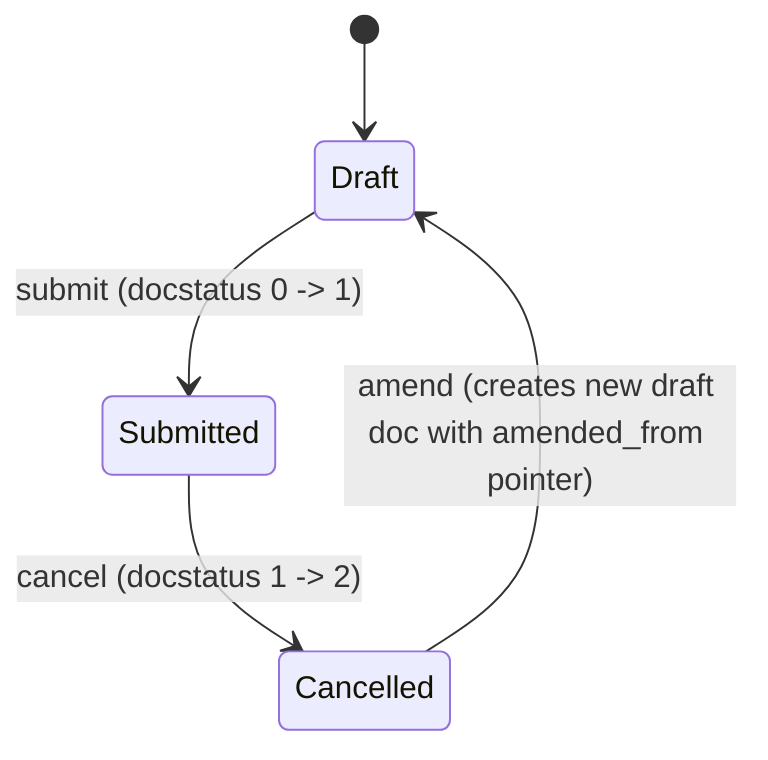

# Leave Policy

**Source:** `hrms/hr/doctype/leave_policy/leave_policy.json`, `leave_policy.py`, `leave_policy.js`
**[[Submittable Document Lifecycle|Submittable]]:** yes   **Tree:** no   **[[Naming and Autoname Rules|Naming]]:** `HR-LPOL-.YYYY.-.#####` (naming series: `HR-LPOL-` + current year + auto-incrementing 5-digit counter, e.g. `HR-LPOL-2026-00001`)
**Module:** HR

## Schema

Full field table, in JSON `field_order`:

| Field (fieldname) | Label | Type | Options/Link Target | Required | Default | Read-Only | Notes |
|---|---|---|---|---|---|---|---|
| title | Title | Data | — | Yes (`reqd`) | — | No | `in_list_view: 1`; `allow_on_submit: 1` (editable even after submission); this is the `title_field` for the doctype |
| (leave_allocations_section) | Leave Allocations | Section Break | — | — | — | — | `allow_in_quick_entry: 1`; groups the child table below |
| leave_policy_details | Leave Policy Details | Table | [[Leave Policy Detail]] | Yes (`reqd`) | — | No | Child table — see `Leave Policy Detail` for schema |
| amended_from | Amended From | Link | [[Leave Policy]] | No | — | Yes | `no_copy: 1`, `print_hide: 1`; standard Frappe amendment-chain pointer, auto-set when this doc is created via "Amend" from a cancelled submitted Leave Policy |

`track_changes: 1`. `search_fields: "title"`.

## Child Tables

- `leave_policy_details` (Table field) -> child doctype `Leave Policy Detail`. See `Leave Policy Detail.md` for its full field list and controller logic. Each row maps one `Leave Type` to an `annual_allocation` value for this policy.

## State Machine

Standard submittable lifecycle only (no custom `status`/`workflow_state` field):

Plain list:
- (Draft, submit, Submitted, guard: none beyond standard submit permission — no `before_submit`/`on_submit` override defined on this controller)
- (Submitted, cancel, Cancelled, guard: none beyond standard cancel permission — no `on_cancel` override defined on this controller)
- (Cancelled, amend, Draft, guard: standard Frappe amend flow, sets `amended_from` to the cancelled doc's name)

Note: the controller (`leave_policy.py`) defines only `validate()` — no `on_submit`, `on_cancel`, or `before_submit` overrides exist. Submission has no side effects beyond the standard docstatus transition (unlike `Leave Policy Assignment`, whose `on_submit` triggers leave allocation).

## Validation Rules (exact, in execution order)

`validate()` logic:

1. IF `self.leave_policy_details` is non-empty THEN for each row (`lp_detail`) in `leave_policy_details`, in table order: fetch `max_leaves_allowed = frappe.db.get_value("Leave Type", lp_detail.leave_type, "max_leaves_allowed")`. IF `max_leaves_allowed > 0` AND `lp_detail.annual_allocation > max_leaves_allowed` -> `frappe.throw(_("Maximum leave allowed in the leave type {0} is {1}").format(lp_detail.leave_type, max_leaves_allowed))` (source: `validate`). Note: a `max_leaves_allowed` of 0 (or falsy/unset) on the Leave Type means "no cap" — the check is skipped entirely for that leave type in that case.

## Business Logic / Calculations

None beyond the per-row cap check above. This doctype is a static configuration container (leave-type -> annual-allocation mapping); the actual pro-rata/earned-leave allocation math happens downstream in `Leave Policy Assignment`.

## [[Cross-Doctype Hooks (doc_events)|Lifecycle Hooks]] (exact)

| Event | What Runs | Side Effects on Other Doctypes |
|---|---|---|
| validate | Per-row cap check against `Leave Type.max_leaves_allowed` (see Validation Rules) | Reads `Leave Type` only; no writes |

No `on_submit`/`on_cancel`/`before_submit`/`on_trash` overrides exist on this controller.

## Whitelisted / API Methods

None defined on this controller or a dedicated module file for Leave Policy.

## Permissions

| Role | Read | Write | Create | Delete | Submit | Cancel | Amend | Report | Export | Notes |
|---|---|---|---|---|---|---|---|---|---|---|
| System Manager | Yes | Yes | Yes | Yes | Yes | Yes | Yes | Yes | Yes | `email`, `print`, `share` also 1 |
| HR Manager | Yes | Yes | Yes | Yes | Yes | Yes | Yes | Yes | Yes | `email`, `print`, `share` also 1 |
| HR User | Yes | Yes | Yes | Yes | Yes | Yes | Yes | Yes | Yes | `email`, `print`, `share` also 1 |

(No `if_owner` or `permlevel` restrictions present in the JSON.)

## [[Background Jobs (Scheduler Events)|Scheduled Jobs]] Touching This Doctype

None directly in `scheduler_events`. (`Leave Policy Detail` rows of a submitted Leave Policy are read by the `daily_long` job `hrms.hr.utils.allocate_earned_leaves` via `get_annual_allocation_from_policy`, which looks up `Leave Policy Detail` by `{"parent": allocation.leave_policy, "leave_type": e_leave_type.name}` — this reads through the parent `Leave Policy` name but does not write to `Leave Policy` itself. See `Leave Policy Assignment.md` for the full allocation-scheduling trace.)

## Related Doctypes

- [[Leave Policy Detail]] — `leave_policy_details` child Table field, one row per (Leave Type, annual_allocation) pair.
- [[Leave Type]] — read (via each `Leave Policy Detail` row) to cap `annual_allocation` at `max_leaves_allowed`.
- [[Leave Policy Assignment]] — created (single or bulk) referencing this policy via the client-side "Create" buttons on a submitted Leave Policy.
- [[Leave Policy]] — `amended_from` self-referencing Link field, standard Frappe amend-chain pointer.

## Port Notes

- `is_submittable: 1` with no custom `on_submit`/`on_cancel` logic means a port only needs the generic draft/submitted/cancelled/amended docstatus state machine for this doctype — there is no extra side effect to reproduce on submit/cancel of a Leave Policy itself (contrast with `Leave Policy Assignment`, where submit triggers allocation creation).
- `title_field: "title"` plus `allow_on_submit: 1` on `title` means the display title can be edited even after the document becomes read-only/submitted elsewhere; a port's UI/API layer should allow updating this one field post-submission while blocking edits to `leave_policy_details` (which has no `allow_on_submit`, so it becomes non-editable after submission, per standard Frappe submittable-doctype behavior — child table rows are frozen once `docstatus = 1` unless the field/table is explicitly marked `allow_on_submit`).
- `amended_from` + Frappe's automatic amendment mechanism: when a submitted Leave Policy is cancelled and "Amend" is used, Frappe auto-clones the cancelled doc into a new Draft with `amended_from` set to the original's name, and typically preserves the same `title` naming or appends a suffix — a port must implement an equivalent explicit clone-on-amend flow since this is a Frappe framework behavior, not code in this controller.
- `naming_series` counter and audit columns (`creation`, `modified`, `modified_by`, `owner`, `idx`) — same framework-provided behavior as noted in `Leave Type.md` and `Leave Period.md`; must be built explicitly in a new stack.
- `track_changes: 1` — version/audit history, same caveat as other doctypes in this module.
- Client script (`leave_policy.js`) adds two "Create" buttons on a submitted Leave Policy form: "Single Assignment" (opens a new `Leave Policy Assignment` pre-filled with `leave_policy = this doc's name`) and "Bulk Assignment" (routes to a `Leave Control Panel` form pre-filled with `leave_policy`). These are pure UI navigation shortcuts with no business-rule logic — no server-side equivalent is needed beyond exposing the ability to create a `Leave Policy Assignment` (or bulk-create via the whitelisted `create_assignment_for_multiple_employees` documented in `Leave Policy Assignment.md`) referencing this policy.
- The `Leave Policy Detail` grid's client-side `leave_type` change handler (in `leave_policy.js`, registered on the child doctype) auto-populates `annual_allocation` by fetching `Leave Type.max_leaves_allowed` via `frappe.client.get_value` whenever a row's `leave_type` is set (or clears it to empty if `leave_type` is cleared). **This default-fill is CLIENT-SIDE ONLY** — the server-side `Leave Policy Detail` controller (`pass`) and this doctype's `validate()` never auto-populate `annual_allocation`; they only cap it if it exceeds `max_leaves_allowed`. A port must decide explicitly whether to replicate this "default annual_allocation to the leave type's max" convenience as a server-side default, since the current system relies entirely on the client for it — if a caller (e.g. a non-UI API client) creates a `Leave Policy Detail` row without setting `annual_allocation`, no default is applied server-side and the `reqd: 1` constraint on `annual_allocation` (see `Leave Policy Detail.md`) will simply reject an empty value.
