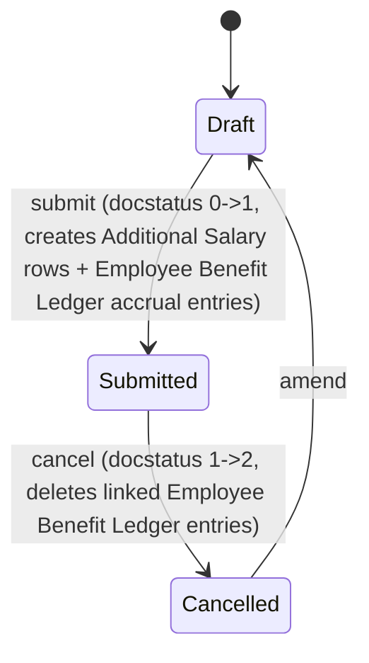

# Arrear

**Source:** `hrms/payroll/doctype/arrear/arrear.json`, `arrear.py`, `arrear.js`
**Submittable:** yes ([[Submittable Document Lifecycle]])   **Tree:** no   **Naming:** `format:{Arrear}/{employee}/{#####}` (expression naming rule — literal string "Arrear" + employee id + sequence) ([[Naming and Autoname Rules]])
**Module:** Payroll

Computes and pays out retroactive salary differences ("arrears") when an employee's Salary Structure changes retroactively (e.g. a raise backdated to an earlier date), by diffing already-processed Salary Slip components against a preview of what they'd be under the new structure.

## Schema

| Field (fieldname) | Label | Type | Options/Link Target | Required | Default | Read-Only | Notes |
|---|---|---|---|---|---|---|---|
| employee | Employee | Link | [[Employee Core Model]] | yes | | no | |
| employee_name | Employee Name | Data | | no | | yes | fetch_from `employee.employee_name` |
| salary_structure | Salary Structure | Link | [[Salary Structure]] | yes | | no | `depends_on: eval:doc.payroll_period` — the NEW structure to diff against |
| arrear_start_date | Arrear Start Date | Date | | yes | | no | `depends_on: eval:doc.salary_structure`; description: "Salary slips starting on or after this date will be considered for arrear calculations" |
| company | Company | Link | Company | yes | | no | fetch_from `employee.company` |
| currency | Currency | Link | Currency | yes | | yes | `depends_on: eval:doc.employee` |
| payroll_period | Payroll Period | Link | [[Payroll Period]] | yes | | no | `depends_on: eval:doc.employee` |
| payroll_date | Payroll Date | Date | | yes | | no | `depends_on: eval:doc.salary_structure`; the date the generated Additional Salary entries will use |
| earning_arrears (tab: Arrears) | Earning Arrears | Table | [[Payroll Correction Child]] | no | | no | `depends_on: earning_arrears` (shows only if non-empty); computed by controller |
| deduction_arrears | Deduction Arrears | Table | [[Payroll Correction Child]] | no | | no | `depends_on: deduction_arrears`; computed by controller |
| accrual_arrears | Accrual Arrears | Table | [[Payroll Correction Child]] | no | | no | `depends_on: accrual_arrears`; computed by controller |
| amended_from | Amended From | Link | [[Arrear]] | no | | yes | |

Layout-only fields skipped: column_break_itzd, section_break_zegb, section_break_ubws, arrears_tab (Tab Break).

## Child Tables

All three arrear tables reuse the same child doctype: **[[Payroll Correction Child]]** (see `Payroll Correction Child.md`) — fields `salary_component` (Link, [[Salary Component]]) and `amount` (Float, non_negative).

## State Machine



No explicit `status` field; state is `docstatus` only.

## Validation Rules (exact, in execution order)

`validate()` calls, in order:
1. `validate_dates()`:
   a. IF `self.arrear_start_date` and `self.payroll_period` both set:
      - IF `getdate(arrear_start_date) < payroll_period.start_date` THEN throw `"From Date {0} cannot be before Payroll Period start date {1}"` (arrear_start_date, payroll_period.start_date).
      - ELIF `getdate(arrear_start_date) > payroll_period.end_date` THEN throw `"From Date {0} cannot be after Payroll Period end date {1}"` (arrear_start_date, payroll_period.end_date).
2. `validate_salary_structure_assignment()`: only runs if `employee`, `salary_structure`, AND `payroll_period` are all set:
   a. Look up a `Salary Structure Assignment` with `employee == self.employee`, `salary_structure == self.salary_structure`, `docstatus == 1`, `from_date >= self.arrear_start_date`.
   b. IF none found THEN throw `"No active Salary Structure Assignment found for employee {0} with salary structure {1} on or after arrear start date {2}"` (employee bolded, salary_structure bolded, arrear_start_date bolded) — note: source comment flags `# TODO: make error message better`, preserved verbatim as a code comment for context, not part of the message text itself.
3. `validate_duplicate_doc()`: IF an `Arrear` already exists with same `employee` + `salary_structure` + `payroll_period`, `docstatus == 1`, excluding self, THEN throw `"An Arrear document already exists for employee {0} with salary structure {1} in payroll period {2}"` (all three bolded).
4. `calculate_salary_structure_arrears()` — the main computation (see Business Logic below); this populates the three arrear child tables in-place during `validate()` (i.e., every save recomputes them), and throws internally if no differences are found (see algorithm step 6).

`on_submit()`:
5. `validate_arrear_details()`: IF all three of `earning_arrears`, `deduction_arrears`, `accrual_arrears` are empty THEN throw `"No arrear details found"`.
6. `create_additional_salary()` (side effect, see below).
7. `create_benefit_ledger_entry()` (side effect, see below).

## Business Logic / Calculations

### `calculate_salary_structure_arrears()` — full algorithm
This runs on every `validate()` (draft save and submit), recomputing the arrear breakdown from scratch each time.

1. **Fetch existing processed salary slips**: `get_existing_salary_slips()` — all submitted (`docstatus=1`) `Salary Slip` rows for `self.employee` where `start_date >= self.arrear_start_date`, ordered by `start_date`, fields `name, posting_date, start_date, end_date`. IF none found THEN throw `"No salary slips found for the selected employee from {0}"` (arrear_start_date).
2. **Fetch existing component totals** (`fetch_existing_salary_components`) — for those slip names:
   a. Query `Salary Detail` rows joined to `Salary Component`, filtered: `parent IN salary_slips`, `additional_salary IS NULL` (i.e. exclude amounts that came from an Additional Salary — only base-structure-driven amounts count), `variable_based_on_taxable_salary == 0` (exclude tax components), `Salary Component.arrear_component == 1` (only components explicitly flagged eligible for arrear tracking).
   b. Sum `amount` per `salary_component`, split into `earnings_totals` / `deductions_totals` dicts keyed by the row's `parentfield` (`"earnings"` or `"deductions"`).
   c. `fetch_existing_accrual_components(salary_slips)`: query `Employee Benefit Detail` rows (the Salary Slip's accrued-benefit child rows) joined to `Salary Component` where `parent IN salary_slips` and `Salary Component.arrear_component == 1`; sum `amount` per component into `accrual_totals`.
   d. `fetch_existing_payroll_corrections(salary_slips)`: additionally fold in amounts from any submitted `Payroll Correction` documents whose `salary_slip_reference IN salary_slips`, by joining `Payroll Correction` -> `Payroll Correction Child` -> `Salary Component` (again filtered `arrear_component == 1`), summing by `parentfield` (`earning_arrears`->earnings, `deduction_arrears`->deductions, `accrual_arrears`->accruals) — these amounts are ADDED into the same `earnings_totals`/`deductions_totals`/`accrual_totals` dicts from step 2b/2c (i.e. prior manual LWP-reversal corrections are treated as if they were part of the "existing" baseline pay).
   e. IF all three totals dicts end up empty THEN throw `"No arrear components found in the existing salary slips."`
   f. Return `{"earnings": ..., "deductions": ..., "accruals": ...}`.
3. **Generate preview components under the NEW structure** (`generate_preview_components`) — for each existing salary slip:
   a. Build an in-memory (unsaved) `Salary Slip` doc with `employee=self.employee`, `salary_structure=self.salary_structure` (the NEW structure), and the SAME `posting_date`/`start_date`/`end_date` as the original processed slip.
   b. Look up `total_days_to_reverse = SUM(Payroll Correction.days_to_reverse)` across all submitted Payroll Corrections referencing this exact slip (`salary_slip_reference == slip.name`) — i.e. LWP days previously "given back" via Payroll Correction are also given back in this preview so the new-structure preview reflects the same effective payment days.
   c. Call `make_salary_slip(salary_structure, salary_slip_doc, employee, lwp_days_corrected=total_days_to_reverse)` (owned by `Salary Structure`/`Salary Slip` module — this generates a full in-memory calculated slip without persisting it).
   d. From the preview slip's `earnings` rows: for each row where `NOT row.additional_salary` (i.e. base-structure-driven, not from an Additional Salary) AND `is_arrear_component(row.salary_component)` (i.e. `Salary Component.arrear_component == 1`, cached lookup) — accumulate into `preview_earnings` keyed by component.
   e. From `deductions` rows: same but ALSO excluding `row.variable_based_on_taxable_salary` (tax components) — accumulate into `preview_deductions`.
   f. From `accrued_benefits` rows: for each where `is_arrear_component(...)` — accumulate into `preview_accruals`.
   g. Sums accumulate ACROSS all slips processed in the loop (i.e. this is a total across the whole arrear window, not per-slip).
4. **Compute differences** (`compute_component_differences`): for each of earnings/deductions/accruals, for each component present in the PREVIEW totals: `diff = preview_amount - existing_amount` (existing defaults to 0 if the component wasn't in the existing baseline at all). IF `diff > 0` THEN include it in the corresponding `*_diff` dict (i.e. only POSITIVE differences — underpayment being corrected upward — are kept; components where the new structure would pay LESS or the same are silently dropped, no negative-arrear/clawback support). IF the combined result across all three categories is empty THEN throw `"There are no arrear differences between existing and new salary structure components."`
5. **Populate child tables** (`populate_arrear_tables`): clear all three arrear child tables, then append one row per component/amount pair from the differences dict into the matching table (`earning_arrears`, `deduction_arrears`, `accrual_arrears`).

Edge cases explicitly handled: components only in preview but not existing baseline are treated as a full new-amount diff (existing=0); components with a zero or negative diff are dropped entirely (no rows created); an empty overall result throws rather than silently submitting a no-op document.

### `create_additional_salary()` (on_submit)
For every row across `earning_arrears` + `deduction_arrears` (accrual arrears handled separately, see next): skip rows with no `salary_component` or falsy `amount`. For each remaining row, insert AND submit a new `Additional Salary`:
```
employee: self.employee
company: self.company
payroll_date: self.payroll_date
salary_component: component.salary_component
currency: self.currency
amount: component.amount
ref_doctype: "Arrear"
ref_docname: self.name
overwrite_salary_structure_amount: 0
```
(Always non-overwrite, single-payroll-date, non-recurring by construction since Additional Salary's own `is_recurring` default is 0 and never set here.)

### `create_benefit_ledger_entry()` (on_submit)
For every row in `accrual_arrears` (skip if no component or falsy amount): look up `is_flexible_benefit` from `Salary Component`, then insert a new `Employee Benefit Ledger` entry:
```
employee, employee_name, company: from self
payroll_period: self.payroll_period
salary_component: component.salary_component
transaction_type: "Accrual"
amount: component.amount
reference_doctype: "Arrear"
reference_document: self.name
remarks: "Accrual via Arrears"
flexible_benefit: is_flexible_benefit
```

### `on_cancel()`
Calls `delete_employee_benefit_ledger_entry("reference_document", self.name)` — bulk-deletes all `Employee Benefit Ledger` rows where `reference_document == self.name` (i.e. the accrual entries created above). Note: this does NOT cancel or reverse the `Additional Salary` documents created on submit — they remain submitted/active after the Arrear is cancelled (same class of orphaning gap seen in other doctypes in this module).

## Lifecycle Hooks (exact) ([[Cross-Doctype Hooks (doc_events)]])

| Event | What Runs | Side Effects on Other Doctypes |
|---|---|---|
| validate | `validate_dates`, `validate_salary_structure_assignment`, `validate_duplicate_doc`, `calculate_salary_structure_arrears` (recomputes arrear tables every save) | Reads [[Salary Slip]], [[Salary Detail]], [[Salary Component]], [[Employee Benefit Detail]], [[Payroll Correction]] (no writes) |
| on_submit | `validate_arrear_details`, `create_additional_salary`, `create_benefit_ledger_entry` | Inserts + submits `Additional Salary` docs; inserts `Employee Benefit Ledger` docs |
| on_cancel | `delete_employee_benefit_ledger_entry("reference_document", self.name)` | Bulk-deletes `Employee Benefit Ledger` rows referencing this Arrear (Additional Salary docs NOT reversed) |

## Whitelisted / API Methods

None (`@frappe.whitelist()` not used in `arrear.py`).

## Permissions ([[Permission Model (RBAC)]])

| Role | Read | Write | Create | Delete | Submit | Cancel | Amend | Report | Export | Notes |
|---|---|---|---|---|---|---|---|---|---|---|
| System Manager | yes | yes | yes | yes | yes | n/a (cancel not listed) | n/a | yes | yes | share/email/print also 1 |
| HR Manager | yes | yes | yes | yes | yes | yes | n/a (amend not listed) | yes | yes | share/email/print also 1; has explicit `cancel:1` but no `amend` key |

Only two roles have any access at all — no `HR User` or `Employee` rows exist in the permissions array for this doctype.

## Scheduled Jobs Touching This Doctype ([[Background Jobs (Scheduler Events)]])

None found in `hrms/hooks.py`.

## Related Doctypes

- [[Employee Core Model]] — the employee whose retroactive pay difference is being computed.
- [[Salary Structure]] — the new structure the arrear diffs against; [[Salary Structure Assignment]] is looked up to confirm the employee was actually assigned it from the arrear start date.
- [[Payroll Period]] — bounds the valid `arrear_start_date` range.
- [[Salary Slip]] — the already-processed slips whose components form the "existing" baseline being diffed against the new-structure preview.
- [[Salary Component]] — components are only eligible for arrear tracking when flagged `arrear_component` on this doctype.
- [[Payroll Correction]] / [[Payroll Correction Child]] — prior LWP-reversal corrections are folded into the existing baseline; the three arrear child tables reuse Payroll Correction Child as their row shape.
- [[Additional Salary]] — created and submitted on `on_submit` for every earning/deduction difference row.
- [[Employee Benefit Ledger]] — accrual entries are created on `on_submit` for `accrual_arrears` rows and bulk-deleted on `on_cancel`.

## Port Notes

- The arrear child tables are FULLY RECOMPUTED on every `validate()` call (every save, not just first save) — a port must replicate "recalculate and overwrite child rows on every save" semantics, not treat them as user-editable persisted data (the JSON does not mark the tables read-only at the field level for `earning_arrears`/`deduction_arrears`, but `accrual_arrears` and the sibling `Payroll Correction`'s equivalents ARE marked read-only — Arrear's own tables lack `"read_only": 1` in the JSON despite being fully server-computed; this is an inconsistency worth flagging, not silently correcting).
- Depends heavily on `make_salary_slip(...)` producing an accurate in-memory preview slip under a hypothetical (new) Salary Structure without persisting it — this "dry-run payroll calculation" capability (owned by `Salary Structure`/`Salary Slip` modules) is a hard prerequisite for a faithful port of this doctype's core value proposition.
- Only POSITIVE differences (new structure pays more) are supported; there is no negative-arrear/deduction-of-overpayment path in this doctype. Flag this explicitly if a port intends to support salary corrections that go the other way (would need a different, unimplemented mechanism — not to be invented here).
- Cancelling an Arrear does not reverse its generated `Additional Salary` records (only the `Employee Benefit Ledger` entries are cleaned up) — same orphaning gap noted elsewhere in this module; reproduce faithfully.
- `arrear_component` flag lives on `Salary Component` (owned by another module/agent) and is the single gating flag controlling which components are eligible for this entire arrear-diffing mechanism — a port must carry this flag on its Salary Component equivalent.
- The naming rule literally embeds the word "Arrear" as a constant string segment (`format:{Arrear}/{employee}/{#####}`), producing names like `Arrear/EMP-0001/00001` — reproduce this exact literal-plus-field naming pattern.
