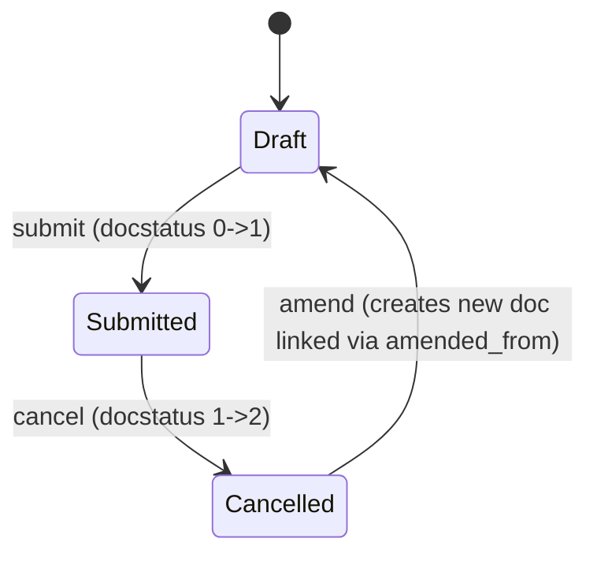

# Employee Benefit Application

**Source:** `hrms/payroll/doctype/employee_benefit_application/employee_benefit_application.json`, `employee_benefit_application.py`, `employee_benefit_application.js`
**Submittable:** yes ([[Submittable Document Lifecycle]])   **Tree:** no   **Naming:** `HR-BEN-APP-.YY.-.MM.-.#####` (expression-based autoname, resets yearly/monthly) ([[Naming and Autoname Rules]])
**Module:** Payroll

## Schema

| Field (fieldname) | Label | Type | Options/Link Target | Required | Default | Read-Only | Notes |
|---|---|---|---|---|---|---|---|
| employee | Employee | Link | [[Employee Core Model]] | yes | | no | |
| employee_name | Employee Name | Data | | no | | yes | fetch_from `employee.employee_name` |
| max_benefits | Max Benefits (Yearly) | Currency | options: `currency` (uses `currency` field for precision) | no | | yes | set programmatically from Salary Structure Assignment via `set_benefit_components_and_currency` |
| remaining_benefit | Remaining Benefits (Yearly) | Currency | options: `currency` | no | | yes | client-side only: computed in JS as `max_benefits - total_amount`; not persisted server-side |
| date | Date | Date | | yes | Today | no | drives salary structure assignment lookup |
| payroll_period | Payroll Period | Link | [[Payroll Period]] | yes | | no | |
| department | Department | Link | Department | no | | yes | fetch_from `employee.department` |
| amended_from | Amended From | Link | [[Employee Benefit Application]] | no | | yes | standard amendment field |
| employee_benefits | Flexible Benefits (section: Benefits) | Table | [[Employee Benefit Application Detail]] | yes | | no | see Child Tables |
| total_amount | Total Amount (section: Totals) | Currency | options: `currency` | no | | yes | client-side sum of `employee_benefits.amount`; NOT recomputed server-side in `validate()` (see Port Notes) |
| currency | Currency | Link | Currency | yes | | yes | `depends_on: eval:(doc.docstatus==1 || doc.employee)`; set programmatically |
| company | Company | Link | Company | yes | | no | fetch_from `employee.company` |

Layout-only fields skipped: column_break_2, column_break_11, column_break_13, column_break, section_break_4, section_break_15.

## Child Tables

### [[Employee Benefit Application Detail]] (`employee_benefits`)
See `Employee Benefit Application Detail.md`. istable=1, no own permissions, track_changes=1.

| Field | Label | Type | Options | Required | Read-Only | Notes |
|---|---|---|---|---|---|---|
| salary_component | Earning Component | Link | [[Salary Component]] | yes | yes | |
| max_benefit_amount | Max Benefit Amount | Currency | options: currency | yes | yes | copied from Salary Structure Assignment's `Employee Benefit Detail.amount` |
| amount | Amount | Currency | options: currency | yes | no | `non_negative: 1`; user-entered claim allocation, capped by `max_benefit_amount` |

## State Machine

Plain list:
- (Draft, submit, Submitted, guard: validate() passes — no employee_benefits rows fail max-benefit checks, no duplicate application exists for the payroll period)
- (Submitted, cancel, Cancelled, guard: standard Frappe cancel permission)
- (Cancelled/any, amend, new Draft, guard: standard Frappe amend, `amended_from` set to prior doc name)

There is no explicit `status`/`workflow_state` field on this doctype; state is purely `docstatus` (0/1/2).

## Validation Rules (exact, in execution order)

`validate()` runs, in order:

1. `validate_active_employee(self.employee)` -> throws if employee is not active (shared HR utility; exact message defined in `hrms/hr/utils.py`, not reproduced here — flag to see that shared utility's spec). (source: `validate`)
2. `validate_duplicate_on_payroll_period()`: IF an Employee Benefit Application already exists with the same `employee` + `payroll_period` and `docstatus == 1` THEN throw `"Employee {0} already submitted an application {1} for the payroll period {2}"` (employee, existing application name, payroll_period). (source: `validate_duplicate_on_payroll_period`)
3. IF `self.employee_benefits` is empty THEN throw `"As per your assigned Salary Structure you cannot apply for benefits"`. ELSE call `validate_max_benefit()`. (source: `validate`)
4. Inside `validate_max_benefit()`, for each row in `employee_benefits` (in order):
   a. IF `not benefit.amount or benefit.amount <= 0` THEN throw `"Benefit amount of component {0} should be greater than 0"` (salary_component). (source: `validate_max_benefit`)
   b. ELIF `benefit.amount > benefit.max_benefit_amount` THEN throw `"Benefit amount of component {0} exceeds {1}"` (salary_component, max_benefit_amount). (source: `validate_max_benefit`)
   c. Accumulate `total_benefit_amount += flt(benefit.amount)`.
5. After looping all rows: IF `rounded(total_benefit_amount, 2) > self.max_benefits` THEN throw `"Sum of benefit amounts {0} exceeds maximum limit of {1}"` (total_benefit_amount, max_benefits). (source: `validate_max_benefit`)

Note: `total_amount` field itself is set only client-side (`calculate_all` in `.js`); the Python controller never assigns `self.total_amount`. A port must decide whether to compute/persist it server-side to keep it authoritative (flag in Port Notes).

## Business Logic / Calculations

### Benefit component population — `set_benefit_components_and_currency()` (whitelisted method)
Called from the client whenever `employee` or `date` changes (see `.js`). Steps:
1. Reset `self.employee_benefits = []`.
2. Look up the active Salary Structure Assignment for `employee` as of `date` via `get_salary_structure_assignment(employee, date)` (imported from Employee Benefit Claim's module — see that doctype's spec for exact query: latest assignment where `docstatus=1` and `from_date <= date`, ordered by `from_date desc`, `limit 1`). IF none found THEN throw `"No Salary Structure Assignment found for employee {0} on date {1}"`.
3. Query the assignment's child table `Employee Benefit Detail` (rows where `parent == salary_structure_assignment`), selecting `salary_component` and `amount` for each row — these are the flexible-benefit components configured on the Salary Structure Assignment.
4. IF any such rows exist:
   a. Fetch `max_benefits` and `currency` from the `Salary Structure Assignment` document itself, and set them on `self.max_benefits` / `self.currency`.
   b. For each `Employee Benefit Detail` row, append to `self.employee_benefits`: `{salary_component: benefit.salary_component, max_benefit_amount: benefit.amount}` — i.e. the flexible benefit's yearly configured amount becomes this application's `max_benefit_amount` ceiling for that component, and `amount` (the actual claim) starts unset/0 for the user to fill in.
5. IF no such rows exist, `employee_benefits` remains empty (which then triggers validation rule #3 above on submit).

This is a pro-rata *ceiling* setup, not a pro-rata amount computation — the max limits come directly from the assignment; the user manually allocates `amount` per component up to `max_benefit_amount`, and the total must not exceed `max_benefits` (validation rule #5).

### Client-side total/remaining computation (JS only — not ported to server)
`calculate_all(doc)` in `.js`:
1. IF `doc.max_benefits === 0` THEN clear `employee_benefits` entirely.
2. ELSE sum `amount` across all `employee_benefits` rows where `amount > 0` into `total_amount`.
3. Set `doc.remaining_benefit = doc.max_benefits - total_amount`.
A server-side equivalent must be implemented in the port since `remaining_benefit`/`total_amount` are not recalculated by Python `validate()`.

## Lifecycle Hooks (exact) ([[Cross-Doctype Hooks (doc_events)]])

| Event | What Runs | Side Effects on Other Doctypes |
|---|---|---|
| validate | `validate_active_employee`, `validate_duplicate_on_payroll_period`, `validate_max_benefit` (or throw if no benefits) | none |

No `on_submit`, `on_cancel`, `before_insert`, or other lifecycle methods are defined on this controller. Submission has no side effect on other doctypes (unlike [[Employee Benefit Claim]], which creates an Additional Salary on submit) — this application only records intent/allocation; the actual accrual/payout ledger entries are created later during Salary Slip processing (see [[Employee Benefit Ledger]] and [[Salary Slip]] — owned by another agent — for how `Employee Benefit Application` rows feed into benefit payout during payroll run via `get_benefits_details_parent`).

## Whitelisted / API Methods

| Method name | HTTP-equivalent purpose | Args | Returns | What it does |
|---|---|---|---|---|
| `set_benefit_components_and_currency` | POST (form doc method call) | none (uses `self.employee`, `self.date`) | None (mutates doc in place) | Populates `employee_benefits` child rows from the employee's active Salary Structure Assignment's `Employee Benefit Detail` rows, and sets `max_benefits`/`currency`. Throws if no assignment found. |

## Permissions ([[Permission Model (RBAC)]])

| Role | Read | Write | Create | Delete | Submit | Cancel | Amend | Report | Export | Notes |
|---|---|---|---|---|---|---|---|---|---|---|
| System Manager | yes | yes | yes | yes | yes | yes | yes | yes | yes | share/email/print also 1 |
| HR Manager | yes | yes | yes | yes | yes | yes | yes | yes | yes | share/email/print also 1 |
| HR User | yes | yes | yes | yes | yes | yes | yes | yes | yes | share/email/print also 1 |
| Employee | yes | yes | yes | yes | no | no | no | yes | yes | no submit/cancel/amend rights; share/email/print also 1 |

## Scheduled Jobs Touching This Doctype ([[Background Jobs (Scheduler Events)]])

None found in `hrms/hooks.py` referencing this doctype directly.

## Related Doctypes

- [[Employee Core Model]] — the employee applying for flexible benefit allocation.
- [[Payroll Period]] — the period this application is unique against (one application per employee per period).
- [[Employee Benefit Application Detail]] — the child table (`employee_benefits`) holding one row per claimable salary component and its allocated amount.
- [[Salary Component]] — the flexible-benefit component each detail row is allocated against.
- [[Salary Structure Assignment]] — read via `set_benefit_components_and_currency()`/`get_salary_structure_assignment()` to source the [[Employee Benefit Detail]] rows that seed this application's max-benefit ceilings.
- [[Employee Benefit Claim]] — the doctype that later consumes this application's allocations when computing how much of a benefit is still claimable.
- [[Employee Benefit Ledger]] — accrual/payout entries that, together with this application, determine remaining claimable benefit during payroll processing.
- [[Salary Slip]] — reads this application's rows during payroll run via `get_benefits_details_parent` to resolve benefit payout.

## Port Notes

- `remaining_benefit` and `total_amount` are computed ONLY in client-side JavaScript (`calculate_all`). The Python `validate()` never sets them. A faithful port that relies on server-side truth (e.g. an API-driven frontend with no client script) MUST add equivalent server-side computation, or these fields will be stale/zero when created via API. This is an implicit gap in the original code — flagged as Port Notes per spec ground rules, not invented.
- `quick_entry: 1` and `track_changes: 1` on the JSON are Frappe-framework conveniences (quick creation dialog, automatic version/audit trail) that need explicit re-implementation in a new stack (e.g. an audit log table) if that behavior is desired.
- `autoname: "HR-BEN-APP-.YY.-.MM.-.#####"` — Frappe auto-generates a sequential number per year/month combination; the new stack must implement an equivalent naming-series counter (not just a global auto-increment ID) to reproduce human-readable document numbers like `HR-BEN-APP-25-09-00001`.
- The `currency` field's `depends_on` expression (`docstatus==1 || doc.employee`) is UI-visibility logic only, not a server validation; it's still `reqd: 1` server-side.
- `get_salary_structure_assignment` (used inside `set_benefit_components_and_currency`) is actually defined in `Employee Benefit Claim`'s module file, not locally — this is a cross-doctype import dependency to note when porting module boundaries.
