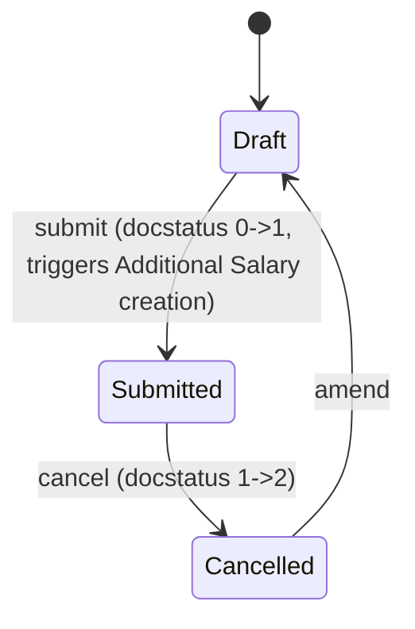

# Employee Benefit Claim

**Source:** `hrms/payroll/doctype/employee_benefit_claim/employee_benefit_claim.json`, `employee_benefit_claim.py`, `employee_benefit_claim.js`
**Submittable:** yes ([[Submittable Document Lifecycle]])   **Tree:** no   **Naming:** `HR-BEN-CLM-.YY.-.MM.-.#####` (expression-based autoname) ([[Naming and Autoname Rules]])
**Module:** Payroll

## Schema

| Field (fieldname) | Label | Type | Options/Link Target | Required | Default | Read-Only | Notes |
|---|---|---|---|---|---|---|---|
| employee | Employee | Link | [[Employee Core Model]] | yes | | no | `link_filters`: Employee.status = Active (UI-only filter) |
| employee_name | Employee Name | Data | | no | | yes | fetch_from `employee.employee_name` |
| department | Department | Link | Department | no | | yes | fetch_from `employee.department` |
| benefit_type/earning_component (section: Benefits) | Claim Benefit For | Link | [[Salary Component]] | yes | | no | query restricted client-side to `get_benefit_components` whitelisted method |
| max_amount_eligible | Max Amount Eligible For Claim | Currency | options: currency | no | | yes | computed by `get_benefit_details()` |
| claimed_amount | Claimed Amount | Currency | options: currency | yes | | no | `non_negative: 1` |
| amended_from | Amended From | Link | [[Employee Benefit Claim]] | no | | yes | |
| attachments (section: Expense Proof) | Attachments | Attach | | no | | no | |
| currency | Currency | Link | Currency | yes | | yes | `depends_on: eval: doc.employee` |
| company | Company | Link | Company | yes | | no | fetch_from `employee.company` |
| payroll_date | Payroll Date | Date | | yes | Today | no | must not be in the past (validation) |
| yearly_benefit | Yearly Amount | Currency | | no | | yes | computed by `get_benefit_details()` |

Layout-only fields skipped: column_break_3, column_break_12, benefit_type_and_amount (Section Break), section_break_9 (Section Break, labeled "Expense Proof").

## Child Tables

None — no Table fields on this doctype.

## State Machine



Plain list:
- (Draft, submit, Submitted, guard: `validate_date_and_benefit_claim_amount` and `validate_duplicate_claim` pass; on_submit then creates and submits a linked Additional Salary)
- (Submitted, cancel, Cancelled, guard: standard cancel permission — no explicit `on_cancel` override found; Additional Salary created on submit is NOT automatically cancelled by this doctype's controller, see Port Notes)
- (any, amend, new Draft, guard: standard amend)

No explicit `status` field; state is `docstatus` only.

## Validation Rules (exact, in execution order)

`validate()` calls, in order:

1. `validate_date_and_benefit_claim_amount()`:
   a. IF `getdate(self.payroll_date) < getdate()` (today) THEN throw `"Payroll date cannot be in the past. This is to ensure that claims are made for the current or future payroll cycles."` (source: `validate_date_and_benefit_claim_amount`)
   b. IF `self.claimed_amount <= 0` THEN throw `"Claimed amount of employee {0} should be greater than 0"` (employee). (source: same)
   c. IF `self.claimed_amount > self.max_amount_eligible` THEN throw `"Claimed amount of employee {0} exceeds maximum amount eligible for claim {1}"` (employee, max_amount_eligible). (source: same)
2. `validate_duplicate_claim()`: computes `existing_claim = get_existing_claim_for_month()` — an existing *submitted* (`docstatus=1`) Employee Benefit Claim for the same `employee` + `earning_component`, with `payroll_date` falling in the same calendar month (`between` first-day and last-day of `self.payroll_date`'s month), excluding this document itself. IF found THEN throw (title `"Duplicate Claim Detected"`): `"Employee {0} has already claimed the benefit '{1}' for {2} ({3}).<br>To prevent overpayments, only one claim per benefit type is allowed in each payroll cycle."` (employee bolded, earning_component bolded, formatted month/year e.g. "September 2026" bolded, link to existing claim bolded). (source: `validate_duplicate_claim`, `get_existing_claim_for_month`)

## Business Logic / Calculations

### `get_benefit_details()` (whitelisted) — computes `yearly_benefit` and `max_amount_eligible`
Triggered client-side whenever `earning_component` changes. Steps:
1. Compute `payroll_period = get_payroll_period(payroll_date, payroll_date, company).name` (payroll period containing the payroll date, for this company).
2. Compute `salary_structure_assignment = get_salary_structure_assignment(employee, payroll_date)` — latest assignment with `docstatus=1` and `from_date <= payroll_date`, ordered `from_date desc`, `limit 1`. Throws `"Salary Structure Assignment not found for employee {0} on date {1}"` if none.
3. `component_details = get_component_details(payroll_period, salary_structure_assignment)`:
   a. Resolve `benefit_details_parent, benefit_details_doctype = get_benefits_details_parent(employee, payroll_period, salary_structure_assignment)` (defined in `Salary Slip` module — owned by another agent; conceptually: resolves whichever of `Employee Benefit Application` (submitted, for this payroll period) or the `Salary Structure Assignment` itself holds the flexible-benefit configuration for this employee).
   b. IF no `benefit_details_parent` THEN return None (no component details).
   c. Otherwise join the benefit-detail child doctype (`Employee Benefit Detail` on the assignment, or `Employee Benefit Application Detail` on an application) with `Salary Component` on `salary_component`, filtered to `salary_component == self.earning_component` and `parent == benefit_details_parent`, selecting `name, payout_method, depends_on_payment_days, amount`. Return first row or None.
4. IF `component_details` found:
   a. `yearly_benefit = component_details.amount`.
   b. `current_month_amount = _get_current_month_benefit_amount(component_details)`:
      - IF `component_details.payout_method == "Accrue per cycle, pay only on claim"` THEN call `preview_salary_slip_and_fetch_current_month_benefit_amount()`:
        i. Resolve the assigned Salary Structure via `get_assigned_salary_structure(employee, payroll_date)`.
        ii. Build a **preview** Salary Slip (`make_salary_slip(..., for_preview=1)`) for this employee/structure/payroll_date (no DB insert).
        iii. Scan the preview slip's `accrued_benefits` rows; return the `amount` of the row matching `salary_component == earning_component`, else `0`.
      - ELSE `current_month_amount = 0.0`.
   c. `claimable_benefit = get_max_claim_eligible(employee, payroll_period, component_details, current_month_amount)` — delegates to `Employee Benefit Ledger.get_max_claim_eligible` (see `Employee Benefit Ledger.md` for the full accrual/payout math: for "Accrue per cycle, pay only on claim" it's `(sum of Accrual ledger entries + current_month_amount) - sum of Payout ledger entries`, throwing if accrued < paid; for "Allow claim for full benefit amount" it's `yearly_benefit - paid`).
5. ELSE (`component_details` is None): `yearly_benefit = 0`, `claimable_benefit = 0`.
6. Set `self.yearly_benefit = yearly_benefit`, `self.max_amount_eligible = claimable_benefit`.

This is the pro-rata/eligibility calculation referenced by the assignment notes: the claim amount is capped not by a flat yearly max but by what has actually accrued-vs-been-paid so far in the payroll period (for accrual-type components), or by the remaining yearly balance (for full-claim-type components).

### `create_additional_salary()` (on_submit side effect)
Creates and immediately submits a new `Additional Salary` document:
```
doctype: Additional Salary
company: self.company
employee: self.employee
currency: self.currency
salary_component: self.earning_component
payroll_date: self.payroll_date
amount: self.claimed_amount
overwrite_salary_structure_amount: 0
ref_doctype: "Employee Benefit Claim"
ref_docname: self.name
```
This is a one-time (non-recurring) Additional Salary since `is_recurring` defaults to 0 and `overwrite_salary_structure_amount` is forced 0. Amount flows into the employee's Salary Slip earnings for the payroll cycle covering `payroll_date` via `Additional Salary.get_additional_salaries()` (see `Additional Salary.md`).

## Lifecycle Hooks (exact) ([[Cross-Doctype Hooks (doc_events)]])

| Event | What Runs | Side Effects on Other Doctypes |
|---|---|---|
| validate | `validate_date_and_benefit_claim_amount`, `validate_duplicate_claim` | none |
| on_submit | `create_additional_salary()` | Inserts + submits a new [[Additional Salary]] record referencing this claim |

No `on_cancel` override exists on this controller — cancelling an Employee Benefit Claim does NOT automatically cancel the Additional Salary it created (flagged in Port Notes).

## Whitelisted / API Methods

| Method name | HTTP-equivalent purpose | Args | Returns | What it does |
|---|---|---|---|---|
| `get_benefit_details` (instance method) | POST (form doc method call) | none (uses self.employee/payroll_date/company/earning_component) | None (mutates doc) | Computes and sets `yearly_benefit` and `max_amount_eligible` per algorithm above |
| `get_benefit_components` (module function) | GET (Link-field query/autocomplete source) | `doctype, txt, searchfield, start, page_len, filters` (filters must include `employee`, `date`; `company` optional) | list of tuples `(salary_component,)` | Checks read permission on `employee`. Resolves salary structure assignment and payroll period, resolves benefit-details parent via `get_benefits_details_parent`, then lists `salary_component`s from that parent's benefit-detail child table whose `Salary Component.payout_method` is `"Accrue per cycle, pay only on claim"` or `"Allow claim for full benefit amount"`. Returns `[]` on any exception (logged via `frappe.log_error`) or if no employee/date given. |

## Permissions ([[Permission Model (RBAC)]])

| Role | Read | Write | Create | Delete | Submit | Cancel | Amend | Report | Export | Notes |
|---|---|---|---|---|---|---|---|---|---|---|
| System Manager | yes | yes | yes | yes | yes | yes | yes | yes | yes | share/email/print also 1 |
| HR Manager | yes | yes | yes | yes | yes | yes | yes | yes | yes | share/email/print also 1 |
| HR User | yes | yes | yes | yes | yes | yes | yes | yes | yes | share/email/print also 1 |
| Employee | yes | yes | yes | yes | no | no | no | yes | yes | share/email/print also 1 |

## Scheduled Jobs Touching This Doctype ([[Background Jobs (Scheduler Events)]])

None found in `hrms/hooks.py`.

## Related Doctypes

- [[Employee Core Model]] — the employee filing the benefit claim.
- [[Salary Component]] — the benefit component being claimed against (`earning_component`).
- [[Additional Salary]] — created and submitted on `on_submit` to actually pay out the claimed amount via payroll.
- [[Salary Structure Assignment]] — read via `get_salary_structure_assignment()` to resolve the flexible-benefit configuration and payroll period for eligibility calculations.
- [[Employee Benefit Application]] — one of the possible sources `get_benefits_details_parent()` resolves to for this employee's flexible-benefit configuration in the current payroll period.
- [[Employee Benefit Detail]] / [[Employee Benefit Application Detail]] — child-table sources of the `payout_method`/`amount` details joined against `Salary Component` to compute claim eligibility.
- [[Employee Benefit Ledger]] — `get_max_claim_eligible()` on this doctype delegates to the ledger's accrual/payout math to cap `max_amount_eligible`.
- [[Salary Slip]] / [[Salary Structure]] — a preview (unsaved) Salary Slip is generated against the assigned Salary Structure to compute the current month's accrued benefit amount for "Accrue per cycle, pay only on claim" components.

## Port Notes

- Cancelling an Employee Benefit Claim leaves its generated `Additional Salary` document submitted/active — no automatic reversal exists in source. A port should decide explicitly whether to replicate this gap or fix it (do not silently "fix" without flagging — this is intentional per spec ground rules to surface, not invent).
- `links` array in JSON declares a Frappe "Connections" UI link to `Additional Salary` via `ref_docname` — this is a UI convenience, not enforced referential integrity beyond the `ref_doctype`/`ref_docname` polymorphic reference stored on Additional Salary.
- `get_benefits_details_parent` and `make_salary_slip`/preview logic live in the `Salary Slip` / `Salary Structure` doctypes (owned by another module agent) — this doctype has a hard runtime dependency on that module's preview-slip generation capability to compute `max_amount_eligible` for accrual-type benefits. A port must replicate a "dry-run salary slip calculation" capability to reproduce this exactly.
- `max_amount_eligible` and `yearly_benefit` are populated only via the whitelisted method call (client-triggered) — not recomputed automatically in `validate()`. If a claim is created purely via API without calling `get_benefit_details` first, these fields could be stale/zero and validation rule 1c would incorrectly pass/fail based on unset `max_amount_eligible`. Flagged as an implicit reliance on client orchestration.
