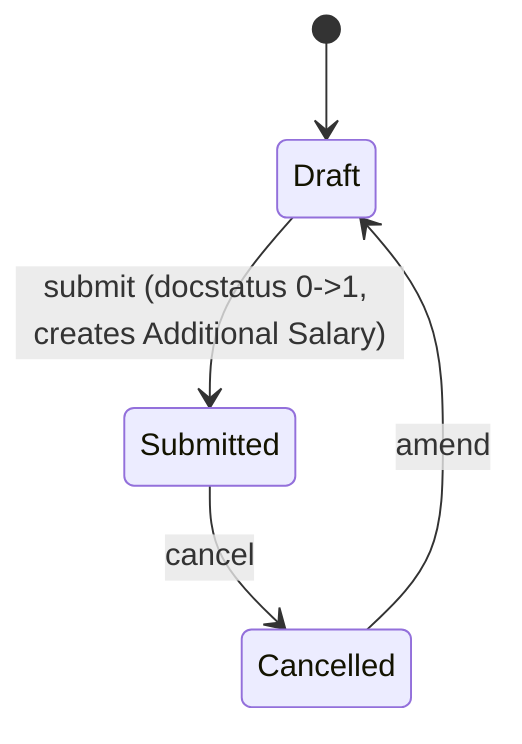

# Employee Incentive

**Source:** `hrms/payroll/doctype/employee_incentive/employee_incentive.json`, `employee_incentive.py`, `employee_incentive.js`
**Submittable:** yes   **Tree:** no   **Naming:** `HR-EINV-.YY.-.MM.-.#####` (expression-based autoname, see [[Naming and Autoname Rules]])
**Module:** Payroll

## Schema

| Field (fieldname) | Label | Type | Options/Link Target | Required | Default | Read-Only | Notes |
|---|---|---|---|---|---|---|---|
| employee (section: Employee) | Employee | Link | [[Employee Core Model]] | yes | | no | client-side query filters to `status: "Active"` (UI-only) |
| incentive_amount (section: Incentive) | Incentive Amount | Currency | options: currency | yes | | no | `non_negative: 1` |
| payroll_date | Payroll Date | Date | | yes | | no | one-time/non-recurring only — no recurring option on this doctype |
| amended_from | Amended From | Link | [[Employee Incentive]] | no | | yes | |
| employee_name | Employee Name | Data | | no | | yes | fetch_from `employee.employee_name` |
| department | Department | Link | Department | no | | yes | fetch_from `employee.department` |
| salary_component | Salary Component | Link | [[Salary Component]] | yes | | no | client-side query restricted to `component_type: Earning` for the selected company |
| currency | Currency | Link | Currency | yes | | yes | `depends_on: eval:(doc.docstatus==1 || doc.employee)`, `print_hide: 1` |
| company | Company | Link | Company | yes | | no | |

Layout-only fields skipped: column_break_5, column_break_11, employee_section, incentive_section.

## Child Tables

None.

## State Machine



Plain list:
- (Draft, submit, Submitted, guard: `validate_active_employee` and `validate_salary_structure` pass; `on_submit` creates+submits an Additional Salary)
- (Submitted, cancel, Cancelled, guard: standard cancel; no explicit `on_cancel` override on this controller — see Port Notes)
- (any, amend, new Draft, guard: standard amend)

No explicit `status` field; state is `docstatus` only (see [[Submittable Document Lifecycle]]).

## Validation Rules (exact, in execution order)

`validate()`:
1. `validate_active_employee(self.employee)` -> throws if employee not active (shared `hrms/hr/utils.py` utility).
2. `validate_salary_structure()`: IF NOT `frappe.db.exists("Salary Structure Assignment", {"employee": self.employee})` (any docstatus, any date — note: does NOT filter by `docstatus=1` or by date, unlike similar checks elsewhere) THEN throw `"There is no Salary Structure assigned to {0}. First assign a Salary Structure."` (employee). (source: `validate_salary_structure`)

## Business Logic / Calculations

### `on_submit()` — `Additional Salary` creation
1. Look up `company = frappe.db.get_value("Employee", self.employee, "company")`.
2. Build and submit a new `Additional Salary`:
```
employee: self.employee
currency: self.currency
salary_component: self.salary_component
overwrite_salary_structure_amount: 0
amount: self.incentive_amount
payroll_date: self.payroll_date
company: company
ref_doctype: "Employee Incentive"
ref_docname: self.name
```
No proration/pro-rata math on this doctype itself — the incentive amount flows through as-is into the Additional Salary, which is always non-recurring (no `is_recurring` field exists on Employee Incentive at all, so the generated Additional Salary is always a single-payroll-date one-off).

## Lifecycle Hooks (exact)

| Event | What Runs | Side Effects on Other Doctypes |
|---|---|---|
| validate | `validate_active_employee`, `validate_salary_structure` | none |
| on_submit | Look up employee's company, create + submit `Additional Salary` referencing this doc | Inserts + submits `Additional Salary` |

No `on_cancel` override — cancelling an Employee Incentive does not automatically cancel its generated Additional Salary (same gap pattern as `Employee Benefit Claim`).

## Whitelisted / API Methods

None (`@frappe.whitelist()` not used anywhere in this controller).

## Permissions

| Role | Read | Write | Create | Delete | Submit | Cancel | Amend | Report | Export | Notes |
|---|---|---|---|---|---|---|---|---|---|---|
| HR Manager | yes | yes | yes | yes | yes | yes | yes | yes | yes | share/email/print also 1 |
| Employee | yes | no | no | no | no | no | no | yes | yes | share/email/print also 1; read-only |
| HR User | yes | yes | yes | no | no | no | no | yes | yes | share/email/print also 1; no delete/submit/cancel/amend |

Note: unlike most other payroll doctypes in this batch, `System Manager` is NOT explicitly listed in this doctype's permissions array (only HR Manager, Employee, HR User) — flagged, since System Manager typically has implicit access via Frappe's role hierarchy, but that is a framework-level behavior, not something declared in this JSON.

## Scheduled Jobs Touching This Doctype

None found in `hrms/hooks.py`.

## Related Doctypes

- [[Employee Core Model]] — `employee` link; must be Active (client-side check) and must have a Salary Structure Assignment (server-validated).
- [[Salary Component]] — `salary_component` link; the earning component the incentive is paid through.
- [[Salary Structure Assignment]] — existence for `employee` is validated (any docstatus/date) before submit.
- [[Additional Salary]] — created and submitted by `on_submit()`, referencing this document via `ref_doctype`/`ref_docname`.
- [[Employee Benefit Claim]] — referenced in Port Notes as sharing the same "no on_cancel cleanup" gap pattern.

## Port Notes

- `validate_salary_structure` checks only `frappe.db.exists(...)` with employee filter — it does NOT restrict to `docstatus=1` (submitted) or check the assignment's `from_date` against `payroll_date`, unlike `Additional Salary.validate_salary_structure()` which does filter by docstatus/date. This is a real, narrower check than sibling doctypes — reproduce exactly (any Salary Structure Assignment row, draft or submitted, for the employee, satisfies this check), do not "fix" to match the stricter pattern.
- No `on_cancel` handler — generated Additional Salary is orphaned/still-active after cancelling the source Employee Incentive (same class of gap as Employee Benefit Claim; flagged, not invented).
- `System Manager` role absent from the permissions array is unusual relative to sibling doctypes in this module; verify against actual Frappe role-hierarchy behavior when porting the permission model (System Manager typically bypasses doctype-level permission tables in stock Frappe).
