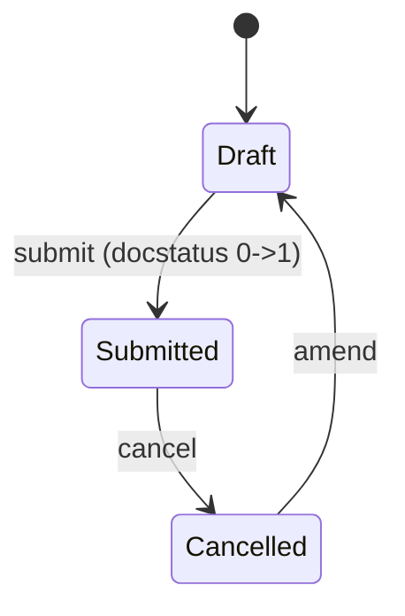

# Employee Other Income

**Source:** `hrms/payroll/doctype/employee_other_income/employee_other_income.json`, `employee_other_income.py`, `employee_other_income.js`
**Submittable:** yes   **Tree:** no   **Naming:** `HR-INCOME-.######` (expression-based autoname, sequential, no year/month segment — see [[Naming and Autoname Rules]])
**Module:** Payroll

Declares an employee's income from a source other than this employer (e.g. other employer, rental income), used as an input to income-tax computation elsewhere (Salary Slip / tax module — owned by other agents; cross-reference only).

## Schema

| Field (fieldname) | Label | Type | Options/Link Target | Required | Default | Read-Only | Notes |
|---|---|---|---|---|---|---|---|
| employee (section: Employee Details) | Employee | Link | [[Employee Core Model]] | yes | | no | `search_index: 1` |
| payroll_period | Payroll Period | Link | [[Payroll Period]] | yes | | no | `search_index: 1` |
| company | Company | Link | Company | yes | | no | `search_index: 1` |
| source (section: Income Source) | Source | Data | | no | | no | free-text description of the income source |
| amount | Amount | Currency | options: `Company:company:default_currency` (dynamic currency precision/symbol from the linked Company's default currency) | yes | | no | `non_negative: 1` |
| employee_name | Employee Name | Data | | no | | yes | fetch_from `employee.employee_name` |
| amended_from | Amended From | Link | [[Employee Other Income]] | no | | yes | |

Layout-only fields skipped: column_break_3, column_break_10, employee_section, income_source_details_section.

## Child Tables

None.

## State Machine

No explicit `status` field; state is `docstatus` only (see [[Submittable Document Lifecycle]]). No custom submit/cancel guards — controller has no `validate`/`on_submit`/`on_cancel` overrides at all (see below).

## Validation Rules (exact, in execution order)

None. The controller class body is `pass` — no `validate()` or any other method is defined. Only the standard field-level constraints from the JSON apply (required fields, `non_negative` on `amount`).

## Business Logic / Calculations

None in this doctype's own controller. This doctype is purely a data-capture record; the actual tax-impact calculation (adding this "other income" into taxable income projections) happens in the Salary Slip / income tax slab computation logic (owned by another module agent — cross-reference `Salary Slip.md`).

## Lifecycle Hooks (exact)

| Event | What Runs | Side Effects on Other Doctypes |
|---|---|---|
| (none) | Controller defines no lifecycle methods | none |

## Whitelisted / API Methods

None.

## Permissions

| Role | Read | Write | Create | Delete | Submit | Cancel | Amend | Report | Export | Notes |
|---|---|---|---|---|---|---|---|---|---|---|
| HR Manager | yes | yes | yes | yes | yes | yes | yes | yes | yes | share/email/print also 1 |
| HR User | yes | yes | yes | yes | yes | yes | yes | yes | yes | share/email/print also 1 |
| Employee | yes | yes | yes | yes | yes | yes | yes | yes | yes | share/email/print also 1 — Employee has FULL rights including submit/cancel/amend/delete, unlike most other submittable payroll doctypes where Employee has reduced rights |

Note: `System Manager` is not explicitly listed here either (same pattern as `Employee Incentive`).

## Scheduled Jobs Touching This Doctype

None found in `hrms/hooks.py`.

## Related Doctypes

- [[Employee Core Model]] — `employee` link; the person whose external income is being declared.
- [[Payroll Period]] — `payroll_period` link; scopes which period this declared income applies to.
- [[Salary Slip]] — consumes this declared income as an input to income-tax computation (owned by another agent; cross-reference only).
- [[Employee Benefit Claim]] — referenced in Port Notes for contrast (it has a per-month duplicate check this doctype lacks).

## Port Notes

- This is the simplest submittable doctype in the assigned set: no server-side validation logic at all beyond field-level `reqd`/`non_negative` constraints from the schema. A port must still enforce these field-level constraints explicitly since they won't be "free" outside Frappe's DocType layer.
- `amount`'s `options: "Company:company:default_currency"` is a Frappe dynamic-currency-field pattern: the field's currency symbol/precision follows whatever `default_currency` is set on the linked `company` record, rather than a fixed `Currency` link field like sibling doctypes. This is a formatting/precision detail only — the underlying stored value is still a decimal amount.
- Employee role has unusually broad self-service rights (submit/cancel/delete/amend) compared to peer doctypes — reproduce exactly as declared; do not narrow to match other doctypes' patterns.
- No cross-check exists here validating that `amount`/`source`/`payroll_period` combinations are non-duplicate — unlike `Employee Benefit Claim`'s per-month duplicate check. Flagged as an absence, not filled in.
