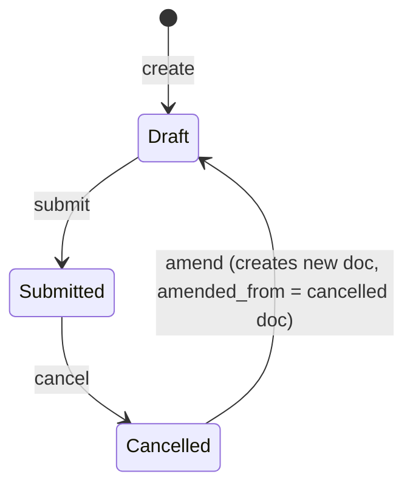

# Employee Tax Exemption Declaration

**Source:** `hrms/payroll/doctype/employee_tax_exemption_declaration/employee_tax_exemption_declaration.json`, `employee_tax_exemption_declaration.py`, `employee_tax_exemption_declaration.js`
**Submittable:** yes   **Tree:** no   **Naming:** `autoname: "HR-TAX-DEC-.YYYY.-.#####"` (naming series: prefix `HR-TAX-DEC-`, current 4-digit year, then a 5-digit auto-incrementing counter reset per prefix pattern, e.g. `HR-TAX-DEC-2026-00001`), `naming_rule: "Expression (old style)"`
**Module:** Payroll

## Schema

| Field (fieldname) | Label | Type | Options/Link Target | Required | Default | Read-Only | Notes |
|---|---|---|---|---|---|---|---|
| employee | Employee | Link | [[Employee Core Model]] | yes | — | no | `in_list_view`. Client-side query restricts picker to `status: "Active"` (client-only convenience filter — see Port Notes on server-side equivalent). |
| employee_name | Employee Name | Data | — | no | — | yes | `fetch_from: employee.employee_name`. |
| department | Department | Link | `Department` | no | — | yes | `fetch_from: employee.department`. |
| *(column_break_2)* | — | Column Break | — | — | — | — | layout only |
| payroll_period | Payroll Period | Link | [[Payroll Period]] | yes | — | no | `in_list_view`. Client-side query filters to the employee's `company`'s periods once `employee`+`company` are set. |
| company | Company | Link | `Company` | no | — | no | `fetch_from: employee.company`. |
| amended_from | Amended From | Link | [[Employee Tax Exemption Declaration]] | no | — | yes | Standard amend-chain pointer. `no_copy`, `print_hide`. |
| *(section_break_8, "Tax Exemption Declaration")* | — | Tab Break | — | — | — | — | tab heading grouping `declarations` |
| declarations | Declarations | Table | [[Employee Tax Exemption Declaration Category]] | no | — | no | The per-sub-category declared amounts — see `Employee Tax Exemption Declaration Category.md`. Not marked `reqd` at the field level (though `validate_tax_declaration`/aggregation logic tolerates an empty table, producing zero totals). |
| *(section_break_10)* | — | Section Break | — | — | — | — | layout only |
| total_declared_amount | Total Declared Amount | Currency | `options: "currency"` (dynamic currency field, tied to the `currency` field) | no | — | yes | Computed server-side — sum of all `declarations` row `amount`s, unclamped by any cap (see Business Logic). |
| *(column_break_12)* | — | Column Break | — | — | — | — | layout only |
| total_exemption_amount | Total Exemption Amount | Currency | `options: "currency"` | no | — | yes | Computed server-side — the capped/aggregated exemption figure Salary Slip actually consumes (see Business Logic and cross-doctype linkage). |
| currency | Currency | Link | `Currency` | yes | — | no | `depends_on: eval: doc.employee` (hidden until an employee is chosen); `print_hide`. Populated client-side via a call to `salary_structure_assignment.get_employee_currency` (see Lifecycle Hooks). |

## Child Tables

- `declarations` -> `Employee Tax Exemption Declaration Category` (own file: `Employee Tax Exemption Declaration Category.md`).

## State Machine



Plain list:
- (none) -> submit -> Submitted — guard: all `validate()` checks below must pass (they run on every save, including the save-then-submit transaction); `employee`, `payroll_period`, `currency` must be set (`reqd: 1`).
- Submitted -> cancel -> Cancelled — no doctype-specific cancel guard found beyond standard Frappe cancel permission.
- Cancelled -> amend -> new Draft — [[Submittable Document Lifecycle|standard Frappe amend]]; `amended_from` set on the new document.

No separate `status`/`workflow_state` field — only standard `docstatus`.

## Validation Rules (exact, in execution order)

All run inside `validate()`, in this exact order (source: `employee_tax_exemption_declaration.py`, `validate`):

1. `validate_active_employee(self.employee)` (from `hrms.hr.utils`) — IF `frappe.db.get_value("Employee", employee, "status") == "Inactive"` THEN `frappe.throw(_("Transactions cannot be created for an Inactive Employee {0}.").format(get_link_to_form("Employee", employee)), InactiveEmployeeStatusError)`.
2. `validate_tax_declaration(self.declarations)` (from `hrms.hr.utils`) — iterates `self.declarations`; IF any row's `exemption_sub_category` value has already appeared earlier in the same table THEN `frappe.throw(_("More than one selection for {0} not allowed").format(d.exemption_sub_category))` — i.e., duplicate sub-category rows within one declaration are rejected (checked in row order, error fires on the second occurrence of a duplicate value).
3. `validate_duplicate_exemption_for_payroll_period(self.doctype, self.name, self.payroll_period, self.employee)` (from `hrms.hr.utils`) — queries `frappe.db.exists("Employee Tax Exemption Declaration", {"payroll_period": self.payroll_period, "employee": self.employee, "docstatus": ["<", 2], "name": ["!=", self.name]})`. IF a match exists (i.e., another Draft-or-Submitted declaration already exists for this exact employee+payroll_period combination) THEN `frappe.throw(_("{0} already exists for employee {1} and period {2}").format(doctype, employee, payroll_period), DuplicateDeclarationError)`. **Enforces at most one non-cancelled Declaration per (employee, payroll_period) pair.**
4. `self.set_total_declared_amount()` — recomputes `total_declared_amount` (value-correction, not a throw — see Business Logic step 1).
5. `self.set_total_exemption_amount()` — recomputes `total_exemption_amount` (value-correction — see Business Logic step 2).
6. `self.calculate_hra_exemption()` — attempts India-specific HRA exemption top-up; in base HRMS this is a no-op given the stubbed regional function (see Business Logic step 3 and Port Notes).

Note on validation order significance: the duplicate-per-period check (#3) runs AFTER the sub-category-duplicate check (#2) but BEFORE the amount totals are (re)computed (#4-#6) — so a save that fails check #2 or #3 never reaches the amount-calculation methods at all.

## Business Logic / Calculations

### 1. `set_total_declared_amount()`
```
total_declared_amount = 0.0
FOR EACH row d IN declarations:
    total_declared_amount += flt(d.amount)
```
No cap applied — this is a raw, uncapped sum of every declared row amount regardless of category ceilings.

### 2. `set_total_exemption_amount()` — delegates to `hrms.hr.utils.get_total_exemption_amount(declarations)`
```
total_exemption_amount = flt(get_total_exemption_amount(self.declarations), precision("total_exemption_amount"))
```
Full algorithm of `get_total_exemption_amount(declarations)` (source: `hrms/hr/utils.py`), reproduced exactly:
```
exemptions = {}  # frappe._dict keyed by exemption_category name
FOR EACH row d IN declarations (table/idx order):
    exemptions.setdefault(d.exemption_category, {})
    category_max_amount = exemptions[d.exemption_category].max_amount
    IF NOT category_max_amount:  # first time this category is seen in this loop, or previously falsy
        category_max_amount = frappe.db.get_value("Employee Tax Exemption Category", d.exemption_category, "max_amount")
        exemptions[d.exemption_category].max_amount = category_max_amount
    # Step A: cap THIS ROW's contribution at the row's own (sub-category) max_amount
    sub_category_exemption_amount = d.max_amount IF (d.max_amount AND flt(d.amount) > flt(d.max_amount)) ELSE d.amount
    exemptions[d.exemption_category].setdefault("total_exemption_amount", 0.0)
    exemptions[d.exemption_category].total_exemption_amount += flt(sub_category_exemption_amount)
    # Step B: cap the RUNNING CATEGORY TOTAL at the category's own max_amount
    IF category_max_amount AND exemptions[d.exemption_category].total_exemption_amount > category_max_amount:
        exemptions[d.exemption_category].total_exemption_amount = category_max_amount
total_exemption_amount = SUM(flt(v.total_exemption_amount) for v in exemptions.values())
RETURN total_exemption_amount
```
Key points to preserve exactly:
- Capping happens at TWO levels per row-processing step: (a) each individual row's contribution is first capped at that row's OWN `max_amount` (which is itself fetched from the sub-category, per `Employee Tax Exemption Declaration Category`'s `fetch_from`), THEN (b) the running total for the row's `exemption_category` is re-capped at the CATEGORY's `max_amount` after adding the row's (already row-capped) contribution. Because the category-level cap (Step B) is applied after EVERY row addition (not just once at the end), a category total that temporarily exceeds the cap due to one row is clamped immediately — subsequent rows in the same category then add on top of the CLAMPED value, not the true running sum. This means excess declared amounts are effectively "lost" (never carried into subsequent rows of the same category) rather than redistributed.
- `category_max_amount` is looked up once per category via `frappe.db.get_value` (only when not already cached in the local `exemptions` dict for this call) — it reflects the Employee Tax Exemption Category's CURRENT `max_amount` at declaration-save time, not any value stored on the declaration itself.
- If `category_max_amount` is falsy (category has no max amount configured), Step B's cap never applies for that category — an unlimited category passes through the row-capped (Step A) amounts unclamped.
- Final `total_exemption_amount` on the parent document may therefore be LESS than `total_declared_amount` whenever any category/sub-category cap was exceeded by the raw declared amounts.

### 3. `calculate_hra_exemption()`
```
self.salary_structure_hra, self.annual_hra_exemption, self.monthly_hra_exemption = 0, 0, 0
IF self.get("monthly_house_rent"):  # truthy check on a field NOT present in this doctype's current JSON schema
    hra_exemption = calculate_annual_eligible_hra_exemption(self)  # hrms.hr.utils, @erpnext.allow_regional
    IF hra_exemption:  # base HRMS stub always returns {} (falsy) -> this branch never executes in core HRMS
        self.total_exemption_amount += hra_exemption["annual_exemption"]
        self.total_exemption_amount = flt(self.total_exemption_amount, precision("total_exemption_amount"))
        self.salary_structure_hra = flt(hra_exemption["hra_amount"], precision("salary_structure_hra"))
        self.annual_hra_exemption = flt(hra_exemption["annual_exemption"], precision("annual_hra_exemption"))
        self.monthly_hra_exemption = flt(hra_exemption["monthly_exemption"], precision("monthly_hra_exemption"))
```
**This entire block is dead code in core/base HRMS** (see Port Notes) — `monthly_house_rent`, `salary_structure_hra`, `annual_hra_exemption`, and `monthly_hra_exemption` are NOT fields defined in this doctype's `.json` schema (confirmed against the full field list above and the auto-generated type stubs in the `.py` file, neither of which lists them). `self.get("monthly_house_rent")` on a Frappe Document for an undeclared field returns `None` unconditionally, so the `if` is always falsy and `calculate_annual_eligible_hra_exemption` is never actually invoked in a stock installation — these three output fields are set to `0` on every save and never change. A regional/localization app that adds the `monthly_house_rent` field (and overrides `calculate_annual_eligible_hra_exemption`) would activate this path; it is inert without such an extension.

## Lifecycle Hooks (exact)

| Event | What Runs | Side Effects on Other Doctypes |
|---|---|---|
| validate | Runs the 6 steps listed in Validation Rules, in order | Reads `Employee` (status check), `Employee Tax Exemption Category` (max_amount lookups inside `get_total_exemption_amount`), and other `Employee Tax Exemption Declaration` records (duplicate-period check). No writes to other doctypes. |
| (client `refresh`, `.js`) | If `docstatus == 1` (Submitted): adds a "Submit Proof" primary button that opens a mapped-doc dialog calling the whitelisted `make_proof_submission` method | Creates (client-side draft, pending user save) an `Employee Tax Exemption Proof Submission` pre-populated from this declaration. |
| (client `employee` change, `.js`) | Calls `hrms.payroll.doctype.salary_structure_assignment.salary_structure_assignment.get_employee_currency` and sets `currency` from the result | Reads `Salary Structure Assignment` (out of scope) server-side. |

## Whitelisted / API Methods

| Method name | HTTP-equivalent purpose | Args | Returns | What it does |
|---|---|---|---|---|
| `make_proof_submission` (module-level function on `employee_tax_exemption_declaration.py`, decorated `@frappe.whitelist()`) | POST-style RPC — "convert this Declaration into a new Proof Submission" | `source_name: str` (the Declaration's `name`), `target_doc: str \| Document \| None = None` (optional pre-existing target doc/JSON to map into) | The mapped `Employee Tax Exemption Proof Submission` document (unsaved, in-memory `Document`/doclist) | Uses Frappe's `get_mapped_doc` to create a new `Employee Tax Exemption Proof Submission` from this `Employee Tax Exemption Declaration`, with field-mapping rules: `field_no_map: ["monthly_house_rent", "monthly_hra_exemption"]` (these two fields are explicitly NOT copied across, even though — per the Port Notes above — `monthly_house_rent` doesn't exist on this doctype's current schema, another sign of dead/legacy-shaped code retained for the regional extension point), and each `Employee Tax Exemption Declaration Category` row is mapped 1:1 into a new `Employee Tax Exemption Proof Submission Detail` row via `add_if_empty: True` (ensures at least an empty target row set is created even if source has none, and otherwise maps every source row across, carrying `exemption_sub_category`, `exemption_category`, `max_amount` — `amount` on the source row is NOT explicitly excluded, so standard `get_mapped_doc` field-name-matching would copy the Declaration's declared `amount` into the Proof Submission Detail row's `amount` field as a starting point for the user to then correct to the actual proven amount). |

## Permissions

| Role | Read | Write | Create | Delete | Submit | Cancel | Amend | Report | Export | Notes |
|---|---|---|---|---|---|---|---|---|---|---|
| System Manager | 1 | 1 | 1 | 1 | 1 | 1 | 1 | 1 | 1 | share, email, print also 1 |
| HR Manager | 1 | 1 | 1 | 1 | 1 | 1 | 1 | 1 | 1 | share, email, print also 1 |
| HR User | 1 | 1 | 1 | 1 | 1 | 1 | 1 | 1 | 1 | share, email, print also 1 |
| Employee | 1 | 1 | 1 | 1 | 1 | 1 | 1 | 1 | 1 | share, email, print also 1; no `if_owner` restriction defined in JSON — any user with the `Employee` role can read/write/submit/cancel/amend ANY declaration record, not just their own (see Port Notes). |

## Scheduled Jobs Touching This Doctype

None found in `hrms/hooks.py`.

## Related Doctypes

- [[Employee Core Model]] — the employee this declaration is filed for; also drives `employee_name`, `department`, and `company` via `fetch_from`.
- [[Payroll Period]] — the period this declaration applies to; at most one non-cancelled declaration may exist per (employee, payroll_period) pair.
- [[Employee Tax Exemption Declaration Category]] — child table (`declarations`) holding the per-sub-category declared amounts this document aggregates.
- [[Employee Tax Exemption Category]] — read (via sub-category rows) for per-category `max_amount` caps during `get_total_exemption_amount()`.
- [[Employee Tax Exemption Proof Submission]] — created from this document via the whitelisted `make_proof_submission` mapper once submitted; later supersedes this document's `total_exemption_amount` for the final sub-period of the payroll period.
- [[Employee Tax Exemption Declaration]] — self-referenced by `amended_from` on the amend chain.

## Port Notes

- **`if_owner` is not set on the `Employee` role's permission row** (see [[Permission Model (RBAC)]]), despite this being an employee self-service doctype (an employee declares their own tax exemptions). In stock Frappe HRMS, restricting an employee to only their own declarations is typically enforced elsewhere (e.g. a `permission_query_conditions` hook in `hooks.py`, or an HD/portal-layer restriction) rather than in the doctype's own `permissions` array — this repo's `hooks.py` was not found to register such a hook for this doctype in the search performed. Flag explicitly: a straightforward JSON-permissions-only port would give every `Employee`-role user full CRUD+submit+cancel+amend rights over every OTHER employee's tax declarations, which is almost certainly not the intended production behavior; the port should add an explicit ownership-scoping rule (e.g. "Employee role can only access records where `employee` maps to their own linked Employee record") even though it is not visible as an explicit rule inside this doctype's own files.
- **[[Naming and Autoname Rules|Naming series behavior]]** (`HR-TAX-DEC-.YYYY.-.#####`) is a Frappe framework feature with no batteries-included equivalent in most other stacks: it auto-generates the primary key at insert time as `HR-TAX-DEC-<4-digit-year-of-creation>-<5-digit-zero-padded-sequence>`, where the sequence counter is scoped per literal prefix pattern (i.e., resets/starts fresh whenever the year segment changes) and is transactionally safe against concurrent inserts. A port must implement this as an explicit sequence-generation service/table (e.g., a `naming_series_counters` table keyed by `"HR-TAX-DEC-2026"` with a last-used integer, incremented atomically), not simply an autoincrement PK, since the visible `name` format must match.
- The client-side `employee` picker filter (`status: "Active"`) is UI-only — there is NO server-side equivalent check that `employee` must be Active on this doctype (the only Active/Inactive check present is `validate_active_employee`, which throws only for `Inactive`, catching the same case from a different angle, but note it does not check any OTHER non-Active status values if the Employee doctype has more than the two-state Active/Inactive model — confirm against `Employee`'s actual status options, owned by another module).
- `total_declared_amount` and `total_exemption_amount` are both `read_only: 1` fields recomputed on every `validate()` — a port must ensure these are always server-computed on write and never accepted as client input (Frappe enforces `read_only` fields cannot be set via the standard save API from a non-privileged client, but a port's API layer must replicate this refusal explicitly).
- The HRA-exemption code path (`calculate_hra_exemption`) and the `field_no_map` entries referencing `monthly_house_rent`/`monthly_hra_exemption` in `make_proof_submission` are retained despite those fields not existing in the current schema — this is very likely legacy/regional-extension scaffolding. Do not port `monthly_house_rent`, `salary_structure_hra`, `annual_hra_exemption`, or `monthly_hra_exemption` as real schema fields unless the target system separately decides to implement India-specific HRA exemption; document their absence as an explicit, deliberate scope exclusion rather than silently dropping them without comment.
- `currency` field's `depends_on: eval: doc.employee` is a client-side visibility condition only (hides the field in the form until an employee is picked) — it does not gate server-side validation; `currency` remains `reqd: 1` at the schema level regardless.
