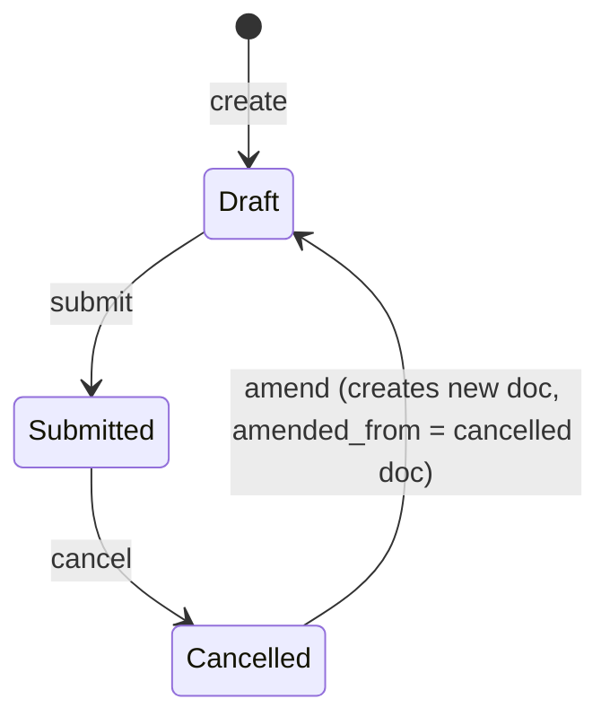

# Employee Tax Exemption Proof Submission

**Source:** `hrms/payroll/doctype/employee_tax_exemption_proof_submission/employee_tax_exemption_proof_submission.json`, `employee_tax_exemption_proof_submission.py`, `employee_tax_exemption_proof_submission.js`
**Submittable:** yes   **Tree:** no   **Naming:** `autoname: "HR-TAX-PRF-.YYYY.-.#####"` ([[Naming and Autoname Rules|naming series]], same mechanics as `Employee Tax Exemption Declaration`, prefix `HR-TAX-PRF-`), `naming_rule: "Expression (old style)"`
**Module:** Payroll

## Schema

(field order per JSON `field_order`, including tab-break groupings)

| Field (fieldname) | Label | Type | Options/Link Target | Required | Default | Read-Only | Notes |
|---|---|---|---|---|---|---|---|
| *(employee_details_tab, "Employee")* | — | Tab Break | — | — | — | — | tab heading |
| employee | Employee | Link | [[Employee Core Model]] | yes | — | no | `in_list_view`, `in_standard_filter`. Client-side picker filters to `status: "Active"` (UI-only, see Port Notes in the Declaration file — same caveat applies here). |
| employee_name | Employee Name | Data | — | no | — | yes | `fetch_from: employee.employee_name`. |
| department | Department | Link | `Department` | no | — | yes | `fetch_from: employee.department`. |
| currency | Currency | Link | `Currency` | yes | — | no | `depends_on: eval: doc.employee`; `print_hide`. Populated client-side via `salary_structure_assignment.get_employee_currency`. |
| amended_from | Amended From | Link | [[Employee Tax Exemption Proof Submission]] | no | — | yes | Standard amend pointer. `no_copy`, `print_hide`. |
| *(column_break_2)* | — | Column Break | — | — | — | — | layout only |
| submission_date | Submission Date | Date | — | yes | `Today` | no | |
| payroll_period | Payroll Period | Link | [[Payroll Period]] | yes | — | no | `in_list_view`, `in_standard_filter`. Client-side query filters to the employee's company's periods. |
| company | Company | Link | `Company` | yes | — | yes | `fetch_from: employee.company`. Note: unlike the Declaration doctype (where `company` is optional), here `company` is `reqd: 1` in addition to being `read_only`/fetched — since it's fetched-and-required, in practice it is populated automatically whenever `employee` is set and Employee has a `company`; if `employee.company` is itself blank, this fetched-required field would be blank and fail the mandatory check at save time. |
| *(exemption_proofs_details_tab, "Exemption Proofs")* | — | Tab Break | — | — | — | — | tab heading |
| tax_exemption_proofs | Tax Exemption Proofs | Table | [[Employee Tax Exemption Proof Submission Detail]] | no | — | no | The per-sub-category proof rows — see `Employee Tax Exemption Proof Submission Detail.md`. |
| *(section_break_10)* | — | Section Break | — | — | — | — | layout only |
| total_actual_amount | Total Actual Amount | Currency | `options: "currency"` | no | — | yes | Computed — sum of all proof-row `amount`s, plus an optional legacy `house_rent_payment_amount` (see Business Logic; not a schema field, see Port Notes). |
| *(column_break_12)* | — | Column Break | — | — | — | — | layout only |
| exemption_amount | Total Exemption Amount | Currency | `options: "currency"` | no | — | yes | Computed — the capped/aggregated exemption figure Salary Slip consumes once this document is submitted (this is the exact field name read by Salary Slip's `get_total_exemption_amount`, per the cross-doctype linkage documented in `Income Tax Slab.md`). |
| *(attachment_section)* | — | Section Break | — | — | — | — | layout only |
| attachments | Attachments | Attach | — | no | — | no | A single overall document attachment slot (in addition to the per-row `attach_proof` on each detail row); client-side `refresh` hides this section unless it already has a value, favoring the per-row "Attach Proof" UI instead. |

## Child Tables

- `tax_exemption_proofs` -> `Employee Tax Exemption Proof Submission Detail` (own file: `Employee Tax Exemption Proof Submission Detail.md`).

## State Machine



Plain list:
- (none) -> submit -> Submitted — guard: all `validate()` checks below must pass; `employee`, `submission_date`, `payroll_period`, `company`, `currency` must be set (`reqd: 1`).
- Submitted -> cancel -> Cancelled — no doctype-specific cancel guard beyond standard Frappe cancel permission.
- Cancelled -> amend -> new Draft — [[Submittable Document Lifecycle|standard Frappe amend]].

No separate `status`/`workflow_state` field — only standard `docstatus`. **This `docstatus == 1` (Submitted) state is itself the signal Salary Slip uses to treat a proof submission as authoritative** — see cross-doctype linkage in `Income Tax Slab.md` (`frappe.db.get_value(..., {"docstatus": 1}, ...)`); a Draft or Cancelled proof submission is invisible to Salary Slip's tax computation.

## Validation Rules (exact, in execution order)

All run inside `validate()`, in this exact order (source: `employee_tax_exemption_proof_submission.py`, `validate` — **note the order differs from the Declaration doctype**: the duplicate-period check runs LAST here, not third):

1. `validate_active_employee(self.employee)` — same check as the Declaration doctype: IF Employee status is `"Inactive"` THEN `frappe.throw(_("Transactions cannot be created for an Inactive Employee {0}.").format(...), InactiveEmployeeStatusError)`.
2. `validate_tax_declaration(self.tax_exemption_proofs)` — same duplicate-sub-category-within-table check as the Declaration doctype, applied to `tax_exemption_proofs` instead of `declarations`: IF any row's `exemption_sub_category` repeats within the table THEN `frappe.throw(_("More than one selection for {0} not allowed").format(d.exemption_sub_category))`.
3. `self.set_total_actual_amount()` — recomputes `total_actual_amount` (value-correction — see Business Logic step 1).
4. `self.set_total_exemption_amount()` — recomputes `exemption_amount` (value-correction — see Business Logic step 2, reuses the identical `get_total_exemption_amount` utility from the Declaration doctype).
5. `self.calculate_hra_exemption()` — attempts India-specific HRA exemption top-up via `calculate_hra_exemption_for_period` (a different stub than the Declaration's `calculate_annual_eligible_hra_exemption`, but equally a no-op `@erpnext.allow_regional` stub in base HRMS returning `{}`) — see Business Logic step 3 and Port Notes.
6. `validate_duplicate_exemption_for_payroll_period(self.doctype, self.name, self.payroll_period, self.employee)` — IF another Draft-or-Submitted `Employee Tax Exemption Proof Submission` already exists for this exact (employee, payroll_period) pair THEN `frappe.throw(_("{0} already exists for employee {1} and period {2}").format(doctype, employee, payroll_period), DuplicateDeclarationError)`. **Enforces at most one non-cancelled Proof Submission per (employee, payroll_period) pair** — this is the SAME shared utility and SAME exception class (`DuplicateDeclarationError`) used by the Declaration doctype, but it is scoped per-doctype (the `frappe.db.exists` filter is against `self.doctype`, i.e. `"Employee Tax Exemption Proof Submission"` specifically) — a Declaration and a Proof Submission for the same employee+period do NOT conflict with each other, only records of the SAME doctype conflict.

## Business Logic / Calculations

### 1. `set_total_actual_amount()`
```
total_actual_amount = flt(self.get("house_rent_payment_amount"))  # field not present in current JSON schema; self.get() returns None -> flt(None) = 0.0
FOR EACH row d IN tax_exemption_proofs:
    total_actual_amount += flt(d.amount)
```
Like the Declaration's `monthly_house_rent`, `house_rent_payment_amount` is referenced defensively via `self.get(...)` but does NOT exist in this doctype's current schema (confirmed against the field list and auto-generated type stubs above) — in a stock installation this always contributes `0`, and `total_actual_amount` is effectively just the row-sum of `tax_exemption_proofs[].amount`. No cap applied at this stage — raw sum, same as `total_declared_amount` on the Declaration doctype.

### 2. `set_total_exemption_amount()` — delegates to the SAME `hrms.hr.utils.get_total_exemption_amount(tax_exemption_proofs)` function used by `Employee Tax Exemption Declaration`
```
exemption_amount = flt(get_total_exemption_amount(self.tax_exemption_proofs), precision("exemption_amount"))
```
**Identical two-level capping algorithm as documented in full in `Employee Tax Exemption Declaration.md` (Business Logic section 2)** — reproduce that exact algorithm here, substituting `tax_exemption_proofs` for `declarations` as the input table. Do not re-derive independently; the function is the same code, just invoked with this doctype's rows. Key restated points:
- Each row's contribution is first capped at ITS OWN `max_amount` (fetched from `exemption_sub_category.max_amount`).
- The running per-category total is then re-capped at the CATEGORY's `max_amount` (`Employee Tax Exemption Category.max_amount`, looked up live) after every row addition — excess is dropped, not carried forward or redistributed to later rows of the same category.
- Final `exemption_amount` may be less than `total_actual_amount` when any cap was exceeded.

### 3. `calculate_hra_exemption()`
```
self.monthly_hra_exemption, self.monthly_house_rent, self.total_eligible_hra_exemption = 0, 0, 0
IF self.get("house_rent_payment_amount"):  # always None/falsy on stock schema, see above
    hra_exemption = calculate_hra_exemption_for_period(self)  # hrms.hr.utils, @erpnext.allow_regional, base stub returns {}
    IF hra_exemption:  # never truthy in core HRMS
        self.exemption_amount += hra_exemption["total_eligible_hra_exemption"]
        self.exemption_amount = flt(self.exemption_amount, precision("exemption_amount"))
        self.monthly_hra_exemption = flt(hra_exemption["monthly_exemption"], precision("monthly_hra_exemption"))
        self.monthly_house_rent = flt(hra_exemption["monthly_house_rent"], precision("monthly_house_rent"))
        self.total_eligible_hra_exemption = flt(hra_exemption["total_eligible_hra_exemption"], precision("total_eligible_hra_exemption"))
```
**Dead code in core HRMS**, identical reasoning to the Declaration doctype's `calculate_hra_exemption` — `house_rent_payment_amount`, `monthly_hra_exemption`, `monthly_house_rent`, `total_eligible_hra_exemption` are not fields on this doctype's current schema; the branch never executes in a stock installation. This is the regional India-HRA extension point for the proof-submission side of the flow (paired with the Declaration's own separate stub).

### Precedence over declared amounts (the requested "which takes precedence once submitted" detail)

This doctype does not itself decide precedence — precedence is entirely determined by **Salary Slip's** consumption logic (out of this agent's scope, but the exact mechanism is documented fully in `Income Tax Slab.md`'s "Cross-doctype linkage" section, since that is where the lookup lives). Restated here for completeness against this doctype's own field, `exemption_amount`:
1. Salary Slip only ever looks up a submitted (`docstatus: 1`) `Employee Tax Exemption Proof Submission` for the given (employee, payroll_period) once it reaches the FINAL sub-period of that payroll period (`self.deduct_tax_for_unsubmitted_tax_exemption_proof` becomes true when `payroll_period.end_date <= self.end_date`).
2. At that point, IF a submitted Proof Submission exists, its `exemption_amount` field (this doctype's own capped total, as computed above) is used AS THE ENTIRE exemption figure — it fully REPLACES the Declaration's `total_exemption_amount`, it is never summed with it.
3. IF no submitted Proof Submission exists at that final-period point, the exemption amount used is `0` for that component (the code does not fall back to the Declaration's amount as a default when a proof is missing at year-end — this is the "force tax deduction for unsubmitted proof" behavior, matching the field name `deduct_tax_for_unsubmitted_tax_exemption_proof`).
4. For all sub-periods BEFORE the final one, only the Declaration's `total_exemption_amount` is consulted — a submitted Proof Submission has NO effect on tax computed in earlier sub-periods of the same payroll period, even if it already exists.

## Lifecycle Hooks (exact)

| Event | What Runs | Side Effects on Other Doctypes |
|---|---|---|
| validate | Runs the 6 steps listed in Validation Rules, in order | Reads `Employee` (status check), `Employee Tax Exemption Category` (max_amount lookups), other `Employee Tax Exemption Proof Submission` records (duplicate-period check). No writes to other doctypes. |
| (client `refresh`, `.js`) | Toggles visibility of the `attachments` field based on whether it already has a value; if `docstatus === 0` (Draft), adds a "Get Details From Declaration" button that opens `erpnext.utils.map_current_doc` against the `make_proof_submission` whitelisted method on `Employee Tax Exemption Declaration`, pre-filtered by `docstatus: 1`, `company`, and optionally `employee`/`payroll_period` | Reads submitted `Employee Tax Exemption Declaration` records to offer as mapping sources; on selection, populates this form's fields/rows via the SAME `make_proof_submission` mapper documented in `Employee Tax Exemption Declaration.md`. |
| (client `employee` change, `.js`) | Calls `salary_structure_assignment.get_employee_currency` and sets `currency` | Reads `Salary Structure Assignment` (out of scope). |

## Whitelisted / API Methods

None defined directly on this doctype's controller (`employee_tax_exemption_proof_submission.py` has no `@frappe.whitelist()` functions). The only whitelisted method involved in this doctype's workflow is `make_proof_submission`, which is owned by and documented under `Employee Tax Exemption Declaration.md` (this doctype is only its mapping TARGET, not the source of the whitelisted call).

## Permissions

| Role | Read | Write | Create | Delete | Submit | Cancel | Amend | Report | Export | Notes |
|---|---|---|---|---|---|---|---|---|---|---|
| System Manager | 1 | 1 | 1 | 1 | 1 | 1 | 1 | 1 | 1 | share, email, print also 1 |
| HR Manager | 1 | 1 | 1 | 1 | 1 | 1 | 1 | 1 | 1 | share, email, print also 1 |
| HR User | 1 | 1 | 1 | 1 | 1 | 1 | 1 | 1 | 1 | share, email, print also 1 |
| Employee | 1 | 1 | 1 | 1 | 1 | 1 | 1 | 1 | 1 | share, email, print also 1; same lack of `if_owner` scoping as the Declaration doctype (see that file's Port Notes) — applies identically here. |

## Scheduled Jobs Touching This Doctype

None found in `hrms/hooks.py`.

## Related Doctypes

- [[Employee Core Model]] — the employee this proof submission is filed for; also drives `employee_name`, `department`, and the required `company` via `fetch_from`.
- [[Payroll Period]] — the period this proof submission applies to; at most one non-cancelled proof submission may exist per (employee, payroll_period) pair.
- [[Employee Tax Exemption Proof Submission Detail]] — child table (`tax_exemption_proofs`) holding the per-sub-category proof rows this document aggregates.
- [[Employee Tax Exemption Category]] — read (via sub-category rows) for per-category `max_amount` caps during `get_total_exemption_amount()`.
- [[Employee Tax Exemption Declaration]] — source doctype for the whitelisted `make_proof_submission` mapper that creates this document; once this document is submitted, its `exemption_amount` fully replaces the Declaration's `total_exemption_amount` for the final sub-period of the payroll period.
- [[Employee Tax Exemption Proof Submission]] — self-referenced by `amended_from` on the amend chain.

## Port Notes

- **Same ownership-scoping gap as `Employee Tax Exemption Declaration`**: no `if_owner` restriction on the `Employee` role (see [[Permission Model (RBAC)]]) means any employee-role user can, per the raw JSON permissions, read/write/submit/cancel/amend any other employee's proof submissions. Flag identically for the port — add explicit row-level ownership scoping even though it's not encoded here.
- **Same dead-code HRA pattern** as the Declaration doctype (`house_rent_payment_amount`, `monthly_hra_exemption`, `monthly_house_rent`, `total_eligible_hra_exemption` referenced via `self.get(...)`/`self.<attr> =` but absent from schema) — do not port these as real fields unless implementing India-specific HRA-over-period logic separately; document their exclusion explicitly.
- **Validation-order divergence from the sibling Declaration doctype is intentional-looking but easy to miss**: the Declaration validates duplicate-period THIRD (before computing totals); the Proof Submission validates duplicate-period LAST (after computing totals and the HRA no-op). Since none of the total-computation steps have any side effect beyond mutating `self` in-memory (no external writes), this ordering difference has no observable behavioral consequence in either doctype UNLESS `set_total_actual_amount`/`set_total_exemption_amount`/`calculate_hra_exemption` were ever changed to throw (they currently never do) — but a faithful port should still preserve the literal method-call order per doctype in case future logic depends on it, per the ground rule of exact-order reproduction.
- `company` is both `fetch_from` AND `reqd: 1` here (unlike the Declaration doctype where `company` is fetched but not required) — a port must apply the mandatory check to the fetched value, i.e., reject save if `employee.company` was blank at fetch time and no company was otherwise supplied, exactly mirroring Frappe's fetch-then-validate-mandatory sequencing (fetch happens client-side/on save before the mandatory-field check runs).
- The `attachments` single-file field versus the per-row `attach_proof` on `Employee Tax Exemption Proof Submission Detail` represents two distinct attachment concepts to preserve: one whole-document attachment slot, and one attachment per exemption-category proof row. Do not collapse these into a single attachments concept when porting.
- `validate_duplicate_exemption_for_payroll_period`'s uniqueness constraint is scoped per-doctype (a Declaration and a Proof Submission for the same employee+period coexist freely) — a port implementing this as a single shared uniqueness table keyed only by (employee, payroll_period) without also keying by doctype/record-type would incorrectly block legitimate coexistence of a Declaration and its corresponding Proof Submission.
