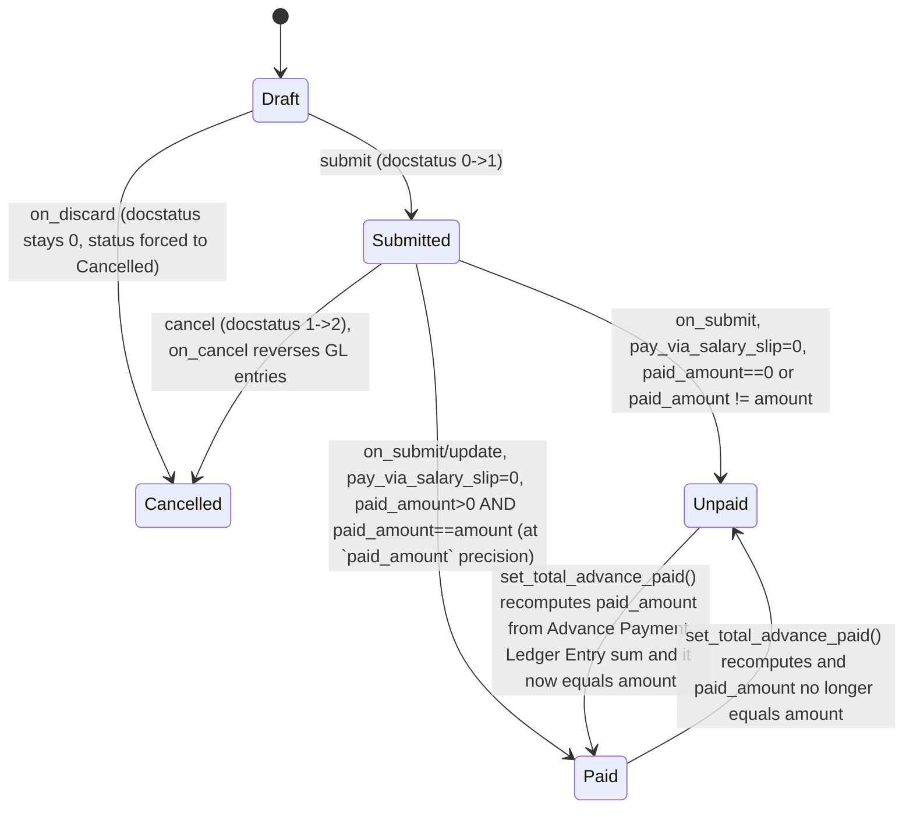

# Gratuity

**Source:** `hrms/payroll/doctype/gratuity/gratuity.json`, `gratuity.py`, `gratuity.js`, `gratuity_dashboard.py`, `gratuity_list.js`
**[[Submittable Document Lifecycle|Submittable]]:** yes   **Tree:** no   **[[Naming and Autoname Rules|Naming]]:** Expression (old style), autoname pattern `HR-GRA-PAY-.#####` (auto-incrementing numeric suffix, zero-padded to 5 digits, prefixed `HR-GRA-PAY-`)
**Module:** Payroll

## Schema

Field order per JSON. Layout-only fields (Tab Break, Column Break, Section Break with no label) are omitted except where noted as a grouping comment.

| Field (fieldname) | Label | Type | Options/Link Target | Required | Default | Read-Only | Notes |
|---|---|---|---|---|---|---|---|
| *(Tab: "Gratuity")* | | | | | | | section heading only |
| employee | Employee | Link | [[Employee Core Model\|Employee]] | yes (`reqd`) | — | no | `in_global_search`, `in_list_view`, `search_index` |
| company | Company | Link | Company | yes | — | yes | `fetch_from: employee.company` |
| posting_date | Posting date | Date | — | yes | — | no | |
| current_work_experience | Current Work Experience | Float | — | no | 0 | no | `non_negative`; computed server-side (see Business Logic) |
| column_break_3 | — | Column Break | — | — | — | — | layout |
| employee_name | Employee Name | Data | — | no | — | yes | `fetch_from: employee.employee_name` |
| department | Department | Link | Department | no | — | yes | `fetch_from: employee.department` |
| designation | Designation | Data | — | no | — | yes | `fetch_from: employee.designation` |
| gratuity_rule | Gratuity Rule | Link | [[Gratuity Rule]] | yes | — | no | |
| status | Status | Select | Draft / Unpaid / Paid / Submitted / Cancelled | no | Draft | yes | computed in `set_status()`, never user-editable |
| company (see above) | | | | | | | |
| amended_from | Amended From | Link | [[Gratuity]] | no | — | yes | `no_copy`, `print_hide`; standard amend-chain pointer |
| *(Tab Break: "Payment and Accounting")* | | | | | | | section heading only |
| pay_via_salary_slip | Pay via Salary Slip | Check | — | no | 1 (checked) | no | toggles which accounting path is used |
| amount | Total Amount | Currency | — | yes | 0 | yes | computed server-side (see Business Logic) |
| paid_amount | Paid Amount | Currency | — | no | 0 | yes | `no_copy`; `depends_on: eval:doc.pay_via_salary_slip == 0`; set via `set_total_advance_paid()` from Advance Payment Ledger Entry sums |
| column_break_13 | — | Column Break | — | — | — | — | layout |
| payroll_date | Payroll Date | Date | — | conditionally (`mandatory_depends_on: pay_via_salary_slip`) | — | no | `depends_on: pay_via_salary_slip` |
| salary_component | Salary Component | Link | [[Salary Component]] | conditionally (`mandatory_depends_on: pay_via_salary_slip`) | — | no | `depends_on: pay_via_salary_slip`; client script restricts query to `type = "Earning"` |
| cost_center | Cost Center | Link | Cost Center | no | — | no | used only in GL-entry (non-salary-slip) path |
| mode_of_payment | Mode of Payment | Link | Mode of Payment | conditionally (`mandatory_depends_on: eval: !doc.pay_via_salary_slip`) | — | no | `depends_on: eval: !doc.pay_via_salary_slip` |
| expense_account | Expense Account | Link | Account | conditionally (`mandatory_depends_on: eval: !doc.pay_via_salary_slip`) | — | no | `depends_on: eval: !doc.pay_via_salary_slip`; client query restricts to root_type in [Expense, Liability], is_group=0, company=doc.company |
| payable_account | Payable Account | Link | Account | conditionally (`mandatory_depends_on: eval: !doc.pay_via_salary_slip`) | — | no | `depends_on: eval: !doc.pay_via_salary_slip`; same client query restriction as expense_account |

`title_field`: employee_name. `search_fields`: employee_name. `sort_field`: creation DESC. `index_web_pages_for_search`: 1.

## Child Tables

None directly on Gratuity. Gratuity links out to `Gratuity Rule` (not a child table — a Link field), and `Gratuity Rule` itself owns the child tables `Gratuity Rule Slab` and `Gratuity Applicable Component` (see their own files in this folder).

## State Machine



Plain transition list:

| From | Event | To | Guard |
|---|---|---|---|
| (new) | insert | Draft | docstatus == 0 |
| Draft | submit | one of {Submitted, Unpaid, Paid} | `set_status()` runs post-submit: if docstatus==1, status is recomputed as Paid/Unpaid based on paid_amount vs amount (see below); otherwise plain "Submitted" only applies transiently before the paid/unpaid check overrides it (in practice docstatus==1 always resolves to Paid or Unpaid, never literally "Submitted", because the paid/unpaid branch always fires when docstatus==1) |
| Submitted/Unpaid | (background) set_total_advance_paid runs | Unpaid or Paid | paid_amount recalculated as `ABS(SUM(Advance Payment Ledger Entry.amount))` where `company=self.company AND against_voucher_type=self.doctype AND against_voucher_no=self.name AND delinked=0`; status = Paid if `paid_amount > 0 AND flt(amount, precision) == flt(paid_amount, precision)`, else Unpaid |
| Draft/Submitted | cancel | Cancelled | docstatus 1->2; `on_cancel` reverses GL entries (if any) then calls `set_status(update=True)` which forces status="Cancelled" since docstatus==2 |
| Draft | discard | Cancelled | `on_discard` directly sets status="Cancelled" via `db_set` (docstatus remains 0 — this is Frappe's discard-draft mechanism, not a real cancel) |

Note: the `status` Select field literally allows "Submitted" as an option but the code path that would set it (`docstatus==1` with no paid/unpaid override) is unreachable — `set_status()` always evaluates the Paid/Unpaid branch whenever `docstatus == 1`. "Submitted" is effectively dead in the state machine as implemented; flagged in Port Notes.

## Validation Rules (exact, in execution order)

`validate()` runs, in order:

1. Calls `calculate_work_experience_and_amount()` which internally:
   1. IF `gratuity_settings.method == "Manual"` THEN `current_work_experience = flt(self.current_work_experience)` (uses whatever the user/client set) ELSE compute via `get_work_experience()`.
   2. `get_work_experience()`: computes `total_working_days` via `get_total_working_days()` (see below) then `work_experience = total_working_days / (total_working_days_per_year or 1)`.
      - IF rule's `work_experience_calculation_function == "Round off Work Experience"` THEN `work_experience = round(work_experience)` (Python `round()`, banker's rounding to nearest int).
      - ELSE `work_experience = flt(work_experience, precision("current_work_experience"))` (i.e. "Take Exact Completed Years" keeps the fractional value, rounded only to the field's currency/float precision — despite the option label "Take Exact Completed Years" this does NOT truncate to an integer, it keeps the fractional years rounded to display precision).
      - IF `work_experience < rule.minimum_year_for_gratuity` -> `frappe.throw(_("Employee: {0} have to complete minimum {1} years for gratuity").format(bold(employee), minimum_year_for_gratuity))` (source: `get_work_experience`).
   3. `get_total_working_days()`: fetches `Employee.date_of_joining` and `Employee.relieving_date`.
      - IF `relieving_date` is falsy -> `frappe.throw(_("Please set Relieving Date for employee: {0}").format(bold(link)))` (source: `get_total_working_days`).
      - `total_working_days = (relieving_date - date_of_joining).days` (whole calendar days between the two dates).
      - Read `Payroll Settings.payroll_based_on` (single doctype), default `"Leave"` if unset.
        - IF `"Leave"` -> subtract count of submitted Attendance records with `status="On Leave"`, `employee=self.employee`, `attendance_date <= relieving_date`, and `leave_type IN (leave types where is_lwp=1)`.
        - IF `"Attendance"` -> subtract count of submitted Attendance records with `status="Absent"`, `employee=self.employee`, `attendance_date <= relieving_date`.
   4. Compute `gratuity_amount = get_gratuity_amount(current_work_experience)` (full algorithm in Business Logic section below); this internally can throw:
      - `frappe.throw(_("No Salary Slip found for Employee: {0}"))` if no submitted Salary Slip exists (source: `get_total_component_amount`).
      - `frappe.throw(_("No applicable Earning component found in last salary slip for Gratuity Rule: {0}"))` if none of the applicable components appear as earnings on that slip (source: `get_total_component_amount`).
      - `frappe.throw(_("No applicable Earning components found for Gratuity Rule: {0}"))` if the Gratuity Rule has zero rows in `Gratuity Applicable Component` (source: `get_applicable_components`).
      - `frappe.throw(_("No applicable slab found for the calculation of gratuity amount as per the Gratuity Rule: {0}"))` if no slab in the rule matches the employee's experience (source: `get_gratuity_amount`).
2. `self.current_work_experience` and `self.amount` are set from the returned dict.
3. `self.set_status()` recomputes `status` (see State Machine) — since this happens during `validate()` (pre-save, docstatus still whatever it currently is), on first save docstatus=0 so status="Draft".

No other explicit `frappe.throw` conditions exist in `validate()` beyond what `calculate_work_experience_and_amount()` triggers.

Additional throw, not part of `validate()` but part of the accounting path:

4. `get_gl_entries()` (called from `create_gl_entries`, itself called from `on_submit` when `pay_via_salary_slip` is unchecked): IF `self.amount` is falsy -> `frappe.throw(_("Total Amount cannot be zero"))`.
5. `set_total_advance_paid()`: IF `flt(paid_amount) > self.amount` -> `frappe.throw(_("Row {0}# Paid Amount cannot be greater than Total amount"))` (message is malformed in source — `{0}` is never `.format()`-substituted, so it renders literally as `"Row {0}# Paid Amount cannot be greater than Total amount"`; reproduce verbatim, flagged in Port Notes).

Framework-level mandatory-field validation (from schema `reqd`/`mandatory_depends_on`) also applies before/around `validate()`: employee, company, posting_date, gratuity_rule, amount always required; payroll_date + salary_component required when `pay_via_salary_slip` is checked; expense_account + mode_of_payment + payable_account required when `pay_via_salary_slip` is unchecked.

## Business Logic / Calculations

### Full gratuity amount algorithm

Inputs: `self.employee`, `self.gratuity_rule` (-> `gratuity_settings`: `method` = Gratuity Rule's `work_experience_calculation_function`, `total_working_days_per_year`, `minimum_year_for_gratuity`, `calculate_gratuity_amount_based_on`).

```
1. IF gratuity_settings.method == "Manual":
   1a. current_work_experience = current_work_experience field value (as entered by user), cast to float
   ELSE:
   1b. total_working_days = (Employee.relieving_date - Employee.date_of_joining) in whole days
       - throw if relieving_date not set
       - IF Payroll Settings.payroll_based_on == "Leave" (or unset):
           total_working_days -= COUNT(submitted Attendance rows for employee,
             status = "On Leave", attendance_date <= relieving_date,
             leave_type IN (Leave Types where is_lwp = 1))
       - ELIF Payroll Settings.payroll_based_on == "Attendance":
           total_working_days -= COUNT(submitted Attendance rows for employee,
             status = "Absent", attendance_date <= relieving_date)
   1c. work_experience_raw = total_working_days / (gratuity_settings.total_working_days_per_year OR 1)
       [guards divide-by-zero by substituting 1 when total_working_days_per_year is 0/falsy]
   1d. IF gratuity_settings.method == "Round off Work Experience":
           current_work_experience = round(work_experience_raw)   # Python round-half-to-even, integer result
       ELSE ("Take Exact Completed Years"):
           current_work_experience = round to `current_work_experience` field precision (fractional years kept)
   1e. IF current_work_experience < gratuity_settings.minimum_year_for_gratuity:
           THROW "Employee: {employee} have to complete minimum {minimum_year_for_gratuity} years for gratuity"
   1f. current_work_experience = current_work_experience OR 0   # None/0 falls back to 0

2. total_component_amount = SUM of Salary Slip earning-row default_amount, restricted to
   salary_component IN (Gratuity Applicable Component rows for this Gratuity Rule), taken from the
   EMPLOYEE'S MOST RECENT SUBMITTED SALARY SLIP ordered by start_date DESC.
   - throw "No Salary Slip found for Employee: {employee}" if the employee has no submitted Salary Slip.
   - throw "No applicable Earning components found for Gratuity Rule: {rule}" if the Gratuity Rule's
     `Gratuity Applicable Component` child table is empty.
   - throw "No applicable Earning component found in last salary slip for Gratuity Rule: {rule}" if none
     of the applicable component names appear among that slip's earnings rows.

3. Fetch Gratuity Rule Slab rows for gratuity_rule ordered by idx (from_year, to_year, fraction_of_applicable_earnings).

4. gratuity_amount = 0 ; years_left = current_work_experience ; slab_found = False

5. IF calculate_gratuity_amount_based_on == "Current Slab":
   For each slab (in idx order):
     a. is_within = (slab.from_year <= experience) AND (experience <= slab.to_year OR slab.to_year == 0)
     b. IF is_within:
          gratuity_amount = total_component_amount * experience * slab.fraction_of_applicable_earnings
          IF slab.fraction_of_applicable_earnings is truthy (nonzero): slab_found = True
     c. IF slab_found: BREAK the loop
   [Only the single matching slab's fraction is applied to the FULL experience figure —
    not prorated across slabs.]

6. ELIF calculate_gratuity_amount_based_on == "Sum of all previous slabs":
   For each slab (in idx order):
     a. IF slab.to_year == 0 AND slab.from_year == 0 (i.e. the rule defines only one unbounded slab):
          gratuity_amount += years_left * total_component_amount * slab.fraction_of_applicable_earnings
          slab_found = True ; BREAK
     b. is_beyond = (slab.from_year < experience) AND (slab.to_year < experience) AND (slab.to_year != 0)
        IF is_beyond:
          # employee has fully completed this slab's year range; apply this slab's fraction to the
          # FULL width of the slab (to_year - from_year), then move to the next slab for the remainder
          gratuity_amount += (slab.to_year - slab.from_year) * total_component_amount * slab.fraction_of_applicable_earnings
          years_left -= (slab.to_year - slab.from_year)
          slab_found = True
          # loop continues to next slab (no break)
     c. ELIF is_within (same definition as step 5a) applied to `experience`:
          # this is the final, partially-completed slab
          gratuity_amount += years_left * total_component_amount * slab.fraction_of_applicable_earnings
          slab_found = True ; BREAK

7. IF NOT slab_found:
     THROW "No applicable slab found for the calculation of gratuity amount as per the Gratuity Rule: {rule}"

8. amount = flt(gratuity_amount, precision("amount"))   # rounded to the Currency field's precision (site default, typically 2 decimals)
```

Edge cases explicitly handled in source:
- Divide-by-zero guard on `total_working_days_per_year` (falls back to 1).
- `current_work_experience OR 0` guard against `None`.
- Slab with `from_year == 0 AND to_year == 0` is treated as "no upper/lower limit" (per the JSON field description on `gratuity_rule_slabs`); under "Sum of all previous slabs" this specific slab shape is *only* handled correctly as the SOLE slab (step 6a) — the code does not special-case a no-limit slab that co-exists with other slabs (and `Gratuity Rule.validate()` explicitly forbids multiple slabs coexisting with a no-limit slab, see `Gratuity Rule.md`).
- Under "Current Slab" mode, `fraction_of_applicable_earnings == 0` on the matching slab means `slab_found` never becomes True even though `is_within` matched, so the loop simply moves to the next slab without breaking (potential silent fallthrough — flagged in Port Notes).
- No explicit maximum/ceiling clamp on the computed gratuity amount exists in this code (no statutory cap logic, e.g. no "max 20 lakh" type clamp) — only rounding to currency precision.

### `set_total_advance_paid` (invoked externally, e.g. from Advance Payment Ledger Entry hooks — not shown in this file's controller but referenced via `advance_payment_payable_doctypes` in `hrms/hooks.py` which includes "Gratuity")

```
1. paid_amount = ABS(SUM(Advance Payment Ledger Entry.amount)) WHERE
     company = self.company AND against_voucher_type = "Gratuity" AND
     against_voucher_no = self.name AND delinked = 0
   (0 if no matching rows)
2. IF paid_amount > self.amount: THROW "Row {0}# Paid Amount cannot be greater than Total amount" (unformatted, see Validation Rules #5)
3. db_set("paid_amount", paid_amount)  # direct DB write, no full save
4. set_status(update=True)  # recompute and persist status (Paid/Unpaid) via db_set
```

## Lifecycle Hooks (exact)

| Event | What Runs | Side Effects on Other Doctypes |
|---|---|---|
| validate | `calculate_work_experience_and_amount()` -> sets `current_work_experience`, `amount`; then `set_status()` (in-memory only, not `db_set`, since this runs pre-save) | Reads `Employee`, `Payroll Settings`, `Attendance`, `Salary Slip`, `Gratuity Rule`, `Gratuity Rule Slab`, `Gratuity Applicable Component`. No writes. |
| on_submit | IF `pay_via_salary_slip`: `create_additional_salary()` — creates and submits a new `Additional Salary` doc (employee, salary_component, amount=self.amount, payroll_date=self.payroll_date, company, ref_doctype="Gratuity", ref_docname=self.name, overwrite_salary_structure_amount=0). ELSE: `create_gl_entries()` — builds a payable-credit / expense-debit GL entry pair via `get_gl_entries()` and posts through `make_gl_entries` (ERPNext `general_ledger` module). | Creates+submits `Additional Salary`, OR creates `GL Entry` rows (via ERPNext's shared GL posting utility). |
| on_cancel | Sets `ignore_linked_doctypes = ["GL Entry", "Payment Ledger Entry", "Advance Payment Ledger Entry"]`; calls `create_gl_entries(cancel=True)` (reverses any GL entries posted for this voucher); calls `set_status(update=True)` (persists status="Cancelled" via `db_set`). | Reverses `GL Entry` rows for this voucher. Does NOT cancel the linked `Additional Salary` document (no code path does this) — flagged in Port Notes. |
| on_discard | `db_set("status", "Cancelled")` | none |

`set_status(update=False)` is a pure helper (not a doc-event) invoked from `validate`, `on_cancel`, and externally from `set_total_advance_paid`.

## Whitelisted / API Methods

| Method name | HTTP-equivalent purpose | Args | Returns | What it does |
|---|---|---|---|---|
| `calculate_work_experience_and_amount` (instance method, `@frappe.whitelist()`) | `POST /api/method/frappe.client.method?...` style RPC bound to a specific Gratuity doc (called by client script on `employee`/`gratuity_rule` field change) | none (uses `self`) | `{"current_work_experience": float, "amount": float}` | Runs the full experience + gratuity-amount calculation described above and returns the two computed values without saving them to the document (client script then does `frm.set_value(...)` for both). |

No module-level whitelisted functions in `gratuity.py`. Note: `hrms.overrides.employee_payment_entry.get_payment_entry_for_employee` is called from the client script's "Create Payment Entry" button (visible when `docstatus==1 && !pay_via_salary_slip && status=="Unpaid"`) but that whitelisted method lives in a different module file, not in this doctype's controller — reference only.

## [[Permission Model (RBAC)|Permissions]]

| Role | Read | Write | Create | Delete | Submit | Cancel | Amend | Report | Export | Notes |
|---|---|---|---|---|---|---|---|---|---|---|
| HR Manager | yes | yes | yes | yes | (not explicitly listed; standard submittable-doctype behavior grants submit/cancel/amend to any role with write+submit rights only if `submit`/`cancel`/`amend` flags are set — here they are NOT set in the permissions row) | — | — | yes | yes | `email`, `share`, `print` all 1. No explicit `submit`/`cancel`/`amend` flags present in the JSON permission row for either role — this is unusual for a submittable doctype and should be flagged (see Port Notes). |
| HR User | yes | yes | yes | yes | — | — | — | yes | yes | same caveat as above |

Only two roles are defined; no permlevel restrictions, no `if_owner`.

## Scheduled Jobs Touching This Doctype

None found in `hrms/hooks.py` `scheduler_events` referencing Gratuity directly. `Gratuity` is listed in the module-level constant `advance_payment_payable_doctypes` (`hrms/hooks.py` line 281) and `audit_trail_doctypes` (line 297) — these are configuration lists consumed by ERPNext/HRMS shared advance-payment and audit-trail features, not scheduler jobs themselves.

## Related Doctypes

- [[Gratuity Rule]] — links to (`gratuity_rule`); supplies the slab table, applicable-earnings components, and experience-calculation method used to compute `amount`.
- [[Employee Core Model]] — links to (`employee`); `date_of_joining`/`relieving_date` drive work-experience calculation, and several fields (`company`, `employee_name`, `department`, `designation`) are fetched from it.
- [[Salary Component]] — links to (`salary_component`); the Additional Salary/GL posting target when `pay_via_salary_slip` is used.
- [[Salary Slip]] — read to find the employee's most recent submitted slip, whose earning rows (filtered by the rule's applicable components) form `total_component_amount`.
- [[Payroll Settings]] — read (`payroll_based_on`) to decide whether Attendance is queried by "On Leave" or "Absent" status when computing total working days.
- [[Attendance]] — read (submitted rows) to subtract leave/absent days from total working days between joining and relieving dates.
- [[Gratuity]] — `amended_from` points back to the cancelled document in the standard amend chain.
- [[Additional Salary]] — created and submitted on `on_submit` when `pay_via_salary_slip` is checked, to actually pay the gratuity through payroll.

## Port Notes

- **Status "Submitted" is effectively unreachable**: the `status` field's Select options include "Submitted", but `set_status()` always overrides to Paid/Unpaid whenever `docstatus == 1`. A faithful port should still allow the value in the enum (framework/UI code elsewhere may reference it) but the business logic will never actually set it.
- **Malformed error message**: `frappe.throw(_("Row {0}# Paid Amount cannot be greater than Total amount"))` in `set_total_advance_paid` has an unsubstituted `{0}` placeholder — no `.format()` call. Reproduce the literal text `Row {0}# Paid Amount cannot be greater than Total amount` verbatim if bug-for-bug fidelity is required; otherwise flag to product owner as a likely upstream bug.
- **Permissions row missing submit/cancel/amend flags**: despite `is_submittable: 1`, neither HR Manager nor HR User has `submit`, `cancel`, or `amend` explicitly set to 1 in the `permissions` array. In Frappe, a role needs an explicit `submit`/`cancel`/`amend` permission (via this doctype's permission row or a custom Role Permission for Page/Report) to actually submit/cancel/amend — as extracted, this JSON alone would NOT let HR Manager/HR User submit a Gratuity document. This is either relying on an additional permission source not visible in this file (e.g. a `Custom DocPerm` override) or is a genuine gap. Port as-is with this caveat; do not silently add submit/cancel/amend rights.
- **"Take Exact Completed Years" option name is misleading**: it does not truncate to whole years — it keeps the fractional value (rounded to the field precision). Only "Round off Work Experience" produces a whole number (via Python's round-half-to-even).
- **Slab fallthrough on zero fraction**: in "Current Slab" mode, if the matching slab's `fraction_of_applicable_earnings` is 0, `slab_found` stays False and the loop moves on to check subsequent slabs (which likely won't match the same experience range), ultimately potentially raising "No applicable slab found" instead of returning a $0 amount. Reproduce this exact behavior rather than "fixing" it.
- **No statutory cap/floor on final gratuity amount**: unlike some real-world gratuity acts (which impose a maximum payable, e.g. a legal ceiling), this implementation applies no such clamp. If the target jurisdiction requires one, it is out of scope of ported behavior — flag as a business requirement, not a code gap.
- **On-cancel does not cancel the linked Additional Salary**: when `pay_via_salary_slip` was used and the Gratuity is later cancelled, the created `Additional Salary` document is left submitted/untouched. Only the GL-entry path is reversed on cancel. Port this asymmetry faithfully.
- **[[Implicit Framework Behaviors|Frappe framework behaviors relied on implicitly]]** (must be built explicitly in a new stack):
  - Auto `creation`/`modified`/`modified_by`/`owner` timestamps and audit columns.
  - `track_changes` is NOT set on Gratuity itself (only on Gratuity Rule and its children) — no automatic version/diff history expected for Gratuity documents.
  - Autoname counter `HR-GRA-PAY-.#####` requires a persistent auto-incrementing sequence per this prefix, shared across the whole doctype (Frappe's `Series` mechanism) — must be implemented as a dedicated counter table/sequence, not per-row logic.
  - Currency field `amount`/`paid_amount` auto-round to site-wide currency precision (`frappe.utils.flt(value, precision)`) — precision must be explicitly applied in the port wherever these are set (already reflected in the pseudocode above via `precision("amount")`/`precision("paid_amount")`).
  - `amended_from` implements Frappe's standard "amend a cancelled submittable document" chain — new stack needs an explicit amend workflow (clone document, link back via `amended_from`, restart at Draft).
  - Fetch-from fields (`company`, `employee_name`, `department`, `designation`) are populated client-side/server-side from the linked `Employee` at set-time in Frappe; a port must replicate this as an explicit copy-on-select (not a live join) since these are stored columns, snapshotted at the time `employee` was set.
